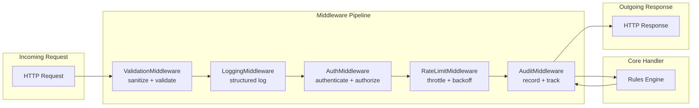

# Middleware Module

Request/response processing pipeline for the Rules-Engine platform.

## Components

| Component | File | Responsibility |
|---|---|---|
| **ValidationMiddleware** | `validation_middleware.py` | Request sanitization, XSS prevention, schema validation, type coercion |
| **LoggingMiddleware** | `logging_middleware.py` | Structured logging, sensitive data masking, log rotation, sampling |
| **AuthMiddleware** | `auth_middleware.py` | Multi-provider authentication (JWT, API key, session, Basic, custom), RBAC |
| **RateLimitMiddleware** | `rate_limit_middleware.py` | Rate limiting (sliding window, token bucket, leaky bucket, GCRA, fixed window), backoff, whitelist/blacklist |
| **AuditMiddleware** | `audit_middleware.py` | Full audit trail for rules, auth, config changes; export, archive, query |

## System Architecture



## Quick Start

```python
from src.middleware.validation_middleware import ValidationMiddleware, ValidationConfig
from src.middleware.logging_middleware import LoggingMiddleware
from src.middleware.auth_middleware import AuthMiddleware
from src.middleware.rate_limit_middleware import RateLimitMiddleware, RateLimitRule, RateLimitScope
from src.middleware.audit_middleware import AuditMiddleware

# 1. Validate and sanitize incoming requests
validation = ValidationMiddleware()
validated = validation.process_request({
    "method": "POST",
    "route": "/api/rules",
    "headers": {"Content-Type": "application/json"},
    "body": {"name": "<script>alert('xss')</script>", "value": 42},
})
print(f"Valid: {validated.valid}, Sanitized: {validated.sanitized}")

# 2. Log requests with sensitive data masking
logging = LoggingMiddleware()
corr_id = logging.log_request({"method": "GET", "route": "/api/rules"})

# 3. Authenticate via JWT bearer token
auth = AuthMiddleware()
token = auth.generate_token("user_123", ["admin", "editor"])
result = auth.authenticate({
    "route": "/api/rules/write",
    "headers": {"Authorization": token},
})
if result.result.value == "granted":
    has_perm = auth.check_permission(result.user, "write")

# 4. Rate limit per IP using sliding window
rate_limiter = RateLimitMiddleware()
request = {"method": "GET", "route": "/api/rules", "headers": {"X-Forwarded-For": "10.0.0.1"}}
rl_result = rate_limiter.check_rate_limit(request)
print(f"Allowed: {rl_result.allowed}, Remaining: {rl_result.remaining}")

# 5. Audit all rule evaluations
audit = AuditMiddleware()
audit_id = audit.record_rule_evaluation(
    rule_name="emergency_escalation",
    actor_id="system",
    result="triggered",
    duration_ms=12.5,
)
```

## Use Cases

| Scenario | Primary Middleware | Supporting |
|---|---|---|
| XSS prevention | ValidationMiddleware | — |
| Request/response logging | LoggingMiddleware | AuditMiddleware |
| User authentication | AuthMiddleware | LoggingMiddleware |
| API abuse prevention | RateLimitMiddleware | AuthMiddleware |
| Compliance audit trail | AuditMiddleware | LoggingMiddleware |
| Sensitive data masking | LoggingMiddleware | ValidationMiddleware |
| RBAC enforcement | AuthMiddleware | AuditMiddleware |
| Schema validation | ValidationMiddleware | — |
| Session management | AuthMiddleware | — |
| Backoff on violation | RateLimitMiddleware | LoggingMiddleware |

## Pipeline Order

The middleware components are designed to execute in a specific order:

1. **ValidationMiddleware** — first: sanitize input, prevent injection attacks
2. **LoggingMiddleware** — second: log the sanitized request with correlation ID
3. **AuthMiddleware** — third: authenticate user, check permissions
4. **RateLimitMiddleware** — fourth: enforce rate limits after auth context is known
5. **AuditMiddleware** — fifth: record the processed request before it reaches the handler
6. **Handler** — process the request
7. **AuditMiddleware** — record the response
8. **LoggingMiddleware** — log the response with duration

## Configuration

All middleware components support declarative configuration:

```yaml
# middleware_config.yaml
validation:
  mode: sanitize
  strip_html: true
  max_request_size: 1048576
  blocked_patterns:
    - "<script[^>]*>.*?</script>"
    - "on\\w+\\s*="

logging:
  format: json
  default_level: INFO
  log_to_file: true
  mask_fields: [password, secret, token, authorization]

auth:
  enabled: true
  providers:
    - type: bearer
      name: jwt
    - type: api_key
      name: api_keys

rate_limit:
  default_max_requests: 100
  default_window_seconds: 60
  enable_backoff: true
  rules:
    - name: strict_api
      scope: per_ip
      max_requests: 30
      window_seconds: 60

audit:
  enabled: true
  max_records: 100000
  retention_days: 90
  track_all_events: true
```

## Rate Limiting Strategies

| Strategy | File | Behavior |
|---|---|---|
| SlidingWindowCounter | `rate_limit_middleware.py` | Timestamp deque with cutoff pruning |
| TokenBucket | `rate_limit_middleware.py` | Token accumulation with refill rate |
| FixedWindowCounter | `rate_limit_middleware.py` | Window-aligned counters with time-slice reset |
| LeakyBucket | `rate_limit_middleware.py` | Constant-rate leak with burst capacity |
| GCRACounter | `rate_limit_middleware.py` | Generic cell rate algorithm (jitter-tolerant) |

## Auth Provider Types

bearer (JWT), api_key, session, basic, custom — each with its own config dataclass (`TokenConfig`, `APIKeyConfig`, `SessionConfig`). Custom providers can be registered via `register_custom_provider(name, handler)`.

## Audit Event Types

rule_evaluated, rule_created, rule_updated, rule_deleted, rule_enabled, rule_disabled, request_processed, response_sent, auth_attempt, auth_success, auth_failure, config_changed, data_exported, data_imported, system_startup, system_shutdown, error_occurred, permission_denied, rate_limit_hit, session_created, session_expired, custom
