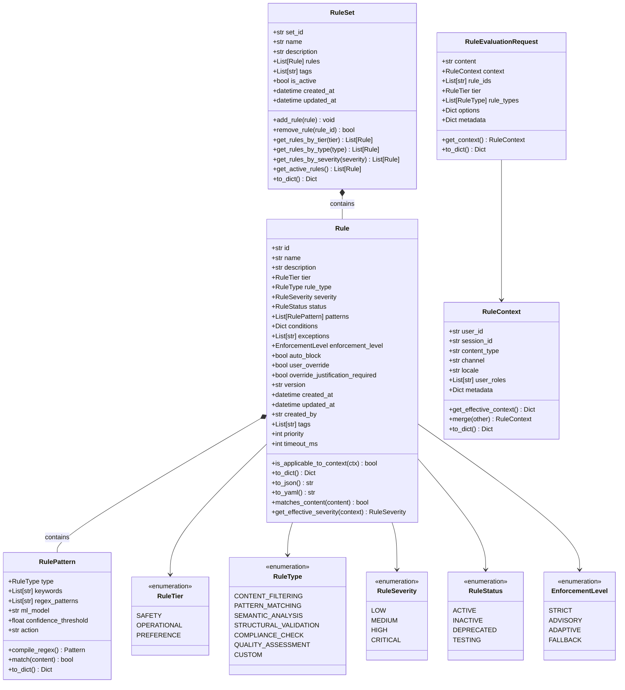
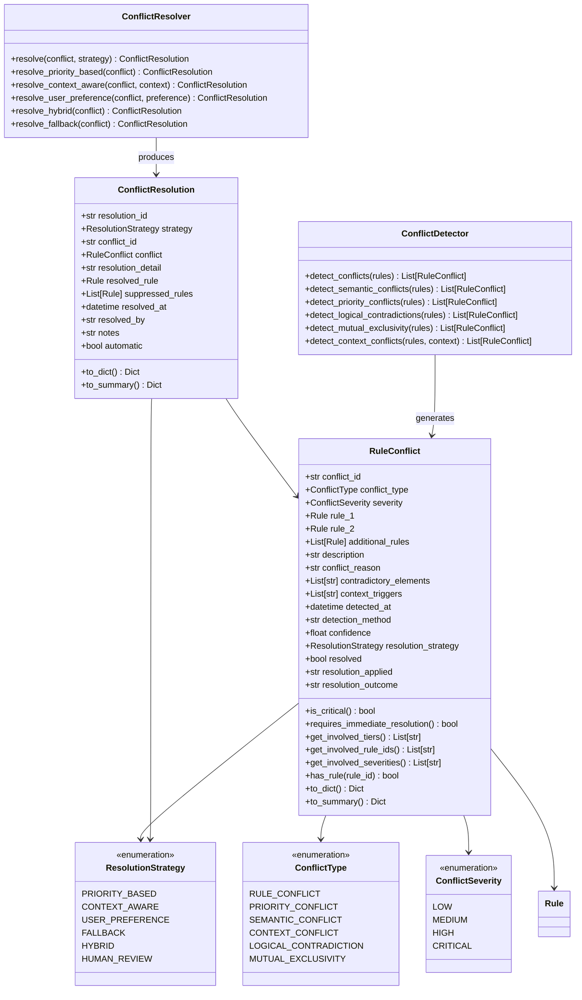
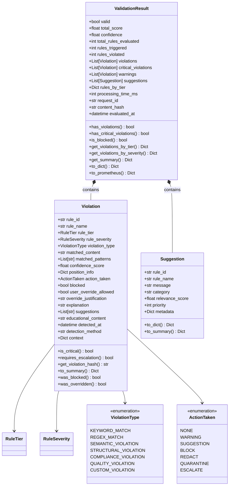
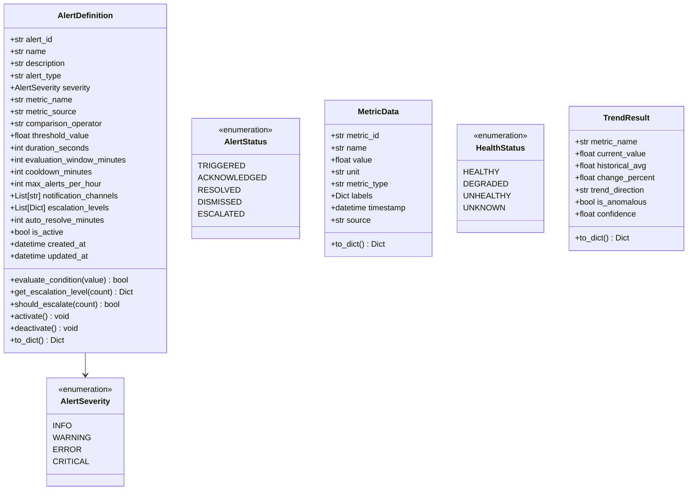
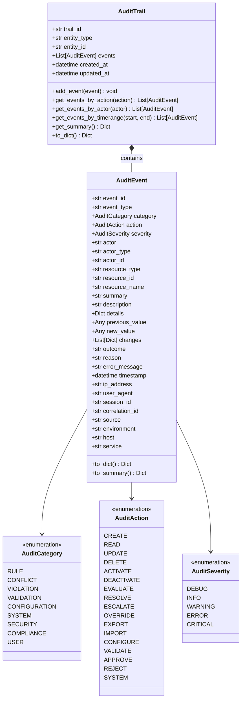

# Model Architecture

## Rule Model Hierarchy

The Rule model is the central entity in the system, with supporting types for patterns, tiers, severity, status, and enforcement.

## Conflict Model Hierarchy

## Validation Model Hierarchy

## Monitoring Model Hierarchy

## Audit Model Hierarchy

