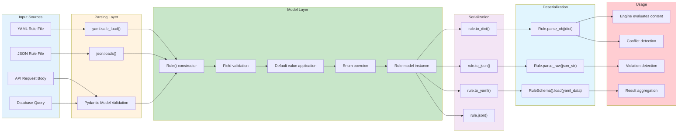
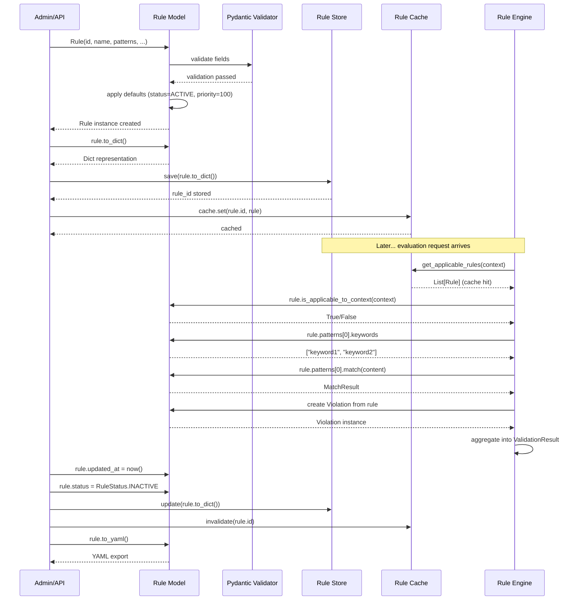
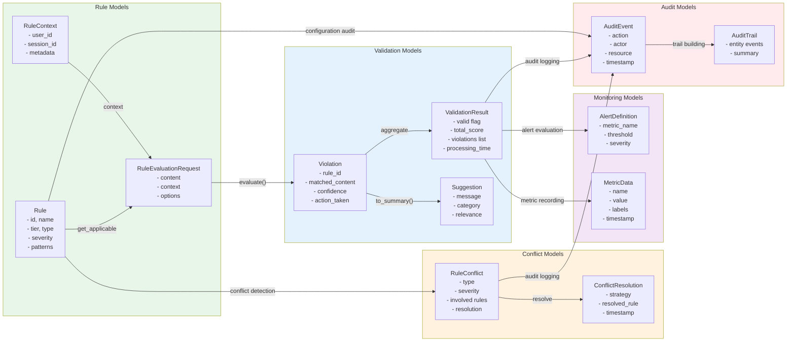
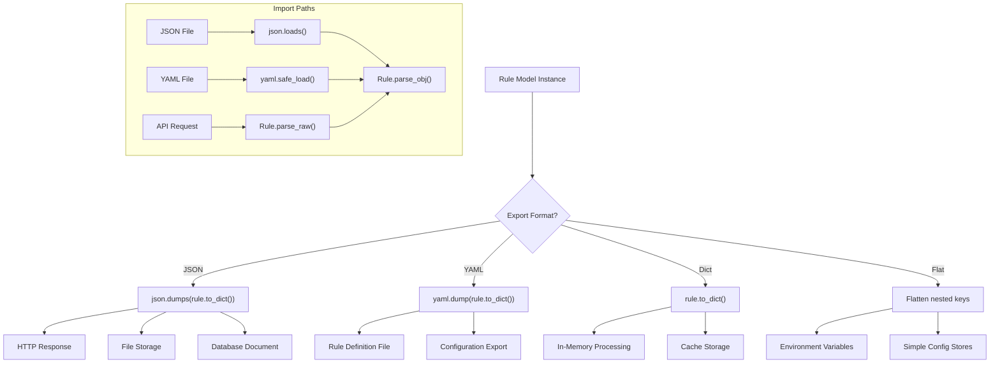
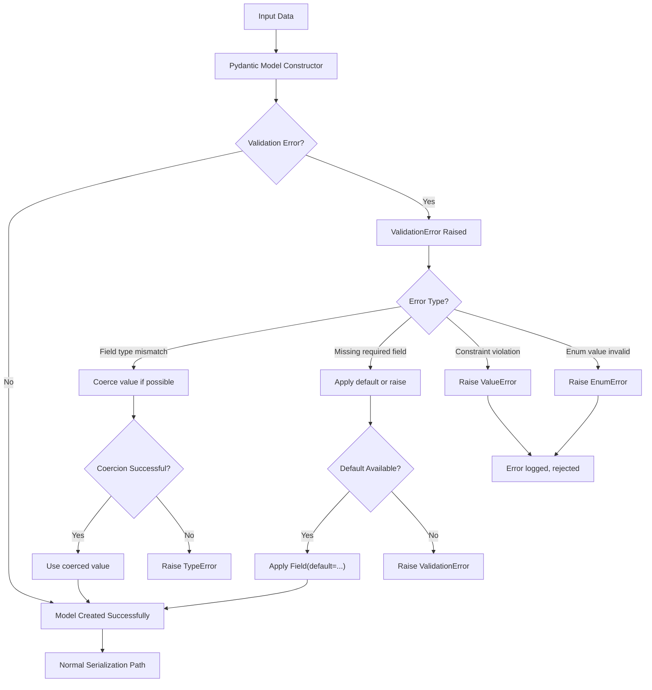
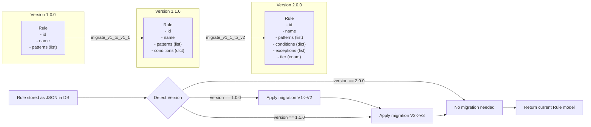

# Model Data Flow

## Input to Rule Model Flow

The following flowchart illustrates how raw input data is processed through the Rule model, serialized, and eventually consumed by evaluation engines.

## Model Lifecycle Sequence

The following sequence diagram illustrates the complete lifecycle of a Rule model from creation through serialization, storage, retrieval, and usage.

## Data Transformation Across Model Types

The following diagram shows how data is transformed as it flows from one model type to another during the evaluation lifecycle.

## Serialization Formats Flow

## Error Handling in Model Serialization

## Model Versioning & Migration

