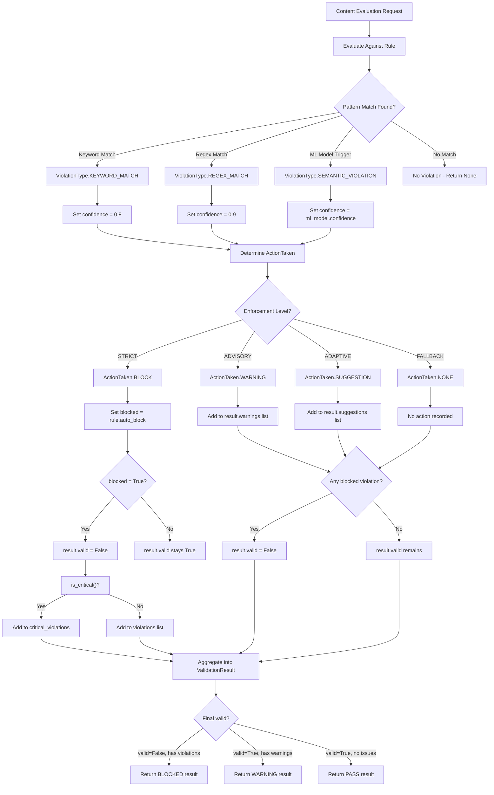
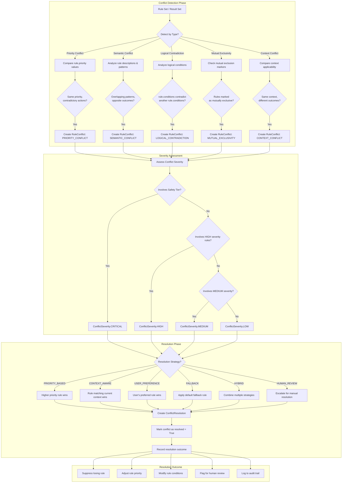
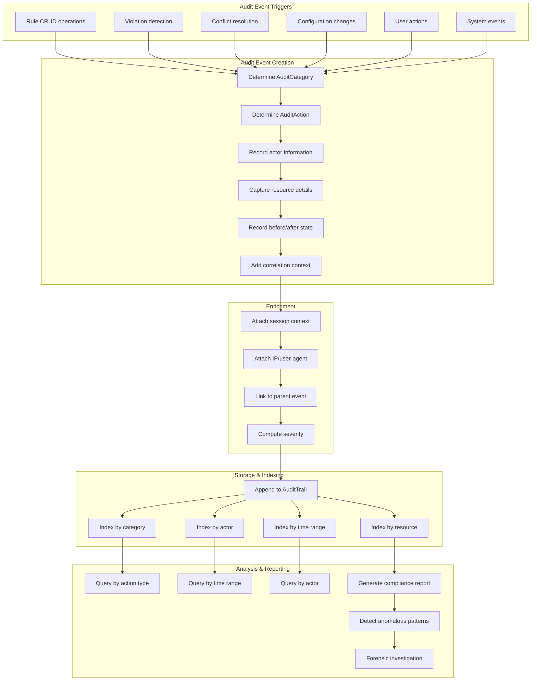
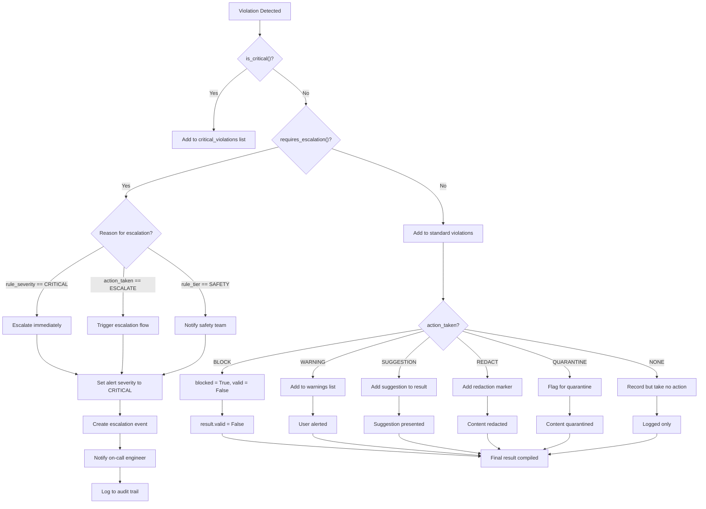
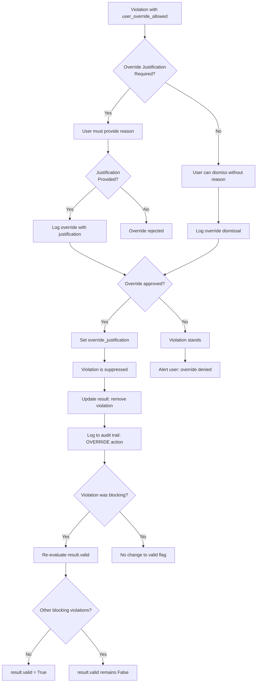

# Model Reasoning & Validation

## Validation Decision Logic

The `ValidationResult` and `Violation` models encapsulate the decision logic for content validation. The following flowchart shows how individual violations combine to produce a final validation outcome.

## Conflict Detection & Resolution Decision Diagram

The Conflict Detection model uses a multi-stage analysis to identify and resolve rule conflicts.

## Audit Trail Reasoning

The Audit model provides a comprehensive trail of all system actions. The following diagram shows how audit events are generated and correlated.

## Violation Escalation Decision Tree

## Override Reasoning

