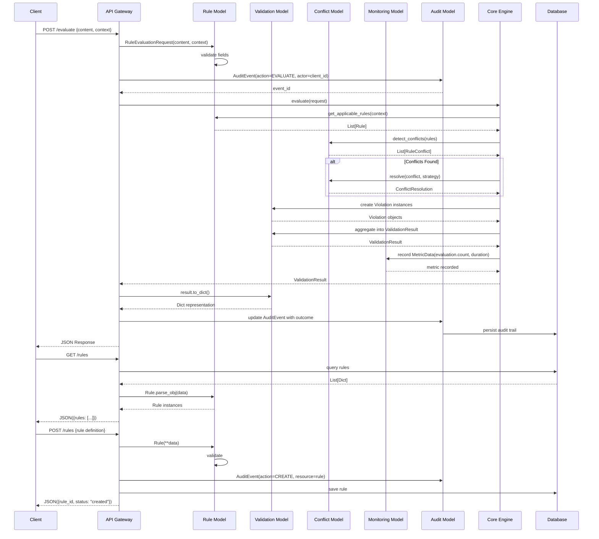
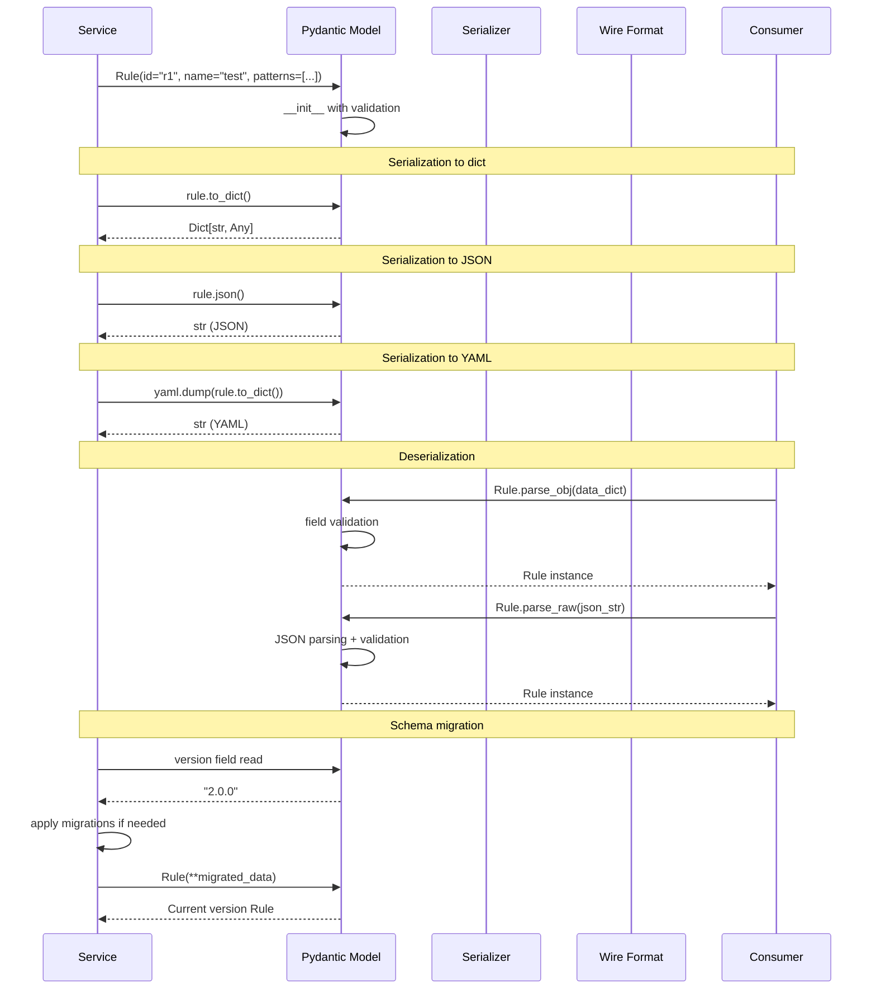
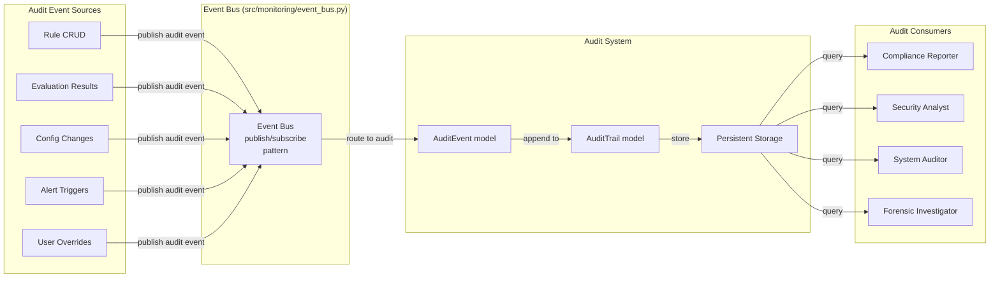

# Model Integration

## Component Diagram

The following diagram shows how models are consumed by every module in the system.

```mermaid
flowchart TD
    subgraph Models["Models Module (src/models/)"]
        RuleM["Rule Model\nRule, RuleContext\nRuleTier, RuleType\nRuleSeverity, RuleStatus"]
        ValM["Validation Model\nValidationResult, Violation\nActionTaken, Suggestion\nViolationType"]
        ConfM["Conflict Model\nRuleConflict, ConflictType\nResolutionStrategy\nConflictSeverity"]
        MonM["Monitoring Model\nAlertDefinition, MetricData\nHealthStatus, TrendResult"]
        AuditM["Audit Model\nAuditEvent, AuditTrail\nAuditCategory, AuditAction"]
    end

    subgraph Core["Core Module (src/core/)"]
        RE["RuleEngine"]
        EP["EvaluationPipeline"]
        RA["ResultAggregator"]
        RD["RuleDispatcher"]
    end

    subgraph ModelsInternal["Model Consumers"]
        RM["RuleManager"]
        VL["ViolationLogger"]
        CD["ConflictDetector"]
        CR["ConflictResolver"]
    end

    subgraph Monitoring["Monitoring Module (src/monitoring/)"]
        MC["MetricsCollector"]
        AM["AlertManager"]
        HC["HealthChecker"]
        DASH["Dashboard"]
        EB["EventBus"]
    end

    subgraph API["API Layer"]
        REST["REST API"]
        GraphQL["GraphQL API"]
        GRPC["gRPC Service"]
    end

    subgraph Storage["Storage Layer"]
        DB["Database"]
        FS["File System"]
        Cache["Cache"]
    end

    RE -->|"evaluate() uses"| RuleM
    RE -->|"returns"| ValM
    RE -->|"detects"| ConfM

    RA -->|"aggregates"| ValM
    RA -->|"resolves"| ConfM

    RM -->|"manages"| RuleM
    VL -->|"logs"| ValM
    CD -->|"generates"| ConfM
    CR -->|"produces"| ConfM

    MC -->|"records"| MonM
    AM -->|"evaluates"| MonM
    HC -->|"publishes"| MonM
    DASH -->|"displays"| MonM
    EB -->|"transports"| MonM

    AuditM -->|"logs"| AuditM

    REST -->|"serializes"| RuleM
    REST -->|"serializes"| ValM
    REST -->|"serializes"| AuditM
    GraphQL -->|"resolves"| RuleM
    GraphQL -->|"resolves"| ValM
    GRPC -->|"protobuf"| RuleM

    DB -->|"stores"| RuleM
    DB -->|"stores"| AuditM
    FS -->|"persists"| RuleM
    Cache -->|"caches"| RuleM
    Cache -->|"caches"| ValM
```

## Integration Sequence: API to Model to Response

The following sequence diagram shows how models are used across the full request-response lifecycle.

## Shared Model Usage Patterns

```mermaid
flowchart TD
    subgraph Pattern1["Pattern 1: Request-Response"]
        A["RuleEvaluationRequest"] --> B["RuleEngine.evaluate()"]
        B --> C["ValidationResult"]
        C --> D["Client receives result"]
    end

    subgraph Pattern2["Pattern 2: Batch Processing"]
        E["List[RuleEvaluationRequest]"] --> F["RuleEngine.evaluate_batch()"]
        F --> G["List[ValidationResult]"]
        G --> H["ResultAggregator.aggregate()"]
        H --> I["AggregatedResult"]
    end

    subgraph Pattern3["Pattern 3: Conflict-Aware"]
        J["List[Rule]"] --> K["ConflictDetector.detect()"]
        K --> L["List[RuleConflict]"]
        L --> M["ConflictResolver.resolve()"]
        M --> N["ConflictResolution"]
        N --> O["Adjusted Rule list"]
    end

    subgraph Pattern4["Pattern 4: Monitoring Pipeline"]
        P["ValidationResult"] --> Q["MetricsCollector.record()"]
        P --> R["AlertManager.evaluate()"]
        Q --> S["Dashboard.refresh()"]
        R --> T["Alert notification"]
    end

    subgraph Pattern5["Pattern 5: Audit Trail"]
        U["Any system action"] --> V["AuditEvent(action, actor, resource)"]
        V --> W["AuditTrail.append(event)"]
        W --> X["AuditTrail stored in DB"]
        X --> Y["Compliance queries"]
        X --> Z["Forensic analysis"]
    end
```

## Model Serialization Integration

## Cross-Module Audit Integration

