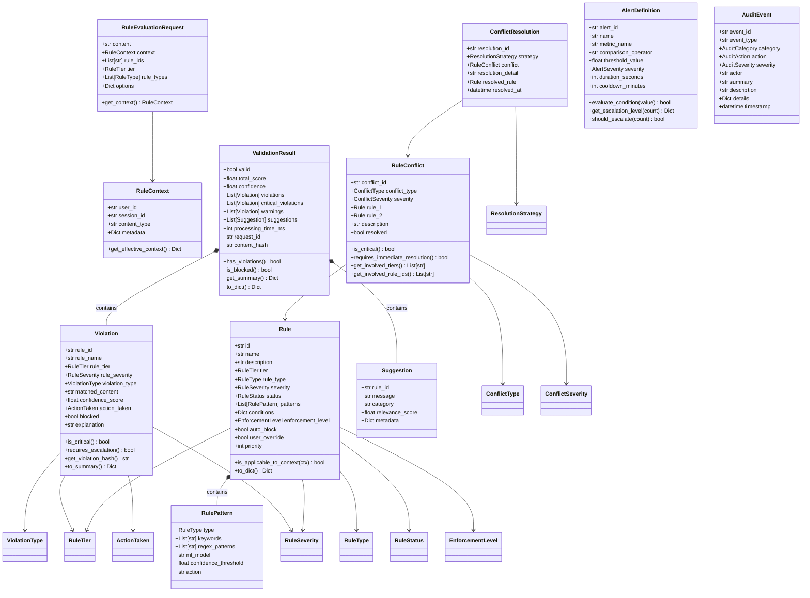

# Data Models Module

## Overview

The Data Models module defines all core data structures used throughout the Rules-Emerging-Pattern system. It provides Pydantic-based models for rules, violations, conflicts, monitoring data, and audit trails. These models serve as the contract between the core engine, monitoring systems, and external APIs.

## Files

| File | Purpose |
|------|---------|
| `rule.py` | `Rule`, `RulePattern`, `RuleContext`, `RuleEvaluationRequest`, `RuleSet`, `RuleTier`, `RuleType`, `RuleSeverity`, `RuleStatus`, `EnforcementLevel` |
| `validation.py` | `ValidationResult`, `Violation`, `ViolationType`, `ActionTaken`, `Suggestion` |
| `conflict.py` | `RuleConflict`, `ConflictType`, `ResolutionStrategy`, `ConflictSeverity`, `ConflictResolution` |
| `monitoring.py` | `AlertDefinition`, `AlertSeverity`, `AlertStatus`, `MetricData`, `HealthStatus`, `TrendResult` |
| `audit.py` | `AuditEvent`, `AuditAction`, `AuditCategory`, `AuditSeverity`, `AuditTrail` |

## Class Hierarchy Diagram



## Usage Examples

```python
from rules_emerging_pattern.models.rule import Rule, RuleTier, RuleSeverity, RuleType, EnforcementLevel

rule = Rule(
    id="rule_001",
    name="Block Profanity",
    description="Blocks content containing profane language",
    tier=RuleTier.SAFETY,
    rule_type=RuleType.CONTENT_FILTERING,
    severity=RuleSeverity.HIGH,
    enforcement_level=EnforcementLevel.STRICT,
    auto_block=True,
    patterns=[RulePattern(
        type=RuleType.CONTENT_FILTERING,
        keywords=["badword1", "badword2"],
        regex_patterns=[r"explicit\s+pattern"],
    )],
)

from rules_emerging_pattern.models.validation import Violation, ValidationResult, ViolationType, ActionTaken

violation = Violation(
    rule_id="rule_001",
    rule_name="Block Profanity",
    rule_tier=RuleTier.SAFETY,
    rule_severity=RuleSeverity.HIGH,
    violation_type=ViolationType.KEYWORD_MATCH,
    matched_content="badword1",
    confidence_score=0.95,
    action_taken=ActionTaken.BLOCK,
    blocked=True,
    explanation="Content contains prohibited keyword",
)

result = ValidationResult(
    valid=False,
    total_score=0.0,
    confidence=0.95,
    violations=[violation],
)
```

## Model Validation

All models use Pydantic `BaseModel` with built-in validation:

- `RulePattern` - Enforces `confidence_threshold` between 0.0 and 1.0
- `Rule` - Validates `priority` between 1 and 1000, `timeout_ms` between 1 and 10000
- `Violation` - Enforces `confidence_score` range
- `AlertDefinition` - Validates `duration_seconds` and `cooldown_minutes` ranges
- `AuditEvent` - Validates timestamp ordering
