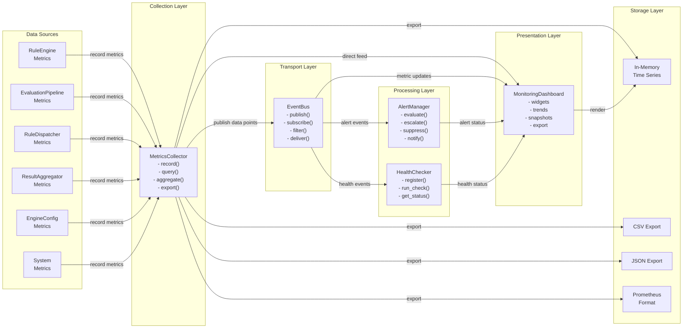
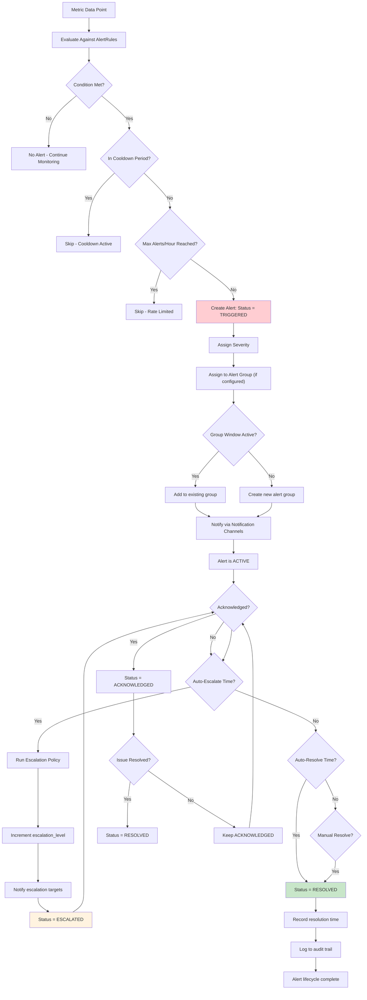
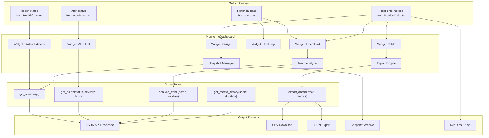
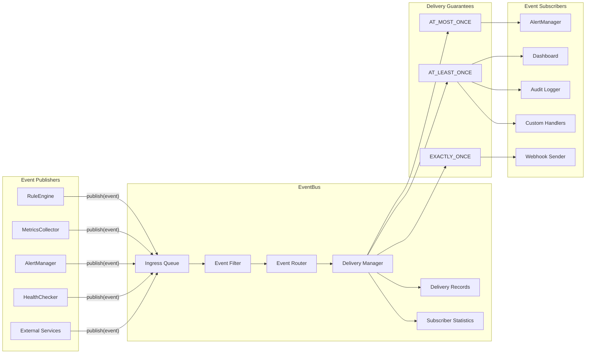
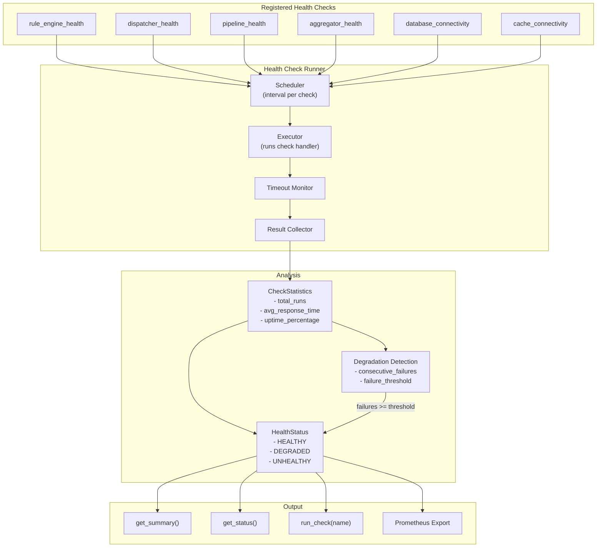

# Monitoring Architecture

## Component Diagram

The following diagram shows how the monitoring components connect: metrics flow from collectors through the event bus to consumers.

## Alert Lifecycle Flow

The following flowchart illustrates the complete lifecycle of an alert from creation through resolution.

## Dashboard Data Flow Diagram

## Event Bus Architecture

## Health Check Architecture

