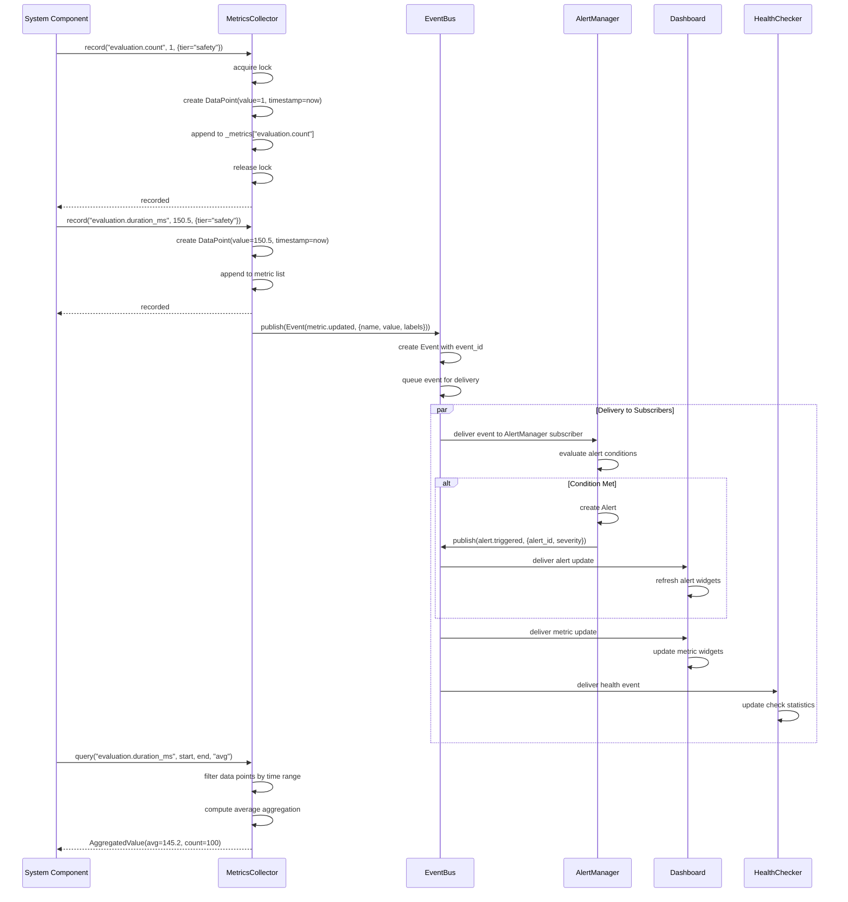
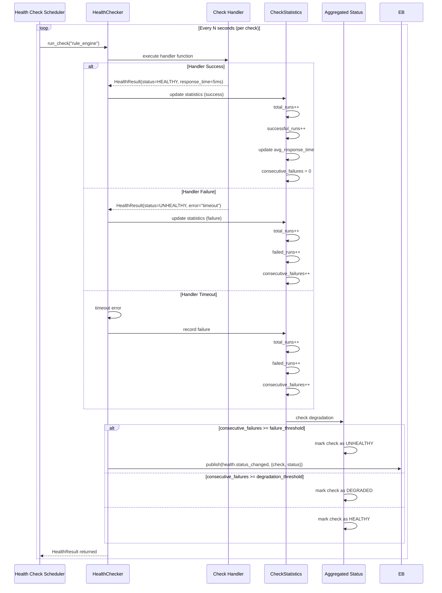
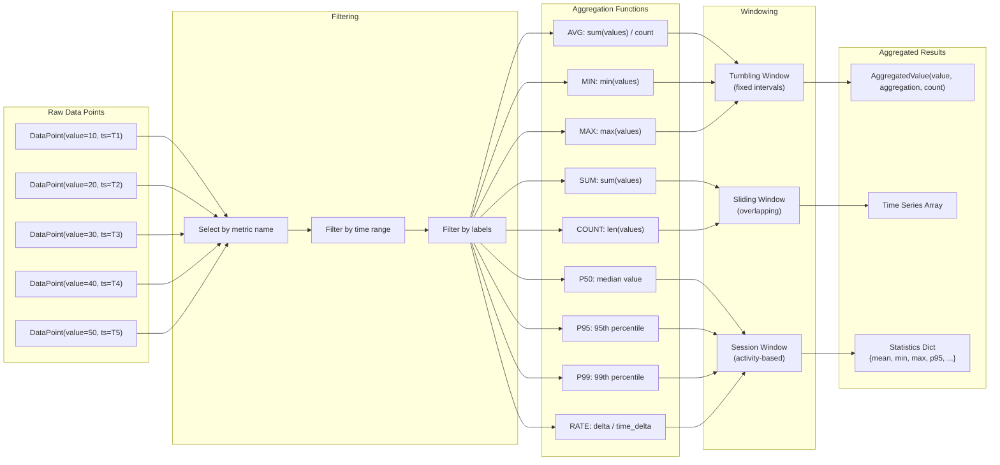
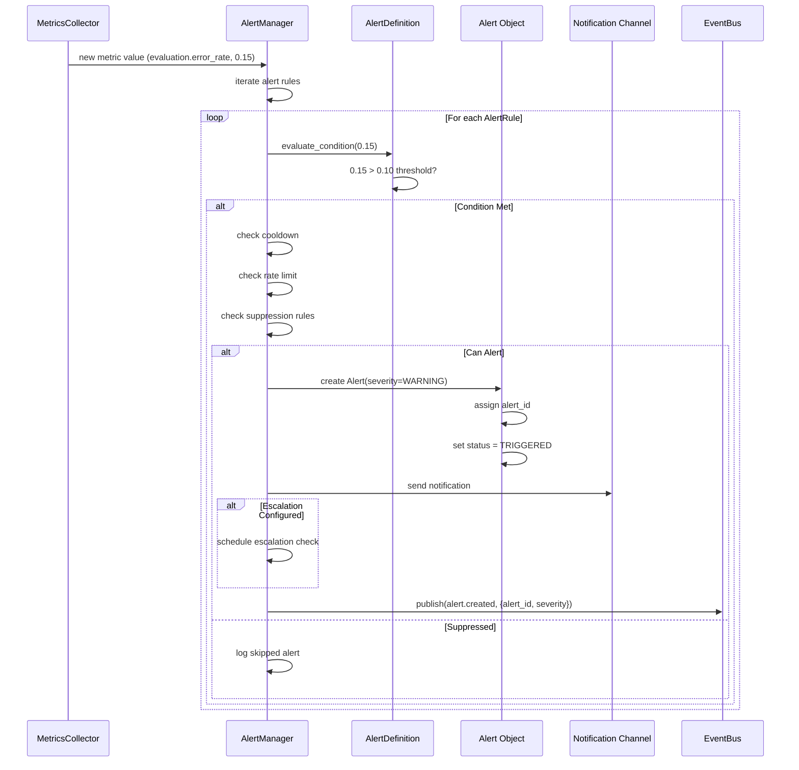
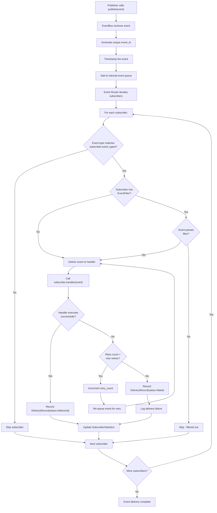

# Monitoring Data Flow

## Metrics Collection Sequence

The following sequence diagram shows how a metric is collected, processed through the event bus, and triggers an alert.

## Health Check Flow

## Metrics Aggregation Pipeline

## Alert Evaluation Data Flow

## Event Bus Message Routing

