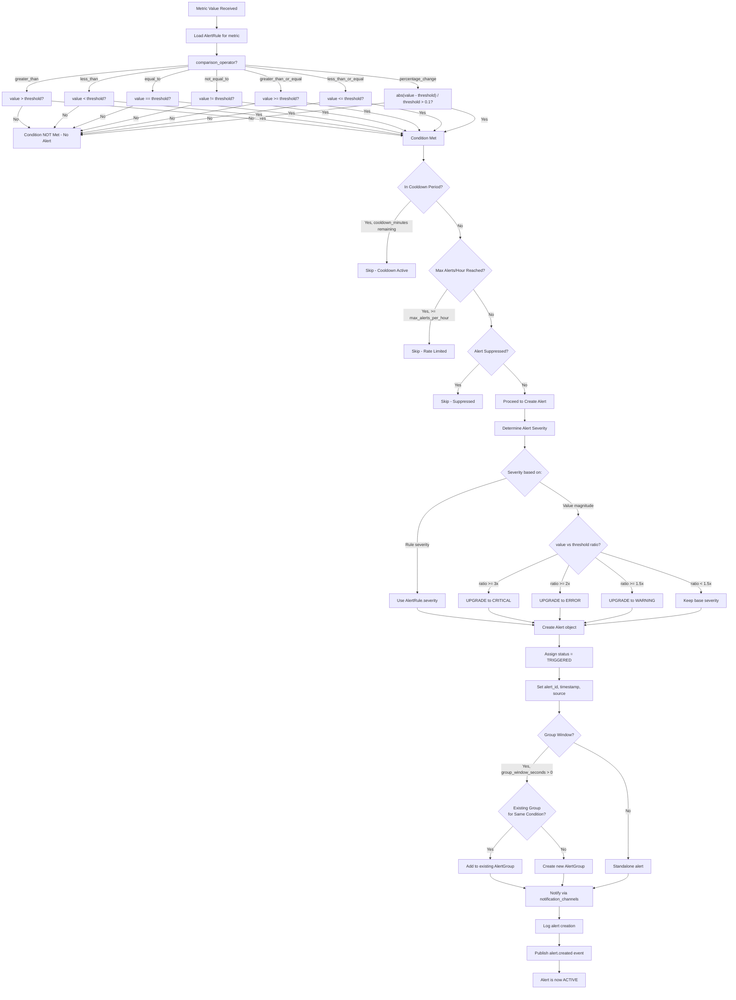
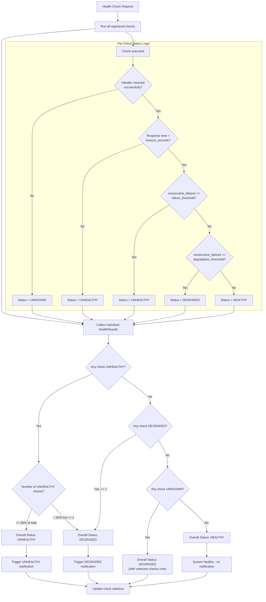
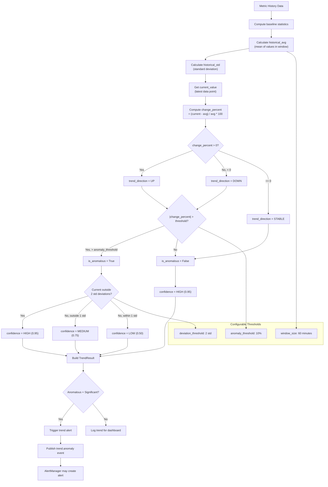
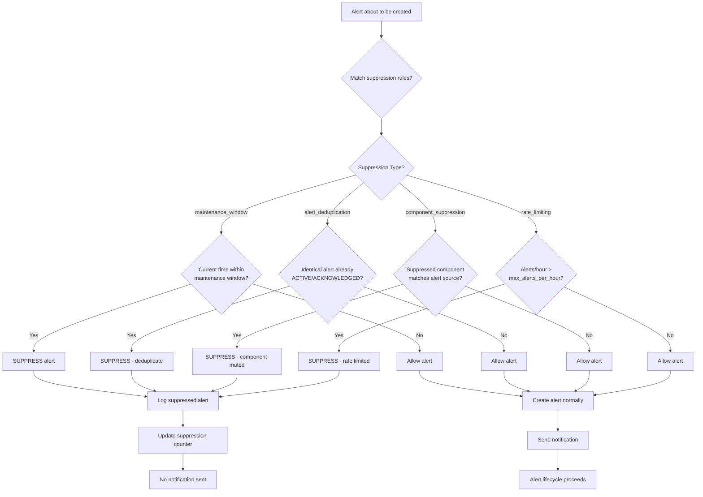
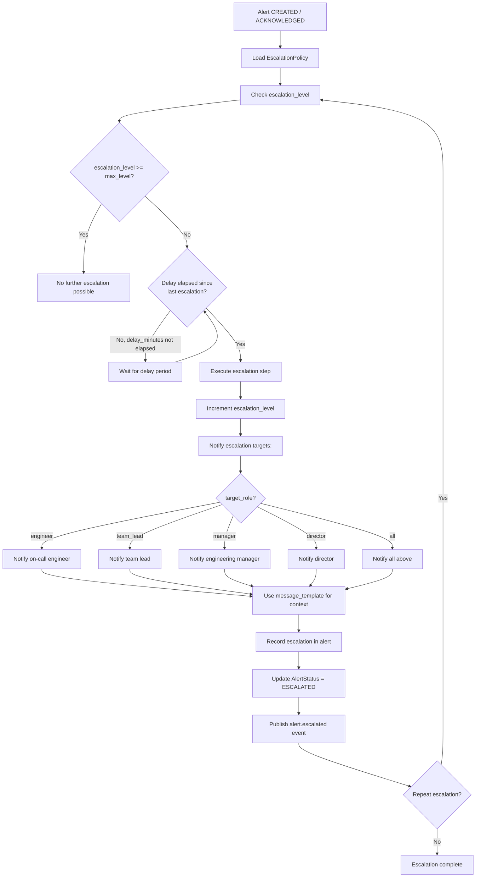
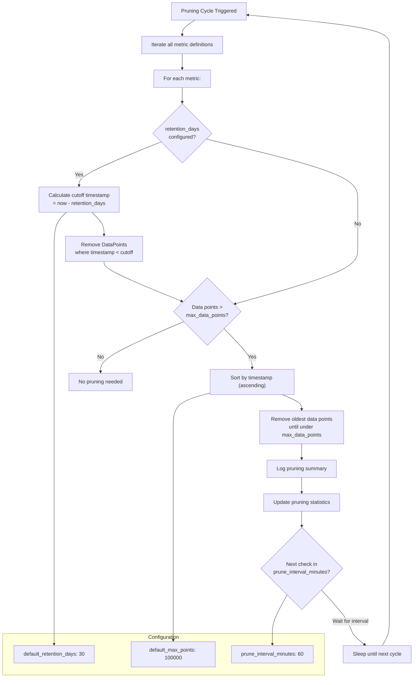

# Alert & Health Reasoning

## Alert Condition Evaluation Flow

The following flowchart shows the complete decision process for evaluating alert conditions, determining severity, and routing notifications.

## Health Status Determination

The following decision tree shows how the HealthChecker determines aggregate system health based on individual check results.

## Trend Detection Logic

The dashboard's trend analyzer uses statistical methods to detect anomalies and compute trend directions.

## Suppression Logic

## Escalation Policy Reasoning

## Data Pruning & Retention Logic

