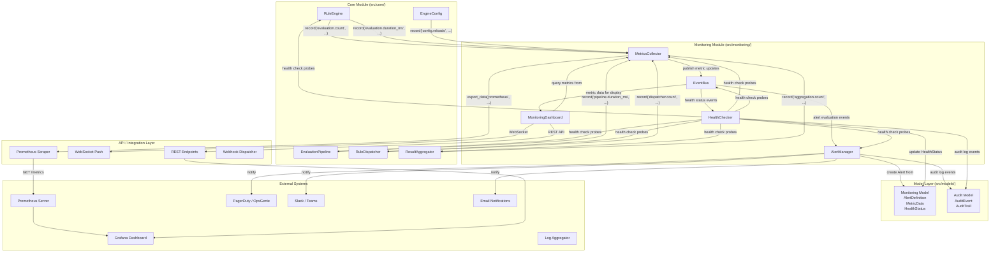
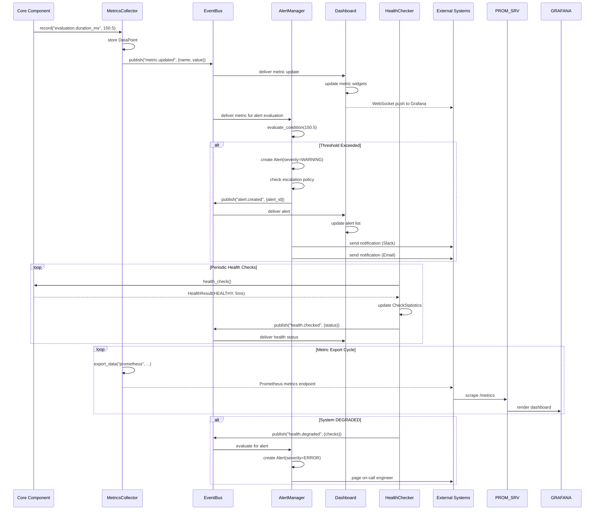
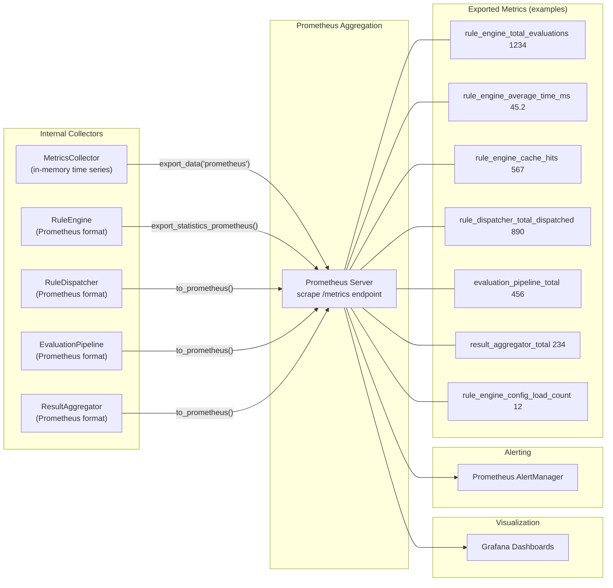
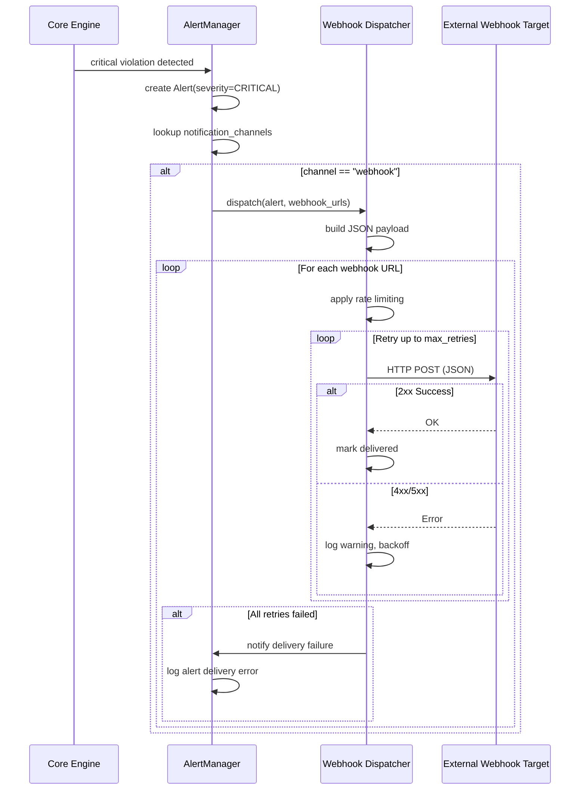
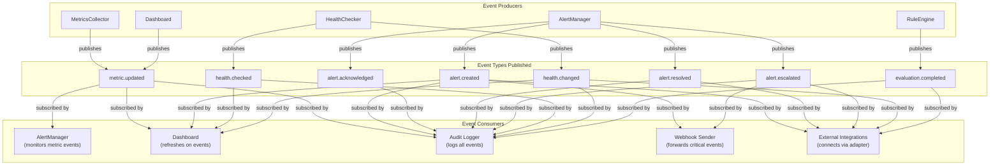
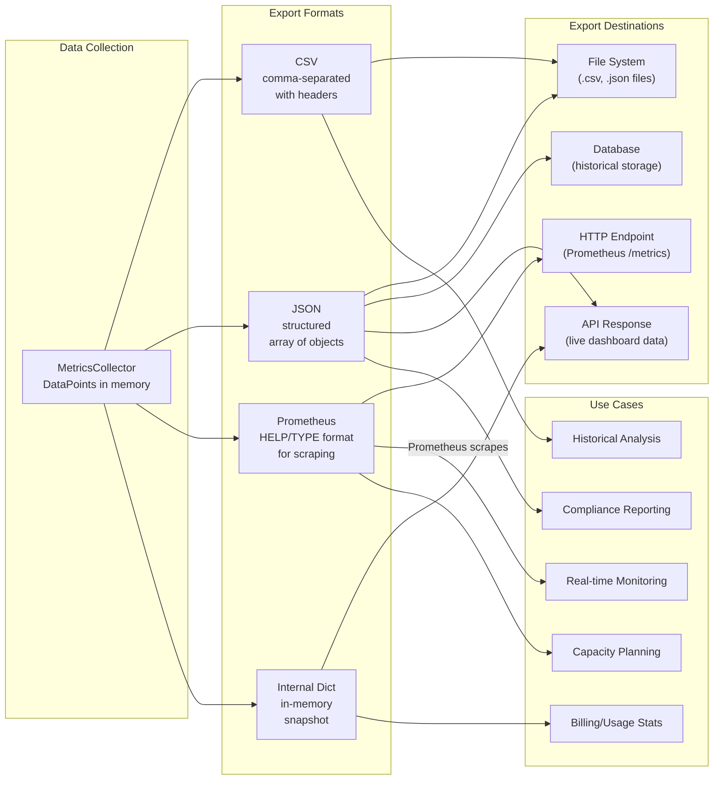

# Monitoring Integration

## Component Diagram

The following diagram shows how the monitoring module integrates with the core engine, models, API layer, and external systems.

## Cross-Module Monitoring Integration Sequence

The following sequence diagram shows how the monitoring module interacts with core components during a complete monitoring lifecycle.

## Prometheus Export Integration

The monitoring module exports metrics in Prometheus-compatible text format, allowing direct integration with Prometheus servers and Grafana dashboards.

## Webhook Notification Integration

## Event Bus Integration Patterns

## Data Export Integration

