# Monitoring & Alerting Module

## Overview

The Monitoring & Alerting module provides comprehensive observability for the Rules-Emerging-Pattern system. It collects metrics, evaluates alert conditions, checks system health, provides a real-time dashboard, and routes events through a publish-subscribe event bus.

## Files

| File | Purpose |
|------|---------|
| `alerting.py` | `AlertManager` with `Alert`, `AlertRule`, `EscalationPolicy`, `EscalationStep`, `AlertGroup`, `NotificationChannel`, `AlertSuppression` |
| `dashboard.py` | `MonitoringDashboard` with `DashboardWidget`, `Metric`, `ThresholdRule`, `TrendResult`, `DashboardSnapshot`, `DashboardTemplate` |
| `health_checker.py` | `HealthChecker` with `CheckDefinition`, `HealthResult`, `HealthStatus`, `CheckStatistics` |
| `metrics_collector.py` | `MetricsCollector` with `DataPoint`, `MetricDefinition`, `AggregatedValue` |
| `event_bus.py` | `EventBus` with `Event`, `Subscriber`, `EventFilter`, `DeliveryRecord`, `DeliveryGuarantee`, `EventPriority` |

## Class Diagram

```mermaid
classDiagram
    class AlertManager {
        -Dict _alerts
        -Dict _alert_rules
        -Dict _escalation_policies
        -Dict _suppression_rules
        -Dict _notification_channels
        +create_alert(alert) Alert
        +evaluate_rule(rule, value) Alert
        +acknowledge_alert(alert_id) bool
        +resolve_alert(alert_id) bool
        +escalate_alert(alert_id) bool
        +suppress_alert(alert_id, duration) bool
        +get_alerts(status, severity, limit) List[Alert]
        +get_alert_stats() Dict
        +health_check() Dict
    }

    class Alert {
        +str alert_id
        +str name
        +AlertSeverity severity
        +AlertStatus status
        +str message
        +datetime timestamp
        +str source
        +Dict metadata
        +str acknowledged_by
        +datetime acknowledged_at
        +datetime resolved_at
        +datetime escalated_at
        +int escalation_level
        +str group_id
        +int retry_count
    }

    class AlertRule {
        +str rule_id
        +str name
        +str condition
        +AlertSeverity severity
        +List[str] notification_channels
        +bool enabled
        +int cooldown_seconds
        +int group_window_seconds
        +str escalation_policy
        +Dict metadata
    }

    class EscalationPolicy {
        +str policy_id
        +str name
        +List[EscalationStep] steps
        +int max_escalation_level
        +bool repeat
        +Dict metadata
    }

    class EscalationStep {
        +int level
        +List[str] notify_channels
        +int delay_minutes
        +str target_role
        +str message_template
    }

    class MonitoringDashboard {
        -Dict _widgets
        -Dict _metrics
        -Dict _thresholds
        -Dict _templates
        -List _snapshots
        +create_widget(widget) DashboardWidget
        +add_metric(metric) void
        +set_threshold(rule) void
        +get_metric_history(name, duration) List[Metric]
        +analyze_trend(name, window) TrendResult
        +create_snapshot(description) DashboardSnapshot
        +export_data(format, metrics) str
        +health_check() Dict
    }

    class DashboardWidget {
        +str widget_id
        +str widget_type
        +str title
        +List[str] metric_names
        +Dict config
    }

    class Metric {
        +str name
        +float value
        +str unit
        +datetime timestamp
        +Dict labels
    }

    class HealthChecker {
        -Dict _checks
        -Dict _results
        -Dict _statistics
        -threading.Thread _runner
        +register_check(check, handler) str
        +unregister_check(name) bool
        +run_check(name) HealthResult
        +run_all_checks() Dict
        +get_status() HealthStatus
        +get_summary() Dict
        +get_check_stats(name) CheckStatistics
        +health_check() Dict
    }

    class HealthResult {
        +str check_name
        +HealthStatus status
        +datetime timestamp
        +float response_time_ms
        +str message
        +Dict details
        +str error
        +int consecutive_failures
    }

    class CheckDefinition {
        +str name
        +str description
        +int interval_seconds
        +int timeout_seconds
        +int failure_threshold
        +int degradation_threshold
        +bool enabled
        +List[str] tags
    }

    class MetricsCollector {
        -Dict _metrics
        -Dict _definitions
        +record(name, value, labels) void
        +record_batch(metrics) void
        +query(name, start, end, aggregation) List[AggregatedValue]
        +get_latest(name) DataPoint
        +get_statistics(name) Dict
        +list_metrics() List[str]
        +export_csv(metrics, filepath) void
        +export_json(metrics, filepath) void
        +health_check() Dict
    }

    class DataPoint {
        +float value
        +datetime timestamp
        +Dict labels
    }

    class MetricDefinition {
        +str name
        +str description
        +str unit
        +str metric_type
        +int retention_days
        +int max_data_points
        +Dict labels
        +bool enabled
    }

    class EventBus {
        -Dict _subscribers
        -queue.Queue _event_queue
        -Dict _delivery_records
        -Dict _subscriber_stats
        +publish(event) str
        +subscribe(event_types, handler, filter) str
        +unsubscribe(subscriber_id) bool
        +get_events(event_type, start, end, limit) List[Event]
        +get_subscriber_stats(subscriber_id) SubscriberStatistics
        +health_check() Dict
    }

    class Event {
        +str event_id
        +str event_type
        +Dict data
        +datetime timestamp
        +str source
        +EventPriority priority
        +Dict metadata
        +int retry_count
        +DeliveryGuarantee delivery_guarantee
    }

    class Subscriber {
        +str subscriber_id
        +Callable handler
        +List[str] event_types
        +EventFilter filter
        +str name
        +datetime created_at
    }

    AlertManager *-- Alert : manages
    AlertManager *-- AlertRule : evaluates
    AlertManager *-- EscalationPolicy : uses
    EscalationPolicy *-- EscalationStep : contains
    MonitoringDashboard *-- DashboardWidget : contains
    MonitoringDashboard *-- Metric : tracks
    MonitoringDashboard *-- ThresholdRule : enforces
    HealthChecker *-- CheckDefinition : runs
    HealthChecker *-- HealthResult : produces
    HealthChecker *-- CheckStatistics : tracks
    MetricsCollector *-- DataPoint : stores
    MetricsCollector *-- MetricDefinition : defines
    EventBus *-- Subscriber : manages
    EventBus *-- Event : routes
```



## Quick Start

```python
from src.monitoring.metrics_collector import MetricsCollector

collector = MetricsCollector()
collector.record("evaluation.count", 1, {"tier": "safety"})
collector.record("evaluation.duration_ms", 45.2, {"tier": "safety"})

latest = collector.get_latest("evaluation.count")
print(f"Count: {latest.value} at {latest.timestamp}")
```

```python
from src.monitoring.health_checker import HealthChecker

checker = HealthChecker()
checker.register_check(
    "rule_engine",
    lambda: {"status": "healthy", "response_time_ms": 5.0},
    {"interval_seconds": 30}
)
status = checker.get_status()
print(f"System health: {status.value}")
```

```python
from src.monitoring.event_bus import EventBus

bus = EventBus()

def on_violation(event):
    print(f"Violation: {event.data}")

bus.subscribe(["violation.detected"], on_violation)
bus.publish({
    "event_type": "violation.detected",
    "data": {"rule_id": "r001", "severity": "high"}
})
```
