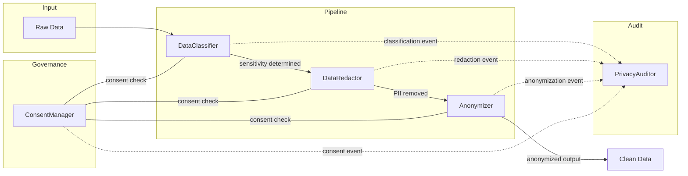

# Privacy Module Architecture

## High-Level Component Model

The privacy module follows a layered pipeline architecture:

1. **Classification Layer** — `DataClassifier` inspects data and assigns a sensitivity level
2. **Redaction Layer** — `DataRedactor` strips PII from text/dicts based on regex rules
3. **Anonymization Layer** — `Anonymizer` applies field-level transformations (suppression, generalization, perturbation, pseudonymization)
4. **Consent Layer** — `ConsentManager` tracks user consent across 12+ categories with full lifecycle management
5. **Audit Layer** — `PrivacyAuditor` records every privacy-relevant event and provides DSAR/compliance reporting

## Detailed Class Diagram

```mermaid
classDiagram
    class DataClassifier {
        -_rules: List~ClassificationRule~
        -_compiled_patterns: Dict~str, List~Pattern~~
        -_default_level: str
        +__init__(config_path, default_level)
        +add_rule(rule) void
        +remove_rule(rule_id) bool
        +get_rules(include_disabled) List
        +enable_rule(rule_id, enabled) bool
        +clear_rules() void
        +load_rules_from_config(path) int
        +classify(data, context) ClassificationResult
        +classify_batch(dataset, context) List
        +classify_text(text) ClassificationResult
        +classify_with_metadata(data, metadata) ClassificationResult
        +classify_batch_with_summary(dataset) Tuple
        +compare_levels(a, b) int
        +is_at_least(level, minimum) bool
        +export_rules_config(path, fmt) void
        -_classify_text(text, context) ClassificationResult
        -_classify_dict(data, context) ClassificationResult
        -_elevate_level(level, steps) str
        -_load_builtin_rules() void
    }

    class ClassificationRule {
        +rule_id: str
        +name: str
        +description: str
        +level: str
        +patterns: List~str~
        +keywords: List~str~
        +match_any: bool
        +weight: float
        +enabled: bool
    }

    class ClassificationResult {
        +level: str
        +score: float
        +matched_rules: List~str~
        +details: List~Dict~
        +is_classified: bool
        +classified_at: str
    }

    class DataRedactor {
        -_rules: List~RedactionRule~
        -_audit_log: List~RedactionAuditEntry~
        -_total_redactions: int
        -_enable_luhn_filter: bool
        +__init__(config_path, enable_luhn_filter, auto_load_config)
        +add_rule(pattern, replacement, description, label, enabled) RedactionRule
        +remove_rule(index) RedactionRule
        +enable_rule(index, enabled) bool
        +get_rules(include_disabled) List
        +clear_rules() void
        +load_rules_from_config(path) int
        +export_rules_config(path, fmt) void
        +redact(text, additional_rules, context) str
        +redact_dict(data, sensitive_keys, recursive, context) Dict
        +redact_batch(items, context) List
        +analyze_for_pii(text) Dict
        +analyze_dict_for_pii(data, sensitive_keys) Dict
        +get_stats() Dict
        +generate_report() RedactionReport
        +clear_audit_log() int
        +get_audit_log(since, label_filter, limit) List
        -_setup_default_rules() void
    }

    class Anonymizer {
        -_rules: List~AnonymizationRule~
        -_default_strategy: AnonymizationTechnique
        +__init__(config_path, default_strategy, seed)
        +add_rule(rule) void
        +add_strategy(field, technique, params, rule_id, description) AnonymizationRule
        +remove_rule(rule_id) bool
        +get_rules(include_disabled) List
        +clear_rules() void
        +load_rules_from_config(path) int
        +anonymize(data, strategy_map, in_place) Dict
        +anonymize_batch(dataset, strategy_map, in_place) List
        +anonymize_value(value, technique, params) Any
        +check_k_anonymity(dataset, quasi_identifiers, k) KAnonymityReport
        +generate_report() AnonymizationReport
        +export_rules_config(path, fmt) void
        -_apply_strategy_to_field(data, field_path, strategy) void
        -_apply_field_value(container, strategy, key) void
    }

    class ConsentManager {
        -_records: List~ConsentRecord~
        -_policies: Dict~str, ConsentPolicy~
        -_default_expiry_days: int
        +__init__(config_path, default_expiry_days, policy_version)
        +record_consent(user_id, category, granted, source, ...) ConsentRecord
        +withdraw_consent(user_id, category, source, ...) ConsentRecord
        +check_consent(user_id, category, check_expiry) bool
        +has_ever_consented(user_id, category) bool
        +get_consent_status(user_id, category) Dict
        +get_consent_history(user_id, category, limit) List
        +get_consent_proof(user_id, category) Dict
        +expire_consent(user_id, category) ConsentRecord
        +expire_all_expired() int
        +record_consent_batch(entries) List
        +get_consent_summary() ConsentSummary
        +get_user_consent_profile(user_id) Dict
        +add_policy(policy) void
        +remove_policy(policy_id) bool
        +load_policies_from_config(path) int
        +export_records_csv() str
        +export_records_json(indent) str
        +import_records_json(json_str) int
        +gdpr_compliance_report() Dict
        +ccpa_compliance_report() Dict
        +clear_records() int
        -_load_default_policies() void
    }

    class PrivacyAuditor {
        -_events: List~PrivacyEvent~
        -_dsar_requests: List~DSARRequest~
        -_retention_days: int
        +__init__(config_path, retention_days, auto_purge)
        +log_event(event_type, user_id, details, ...) PrivacyEvent
        +log_data_access(user_id, resource, ...) PrivacyEvent
        +log_data_modification(user_id, resource, ...) PrivacyEvent
        +log_data_sharing(user_id, resource, third_party, ...) PrivacyEvent
        +log_breach(user_id, details, severity, ...) PrivacyEvent
        +log_consent_change(user_id, category, granted, source) PrivacyEvent
        +query_events(event_type, user_id, start_time, end_time, ...) List
        +get_events_count(event_type, user_id) int
        +get_user_events(user_id, event_type, limit) List
        +get_recent_events(minutes, limit) List
        +export_events(fmt, path, event_type, ...) str
        +create_dsar(user_id, request_type, ...) DSARRequest
        +fulfill_dsar(dsar_id, notes) DSARRequest
        +deny_dsar(dsar_id, reason) DSARRequest
        +get_dsar(dsar_id) Dict
        +dsar_fulfillment_package(user_id, ...) Dict
        +compliance_report(report_type, period_start, period_end) ComplianceReport
        +purge_expired_events() int
        +get_stats() Dict
        +load_config(path) int
        +stream_events(event_type, user_id) Iterator
        +clear_events() int
        -_rebuild_indices() void
    }

    class ConsentRecord {
        +consent_id: str
        +user_id: str
        +category: str
        +status: str
        +granted: bool
        +source: str
        +expiry: str
        +recorded_at: str
    }

    class PrivacyEvent {
        +event_id: str
        +event_type: str
        +user_id: str
        +actor_id: str
        +timestamp: str
        +severity: str
        +tags: Set~str~
    }

    class DSARRequest {
        +dsar_id: str
        +user_id: str
        +request_type: str
        +status: str
        +submitted_at: str
        +regulatory_deadline: str
    }

    DataClassifier --> ClassificationRule : manages
    DataClassifier --> ClassificationResult : produces
    DataClassifier ..> DataRedactor : triggers on PII found
    DataRedactor ..> Anonymizer : feeds cleaned data
    ConsentManager ..> PrivacyAuditor : logs consent events
    Anonymizer ..> PrivacyAuditor : logs anonymization
    DataRedactor ..> PrivacyAuditor : logs redaction
    DataClassifier ..> PrivacyAuditor : logs classification
    ConsentManager --> ConsentRecord : stores
    PrivacyAuditor --> PrivacyEvent : stores
    PrivacyAuditor --> DSARRequest : manages
```



## Layer Interaction Flow



## Architectural Decisions

### 1. Pipeline Pattern with Side-Channel Audit
The three data-processing components (classifier, redactor, anonymizer) form a sequential pipeline. Each stage enriches the data (metadata) or transforms it, while simultaneously emitting events to the PrivacyAuditor via a side channel. This keeps the pipeline simple while maintaining a full audit trail.

### 2. Config-Driven Rule Systems
All four rule-based components load their configuration from YAML/JSON files at initialization:
- **DataClassifier**: 17 built-in rules across 5 sensitivity levels
- **DataRedactor**: 13 built-in regex patterns with Luhn validation
- **Anonymizer**: Rule-based field strategies loaded from config
- **ConsentManager**: Built-in policies (processing, marketing, sharing, analytics) + custom
- **PrivacyAuditor**: Retention policy and monitored event types

### 3. Indexed Event Storage
PrivacyAuditor maintains three indices (`_index_by_type`, `_index_by_user`, `_index_by_severity`) for efficient querying without external databases. Events are stored as an in-memory list of `PrivacyEvent` dataclass instances.

### 4. Immutable Transformations
By default, `DataRedactor.redact()`, `DataRedactor.redact_dict()`, `Anonymizer.anonymize()` return new copies of the data. In-place mutation is opt-in via `in_place=True`. This prevents accidental data corruption in multi-step pipelines.

### 5. Luhn Filter for Credit Cards
The `DataRedactor` applies the Luhn algorithm to credit-card candidates before redacting, reducing false-positive matches on numeric strings that happen to match the 16-digit pattern.

### 6. Consent Lifecycle State Machine
```
GRANTED ──→ (time passes) ──→ EXPIRED
   │                              │
   └──→ WITHDRAWN ←───────────────┘
   ↑
PENDING
```
The most recent record for a user/category pair determines current status.

### 7. DSAR Regulatory Deadline
`PrivacyAuditor.create_dsar()` automatically sets `regulatory_deadline` to 30 days from creation (GDPR Article 12 requirement). Overdue DSARs can be retrieved via `get_overdue_dsars()`.

### 8. Sensitivity Level Elevation
`DataClassifier.classify_with_metadata()` can elevate the sensitivity level based on:
- Source system (HR, payroll, legal, finance, medical → +1)
- Contains PII flag → +2
- Regulatory framework (HIPAA, GDPR, PCI, SOX, CCPA) → +3
- Data type (health, biometric, genetic → +3; financial → +2; personal → +1)

Elevation is capped at CRITICAL (max level).
