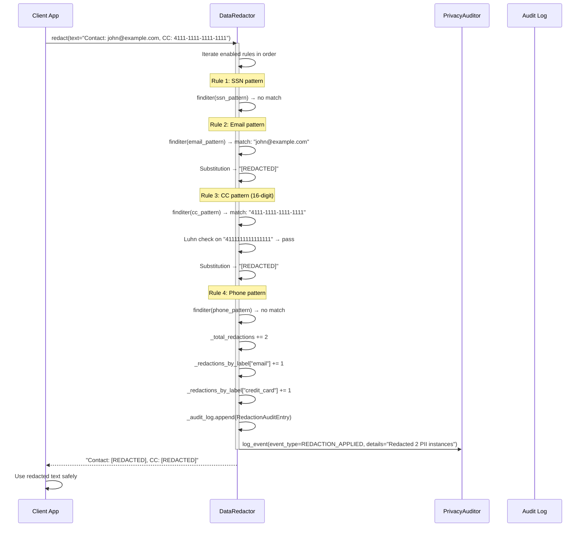
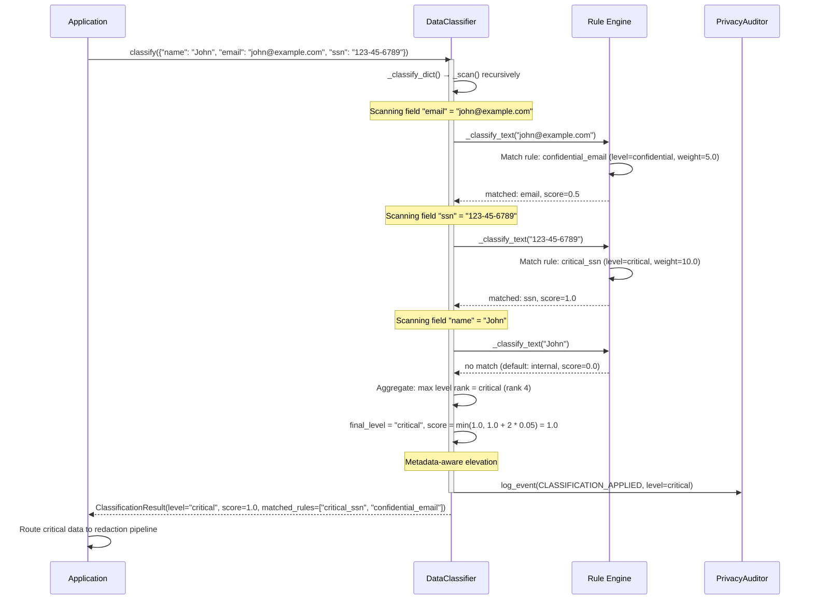
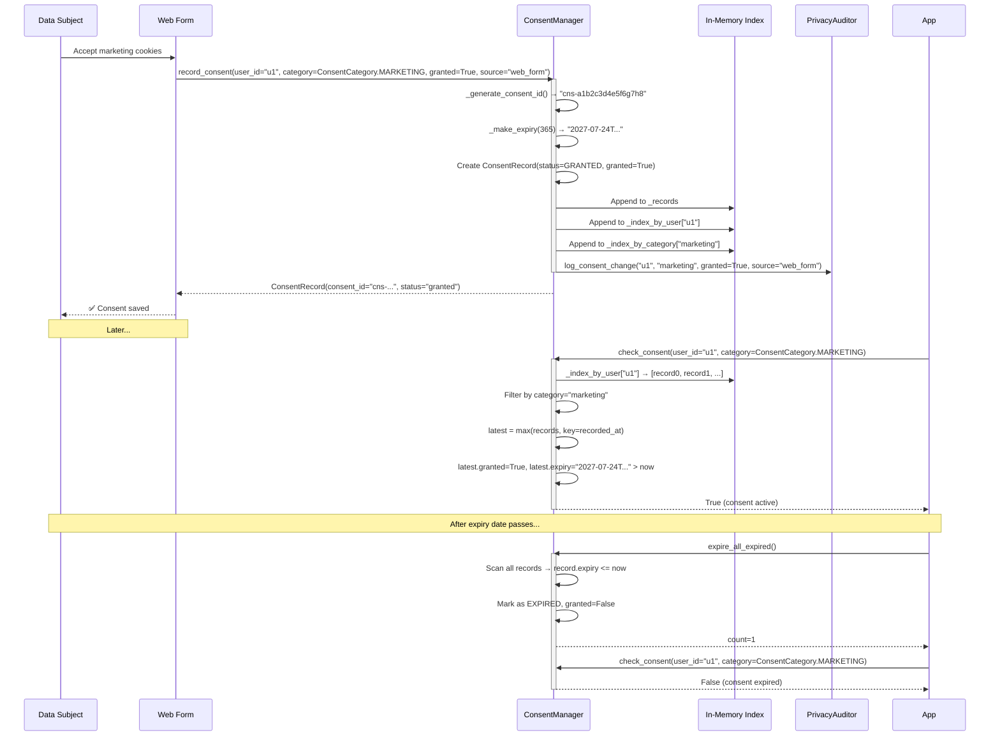
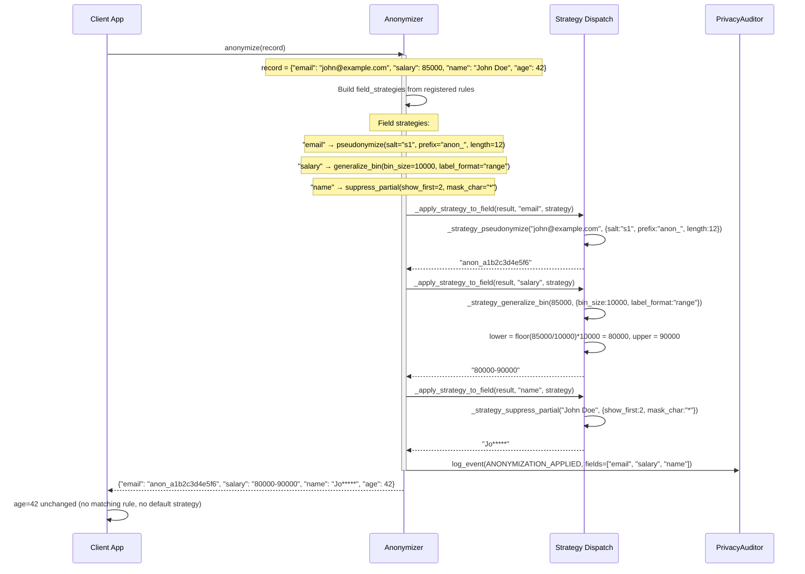
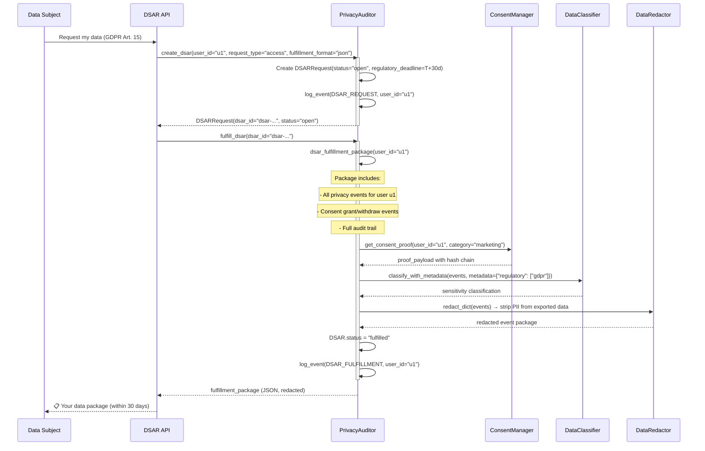
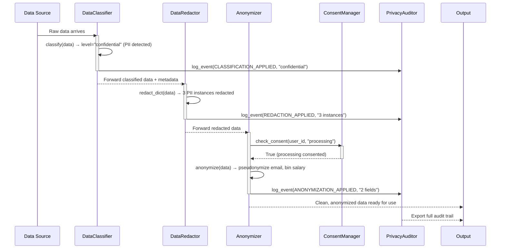

# Privacy Module Data Flow

## 1. PII Redaction Flow

When a user submits data containing personally identifiable information, the `DataRedactor` processes it through pattern matching, Luhn validation, and substitution.

## 2. Sensitivity Classification Flow

The `DataClassifier` assigns a sensitivity level by scanning data against compiled regex patterns and keyword lists, then computing a weighted score.

## 3. Consent Check and Recording Flow

The `ConsentManager` handles the full lifecycle: grant, check, expire, and audit.

## 4. Anonymization Pipeline Flow

The `Anonymizer` applies multiple field-level strategies in a single pass using dispatch functions.

## 5. DSAR Fulfillment Flow

The `PrivacyAuditor` handles Data Subject Access Requests from creation through fulfillment.

## 6. Cross-Component Privacy Pipeline

End-to-end flow showing how all five components collaborate:

