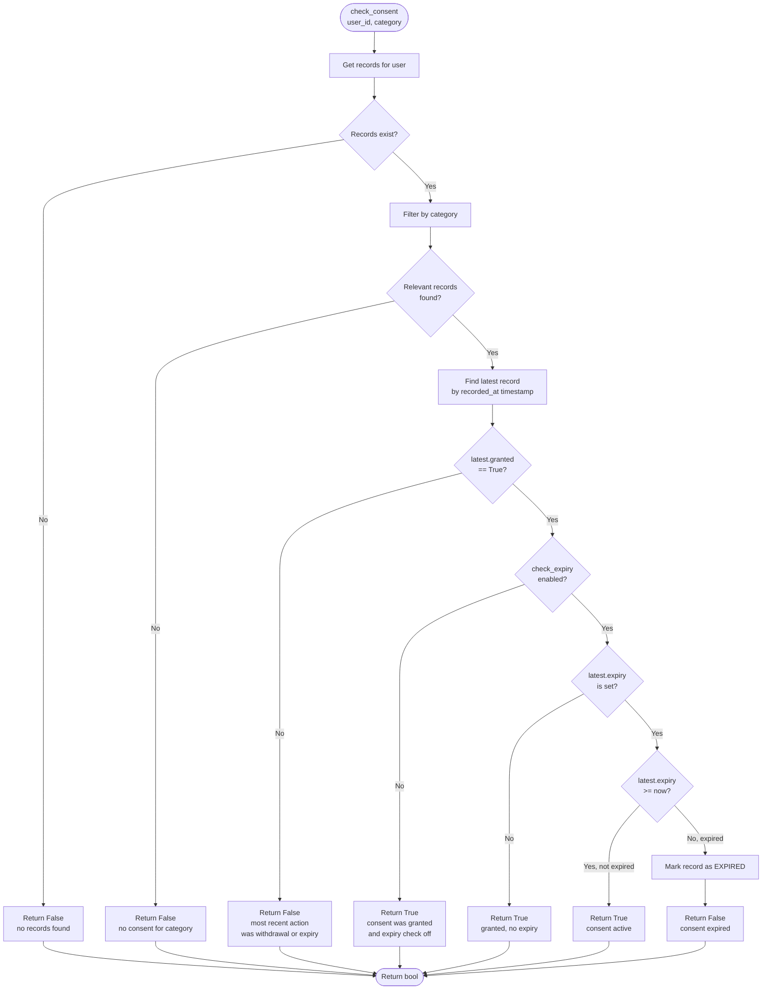
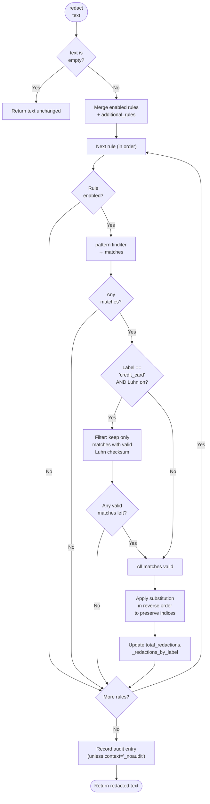

# Privacy Module Reasoning & Decision Logic

## 1. Sensitivity Classification Decision Tree

The `DataClassifier` determines the sensitivity level through a multi-stage scoring process.

```mermaid
flowchart TD
    START([Data Input]) --> IS_DICT{"Is data a dict?"}
    IS_DICT -->|Yes| SCAN_DICT[Recursively scan all string values]
    IS_DICT -->|No| SCAN_TEXT[Scan as plain text]

    SCAN_TEXT --> ITER_RULES[Iterate enabled classification rules]
    ITER_RULES --> CHECK_RULE{"Rule enabled?"}
    CHECK_RULE -->|No| NEXT_RULE[Skip → next rule]
    CHECK_RULE -->|Yes| CHECK_PATTERN{"Has regex<br>patterns?"}

    CHECK_PATTERN -->|Yes| COMPILE_MATCH[Compiled pattern.search(text)]
    COMPILE_MATCH --> PAT_MATCH{"Pattern matched?"}
    PAT_MATCH -->|Yes| PAT_OK[pattern_matched = True]
    PAT_MATCH -->|No| PAT_NOK[pattern_matched = False]

    CHECK_PATTERN -->|No| NO_PAT[pattern_matched = False]

    PAT_OK --> CHECK_KW{"Has keywords?"}
    PAT_NOK --> CHECK_KW
    NO_PAT --> CHECK_KW

    CHECK_KW -->|Yes| KW_CHECK[keyword.lower in text.lower?]
    KW_CHECK --> KW_MATCH{"Keyword found?"}
    KW_MATCH -->|Yes| KW_OK[keyword_matched = True]
    KW_MATCH -->|No| KW_NOK[keyword_matched = False]

    CHECK_KW -->|No| NO_KW[keyword_matched = False]

    KW_OK --> EVAL_MATCH{"match_any?<br>pattern OR keyword<br>matched?"}
    KW_NOK --> EVAL_MATCH
    NO_KW --> EVAL_MATCH

    EVAL_MATCH -->|Yes| RULE_HIT[Record rule match]
    EVAL_MATCH -->|No| NEXT_RULE

    RULE_HIT --> TRACK_SCORE[Track max level rank<br>and highest score]
    TRACK_SCORE --> REMAIN{"More rules?"}
    REMAIN -->|Yes| ITER_RULES
    REMAIN -->|No| ANY_HIT{"Any rules matched?"}

    ANY_HIT -->|No| DEFAULT[Assign default level]
    DEFAULT --> RETURN_DEFAULT[Return ClassificationResult<br>level=default, score=0.0,<br>is_classified=False]

    ANY_HIT -->|Yes| GET_LEVEL[Map max rank to level]
    GET_LEVEL --> COMPUTE_SCORE[score = min(1.0, max_weight/10 + n_matched*0.05)]
    COMPUTE_SCORE --> SCAN_DICT_END

    SCAN_DICT --> AGG[Collect matched rules, details, scores across all values]
    AGG --> PICK_TOP[Pick highest level rank]
    PICK_TOP --> COMPUTE_DICT_SCORE[score = min(1.0, top_score + n_matched * 0.02)]
    COMPUTE_DICT_SCORE --> SCAN_DICT_END

    SCAN_DICT_END --> METADATA{"Metadata hints<br>provided?"}
    METADATA -->|No| RETURN([Return ClassificationResult])
    METADATA -->|Yes| ELEVATE[Compute elevation score]
    ELEVATE --> ELEV_CHECK{"elevation >= 3.0?"}
    ELEV_CHECK -->|Yes| UP2[Elevate 2 steps]
    ELEV_CHECK -->|No| ELEV_CHECK2{"elevation >= 1.0?"}
    ELEV_CHECK2 -->|Yes| UP1[Elevate 1 step]
    ELEV_CHECK2 -->|No| NO_ELEV[No elevation]
    UP2 --> RETURN_ELEV
    UP1 --> RETURN_ELEV
    NO_ELEV --> RETURN_ELEV
    RETURN_ELEV --> RETURN
```

## 2. Consent Status Determination Logic

The `ConsentManager` determines whether a user has active consent for a given category.



## 3. PII Redaction Application Logic

The `DataRedactor` applies pattern-based substitutions with credit-card Luhn validation.



## 4. Anonymization Strategy Dispatch Logic

The `Anonymizer` selects and applies the correct transformation function per field.

```mermaid
flowchart TD
    START([anonymize<br>record dict]) --> MODE{"in_place?"}
    MODE -->|Yes| RESULT[Use data directly]
    MODE -->|No| RESULT[deepcopy data]

    RESULT --> BUILD[Build field_strategies map]
    BUILD --> SRC1[From registered rules<br>rules[i].strategies[j].field]
    SRC1 --> SRC2[Merge with inline strategy_map]
    SRC2 --> LOOP["For each field_path, strategy"]

    LOOP --> RESOLVE[Resolve field path<br>supporting dot-notation<br>and * wildcards]
    RESOLVE --> HANDLE_WILD{"Path contains * ?"}
    HANDLE_WILD -->|Yes| EXPAND[Expand to each list element]
    EXPAND --> APPLY
    HANDLE_WILD -->|No| APPLY

    APPLY --> DISPATCH{strategy.technique}
    DISPATCH -->|SUPPRESS_ALL| F1[_strategy_suppress_all]
    DISPATCH -->|SUPPRESS_MASK| F2[_strategy_suppress_mask]
    DISPATCH -->|SUPPRESS_PARTIAL| F3[_strategy_suppress_partial]
    DISPATCH -->|GENERALIZE_ROUND| F4[_strategy_generalize_round]
    DISPATCH -->|GENERALIZE_BIN| F5[_strategy_generalize_bin]
    DISPATCH -->|GENERALIZE_RANGE| F6[_strategy_generalize_range]
    DISPATCH -->|PERTURB_NOISE| F7[_strategy_perturb_noise]
    DISPATCH -->|PERTURB_SWAP| F8[_strategy_perturb_swap]
    DISPATCH -->|PSEUDONYMIZE| F9[_strategy_pseudonymize]
    DISPATCH -->|REDACT| F10[_strategy_suppress_all]

    F1 --> APPLIED
    F2 --> APPLIED
    F3 --> APPLIED
    F4 --> APPLIED
    F5 --> APPLIED
    F6 --> APPLIED
    F7 --> APPLIED
    F8 --> APPLIED
    F9 --> APPLIED
    F10 --> APPLIED

    APPLIED --> MORE_FIELDS{"More fields?"}
    MORE_FIELDS -->|Yes| LOOP
    MORE_FIELDS -->|No| RETURN([Return anonymized dict])
```

## 5. k-Anonymity Check Logic

The `Anonymizer` evaluates whether a dataset satisfies k-anonymity.

```mermaid
flowchart TD
    START([check_k_anonymity<br>dataset, quasi_ids, k]) --> EMPTY{"Dataset<br>empty?"}
    EMPTY -->|Yes| EMPTY_REPORT[Return report: satisfied if k<=0]

    EMPTY -->|No| INIT[Initialize eq_classes dict]
    INIT --> ROW_LOOP["For each row[index]<br>in dataset"]

    ROW_LOOP --> BUILD_KEY[Build key from quasi-identifier values]
    BUILD_KEY --> JOIN["key = val1|val2|...|valN"]
    JOIN --> STORE[eq_classes[key].append(index)]
    STORE --> MORE_ROWS{"More rows?"}
    MORE_ROWS -->|Yes| ROW_LOOP
    MORE_ROWS -->|No| COMPUTE[Compute class sizes]

    COMPUTE --> SMALLEST[Find smallest class size]
    SMALLEST --> VIOLATIONS{"For each class:<br>size < k?"}
    VIOLATIONS -->|Yes| ADD_VIOLATION[Collect indices]
    VIOLATIONS -->|No| SKIP
    ADD_VIOLATION --> SKIP
    SKIP --> MORE_CLASSES{"More classes?"}
    MORE_CLASSES -->|Yes| VIOLATIONS
    MORE_CLASSES -->|No| REPORT[Build KAnonymityReport]
    REPORT --> SAT{"smallest >= k?"}
    SAT -->|Yes| PASS[is_satisfied = True]
    SAT -->|No| FAIL[is_satisfied = False]

    PASS --> RETURN_REPORT
    FAIL --> RETURN_REPORT
    RETURN_REPORT([Return KAnonymityReport])
```

## 6. Severity Calculation for PII Analysis

The `DataRedactor.analyze_for_pii()` method computes a risk score and level.

```mermaid
flowchart TD
    START([analyze_for_pii<br>text]) --> RULE_LOOP["For each enabled rule"]

    RULE_LOOP --> FIND[rule.pattern.finditer(text)]
    FIND --> MATCHES{"Matches found?"}
    MATCHES -->|No| SKIP_RULE

    MATCHES -->|Yes| IS_CC_LUHN{"Label == credit_card<br>AND Luhn filter on?"}
    IS_CC_LUHN -->|Yes| FILTER_LUHN[Keep only Luhn-valid matches]
    FILTER_LUHN --> COLLECT
    IS_CC_LUHN -->|No| COLLECT

    COLLECT[Collect samples and count]
    COLLECT --> SKIP_RULE
    SKIP_RULE --> MORE{"More rules?"}
    MORE -->|Yes| RULE_LOOP
    MORE -->|No| COMPUTE_RISK

    COMPUTE_RISK["risk_score = min(100, total*5 + n_findings*10)"]
    COMPUTE_RISK --> LEVEL{"risk_score<br>>= 70?"}
    LEVEL -->|Yes| CRITICAL[level = critical]
    LEVEL -->|No| LEVEL2{"<br>>= 40?"}
    LEVEL2 -->|Yes| HIGH[level = high]
    LEVEL2 -->|No| LEVEL3{"<br>>= 15?"}
    LEVEL3 -->|Yes| MEDIUM[level = medium]
    LEVEL3 -->|No| LOW[level = low]

    CRITICAL --> RESULT
    HIGH --> RESULT
    MEDIUM --> RESULT
    LOW --> RESULT

    RESULT --> RETURN([Return analysis dict])
```

## 7. Event Query Filtering Logic

The `PrivacyAuditor.query_events()` applies multi-dimensional filters.

```mermaid
flowchart TD
    START([query_events<br>filters]) --> CANDIDATES{Which index to use?}
    CANDIDATES -->|event_type provided| IDX_TYPE[_index_by_type[event_type]]
    CANDIDATES -->|user_id provided| IDX_USER[_index_by_user[user_id]]
    CANDIDATES -->|severity provided| IDX_SEV[_index_by_severity[severity]]
    CANDIDATES -->|none provided| ALL[All indices 0..n-1]

    IDX_TYPE --> FILTER
    IDX_USER --> FILTER
    IDX_SEV --> FILTER
    ALL --> FILTER

    FILTER["For each candidate<br>event[idx]"]
    FILTER --> CHECK_USER{"user_id<br>filter?"}
    CHECK_USER -->|Yes| MATCH_USER{"event.user_id<br>== user_id?"}
    MATCH_USER -->|No| SKIP

    CHECK_USER -->|No| CHECK_SEV
    MATCH_USER -->|Yes| CHECK_SEV

    CHECK_SEV{"severity<br>filter?"}
    CHECK_SEV -->|Yes| MATCH_SEV{"event.severity<br>== severity?"}
    MATCH_SEV -->|No| SKIP

    CHECK_SEV -->|No| CHECK_CAT
    MATCH_SEV -->|Yes| CHECK_CAT

    CHECK_CAT{"category<br>filter?"}
    CHECK_CAT -->|Yes| MATCH_CAT{"event.category<br>== category?"}
    MATCH_CAT -->|No| SKIP

    CHECK_CAT -->|No| CHECK_TAG
    MATCH_CAT -->|Yes| CHECK_TAG

    CHECK_TAG{"tag<br>filter?"}
    CHECK_TAG -->|Yes| TAG_IN{"tag in<br>event.tags?"}
    TAG_IN -->|No| SKIP

    CHECK_TAG -->|No| CHECK_TIME
    TAG_IN -->|Yes| CHECK_TIME

    CHECK_TIME{"start_time or<br>end_time?"}
    CHECK_TIME -->|Yes| TIME_OK{"event.timestamp<br>within range?"}
    TIME_OK -->|No| SKIP

    CHECK_TIME -->|No| ADD_RESULT[Add to results]
    TIME_OK -->|Yes| ADD_RESULT

    ADD_RESULT --> MORE_CAND{"More candidates?"}
    MORE_CAND -->|Yes| FILTER
    MORE_CAND -->|No| SORT[Sort by order_by/order_dir]
    SORT --> PAGINATE[Apply offset + limit]
    PAGINATE --> RETURN([Return list of event dicts])
```
