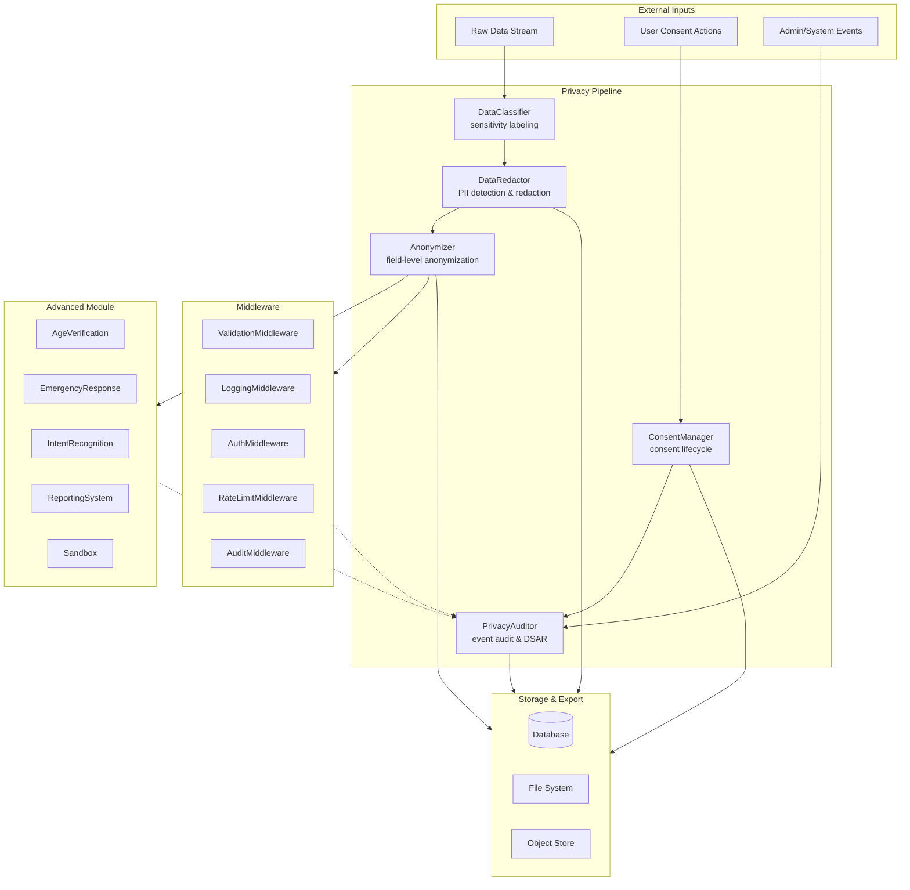
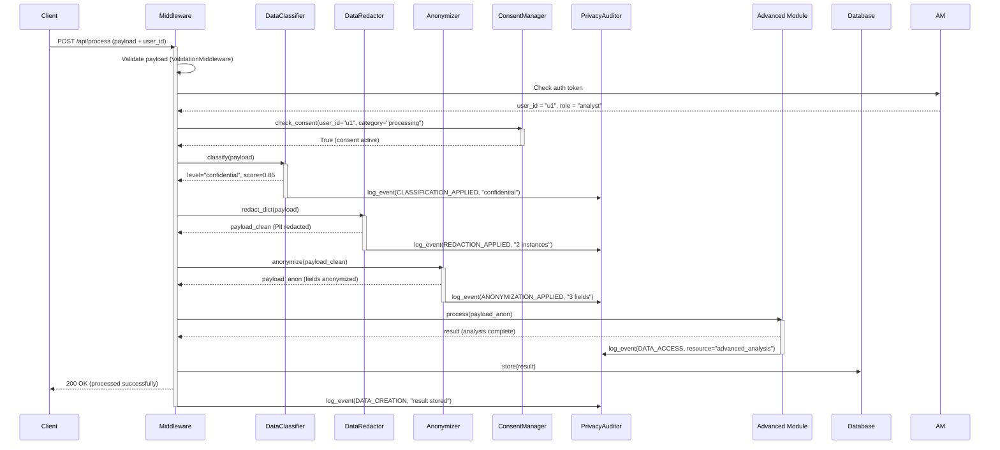
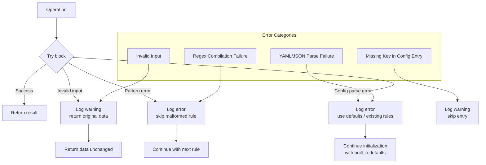

# Privacy Module Integration Guide

## Cross-Module Data Flow

The privacy module provides a complete data protection pipeline that integrates with other system components.



## Integration Sequence: End-to-End Data Processing

This sequence shows how the privacy module processes a user request from ingestion to storage.



## Component Dependency Matrix

| Component | Depends On | Used By |
|---|---|---|
| DataClassifier | — | DataRedactor, PrivacyAuditor |
| DataRedactor | DataClassifier | Anonymizer, PrivacyAuditor |
| Anonymizer | DataRedactor, ConsentManager | Advanced Module, Middleware |
| ConsentManager | PrivacyAuditor | Middleware (auth checks) |
| PrivacyAuditor | — | All components, DSAR API |

## Configuration Integration

All privacy components can share a single YAML configuration file.

```yaml
# config/privacy.yaml
classifier:
  default_level: internal
  rules:
    - rule_id: custom_pii
      name: Custom PII Pattern
      level: confidential
      patterns: ["\\bCUS-\\d{6}\\b"]
      weight: 5.0

redactor:
  enable_luhn_filter: true
  rules:
    - pattern: "\\bCUS-\\d{6}\\b"
      replacement: "[REDACTED_CUSTOM]"
      label: custom_pii

anonymizer:
  default_strategy: suppress_partial
  rules:
    - rule_id: anon_email
      strategies:
        - field: email
          technique: pseudonymize
          params: { salt: "global_salt", prefix: "u_" }

consent:
  default_expiry_days: 365
  policies:
    - policy_id: processing_v2
      categories: [processing, analytics]
      default_duration_days: 730
      require_explicit: true

audit:
  retention_days: 730
  auto_purge: true
```

```python
# Loading shared config
from src.privacy.data_classifier import DataClassifier
from src.privacy.data_redaction import DataRedactor
from src.privacy.anonymizer import Anonymizer
from src.privacy.consent_manager import ConsentManager
from src.privacy.privacy_auditor import PrivacyAuditor

config_path = "config/privacy.yaml"

classifier = DataClassifier(config_path=config_path)
redactor = DataRedactor(config_path=config_path)
anonymizer = Anonymizer(config_path=config_path)
consent = ConsentManager(config_path=config_path)
auditor = PrivacyAuditor(config_path=config_path)
```

## Error Handling Strategy

Each privacy component uses structured logging and graceful fallbacks:



### Error Handling by Component

| Component | Error | Behavior |
|---|---|---|
| DataClassifier | Invalid regex pattern | Log warning, skip pattern, continue with remaining |
| DataClassifier | Missing rule_id in config | Log warning, skip entry |
| DataRedactor | Invalid regex in config | `re.error` caught, log warning, skip pattern |
| DataRedactor | Out-of-range rule index in remove_rule | Log warning, return None |
| Anonymizer | Unknown technique | Log warning, return original value |
| Anonymizer | Config file not found | Log error, return 0 rules loaded |
| ConsentManager | Missing user_id in batch entry | KeyError caught, propagate to caller |
| ConsentManager | Policy config parse error | Log error, use built-in defaults |
| PrivacyAuditor | Config file not found | Log error, return 0 keys loaded |
| PrivacyAuditor | Invalid retention_days | `max(1, days)` clamps to minimum |

## Middleware Integration

The privacy module integrates with API middleware for request/response processing.

```python
from src.middleware.auth_middleware import AuthMiddleware
from src.privacy.consent_manager import ConsentManager
from src.privacy.privacy_auditor import PrivacyAuditor, EventType

class PrivacyAwareMiddleware:
    """Middleware that enforces consent checks and audits data access."""

    def __init__(self, consent_manager: ConsentManager, auditor: PrivacyAuditor):
        self._consent = consent_manager
        self._auditor = auditor

    def before_request(self, request, user_id: str, category: str) -> bool:
        """Check consent before processing a request."""
        if not self._consent.check_consent(user_id, category):
            self._auditor.log_event(
                EventType.DATA_ACCESS, user_id,
                details=f"Access denied: missing consent for {category}",
                severity="warning",
            )
            return False
        return True

    def after_request(self, request, response, user_id: str, resource: str) -> None:
        """Audit data access after processing."""
        self._auditor.log_data_access(user_id, resource)
```

## Privacy-Aware Reporting

The `ReportingSystem` in the advanced module can incorporate privacy classifications.

```python
from src.privacy.data_classifier import DataClassifier, SensitivityLevel

class PrivacyAwareReporter:
    def __init__(self, classifier: DataClassifier):
        self._classifier = classifier

    def generate_safe_report(self, data):
        result = self._classifier.classify(data)
        if self._classifier.is_at_least(result.level, SensitivityLevel.RESTRICTED):
            return {"error": "Cannot generate report: data too sensitive", "level": result.level}
        return {"report": data, "sensitivity": result.level}
```

## DSAR Fulfillment with PrivacyAuditor

The DSAR workflow integrates consent proof and event export.

```python
from src.privacy.privacy_auditor import PrivacyAuditor
from src.privacy.consent_manager import ConsentManager

def fulfill_dsar_request(auditor: PrivacyAuditor, consent: ConsentManager, user_id: str):
    """Process a DSAR for a given user."""
    dsar = auditor.create_dsar(
        user_id=user_id,
        request_type="access",
        fulfillment_format="json",
    )

    package = auditor.dsar_fulfillment_package(user_id)

    # Add consent proofs for all categories
    consent_proofs = {}
    for cat in ["processing", "marketing", "sharing", "analytics"]:
        proof = consent.get_consent_proof(user_id, cat)
        if proof["proof"]:
            consent_proofs[cat] = proof
    package["consent_proofs"] = consent_proofs

    auditor.fulfill_dsar(dsar.dsar_id)
    return package
```
