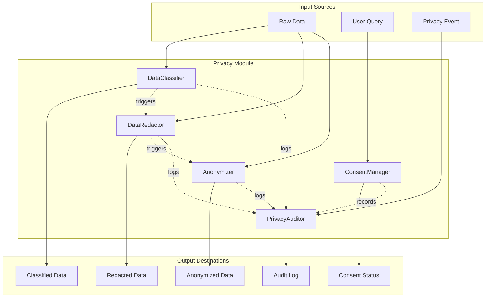

# Privacy Module

Privacy-preserving data processing pipeline for the Rules-Engine platform.

## Components

| Component | File | Responsibility |
|---|---|---|
| **DataClassifier** | `data_classifier.py` | Assigns sensitivity levels (public → critical) via regex/keyword rules |
| **DataRedactor** | `data_redaction.py` | Detects and redacts PII from text and structured data |
| **Anonymizer** | `anonymizer.py` | Field-level anonymization (suppression, generalization, perturbation, pseudonymization) |
| **ConsentManager** | `consent_manager.py` | Full consent lifecycle (grant, withdraw, expire, audit) with GDPR/CCPA reports |
| **PrivacyAuditor** | `privacy_auditor.py` | Central audit trail for privacy events, DSAR management, compliance reporting |

## System Architecture



## Quick Start

```python
from src.privacy.data_classifier import DataClassifier
from src.privacy.data_redaction import DataRedactor
from src.privacy.anonymizer import Anonymizer, AnonymizationTechnique
from src.privacy.consent_manager import ConsentManager, ConsentCategory
from src.privacy.privacy_auditor import PrivacyAuditor, EventType

# 1. Classify data sensitivity
classifier = DataClassifier()
result = classifier.classify("User email: john@example.com, SSN: 123-45-6789")
print(f"Sensitivity: {result.level}, Score: {result.score}")

# 2. Redact PII from text
redactor = DataRedactor()
clean = redactor.redact("Contact: john@example.com or 555-123-4567")
print(f"Redacted: {clean}")

# 3. Anonymize structured data
anonymizer = Anonymizer()
anonymizer.add_strategy("email", AnonymizationTechnique.PSEUDONYMIZE, {"salt": "s1"})
anonymizer.add_strategy("salary", AnonymizationTechnique.GENERALIZE_BIN, {"bin_size": 10000})
record = {"email": "john@example.com", "salary": 85000, "name": "John Doe"}
anon = anonymizer.anonymize(record)
print(f"Anonymized: {anon}")

# 4. Check and manage consent
cm = ConsentManager()
cm.record_consent("user_123", ConsentCategory.MARKETING, granted=True, source="web_form")
status = cm.check_consent("user_123", ConsentCategory.MARKETING)
print(f"Marketing consent active: {status}")

# 5. Audit privacy events
auditor = PrivacyAuditor()
auditor.log_event(EventType.DATA_ACCESS, "user_123", details="Profile data accessed")
auditor.log_event(EventType.DATA_REDACTION_APPLIED, "user_123", details="SSN redacted")
report = auditor.compliance_report(report_type="gdpr")
print(f"GDPR report: {report.total_events} events in period")
```

## Use Cases

| Scenario | Primary Class | Supporting Class |
|---|---|---|
| Incoming PII detection | DataClassifier | DataRedactor |
| Log sanitisation | DataRedactor | Anonymizer |
| Data publishing | Anonymizer | DataClassifier |
| Consent management | ConsentManager | PrivacyAuditor |
| DSAR fulfillment | PrivacyAuditor | DataClassifier |
| Compliance reporting | PrivacyAuditor | ConsentManager |
| Data retention purging | PrivacyAuditor | Anonymizer |
| k-anonymity verification | Anonymizer | DataClassifier |

## Sensitivity Level Scale

```
PUBLIC (0) → INTERNAL (1) → CONFIDENTIAL (2) → RESTRICTED (3) → CRITICAL (4)
```

Built-in rules detect SSNs, credit cards, medical records, passports, biometrics (critical); bank accounts, driver's licenses, credentials, DOB (restricted); emails, phones, addresses, IPs, financial data (confidential); business plans, usernames (internal).

## Anonymization Techniques

| Family | Techniques | Purpose |
|---|---|---|
| Suppression | suppress_all, suppress_mask, suppress_partial | Remove or mask values entirely |
| Generalization | generalize_round, generalize_bin, generalize_range | Reduce precision |
| Perturbation | perturb_noise, perturb_swap | Add statistical noise |
| Pseudonymization | pseudonymize | Deterministic hash replacement |
| Redaction | redact | Full value replacement |

## Consent Categories

processing, marketing, sharing, analytics, communications, location, cookies_functional, cookies_analytics, cookies_marketing, biometric, health, third_party

## Audit Event Types

data_access, data_modification, data_creation, data_deletion, data_sharing, data_export, consent_granted, consent_withdrawn, consent_expired, dsar_request, dsar_fulfillment, breach_detected, breach_notified, policy_accepted, policy_declined, data_retention_deleted, anonymization_applied, classification_applied, redaction_applied, third_party_disclosure, cross_border_transfer, user_account_deletion, user_data_portability, system_config_change

## Configuration

All components support declarative configuration via YAML or JSON files:

```yaml
# privacy_config.yaml
classifier:
  default_level: internal
  rules:
    - rule_id: detect_ssn
      level: critical
      patterns: ["\\b\\d{3}-\\d{2}-\\d{4}\\b"]
      weight: 10.0

consent:
  default_expiry_days: 365
  policies:
    - policy_id: marketing_v2
      categories: [marketing, communications]
      default_duration_days: 180
      require_explicit: true

audit:
  retention_days: 730
  auto_purge: true
```
