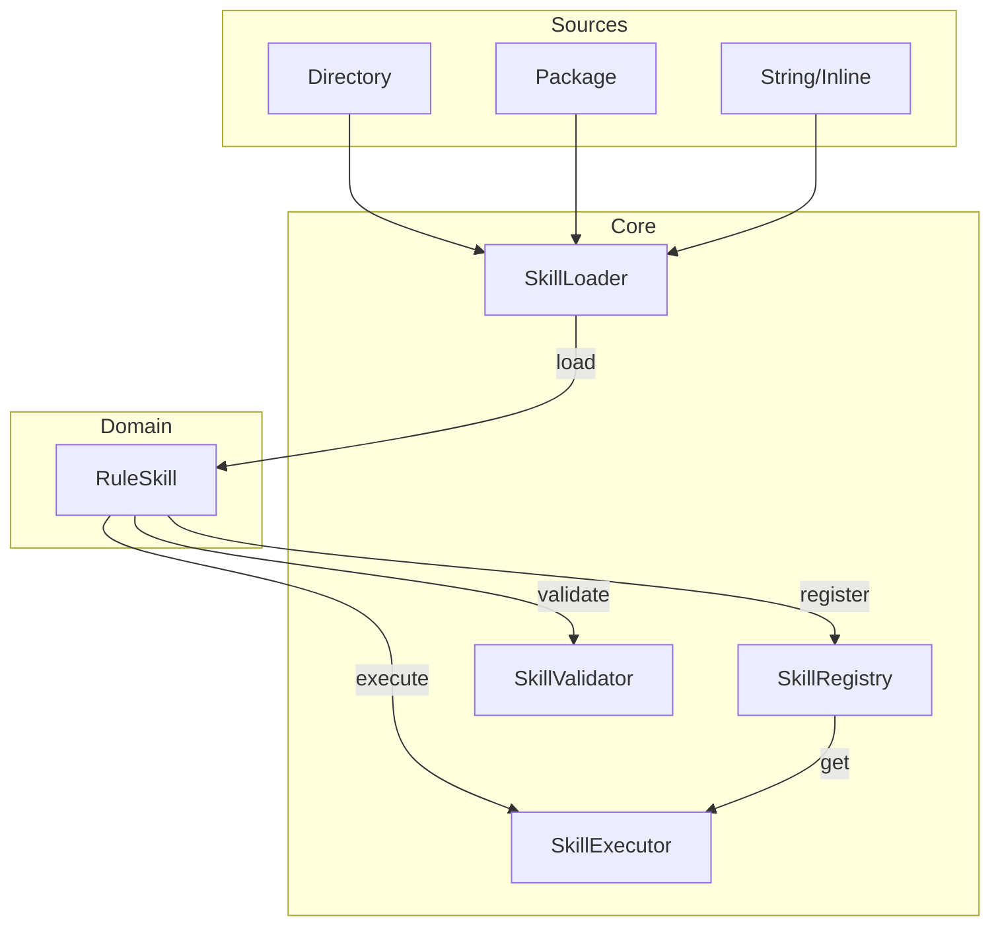
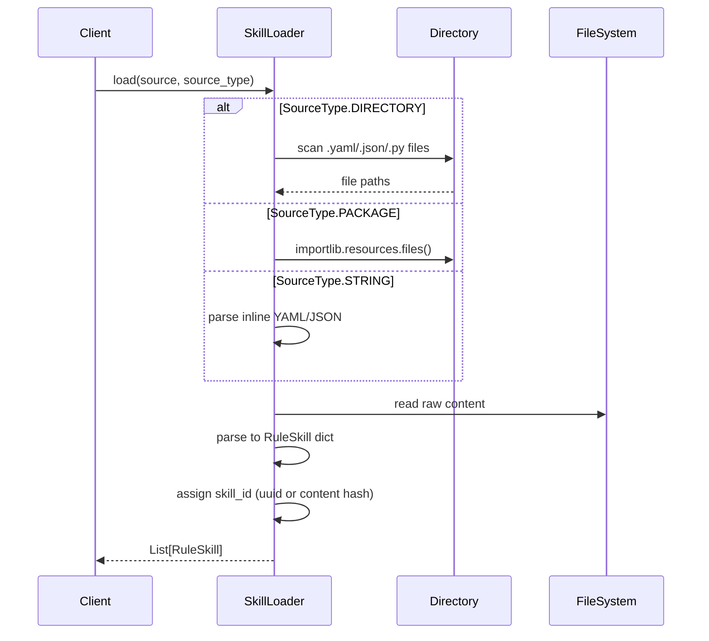
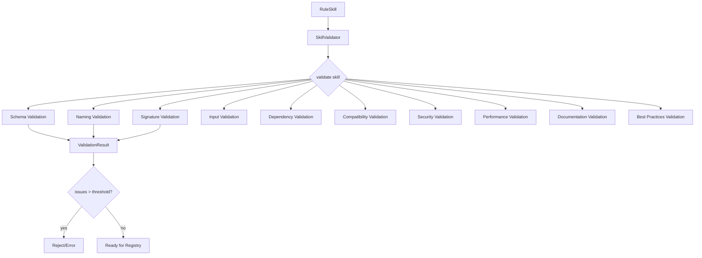
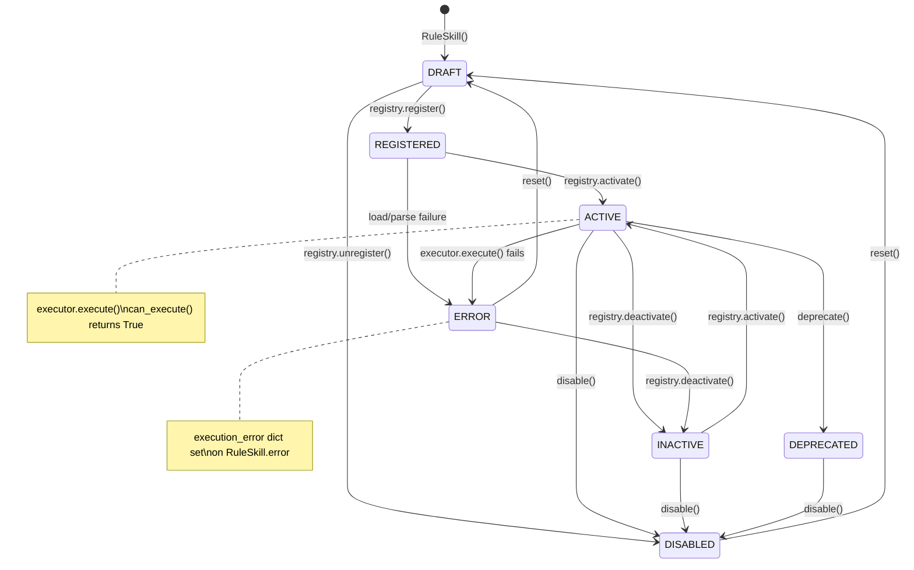
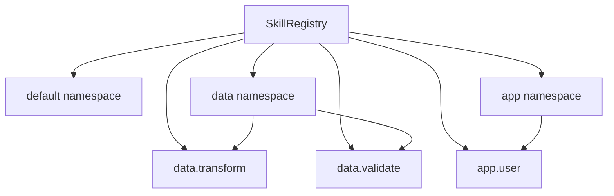
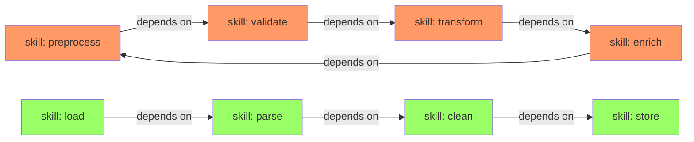
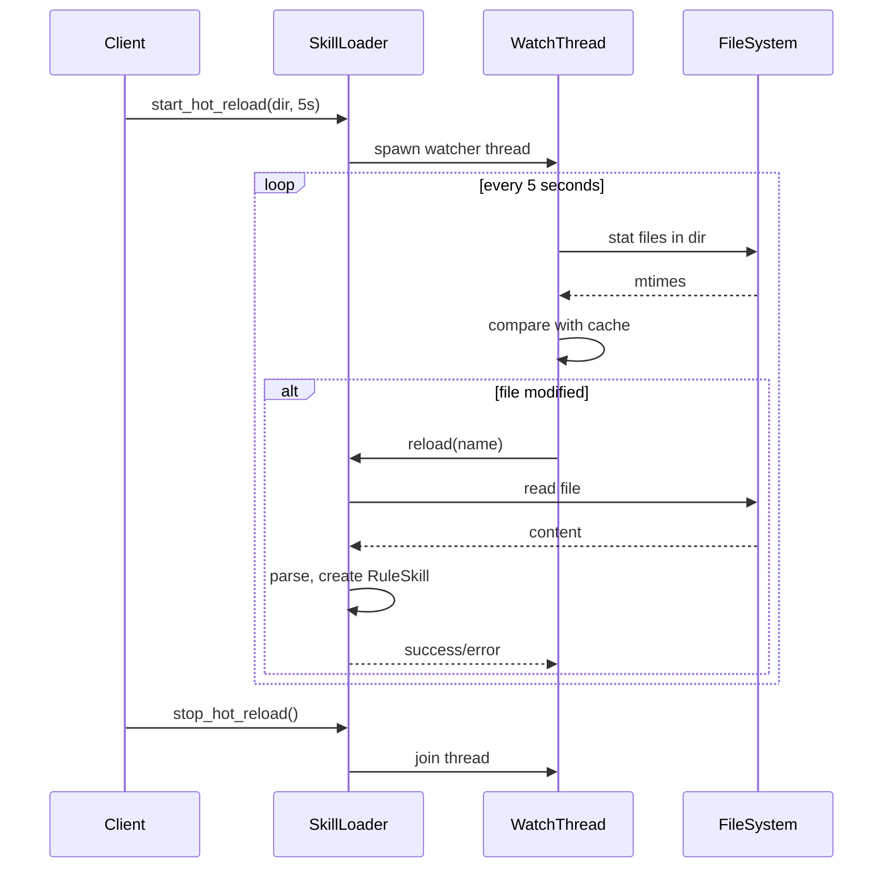
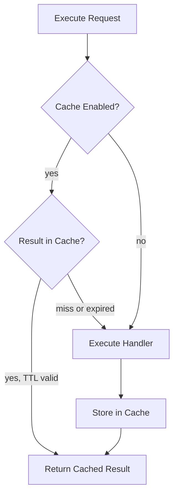

# Skills Module — Architecture

## Component Overview

The Skills module consists of five primary components and several supporting data classes. The `RuleSkill` class is the central domain object, while the Loader, Registry, Validator, and Executor each handle a distinct phase of the skill lifecycle.



## Component Interactions

### 1. Skill Loader → RuleSkill

The `SkillLoader` discovers skill definitions from multiple source types. It parses source files (YAML, JSON, Python, Markdown), resolves references, and returns `RuleSkill` instances.



### 2. RuleSkill → SkillRegistry

After loading, skills are registered into the `SkillRegistry`. The registry maintains a multi-indexed map: by `name`, `skill_id`, `namespace`, and `aliases`. It performs conflict detection — if a skill with the same name already exists and has a different content hash, it raises a `RegistryConflictError`.

```mermaid
flowchart LR
    SK[RuleSkill] --> R[SkillRegistry]
    R --> IDX{Conflict?}
    IDX -->|yes| ERR[RegistryConflictError]
    IDX -->|no| REG[Register]
    REG --> MAP[skills dict\nname → RuleSkill]
    REG --> NS[namespaces dict\nnamespace → List[RuleSkill]]
    REG --> TAG[tag index]
    REG --> CAT[category index]
    REG --> GRP[group index]
    REG --> ALIAS[alias index]
```

### 3. SkillRegistry → SkillValidator

Before execution, skills pass through the `SkillValidator`. Validation is broken into categories:



### 4. SkillRegistry → SkillExecutor

The `SkillExecutor` pulls skills from the registry and executes them. It supports multiple execution modes and collects comprehensive metrics.

```mermaid
flowchart LR
    R[SkillRegistry] -->|get(name)| E[SkillExecutor]
    E --> MODE{Execution Mode}
    MODE -->|SEQUENTIAL| SEQ[run one by one]
    MODE -->|PARALLEL| PAR[ThreadPoolExecutor]
    MODE -->|PIPELINE| PIP[chain: output→next input]
    MODE -->|FAN_OUT| FO[base_input to all skills]
    MODE -->|FAN_IN| FI[all output to aggregator]
    MODE -->|CONDITIONAL| COND[_condition flag]
    SEQ --> M[Metrics: timing, errors]
    PAR --> M
    PIP --> M
    FO --> M
    FI --> M
    COND --> M
    M --> REPORT[Execution Report]
```

## Class Architecture

```mermaid
classDiagram
    class RuleSkill {
        __init__(name, skill_id, metadata, dispatcher, handler, inputs, outputs, dependencies, triggers, hooks, middleware, config, tags, namespace, aliases, groups, timeout, caching_policy, retry_policy, error_strategy, priority, version, status, context, visibility, owner, changelog)
        execute(context, **kwargs)
        register()
        activate()
        deactivate()
        can_execute(context)
        validate_inputs(inputs)
        to_dict()
        from_dict(data, registry)
        clone(new_name)
        merge(other, strategy)
        stats()
    }

    class SkillMetadata {
        __init__(author, description, tags, version, category, priority, **kwargs)
        to_dict()
        from_dict(data)
        __repr__()
    }

    class SkillVersion {
        __init__(major, minor, patch, pre_release, build_metadata)
        compat(other, strategy)
        parse(version_str)
        __str__()
        __repr__()
    }

    class SkillDependency {
        __init__(name, version, version_strategy, optional)
        resolved(version)
        to_dict()
        __repr__()
    }

    class SkillInput {
        __init__(name, type_hint, required, default, description, validator)
        validate(value)
        to_dict()
    }

    class SkillOutput {
        __init__(name, type_hint, optional, description)
        to_dict()
    }

    class ExecutionContext {
        __init__(skill_name, execution_id, inputs, timeout, parent, metadata)
        start()
        complete()
        fail(error)
        child_context(name)
        should_retry(max_retries, delay, backoff, max_delay)
        context()
        __enter__()
        __exit__()
    }

    class SkillLoader {
        __init__(config)
        load(source, source_type, namespace)
        load_from_directory(directory, namespace, pattern)
        load_from_package(package_name, namespace)
        load_from_string(content, fmt, name, namespace)
        reload(name)
        unload(name)
        find(pattern, namespace)
        query(category, tags, status, source_type, namespace, version)
        start_hot_reload(directory, interval)
        stop_hot_reload()
        stats()
    }

    class SkillRegistry {
        __init__(config)
        register(skill, namespace)
        unregister(name, namespace)
        get(name, namespace)
        query(category, tags, status, namespace, aliases, groups, is_active, sort_by, limit)
        activate(name, namespace)
        deactivate(name, namespace)
        snapshot()
        restore_snapshot(snapshot)
        find_circular_dependencies()
        dependency_chain(name, direction, namespace)
    }

    class SkillValidator {
        __init__(config)
        validate(skill, full)
        validate_batch(skills, full)
        validate_compatibility_between(skill_a, skill_b)
        add_custom_validator(name, validator_fn)
        get_history(limit)
    }

    class SkillExecutor {
        __init__(config)
        execute(skill, inputs, context)
        execute_batch(skills, mode, inputs, context)
        execute_parallel(skills, max_workers, inputs, context)
        execute_pipeline(skills, initial_inputs, context)
        cancel()
        shutdown()
        top_slowest(n)
        success_rate(timeframe)
        metrics()
    }
```



## Lifecycle State Machine



## Namespace Architecture

The registry supports hierarchical namespaces using dot-separated notation (e.g., `data.transform`, `data.validate`). Each namespace has its own `SkillRegistry` instance within the registry's internal `_namespaces` dict.



## Dependency Graph

The registry builds a directed dependency graph. The `find_circular_dependencies()` method runs depth-first search (DFS) from each registered skill, tracking visited nodes and the recursion stack. When a node is encountered that is already on the recursion stack, a cycle is detected.



The cycle (red) would be detected and reported. The acyclic chain (green) is resolved into execution order.

## Hot-Reload Architecture

The loader's `start_hot_reload()` spawns a background thread that periodically scans source directories for filesystem changes (mtime). Changed files trigger `unload()` followed by `load()`.



## Middleware Pipeline

Skills support middleware that wraps the handler execution. Each middleware is a callable with signature `(context, next)`. Middleware forms a chain:

```mermaid
flowchart LR
    INPUT[Input] --> M1[Middleware 1: validate_inputs]
    M1 --> M2[Middleware 2: enrich_context]
    M2 --> M3[Middleware 3: timing_logger]
    M3 --> HANDLER[Handler Function]
    HANDLER --> M3_REV[Middleware 3: post-process]
    M3_REV --> M2_REV[Middleware 2: post-process]
    M2_REV --> M1_REV[Middleware 1: post-process]
    M1_REV --> OUTPUT[Output]

    style INPUT fill:#9f6
    style OUTPUT fill:#69f
    style HANDLER fill:#ff9
```



## Config and Stats Classes

### SkillLoader Configuration

```python
@dataclass
class LoaderConfig:
    format: str = "auto"           # yaml, json, python, md, auto
    recursive: bool = True
    validate: bool = True
    hot_reload: bool = False
    hot_reload_interval: int = 5   # seconds
    cache_loaded: bool = True
    resolve_dependencies: bool = True
    max_depth: int = 10
    allowed_paths: List[str] = field(default_factory=list)
    ignore_patterns: List[str] = field(default_factory=lambda: ["__pycache__", "*.pyc", ".git"])
```

### Registry Configuration

```python
@dataclass
class RegistryConfig:
    allow_overwrite: bool = False
    auto_activate: bool = False
    check_circular_deps: bool = True
    track_history: bool = True
    max_snapshots: int = 10
    conflict_resolution: str = "error"  # error, skip, replace, merge
    validate_on_register: bool = True
    version_check: bool = True
    enforce_namespace: bool = False
```

### Executor Configuration

```python
@dataclass
class ExecutorConfig:
    max_workers: int = 4
    default_timeout: float = 30.0
    retry_on_failure: bool = False
    max_retries: int = 3
    delay: float = 1.0
    backoff: float = 2.0
    max_delay: float = 60.0
    track_metrics: bool = True
    metrics_window: int = 1000
    cache_results: bool = False
    cache_ttl: int = 300
    error_strategy: str = "STOP_IMMEDIATELY"
    raise_on_error: bool = True
    validate_before_execute: bool = True
    collect_stats: bool = True
    enable_profiling: bool = False
```

### Validation Configuration

```python
@dataclass
class ValidatorConfig:
    max_issues_per_skill: int = 20
    fail_on_error: bool = True
    fail_on_warning: bool = False
    check_security: bool = True
    check_performance: bool = True
    check_best_practices: bool = True
    custom_validators: Dict = field(default_factory=dict)
    severity_threshold: str = "WARNING"
    cache_results: bool = True
    cache_ttl: int = 60
```

### Regression Testing

```python
@dataclass
class LoaderStats:
    skills_loaded: int = 0
    skills_failed: int = 0
    total_sources: int = 0
    hot_reloads: int = 0
    load_times: List[float] = field(default_factory=list)
    errors: List[Dict] = field(default_factory=list)
    last_load: Optional[float] = None
```

```python
@dataclass
class RegistryStats:
    total_skills: int = 0
    active_skills: int = 0
    total_namespaces: int = 0
    snapshots_taken: int = 0
    conflicts_detected: int = 0
    registration_time: List[float] = field(default_factory=list)
    last_registration: Optional[float] = None
```

```python
@dataclass
class ExecutorMetrics:
    total_executions: int = 0
    successful_executions: int = 0
    failed_executions: int = 0
    total_time: float = 0.0
    execution_times: List[float] = field(default_factory=list)
    errors: Counter = field(default_factory=Counter)
    slowest_executions: List[Dict] = field(default_factory=list)
```

## Cache Architecture

The `RuleSkill.caching_policy` configures per-skill caching behavior. The executor checks cache before executing and stores results after successful execution.



## Performance Characteristics

| Operation | Time Complexity | Notes |
|---|---|---|
| `Registry.register()` | O(n) where n is number of registered skills | Conflict detection via content hash |
| `Registry.query()` | O(1) average per indexed field | Uses dict/multimap indexes |
| `Registry.find_circular_dependencies()` | O(V + E) DFS | V = vertices (skills), E = edges (dependencies) |
| `Validator.validate()` | O(c × s) | c = categories to check, s = size of skill definition |
| `Executor.execute_batch(SEQUENTIAL)` | O(n × t) | n = skills, t = average execution time |
| `Executor.execute_batch(PARALLEL)` | O(ceil(n/w) × t) | w = max_workers |
| `SkillLoader.load(source)` | O(f × p) | f = files found, p = parse time per file |
| `Snapshot.restore()` | O(n) | n = number of skills in snapshot |
