# Skills Module — Data Flow

## Overview

This document describes the data flow through the Skills module lifecycle. Data moves through four primary phases: Loading, Registration, Validation, and Execution. Each phase transforms the `RuleSkill` domain object through well-defined pipelines.

## 1. Full Lifecycle Flow

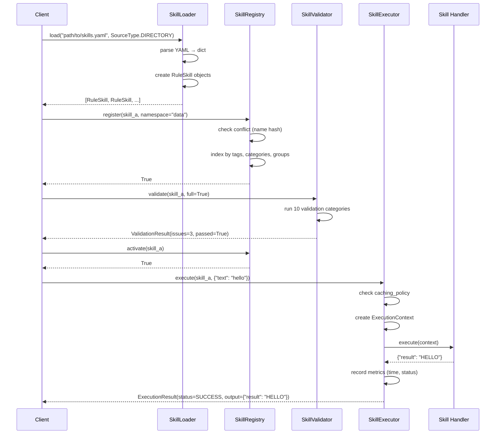

## 2. Skill Loader Data Flow

The loader processes multiple source types. The core flow is: discover → read → parse → validate → return.

```mermaid
flowchart TB
    subgraph Input
        SRC[Source Path or String]
        ST[SourceType: DIRECTORY | PACKAGE | STRING]
    end

    subgraph Discovery
        DISCOVER[Discover Sources]
        FILTER[Filter by pattern]
        READ[Read raw content]
    end

    subgraph Parsing
        DETECT{Format?}
        DETECT -->|.yaml/.yml| YAML[parse with yaml.safe_load]
        DETECT -->|.json| JSON[parse with json.loads]
        DETECT -->|.py| PY[importlib.import_module]
        DETECT -->|.md| MD[extract YAML frontmatter]
        DETECT -->|unknown| SKIP
    end

    subgraph Construction
        BUILD[Build RuleSkill dict]
        MAKE[from_dict → RuleSkill]
        HASH[Generate skill_id]
    end

    subgraph Output
        RETURN[List[RuleSkill]]
        CACHE[Update cache]
    end

    SRC --> DISCOVER
    ST --> DISCOVER
    DISCOVER --> FILTER
    FILTER --> READ
    READ --> DETECT
    YAML --> BUILD
    JSON --> BUILD
    PY --> BUILD
    MD --> BUILD
    BUILD --> MAKE
    MAKE --> HASH
    HASH --> RETURN
    HASH --> CACHE
```

### Source Type Details

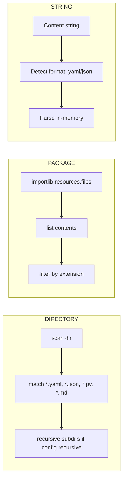

## 3. Skill Registry Data Flow

### Registration Flow

When a skill is registered, the following pipeline executes:

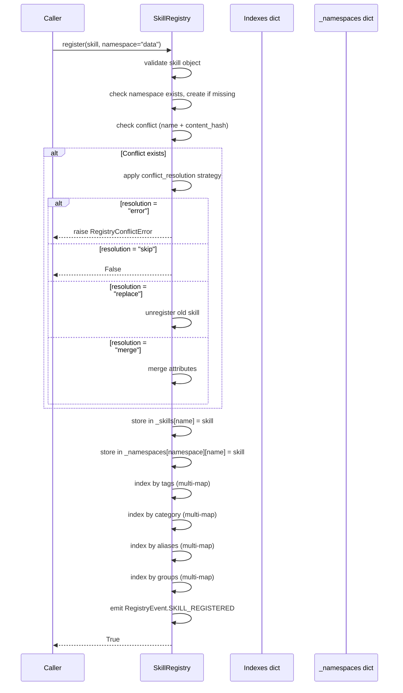

### Query Flow

```mermaid
flowchart TB
    Q[query()] --> FILTERS{Apply Filters}
    FILTERS --> CAT{category?}
    FILTERS --> TAG{tags?}
    FILTERS --> STS{status?}
    FILTERS --> NS{namespace?}
    FILTERS --> ALIAS{alias?}
    FILTERS --> GRP{group?}
    FILTERS --> ACT{is_active?}

    CAT -->|yes| by_cat[filter by SkillCategory]
    TAG -->|yes| by_tag[filter intersection of tags]
    STS -->|yes| by_sts[filter by SkillStatus]
    NS -->|yes| by_ns[filter by namespace prefix]
    ALIAS -->|yes| by_alias[filter by alias match]
    GRP -->|yes| by_grp[filter by group match]
    ACT -->|yes| by_act[filter is_active=True]

    by_cat --> COMBINE[combine with AND logic]
    by_tag --> COMBINE
    by_sts --> COMBINE
    by_ns --> COMBINE
    by_alias --> COMBINE
    by_grp --> COMBINE
    by_act --> COMBINE

    COMBINE --> SORT{sort_by?}
    SORT -->|name| sort_name[sort by name]
    SORT -->|priority| sort_pri[sort by priority desc]
    SORT -->|version| sort_ver[sort by version]
    SORT -->|none| no_sort[keep order]
    sort_name --> LIMIT{limit?}
    sort_pri --> LIMIT
    sort_ver --> LIMIT
    no_sort --> LIMIT
    LIMIT -->|n| truncated[first n results]
    LIMIT -->|None| all[all matches]
    truncated --> RETURN[List[RuleSkill]]
    all --> RETURN
```

### Snapshot/Restore Flow

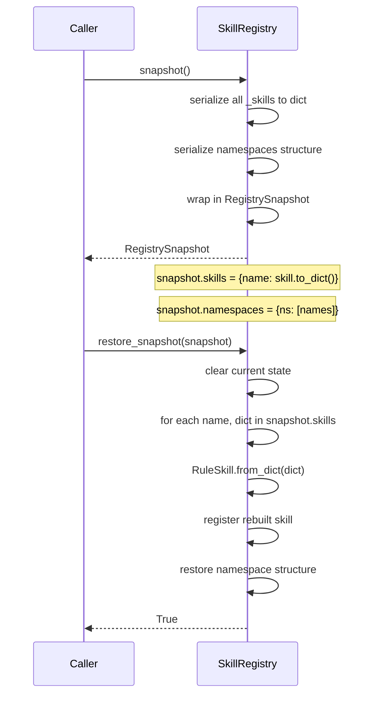

## 4. Skill Validation Data Flow

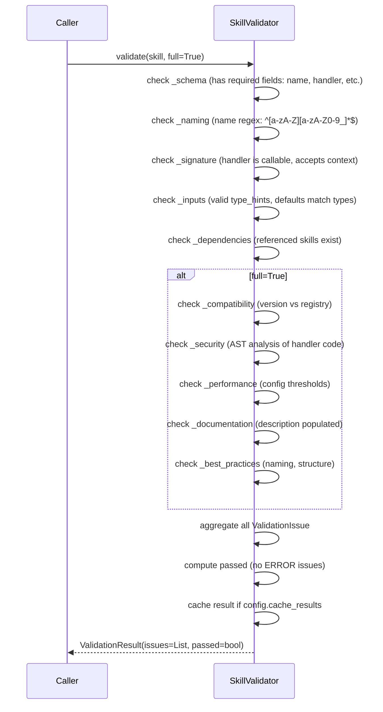

### Validation Issue Severity Levels

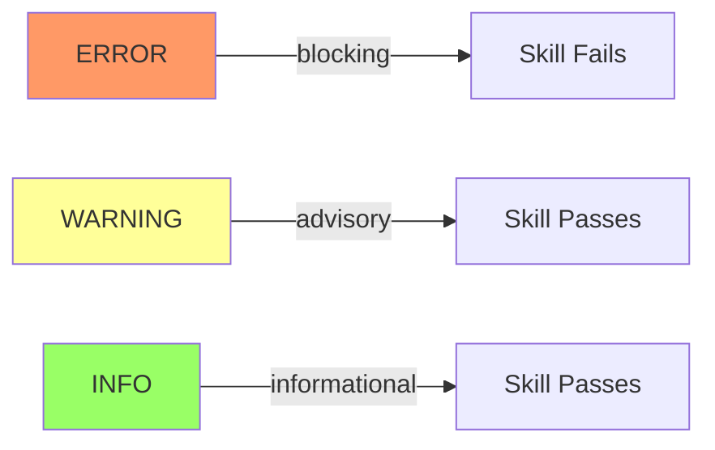

### Security Validation Flow

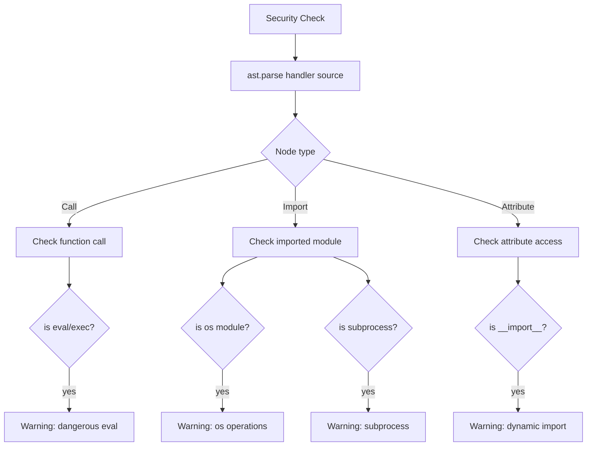

## 5. Skill Execution Data Flow

### Single Skill Execution

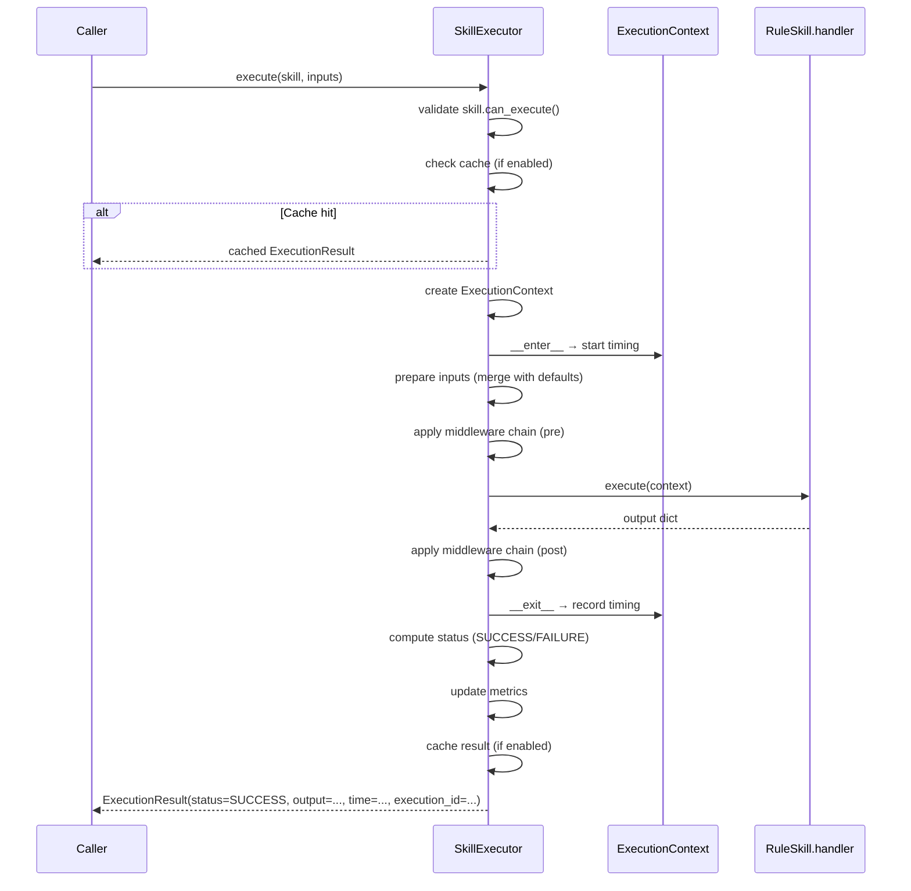

### Batch Execution Modes

#### Sequential Mode

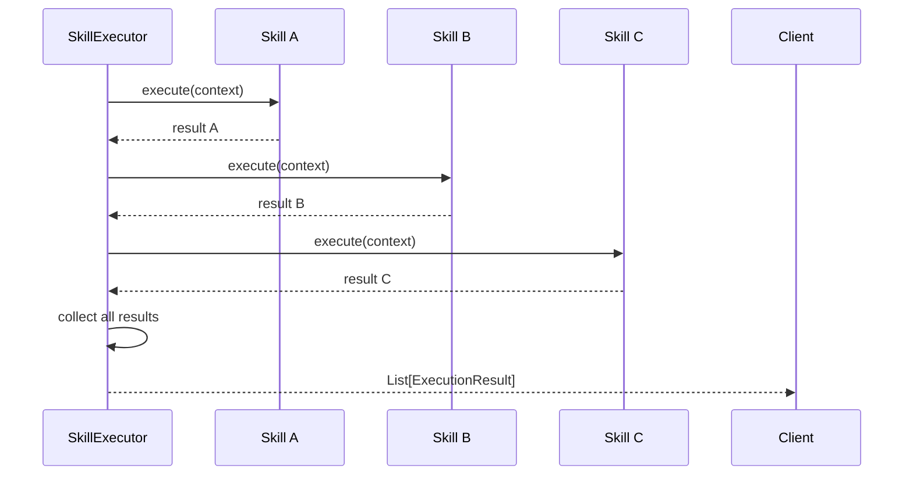

#### Parallel Mode

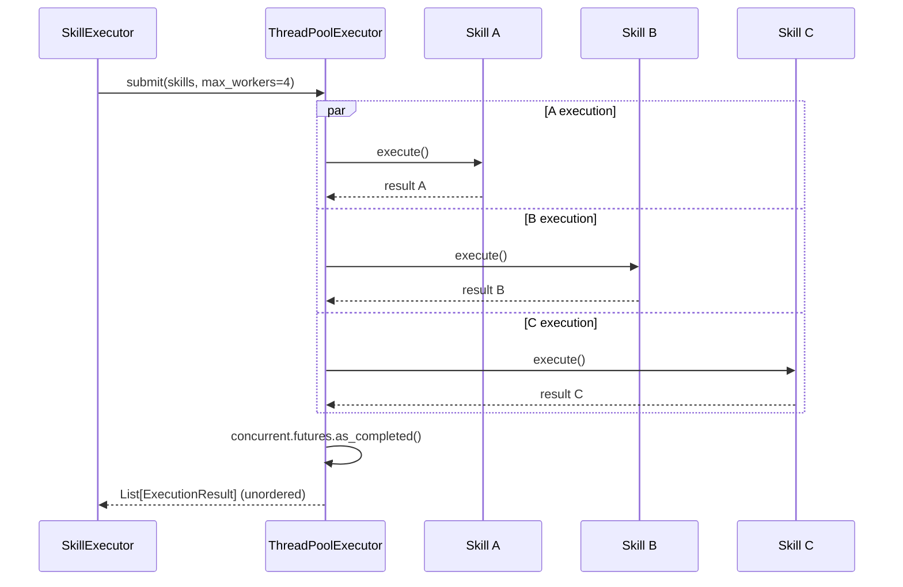

#### Pipeline Mode

In pipeline mode, the output of each skill is passed as input to the next skill in the chain.

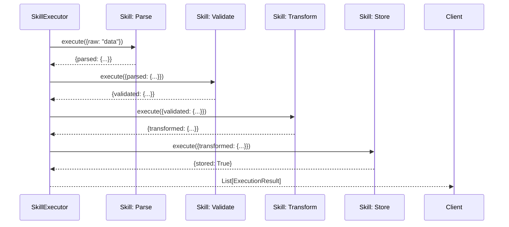

#### Fan-Out Mode

```mermaid
flowchart TB
    INPUT[Base Input] --> S1[Skill A]
    INPUT --> S2[Skill B]
    INPUT --> S3[Skill C]
    S1 --> COLLECT{Collect All Results}
    S2 --> COLLECT
    S3 --> COLLECT
    COLLECT --> OUTPUT[List[ExecutionResult]]
```

#### Fan-In Mode

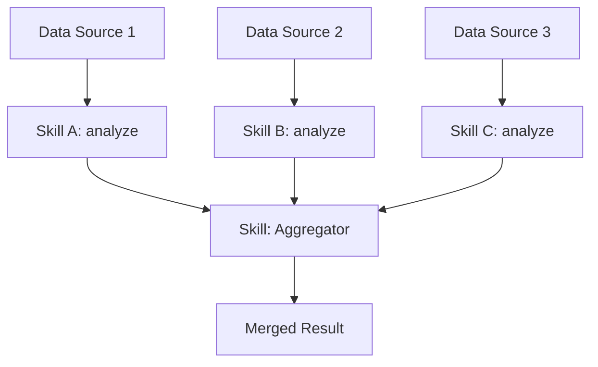

#### Conditional Mode

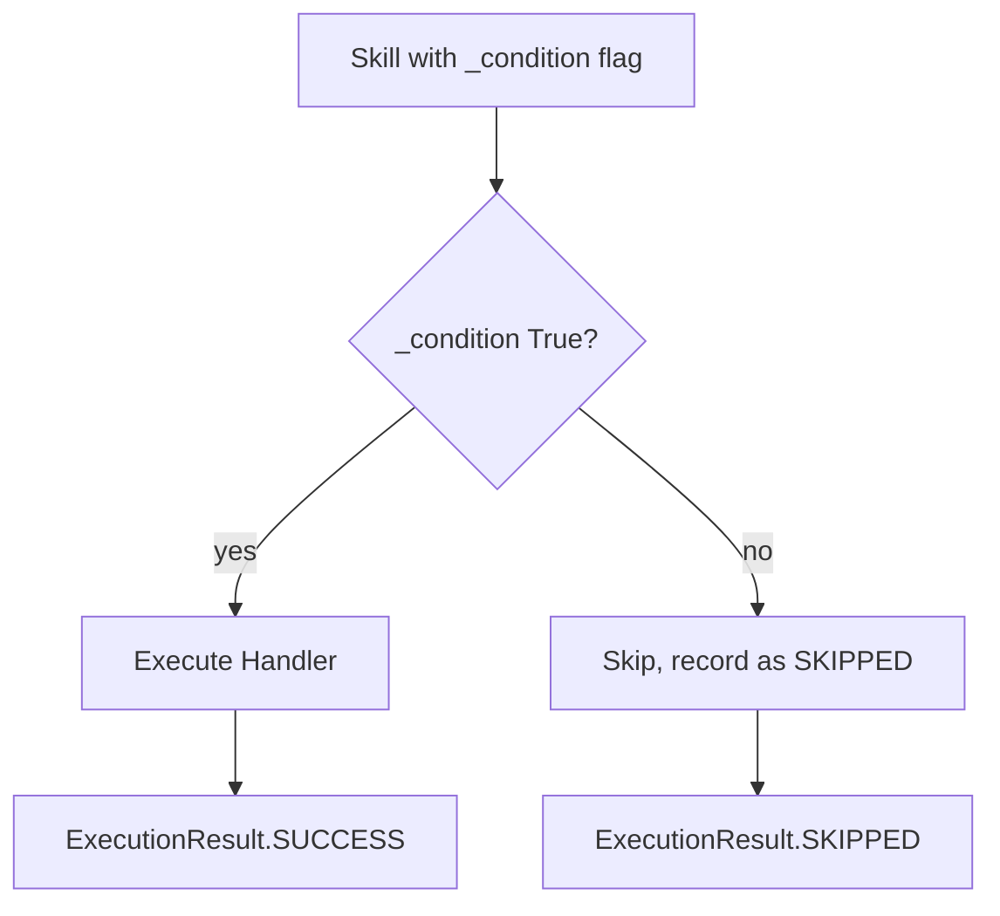

## 6. Event Flow

The registry emits events during key lifecycle transitions. Listeners registered via `on()` receive event notifications.

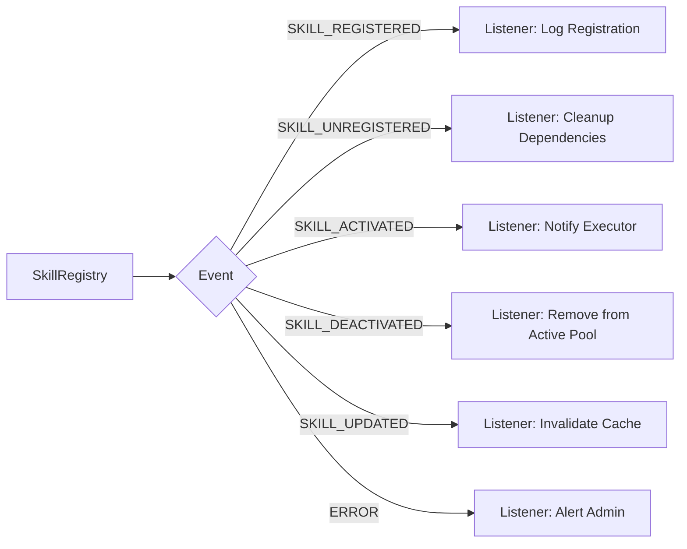

## 7. Metrics Collection Flow

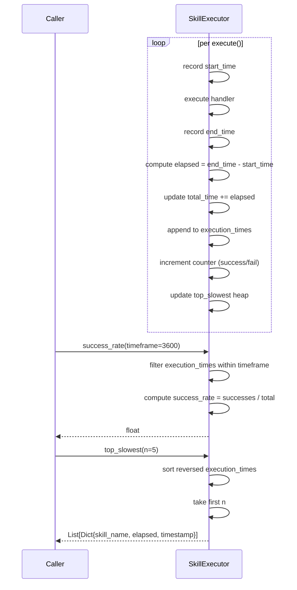

## 8. Error Handling Flow

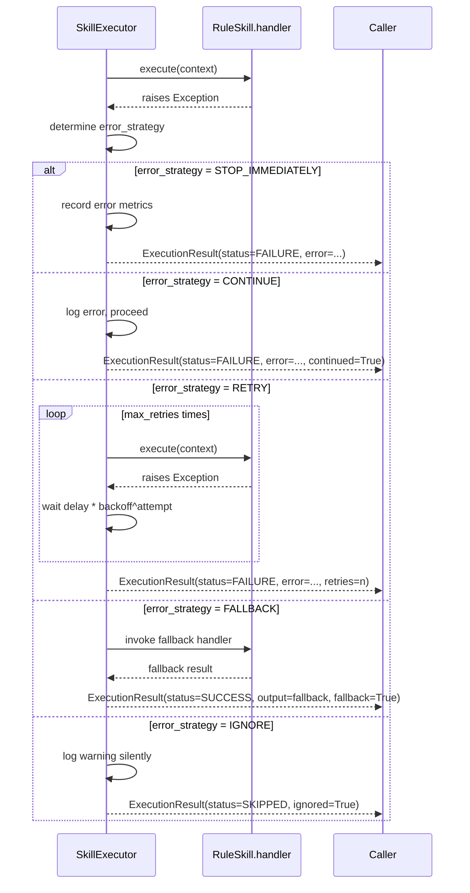

## 9. Hot-Reload Data Flow

```mermaid
flowchart TB
    START[Start Hot-Reload] --> THREAD[Spawn Watcher Thread]
    THREAD --> LOOP{Infinite Loop}
    LOOP --> SLEEP[Sleep interval seconds]
    SLEEP --> SCAN[Scan source paths]
    SCAN --> CMP{Compare mtimes vs cache}
    CMP -->|no changes| LOOP
    CMP -->|changes detected| RELOAD[reload() for each changed file]
    RELOAD --> PARSE[Parse new content]
    PARSE --> VALIDATE[Validate new skill]
    VALIDATE -->|passes| SWAP[Replace in registry]
    VALIDATE -->|fails| LOG[Log error, keep old]
    SWAP --> EMIT[Emit SKILL_UPDATED event]
    EMIT --> LOOP
    LOG --> LOOP
```

## 10. Dependency Resolution Flow

When `resolve_dependencies` is enabled, the loader resolves each skill's dependency list against already-loaded skills.

```mermaid
flowchart TB
    SKILL[Loaded Skill] --> DEPS{[dependencies] empty?}
    DEPS -->|yes| READY[Skill is ready]
    DEPS -->|no| RESOLVE{For each dep}
    RESOLVE --> FIND{Find in loaded_skills}
    FIND -->|found| CHECK{Check compat}
    CHECK -->|compatible| SAT[Dep satisfied]
    CHECK -->|incompatible| FAIL[Load failure]
    FIND -->|not found, optional| WARN[Log warning]
    FIND -->|not found, required| FAIL2[Load failure]
    SAT --> ALL{All deps resolved?}
    WARN --> ALL
    ALL -->|yes| READY
    ALL -->|no| LOAD_DEP[Load dependency first]
    LOAD_DEP --> RESOLVE
```

## 11. Thread Safety Model

```mermaid
flowchart LR
    subgraph Thread-Safe Zones
        REG[SkillRegistry: threading.Lock on _skills]
        EXEC[SkillExecutor: ThreadPoolExecutor]
        CACHE[CacheStore: threading.Lock]
    end

    subgraph Non-Thread-Safe
        LOAD[SkillLoader: sequential only]
        VAL[SkillValidator: per-call stateless]
    end

    T1[Thread 1] --> REG
    T2[Thread 2] --> REG
    T3[Thread 3] --> EXEC
    T4[Thread 4] --> EXEC
```

The `SkillRegistry` uses `threading.Lock` to protect its `_skills` and `_namespaces` dictionaries during registration, unregistration, and query operations. The `SkillExecutor` uses `concurrent.futures.ThreadPoolExecutor` for parallel execution modes. `SkillLoader` and `SkillValidator` are designed for single-threaded use, though the validator is stateless and could be called from multiple threads safely.
