# Skills Module — Reasoning

## Design Rationale

The Skills module is designed around a separation of concerns principle: loading, registration, validation, and execution are each handled by independent components. This document explains the reasoning behind key design decisions.

## 1. Why Separate Loader, Registry, Validator, and Executor?

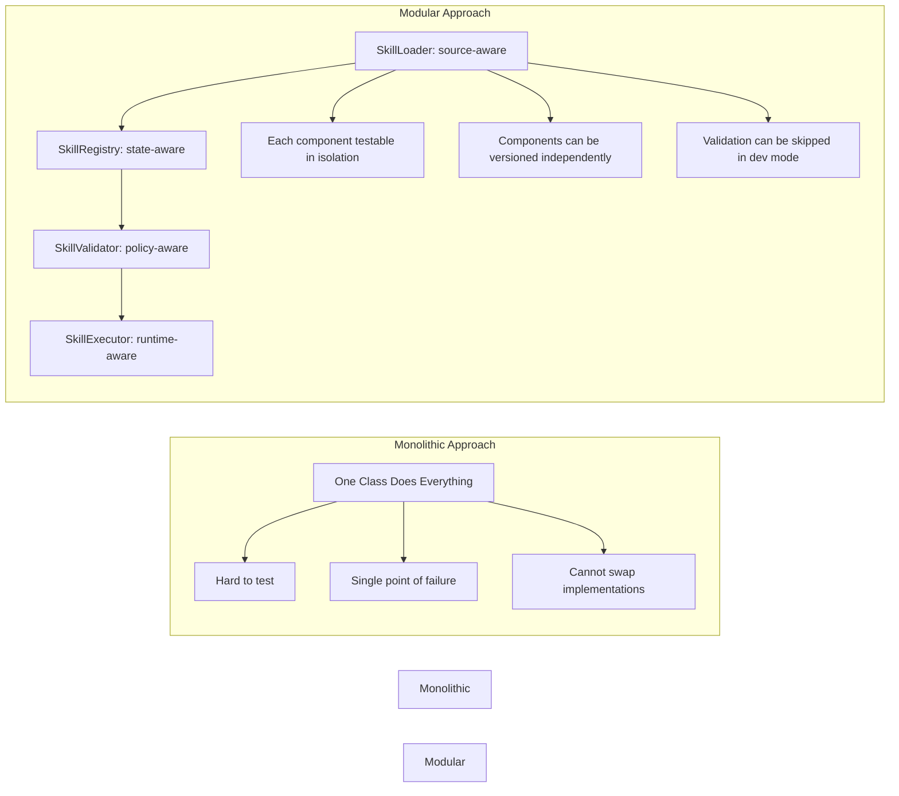

**Decision:** The modular approach was chosen because:

1. **Testability** — Each component can be mocked and tested independently.
2. **Flexibility** — The validator can be swapped for a stricter version, the loader can support new source types, and the executor can use different concurrency backends.
3. **Separation of concerns** — Loading knows about file formats, not execution. Validation knows about rules, not state.
4. **Future-proofing** — New execution modes or source types can be added without touching existing code.

## 2. Conflict Resolution Strategies

When a skill is registered that conflicts with an existing one (same name, different content hash), four strategies are available:

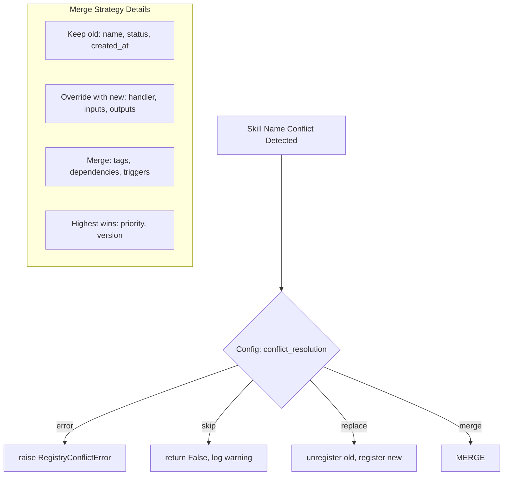

**Decision rationale:**

- **error** — Default. Safe for production where conflicts should be investigated.
- **skip** — Useful in bulk-load scenarios where first registration wins.
- **replace** — Useful during development where the latest version should always be used.
- **merge** — Complex but useful when attributes are managed by different teams (e.g., handler changes by one team, metadata changes by another).

## 3. Execution Mode Selection

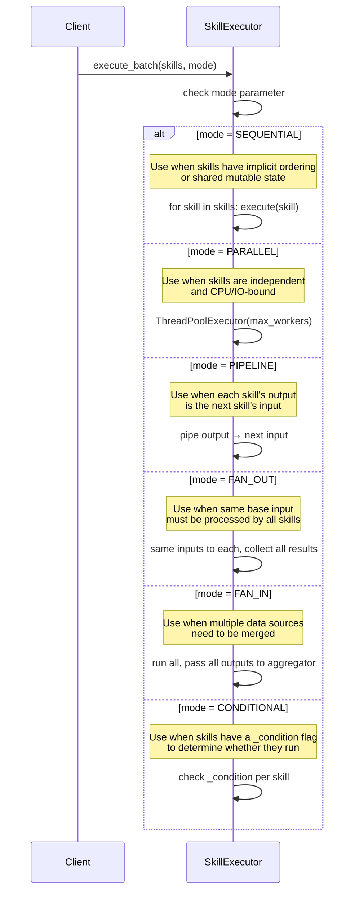

**When to use each mode:**

| Mode | Best For | Example |
|---|---|---|
| SEQUENTIAL | Ordered processing | Preprocessing before ML inference |
| PARALLEL | Independent batch operations | Running multiple filters simultaneously |
| PIPELINE | Data transformation chains | Parse → Validate → Transform → Store |
| FAN_OUT | Broadcast processing | Sending same event to multiple handlers |
| FAN_IN | Aggregation | Merging data from multiple sources |
| CONDITIONAL | Decision-based execution | Run validation only if input is dirty |

## 4. Validation Severity Decision Tree

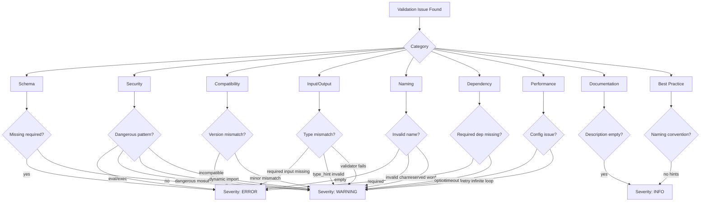

**Why ERROR blocks execution:** A skill with ERROR-level issues cannot be safely executed. For example, missing a required handler means there is no code to run. Dangerous patterns like `eval()` could lead to remote code execution.

**Why WARNING does not block:** WARNING-level issues suggest problems but do not prevent execution. For example, using `subprocess` is a valid pattern in some contexts but should be flagged for review.

**Why INFO is advisory:** INFO-level issues (like missing documentation) are quality concerns, not safety concerns.

## 5. Retry Policy Design

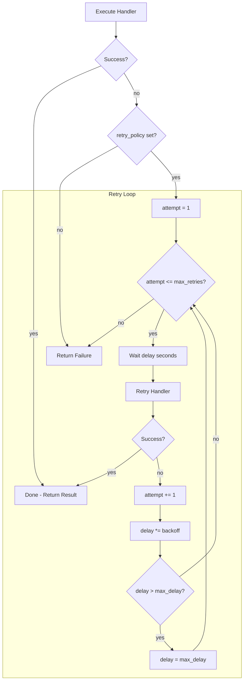

**Why exponential backoff:** Fixed-interval retries can cause thundering herd problems when multiple skills fail simultaneously. Exponential backoff spreads retry attempts and reduces load on downstream dependencies.

**Why max_delay cap:** Without a cap, backoff can grow unreasonably large (e.g., 1s × 2^10 = 1024s ≈ 17 minutes).

**Default values rationale:**
- `max_retries: 3` — Most transient failures resolve within 3 attempts
- `delay: 1.0` — Initial 1-second pause is reasonable for most systems
- `backoff: 2.0` — Doubling is the standard exponential backoff multiplier
- `max_delay: 60.0` — Beyond 60 seconds, the skill likely has a fundamental issue

## 6. Middleware Chain Design

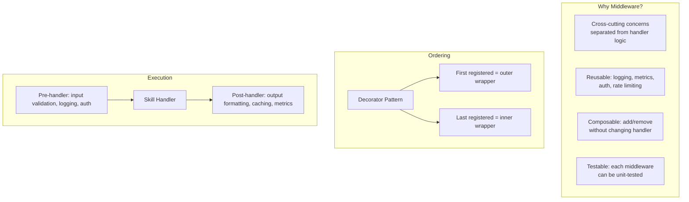

**Decision:** Middleware follows the onion/decorator pattern because:

1. It matches the natural request-response lifecycle — set up before handler, tear down after.
2. Middleware can wrap the handler, catching exceptions and adding fallback behavior.
3. The order of middleware registration matters predictably: first registered middleware executes first in the pre-phase and last in the post-phase.

## 7. Caching Strategy

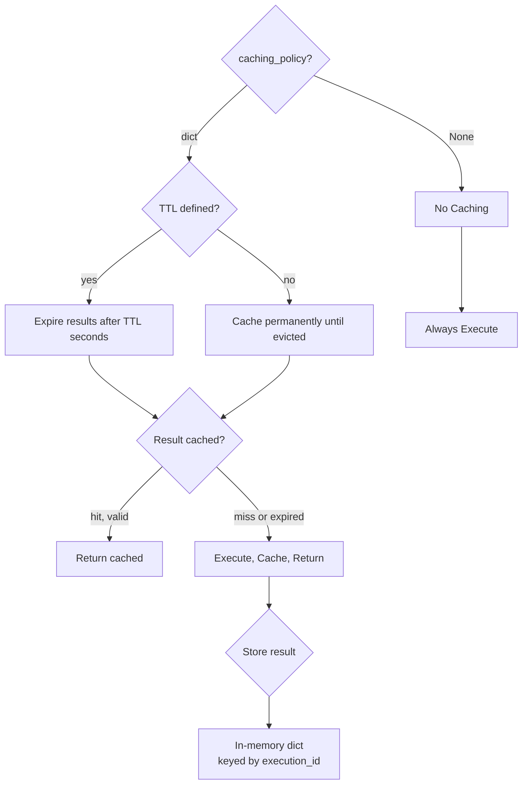

**Why in-memory cache:** The cache is per-executor-instance. A distributed cache (Redis, Memcached) would add deployment complexity and is better suited for higher-level orchestration layers.

**Why per-skill TTL:** Different skills have different staleness tolerances. A "get current time" skill can cache indefinitely, while a "get stock price" skill needs seconds-level TTL.

## 8. Namespace Design

```mermaid
flowchart TB
    subgraph Why Namespaces?
        REASON1[Isolation: data.transform\nvs app.transform are different]
        REASON2[Organization: mirror\nproject directory structure]
        REASON3[Permissions: role admin\ncan manage app namespace only]
        REASON4[Versioning: v1.parse\nvs v2.parse can coexist]
    end

    subgraph Dot Notation
        NS1["data.transform.parse"]
        NS2["data.transform.validate"]
        NS3["data.store"]
        NS4["app.user.login"]
        NS5["app.user.register"]
    end

    subgraph Implementation
        REG[SkillRegistry]
        REG --> DICT{_namespaces dict}
        DICT --> N1["data.transform" → List[Skill]]
        DICT --> N2["data" → List[Skill]]
        DICT --> N3["app.user" → List[Skill]]
        DICT --> N4[default namespace]
    end
```

**Decision rationale:**

Dot-separated namespaces were chosen over nested objects because:
1. **Flat lookup** — `_namespaces[dot_string]` is O(1) dict access
2. **Prefix matching** — `query(namespace="data")` returns all skills under `data.*` by iterating keys and matching prefix
3. **Serialization** — Easy to serialize as a flat dictionary

## 9. Content Hash for Conflict Detection

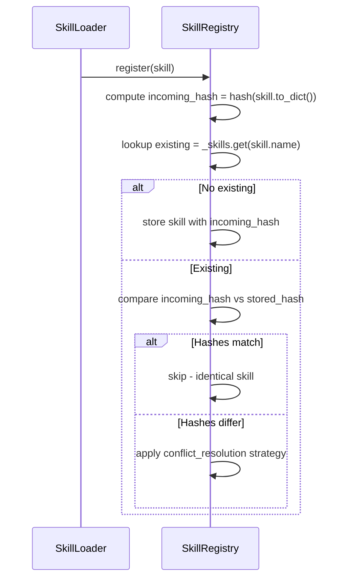

**Why content hash instead of version comparison:**

Versions can be misleading — the same version number may refer to different content after a rebase or fix. Content hashing (using Python's `hashlib.sha256` over the serialized dict) guarantees deterministic conflict detection.

## 10. Event System Design

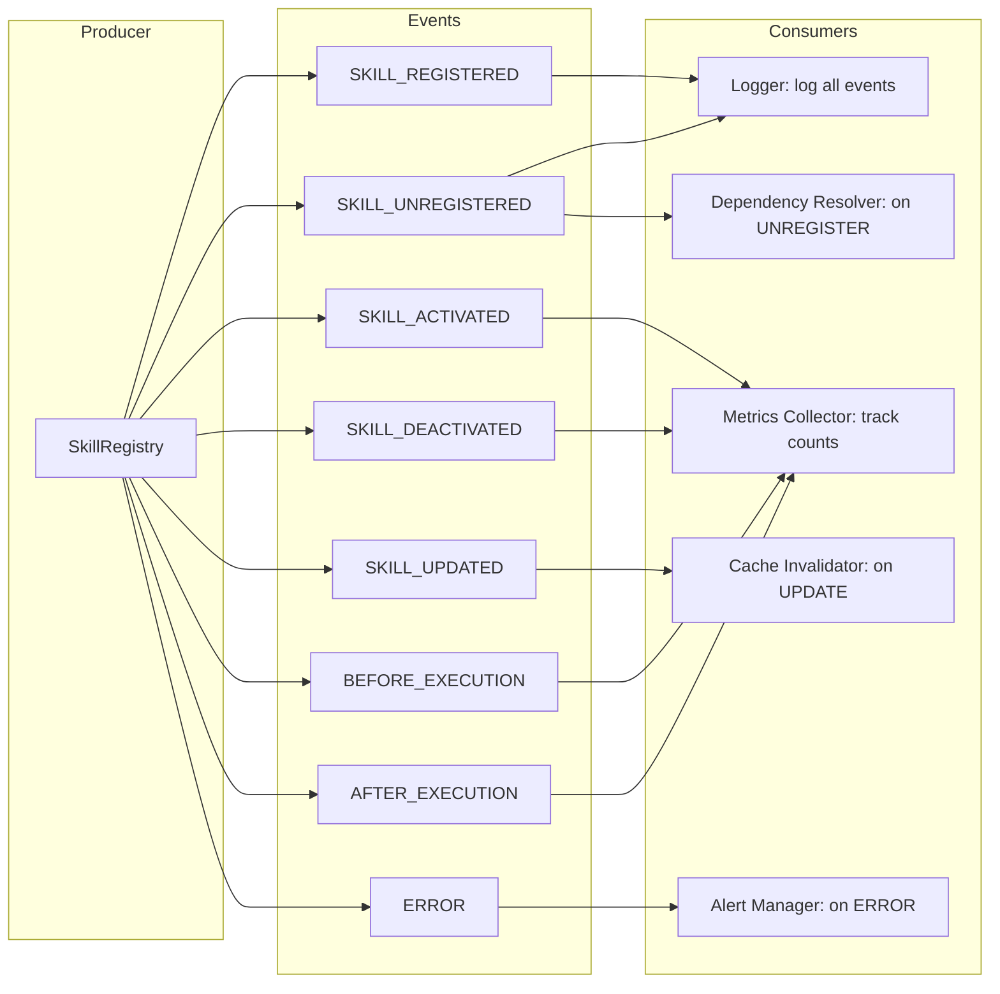

**Decision:** The event system uses a simple publish-subscribe pattern rather than a message queue because:
1. All consumers run in-process — no serialization or network overhead required
2. Events are non-blocking — listeners run in a separate thread or are scheduled for later execution
3. Complexity is minimized — no broker, no topic hierarchy, no partitioning

## 11. Thread Safety Design

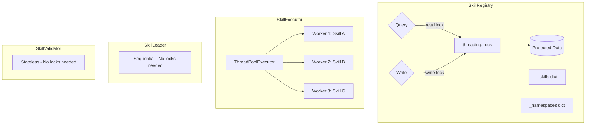

**Why a single lock on the registry:** The registry is read-heavy (many more query() calls than register() calls). Python's `threading.Lock` is sufficient because:
- Dict operations are fast (O(1))
- The lock is held only during the actual mutation, not during validation
- `threading.RLock` would add overhead without benefit since the registry methods are not recursive

**Why ThreadPoolExecutor for parallel execution:** Python's `concurrent.futures.ThreadPoolExecutor` is the standard library for thread-based parallelism. The GIL makes CPU-bound tasks slower in threads, but skill execution is typically I/O-bound (API calls, database queries, file reads), so threading is appropriate.

## 12. Skill Versioning Strategy

```mermaid
flowchart LR
    V[SkillVersion] --> SEMVER[Semantic Versioning: major.minor.patch]
    SEMVER --> COMPAT{compat(other, strategy)}
    COMPAT -->|strict| major_eq["major == other.major"]
    COMPAT -->|minor| major_gte["major >= other.major AND minor >= other.minor"]
    COMPAT -->|flexible| major_ge["major >= other.major"]
    COMPAT -->|any| always["always True"]

    subgraph Version Bump Rules
        MAJOR[breaking changes → increment major]
        MINOR[new features, backward compat → increment minor]
        PATCH[bug fixes → increment patch]
    end
```

**Why semantic versioning:** Semantic versioning gives consumers clear signals about compatibility. A skill with `major=2` is expected to break consumers of `major=1`. The `compat()` method encodes four strategies that skills can declare in their dependencies.

## 13. Config Validation on Startup

```mermaid
flowchart TB
    STARTUP[SkillExecutor.__init__] --> CHECK{Validate config}
    CHECK --> MAX_W[max_workers must be >= 1]
    CHECK --> TIMEOUT[default_timeout must be > 0]
    CHECK --> RETRY[max_retries must be >= 0]
    CHECK --> DELAY[delay must be >= 0]
    CHECK --> BACKOFF[backoff must be >= 1.0]
    CHECK --> MAX_D[max_delay must be > 0]

    MAX_W -->|fails| CLAMP1[clamp to max(1, max_workers)]
    TIMEOUT -->|fails| CLAMP2[clamp to default 30.0]
    RETRY -->|fails| CLAMP3[clamp to 0]
    DELAY -->|fails| CLAMP4[clamp to 0.1]
    BACKOFF -->|fails| CLAMP5[clamp to 1.0]
    MAX_D -->|fails| CLAMP6[clamp to max_delay + 1.0]
```

**Why clamp instead of raise:** Configuration errors should not crash the system. Clamping to sensible defaults is more resilient. The original values are kept in the raw config; warnings are logged for audit purposes.

## 14. Hot-Reload Tradeoffs

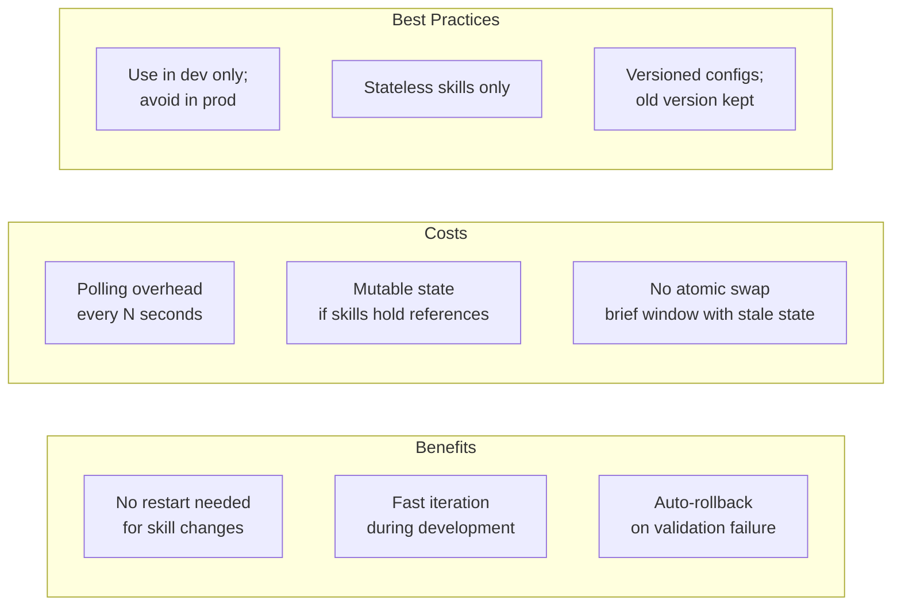

**Decision:** Hot-reload is optional and disabled by default. It is intended for development environments where rapid iteration is valuable and the risks of mutable state are acceptable.
