# Skills Module — Integration

## External Interfaces

The Skills module integrates with the broader system through well-defined interfaces. Each component exposes a public API that other modules consume.

## 1. Integration Overview

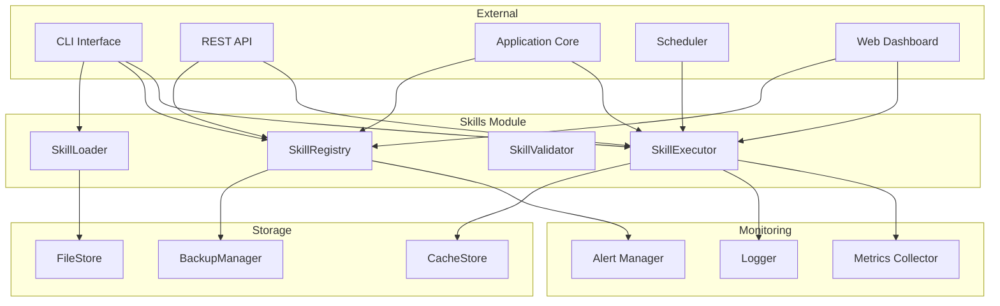

## 2. Integration with CLI

The CLI module uses the Skills module to load, list, register, and execute skills from the command line.

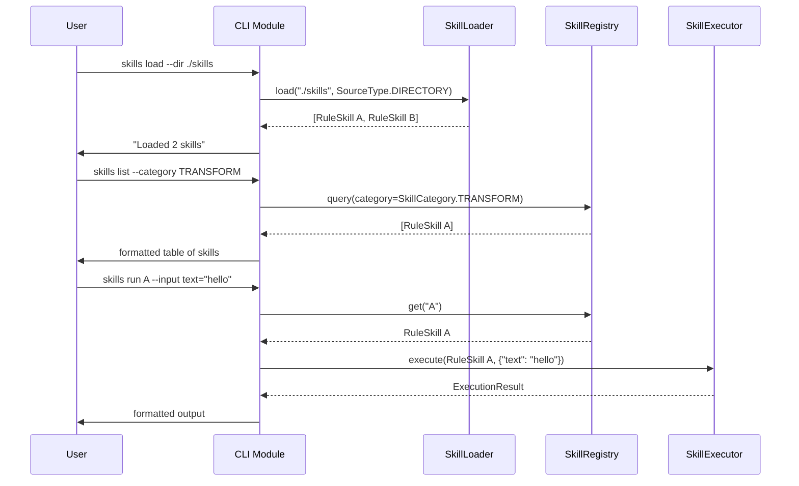

### CLI Command Mapping

| CLI Command | Module Method |
|---|---|
| `skills load <dir>` | `SkillLoader.load(dir, SourceType.DIRECTORY)` |
| `skills reload <name>` | `SkillLoader.reload(name)` |
| `skills list [--category] [--tags]` | `SkillRegistry.query(category, tags)` |
| `skills register <path>` | `SkillRegistry.register(skill)` |
| `skills unregister <name>` | `SkillRegistry.unregister(name)` |
| `skills activate <name>` | `SkillRegistry.activate(name)` |
| `skills deactivate <name>` | `SkillRegistry.deactivate(name)` |
| `skills validate <path>` | `SkillValidator.validate(skill)` |
| `skills run <name> [--input]` | `SkillExecutor.execute(skill, inputs)` |
| `skills batch <names> [--mode]` | `SkillExecutor.execute_batch(skills, mode)` |
| `skills stats` | `SkillExecutor.metrics()` |

## 3. Integration with REST API

The REST API module exposes Skills functionality over HTTP.

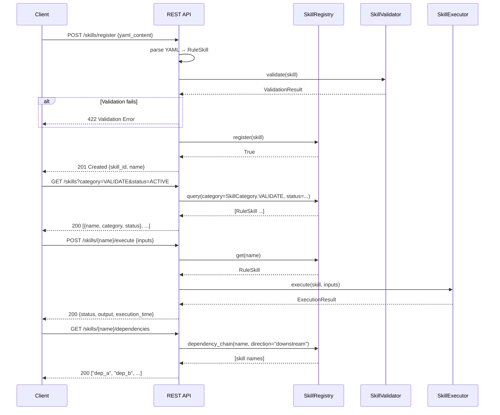

### API Endpoint Mapping

| HTTP Method | Endpoint | Module Call |
|---|---|---|
| `POST` | `/skills/register` | `Registry.register()` |
| `DELETE` | `/skills/{name}` | `Registry.unregister()` |
| `GET` | `/skills` | `Registry.query()` |
| `GET` | `/skills/{name}` | `Registry.get()` |
| `POST` | `/skills/{name}/activate` | `Registry.activate()` |
| `POST` | `/skills/{name}/deactivate` | `Registry.deactivate()` |
| `POST` | `/skills/{name}/execute` | `Executor.execute()` |
| `POST` | `/skills/batch` | `Executor.execute_batch()` |
| `GET` | `/skills/{name}/dependencies` | `Registry.dependency_chain()` |
| `GET` | `/skills/snapshot` | `Registry.snapshot()` |
| `POST` | `/skills/restore` | `Registry.restore_snapshot()` |
| `GET` | `/skills/{name}/validate` | `Validator.validate()` |
| `GET` | `/skills/metrics` | `Executor.metrics()` |

## 4. Integration with Application Core

The application core module consumes skills as part of its main processing pipeline.

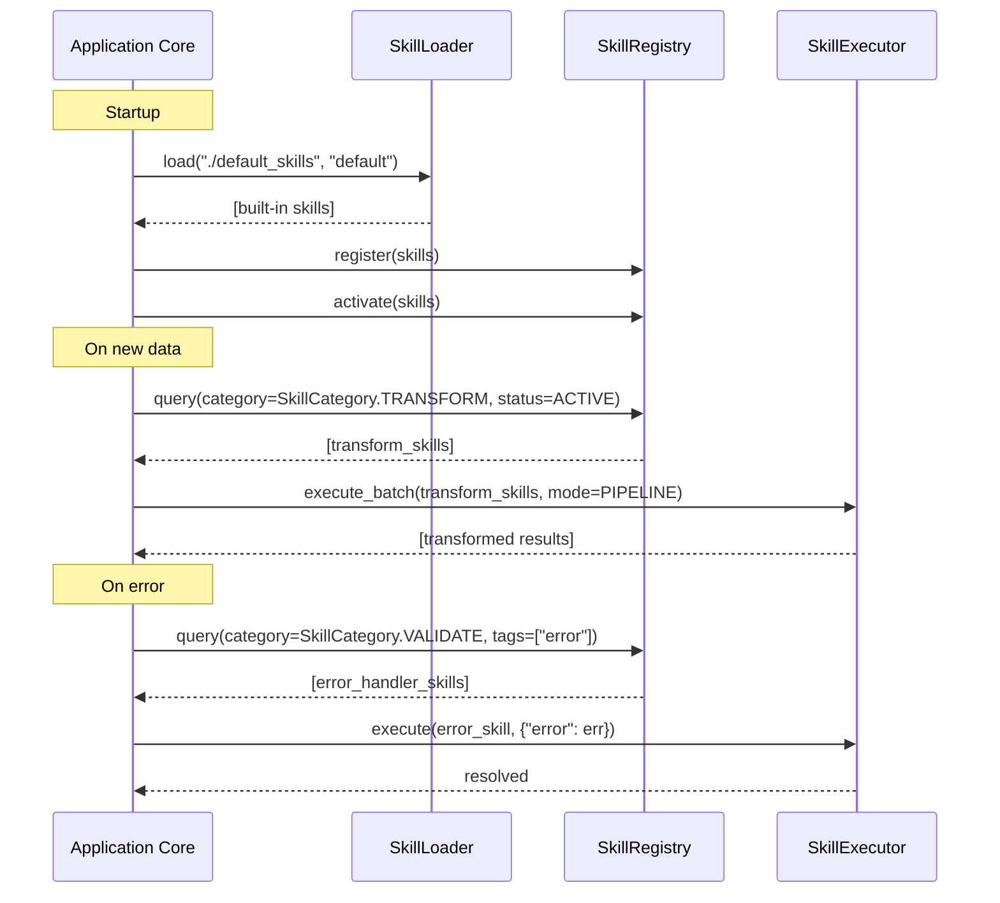

### Core Integration Points

| Core Event | Skills Module Action |
|---|---|
| System startup | `SkillLoader.load()` + `SkillRegistry.register()` |
| Data ingestion | `SkillRegistry.query(TRANSFORM)` → `SkillExecutor.execute_batch(PIPELINE)` |
| Data validation | `SkillRegistry.query(VALIDATE)` → `SkillExecutor.execute_batch(SEQUENTIAL)` |
| Error handling | `SkillRegistry.query(CUSTOM, tags=["error"])` → `SkillExecutor.execute()` |
| Shutdown | `SkillExecutor.shutdown()` |
| Config change | `SkillLoader.reload()` |

## 5. Integration with Scheduler

The scheduler module triggers skill execution at configured intervals.

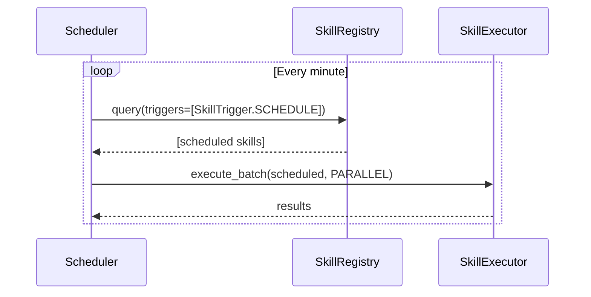

### Crontab Mapping

```yaml
# Schedule configuration in YAML
schedule:
  - skill: data_cleanup
    cron: "0 3 * * *"    # daily at 3am
  - skill: report_generate
    cron: "0 0 * * 1"     # weekly on Monday
  - skill: heartbeat
    cron: "* * * * *"     # every minute
```

## 6. Integration with FileStore

The `SkillLoader` reads skill definitions from the `FileStore`. The integration handles atomic reads, error recovery, and format detection.

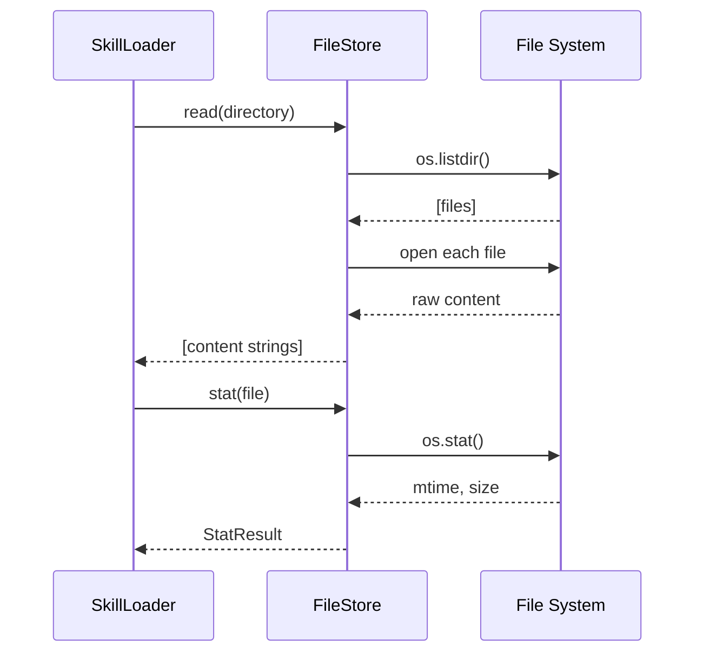

### File Extension Mapping

| Extension | Source Type | Parser |
|---|---|---|
| `.yaml`, `.yml` | `SourceType.DIRECTORY` | `yaml.safe_load()` |
| `.json` | `SourceType.DIRECTORY` | `json.loads()` |
| `.py` | `SourceType.PACKAGE` | `importlib.import_module()` |
| `.md` | `SourceType.DIRECTORY` | YAML frontmatter parser |

## 7. Integration with CacheStore

The `SkillExecutor` integrates with `CacheStore` to cache and retrieve execution results.

```mermaid
flowchart TB
    subgraph Cache Integration
        EXEC[SkillExecutor] --> CHECK{caching_policy?}
        CHECK -->|None| BYPASS[No cache - always execute]
        CHECK -->|TTL > 0| TTL_CHECK{Cache Has Key?}

        TTL_CHECK -->|yes| RETRIEVE[CacheStore.get(key)]
        RETRIEVE --> FRESH{Still Fresh?}
        FRESH -->|yes| RETURN[Return cached result]
        FRESH -->|no| EXECUTE[Execute and cache]
        TTL_CHECK -->|no| EXECUTE

        EXECUTE --> STORE[CacheStore.set(key, result, ttl)]
        STORE --> RETURN2[Return fresh result]
    end

    subgraph Cache Key
        K1["cache_key = f'{skill.skill_id}:{hash(inputs)}'"]
    end
```

## 8. Integration with BackupManager

The `SkillRegistry` integrates with `BackupManager` for periodic snapshots and disaster recovery.

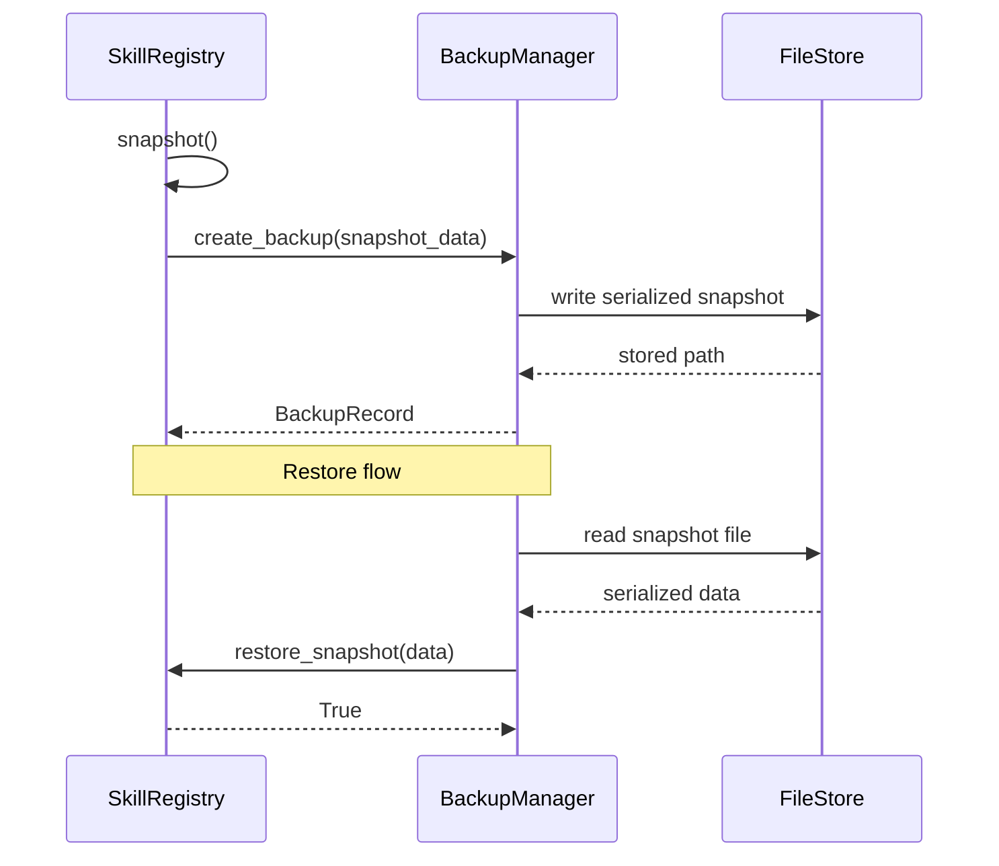

## 9. Integration with Metrics System

The `SkillExecutor` exports metrics that the monitoring system collects.

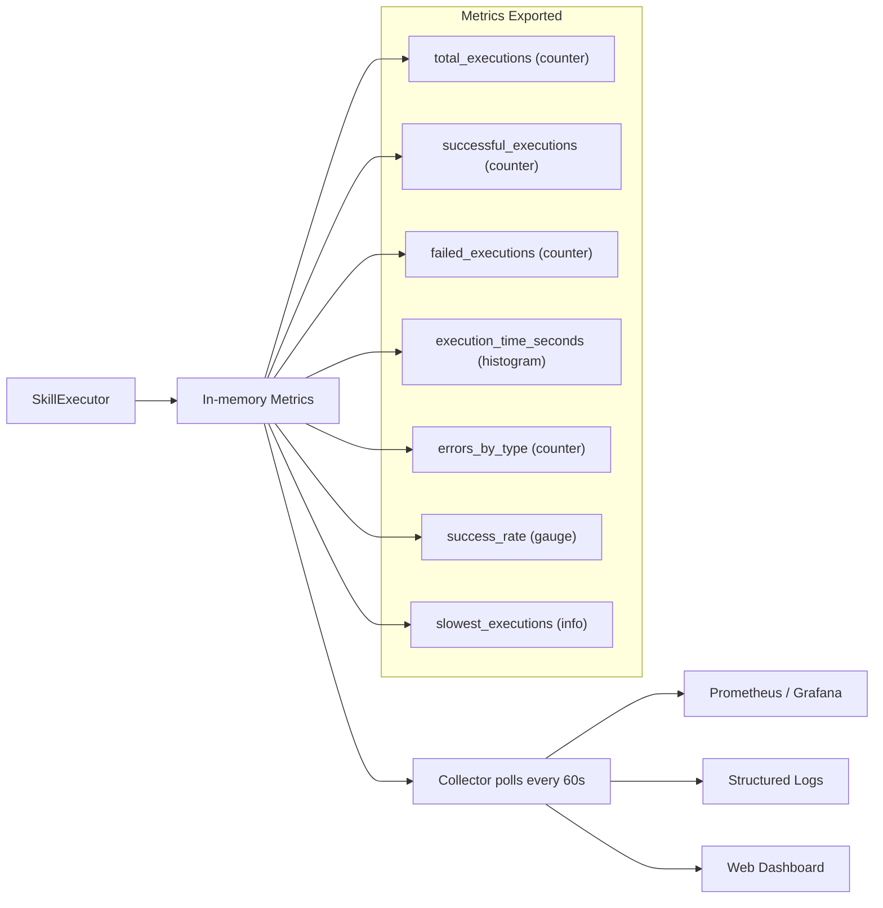

## 10. Integration Patterns

### Pattern 1: Load and Forget

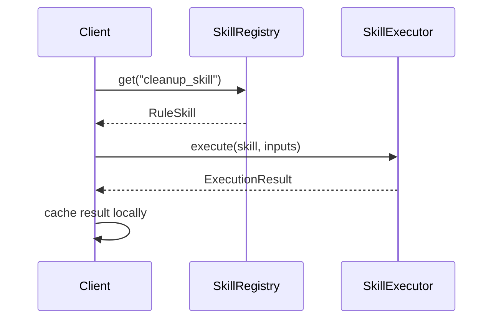

### Pattern 2: Pipeline Orchestrator

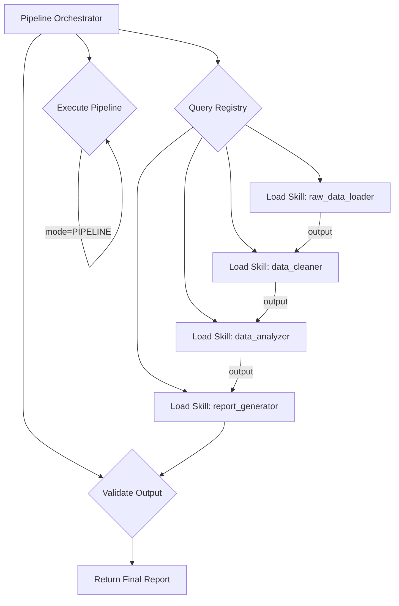

### Pattern 3: Error Handler Chain

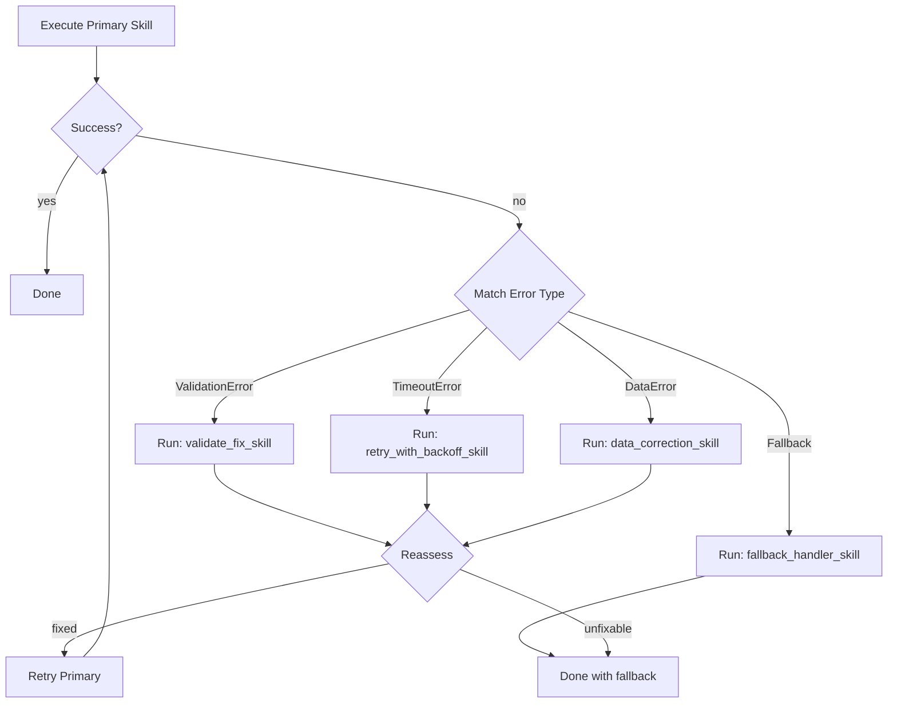

## 11. Integration Configuration

When integrating the Skills module, the following configuration must be provided:

```yaml
skills:
  loader:
    format: "auto"
    recursive: true
    validate: true
    hot_reload: false
    hot_reload_interval: 5
    cache_loaded: true
    resolve_dependencies: true

  registry:
    allow_overwrite: false
    auto_activate: true
    check_circular_deps: true
    conflict_resolution: "error"
    validate_on_register: true

  executor:
    max_workers: 4
    default_timeout: 30.0
    retry_on_failure: false
    track_metrics: true
    cache_results: false

  validator:
    max_issues_per_skill: 20
    fail_on_error: true
    fail_on_warning: false
    check_security: true
```

### Integration with External Systems

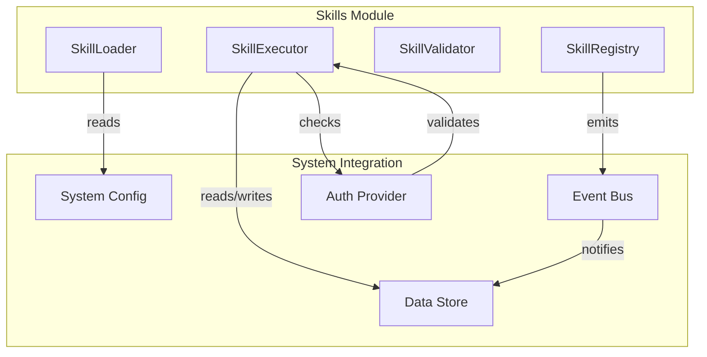

The Skills module does not require a specific event bus, auth provider, or data store. Each integration adapter implements a thin wrapper that maps the module's interfaces to the system's infrastructure.
