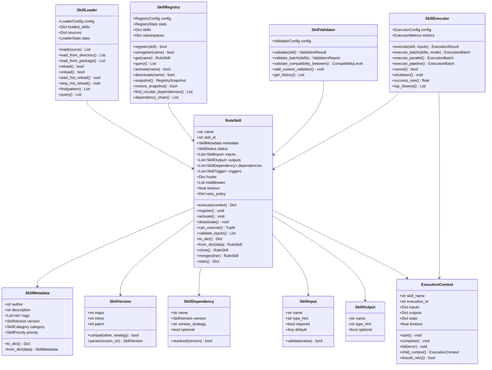
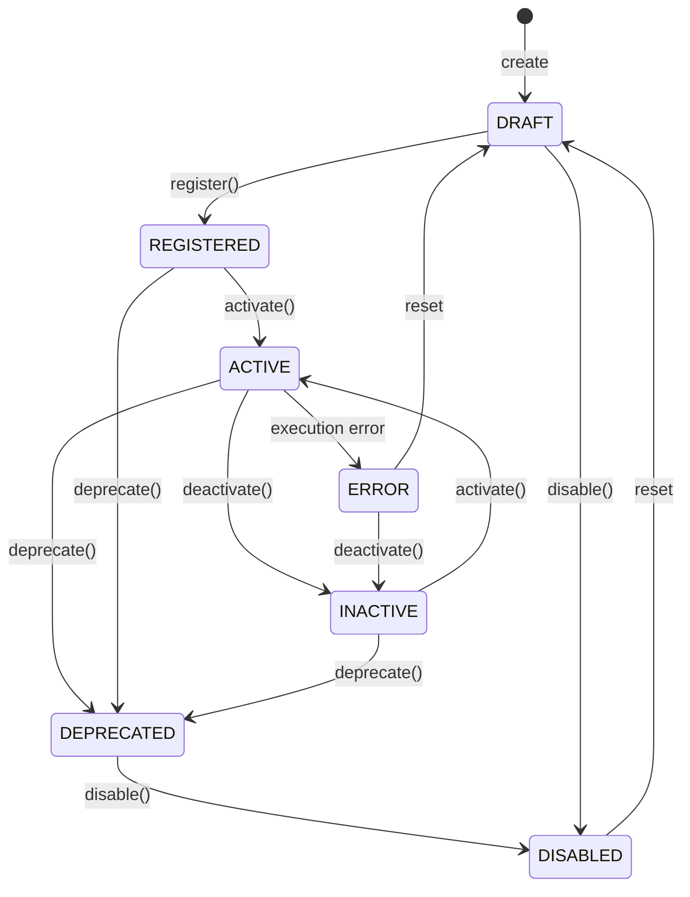
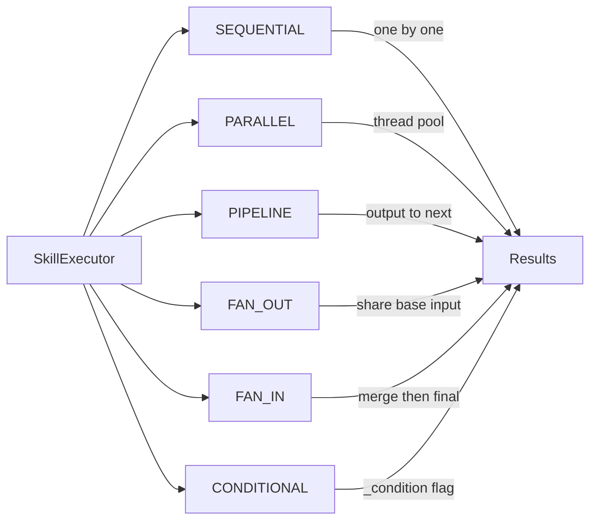

# Skills Module

## Overview

The Skills module provides a complete skill-based rule definition and execution framework. It manages the full lifecycle of `RuleSkill` instances — from loading and registration through validation and execution.

Five core components work together:

- **RuleSkill** — Skill definition with metadata, inputs/outputs, dependencies, triggers, hooks, middleware, caching, and retry policies.
- **SkillLoader** — Loads skills from filesystem sources (YAML, JSON, Python), packages, or inline strings. Supports hot-reload, caching, and dependency resolution.
- **SkillRegistry** — Central registry with multi-dimensional indexing (tags, categories, versions, namespaces, aliases, groups), conflict detection, dependency graph management, snapshot/restore, and event-driven listeners.
- **SkillValidator** — Validates skill definitions across schema, naming, input/output, dependencies, compatibility, security (AST-based code analysis), performance, documentation, and best practices.
- **SkillExecutor** — Executes skills with configurable execution modes (sequential, parallel, pipeline, fan-out, fan-in, conditional), timeout handling, retry with exponential backoff, fallback handlers, caching, and comprehensive metrics.

## Class Diagram



## API Reference

| Class | Method | Description |
|---|---|---|
| `RuleSkill` | `execute(context, **kwargs)` | Execute skill handler with context |
| `RuleSkill` | `register()` | Set status to REGISTERED |
| `RuleSkill` | `activate()` | Set status to ACTIVE |
| `RuleSkill` | `can_execute(ctx)` | Check if skill is ready for execution |
| `RuleSkill` | `clone(new_name)` | Deep-copy skill with new ID |
| `RuleSkill` | `merge(other, strategy)` | Merge another skill's config/inputs/outputs |
| `SkillLoader` | `load(source, source_type, namespace)` | Load skills from path |
| `SkillLoader` | `load_from_package(name)` | Load skills from Python package |
| `SkillLoader` | `load_from_string(content, fmt)` | Load skill from inline string |
| `SkillLoader` | `reload(name)` | Reload changed skill source |
| `SkillLoader` | `start_hot_reload()` | Start background file watcher thread |
| `SkillRegistry` | `register(skill, namespace)` | Register skill with conflict detection |
| `SkillRegistry` | `unregister(name)` | Remove skill from registry |
| `SkillRegistry` | `query(category, tags, status, ...)` | Multi-filter skill search |
| `SkillRegistry` | `snapshot()` | Take full registry snapshot |
| `SkillRegistry` | `find_circular_dependencies()` | DFS-based cycle detection |
| `SkillValidator` | `validate(skill, full)` | Full or partial skill validation |
| `SkillValidator` | `validate_batch(skills)` | Batch validate multiple skills |
| `SkillValidator` | `validate_handler(handler)` | Validate handler function alone |
| `SkillExecutor` | `execute(skill, inputs)` | Single skill execution |
| `SkillExecutor` | `execute_batch(skills, mode)` | Multi-skill execution (6 modes) |
| `SkillExecutor` | `execute_pipeline(skills)` | Pipe outputs through skill chain |
| `SkillExecutor` | `top_slowest(n)` | Get slowest executions |

## Skill Status Lifecycle



## Execution Modes



## Skill Categories and Priorities

| Category | Enum Value | Usage |
|---|---|---|
| TRANSFORM | auto | Data transformation skills |
| VALIDATE | auto | Input/output validation skills |
| EXECUTE | auto | Action execution skills |
| ANALYZE | auto | Data analysis skills |
| INFER | auto | Inference/reasoning skills |
| FILTER | auto | Content filtering skills |
| AGGREGATE | auto | Data aggregation skills |
| GENERATE | auto | Content generation skills |
| CUSTOM | auto | User-defined category |

| Priority | Value | Description |
|---|---|---|
| LOWEST | 0 | No urgency |
| LOW | 25 | Low priority |
| NORMAL | 50 | Default priority |
| HIGH | 75 | High priority |
| HIGHEST | 100 | Urgent |
| CRITICAL | 1000 | Must-run |

## Skill Triggers

| Trigger | Description |
|---|---|
| MANUAL | Invoked explicitly by user |
| EVENT | Fired on system events |
| SCHEDULE | Cron-like scheduled execution |
| PIPELINE | Part of a pipeline chain |
| CHAIN | Triggered by another skill's output |
| CONDITION | Triggered when condition met |

## Error Strategies

| Strategy | Behavior |
|---|---|
| STOP_IMMEDIATELY | Halt on first error |
| CONTINUE | Log error and proceed |
| RETRY | Retry with exponential backoff |
| FALLBACK | Execute fallback handler |
| IGNORE | Skip and continue silently |

## Retry Policy Defaults

```yaml
max_retries: 3
delay: 1.0       # initial delay in seconds
backoff: 2.0     # multiplier per retry
max_delay: 60.0  # cap on delay
```

The retry policy applies per-skill. The executor also maintains its own global retry config that can override per-skill settings when `error_strategy` is set to `RETRY`.
