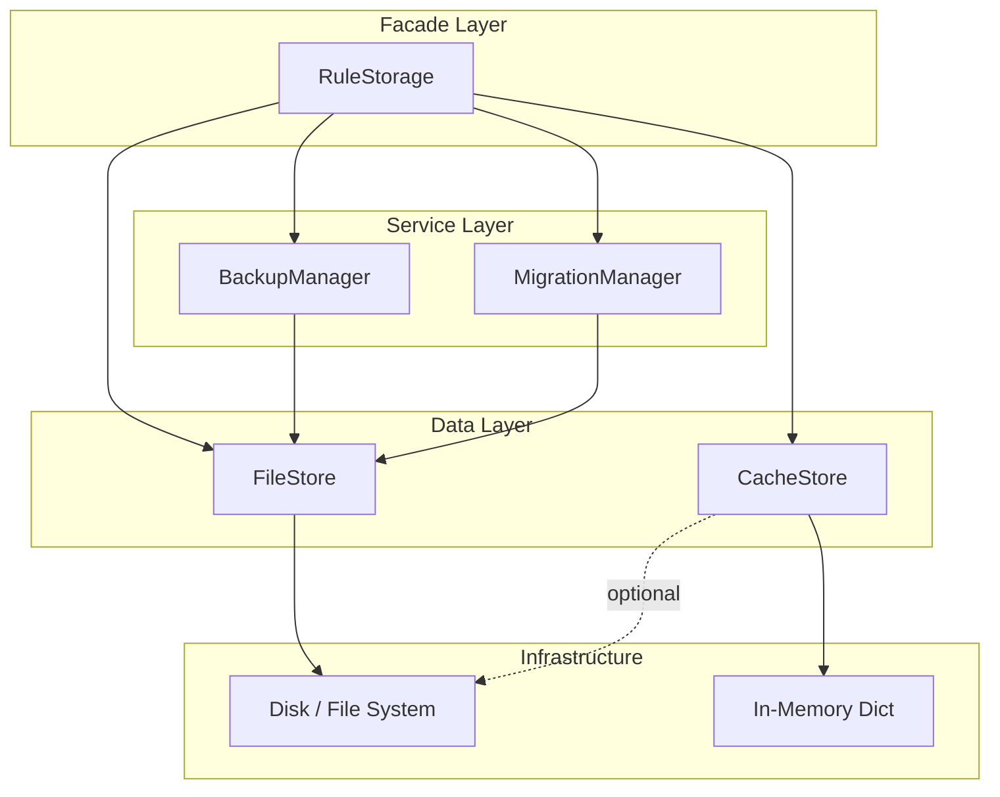
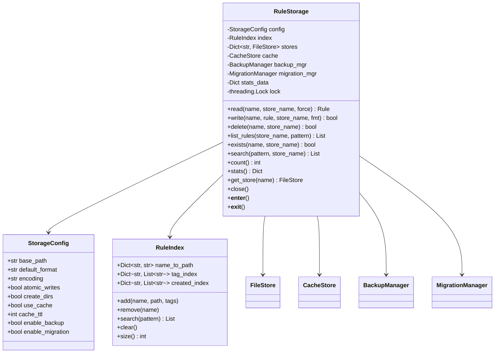
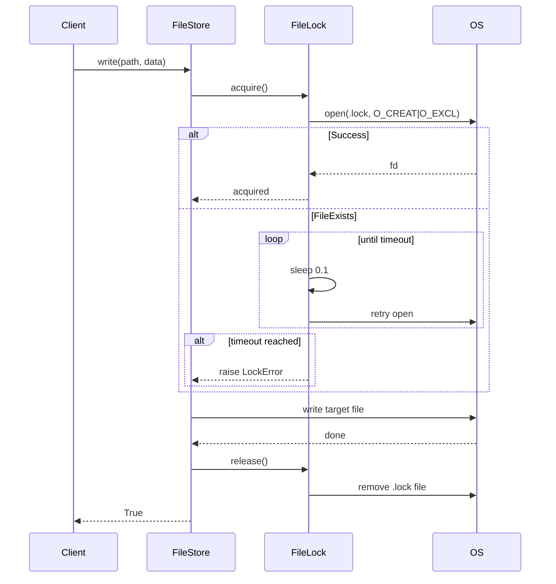
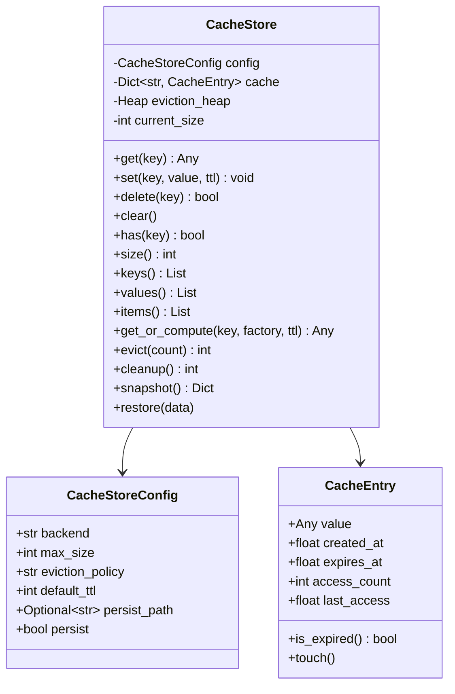
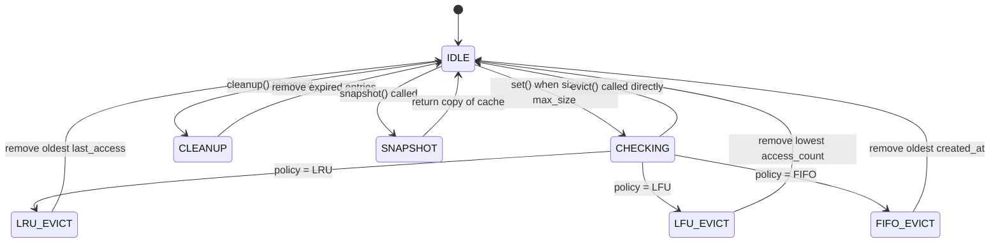
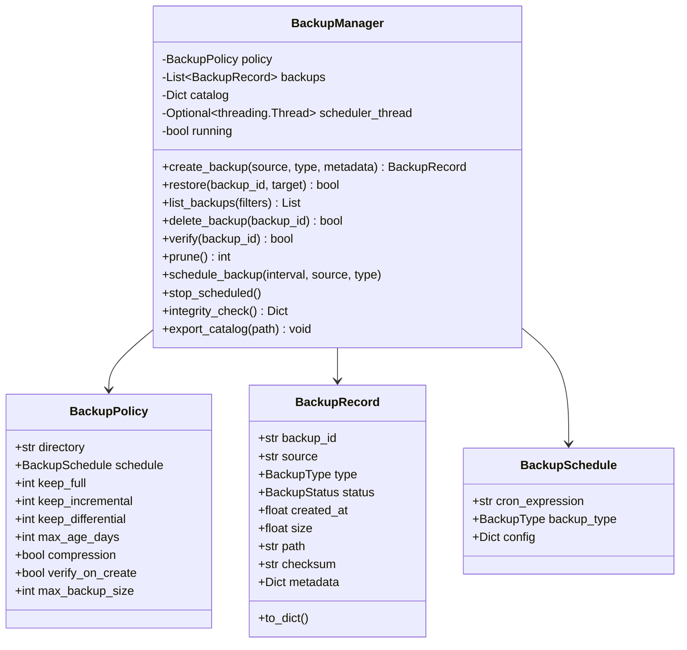
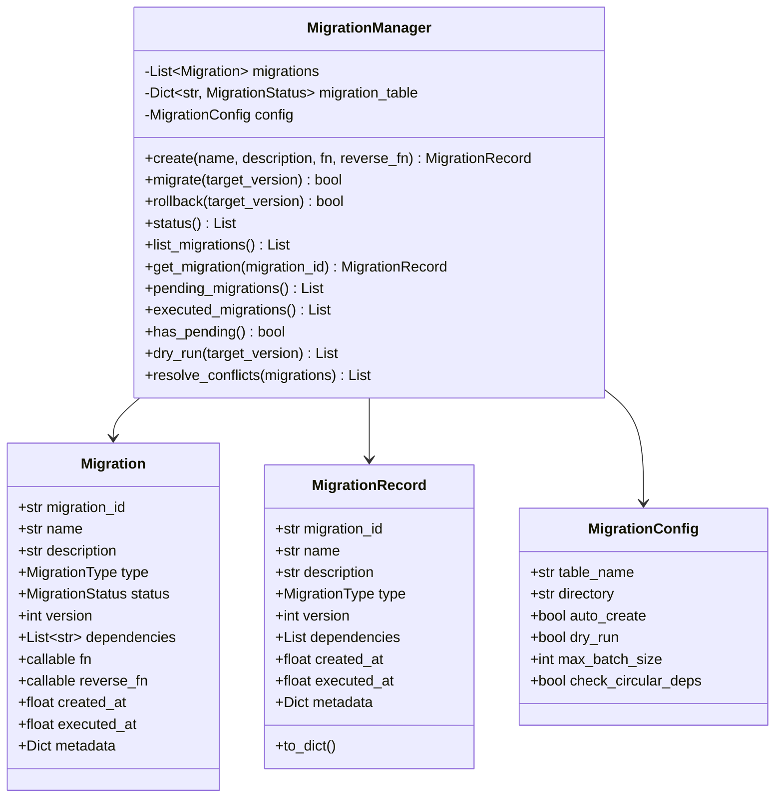
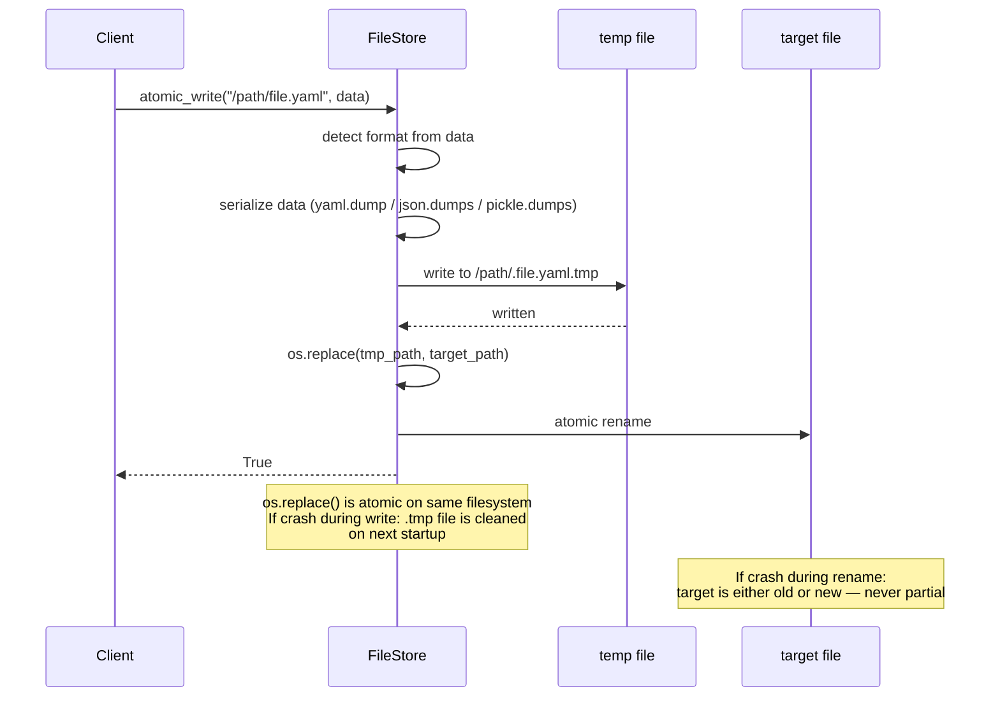
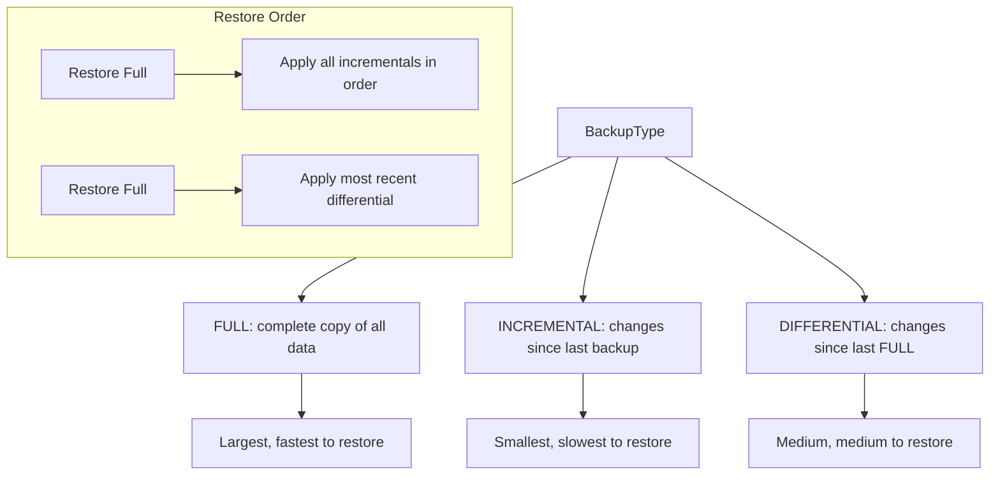
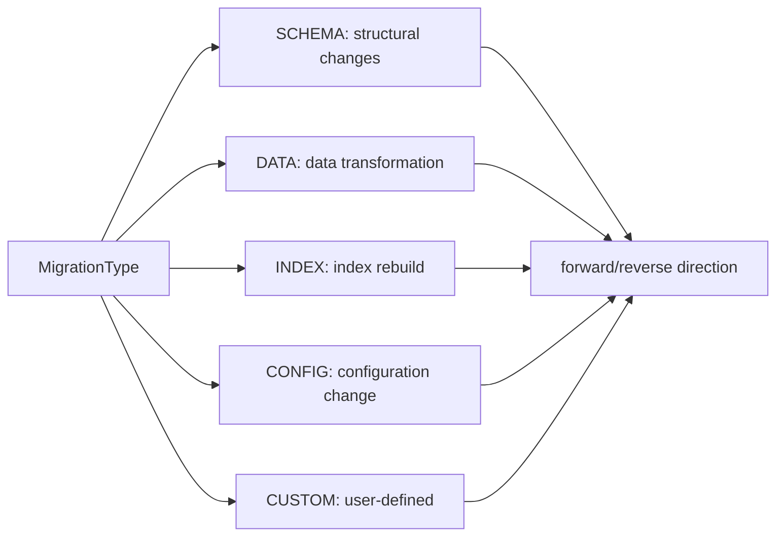

# Storage Module — Architecture

## Component Architecture

The Storage module follows a layered architecture. The `RuleStorage` facade sits at the top, delegating to `FileStore`, `CacheStore`, `BackupManager`, and `MigrationManager`. Each lower layer handles a specific concern.



## RuleStorage Architecture



## FileStore Architecture

```mermaid
classDiagram
    class FileStore {
        -FileStoreConfig config
        -FileLock lock
        -Dict stats
        +read(path) Any
        +write(path, data) bool
        +delete(path) bool
        +exists(path) bool
        +list_files(pattern) List
        +atomic_write(path, data) bool
        +read_stream(path) Generator
        +write_stream(path, data) bool
        +read_binary(path) bytes
        +write_binary(path, data) bool
        +format_magic(data) FileFormat
    }

    class FileStoreConfig {
        +str base_path
        +str format
        +str encoding
        +bool atomic_writes
        +bool create_dirs
        +bool use_locking
        +float lock_timeout
    }

    class FileLock {
        +str path
        +str lock_path
        +float timeout
        +acquire()
        +release()
        +locked()
        +__enter__()
        +__exit__()
    }

    FileStore --> FileStoreConfig
    FileStore --> FileLock
    FileLock -->|.lock file| DISK[(File System)]
```

### FileLock Implementation

The `FileLock` uses a lock file on disk (`path.lock`). It:
1. Tries to create the `.lock` file exclusively (atomic `os.open` with `O_CREAT | O_EXCL`)
2. Retries until the lock is acquired or `timeout` expires
3. Cleans up the `.lock` file on `release()`



## CacheStore Architecture



### Eviction Policy State Machine



## BackupManager Architecture



## MigrationManager Architecture



## Storage Format Detection

The `FileStore.format_magic()` method detects the file format from content prefix:

```mermaid
flowchart TB
    DATA[Content bytes] --> MAGIC{First bytes}
    MAGIC -->|b'%YAML' or b'---'| YAML[FileFormat.YAML]
    MAGIC -->|b'{' or b'['| JSON[FileFormat.JSON]
    MAGIC -->|b'\\x80' pickle protocol| PICKLE[FileFormat.PICKLE]
    MAGIC -->|otherwise| UNKNOWN[FileFormat.UNKNOWN]

    YAML --> DECODE{Decode}
    JSON --> DECODE
    PICKLE --> DECODE
    DECODE --> RETURN[Return FileFormat]
```

## Lock-Free Atomic Writes



## Index Data Structure

The `RuleIndex` maps rule names to file paths and maintains secondary indexes:

```mermaid
flowchart TB
    INDEX[RuleIndex]
    INDEX --> N2P["name_to_path: dict\n'my_rule' → '/rules/my_rule.yaml'"]
    INDEX --> TAG["tag_index: dict of lists\n'transform' → ['a', 'b']"]
    INDEX --> CREATED["created_index: dict of lists\n'2025-01-01' → ['a']"]

    N2P --> LOOKUP[O(1) name lookup]
    TAG --> TAG_LOOKUP[O(1) tag lookup, returns list]
    CREATED --> DATE_LOOKUP[O(1) date filter]
```

## Backup Types



## Migration Types



## Thread Safety

```mermaid
flowchart TB
    subgraph Thread-Safe
        RS[RuleStorage: threading.Lock]
        FS[FileStore: FileLock per file]
        CS[CacheStore: threading.Lock]
    end

    subgraph Not Thread-Safe
        BK[BackupManager: sequential operations]
        MG[MigrationManager: sequential migrations]
    end

    T1[Thread 1] --> RS
    T2[Thread 2] --> RS
    RS --> FS
    RS --> CS
    RS --> BK
    RS --> MG

    note for FS: FileLock prevents concurrent writes to same file
    note for CS: CacheStore lock protects internal dict during eviction
```

The `RuleStorage` uses a single `threading.Lock` to protect all public methods. This ensures that read/write/delete operations on the index are serialized. The `FileStore` relies on the filesystem-level `FileLock` for multi-process safety. The `CacheStore` uses a lock to protect its internal dict and eviction heap during concurrent access.
