# Storage Module — Data Flow

## 1. Read Flow

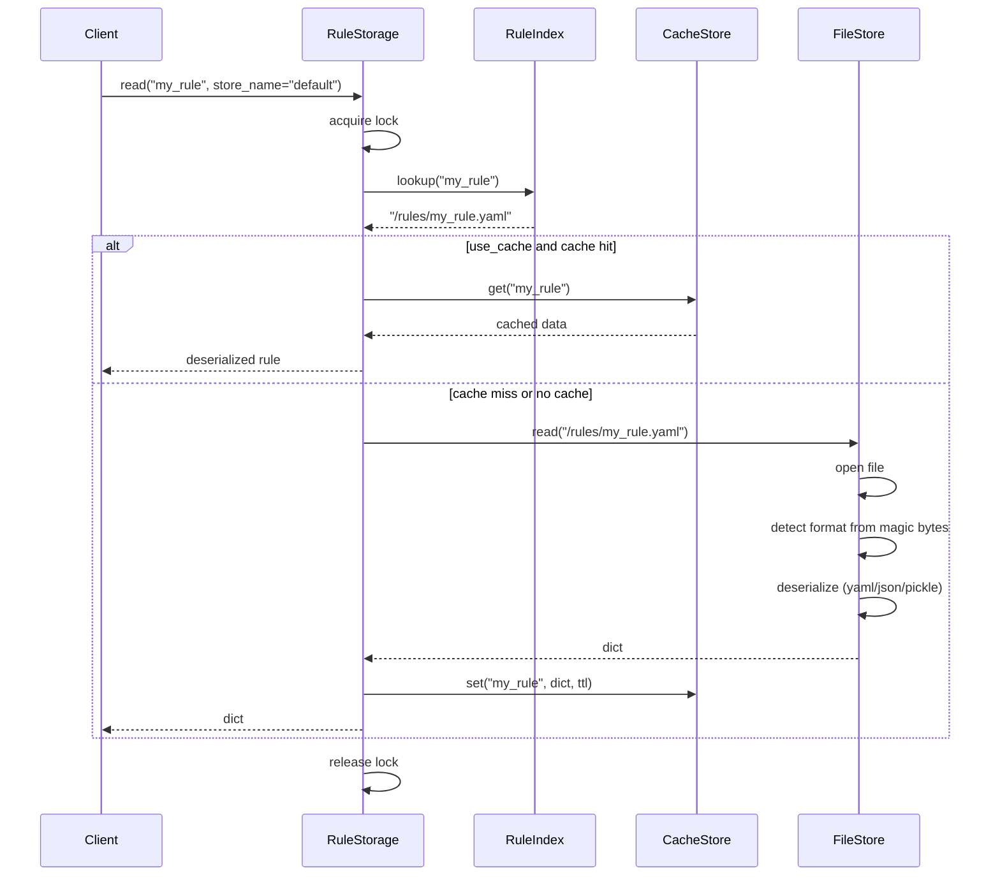

### Read Strategy Decision Tree

```mermaid
flowchart TB
    START[read(name)] --> CHECK{Exists in index?}
    CHECK -->|no| ERROR[Raise FileNotFoundError]
    CHECK -->|yes| PATH[Get path from index]
    PATH --> CACHE{use_cache enabled?}
    CACHE -->|yes| HIT{Cache hit?}
    HIT -->|yes, fresh| RETURN_CACHE[Return cached value]
    HIT -->|miss/expired| READ_FS
    CACHE -->|no| READ_FS[FileStore.read]
    READ_FS --> DESER[Deserialize raw bytes]
    DESER --> CACHE_STORE[CacheStore.set]
    CACHE_STORE --> RETURN[Return parsed rule]
```

## 2. Write Flow

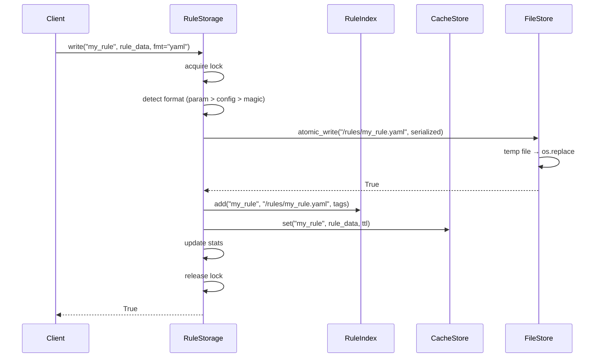

### Write Strategy Decision Tree

```mermaid
flowchart TB
    START[write(name, data)] --> EXISTS{Already exists?}
    EXISTS -->|yes| OVERWRITE{Overwrite allowed?}
    OVERWRITE -->|no| ERROR[Raise or skip]
    OVERWRITE -->|yes| PROCEED
    EXISTS -->|no| PROCEED

    PROCEED --> FMT{Format specified?}
    FMT -->|yes| USE_FMT[Use specified format]
    FMT -->|none| CONFIG_FMT[Use config.default_format]
    CONFIG_FMT -->|yaml| YAML
    CONFIG_FMT -->|json| JSON
    CONFIG_FMT -->|pickle| PICKLE

    USE_FMT --> YAML[yaml.dump]
    USE_FMT --> JSON[json.dumps]
    USE_FMT --> PICKLE[pickle.dumps]

    YAML --> WRITE[Write serialized bytes]
    JSON --> WRITE
    PICKLE --> WRITE

    WRITE --> ATOMIC{atomic_writes?}
    ATOMIC -->|yes| TMP[Write to .tmp file]
    TMP --> RENAME[os.replace → target]
    ATOMIC -->|no| DIRECT[Write directly to path]
    DIRECT --> DONE[Done]
    RENAME --> DONE
    DONE --> INDEX[Update RuleIndex]
    INDEX --> CACHE[Update CacheStore]
    CACHE --> RETURN[Return True]
```

## 3. Delete Flow

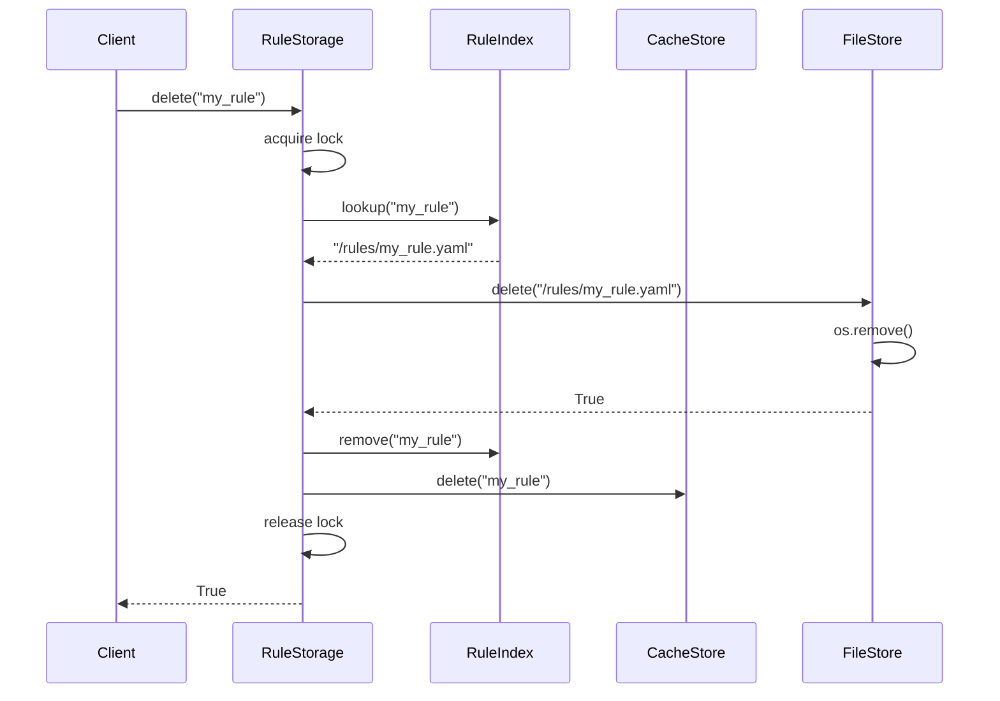

## 4. Search Flow

```mermaid
flowchart TB
    START[search(pattern)] --> INDEX[Get all names from index]
    INDEX --> FILTER[For each name: re.search(pattern, name)]
    FILTER --> MATCHES[Collect matching names]
    MATCHES --> RESOLVE[For each match: get path from index]
    RESOLVE --> READ[For each path: FileStore.read]
    READ --> DESER[Deserialize]
    DESER --> COLLECT[Collect into list]
    COLLECT --> RETURN[List[dict]]

    note right of INDEX: Uses re.search, not fnmatch<br/>Pattern "trans.*" matches "transform_rule"
```

## 5. Cache Flow

### Get-or-Compute

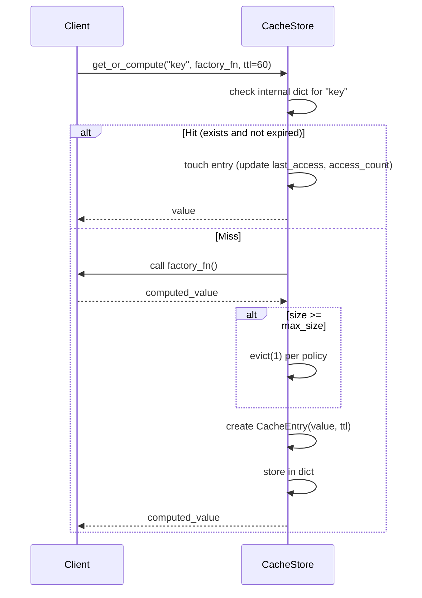

### Eviction Flow

```mermaid
flowchart TB
    TRIGGER{Eviction trigger}
    TRIGGER -->|set() when size >= max_size| EVICT[evict(count)]
    TRIGGER -->|explicit evict(n)| EVICT
    TRIGGER -->|cleanup()| CLEANUP[Remove expired entries only]

    EVICT --> POLICY{Eviction Policy}
    POLICY -->|LRU| LRU[Sort by last_access ascending]
    POLICY -->|LFU| LFU[Sort by access_count ascending]
    POLICY -->|FIFO| FIFO[Sort by created_at ascending]

    LRU --> REMOVE[Remove first N entries]
    LFU --> REMOVE
    FIFO --> REMOVE
    REMOVE --> UPDATE[Update size]
    UPDATE --> DONE[Return number evicted]
```

### Cleanup Flow

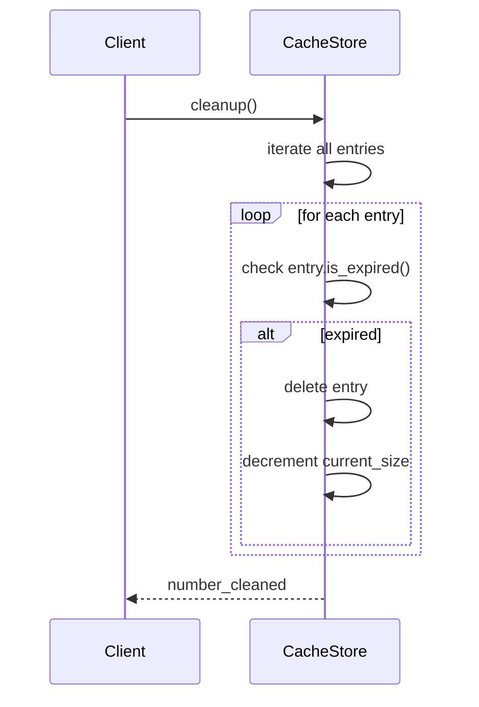

## 6. Backup Flow

### Create Backup

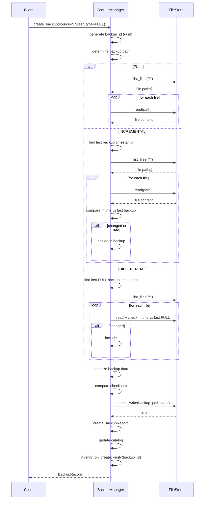

### Restore Backup

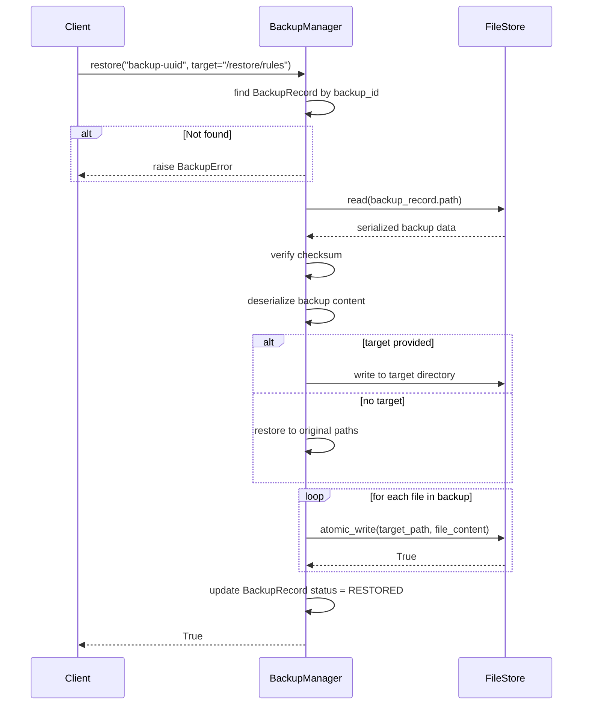

### Prune Flow

```mermaid
flowchart TB
    PRUNE[prune()] --> GROUP[Group backups by source]
    GROUP --> FILTER[For each source: apply retention policy]

    FILTER --> FULL_KEEP[Keep n most recent FULL]
    FULL_KEEP --> INC_KEEP[Keep m most recent INCREMENTAL]
    INC_KEEP --> DIFF_KEEP[Keep p most recent DIFFERENTIAL]
    DIFF_KEEP --> AGE[Remove backups older than max_age_days]
    AGE --> DELETE[Delete remaining backups]
    DELETE --> UPDATE_CAT[Update catalog]
    UPDATE_CAT --> RETURN[Return count deleted]
```

## 7. Migration Flow

### Run Migrations

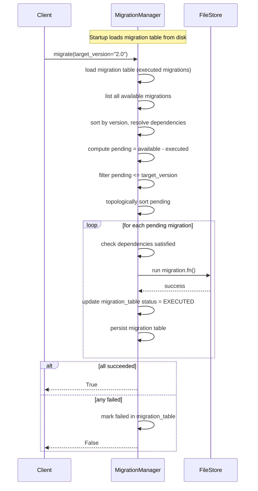

### Rollback Flow

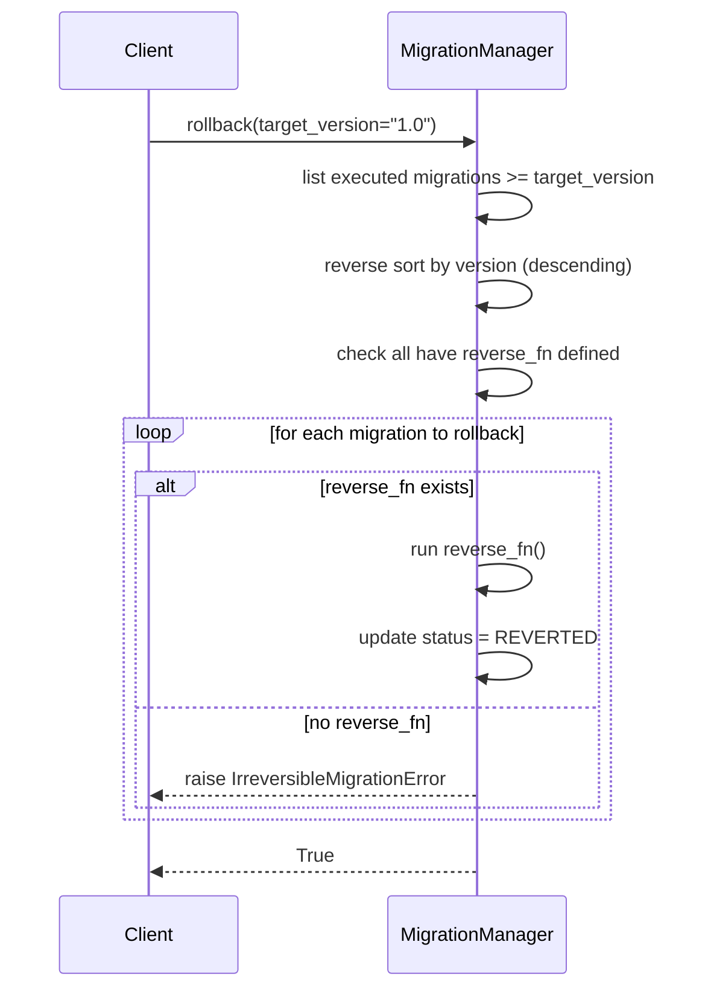

### Dry Run

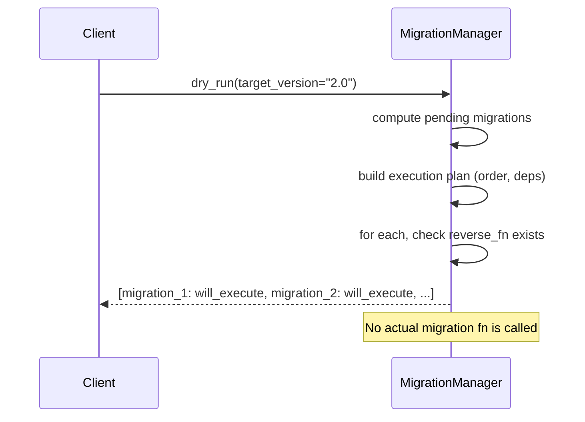

## 8. RuleStorage Stats Flow

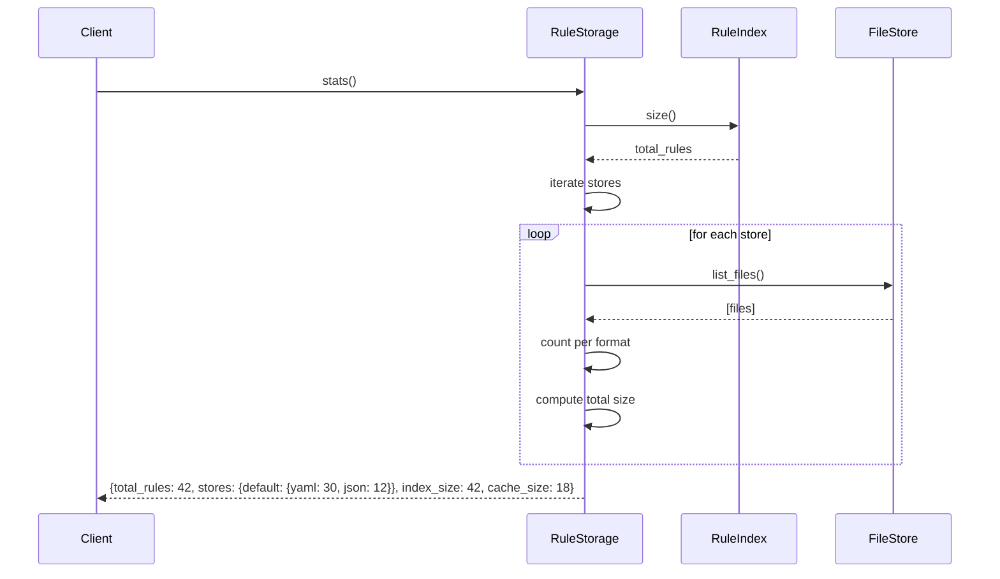

## 9. Full Lifecycle: Rule Write with Backup

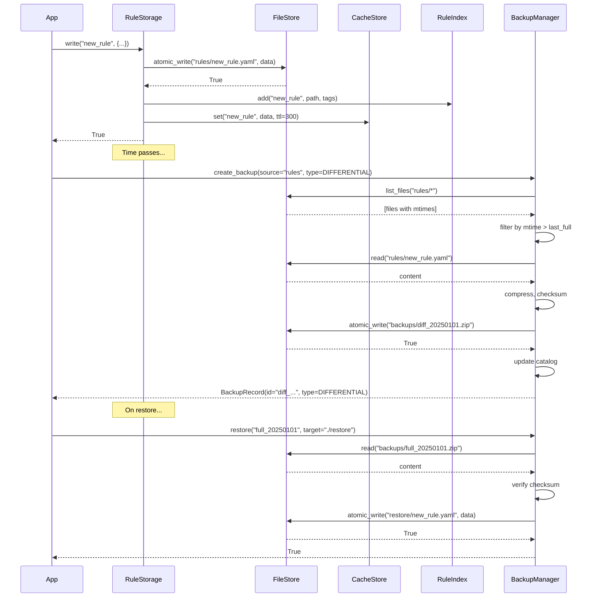

## 10. Pipeline: Migrate After Write

```mermaid
flowchart TB
    WRITE[write() detects schema version mismatch] --> MIGRATE[call migration_manager.migrate()]
    MIGRATE --> LOAD_MIG[load migration files]
    LOAD_MIG --> SORT[sort by version]
    SORT --> EXEC[execute pending]
    EXEC --> MARK[mark as EXECUTED]
    MARK --> WRITE_RETRY[retry write with new schema]
    WRITE_RETRY --> SUCCESS[write succeeds]
```

## 11. Error Recovery Flows

### Atomic Write Failure Recovery

```mermaid
flowchart TB
    WRITE[atomic_write start] --> TMP[Write to .tmp file]
    TMP --> CRASH{System crash?}
    CRASH -->|during tmp write| RECOVER[On restart: clean stale .tmp files]
    RECOVER --> RETRY[Next write proceeds normally]
    CRASH -->|during os.replace| PARTIAL[Target file is intact \n(old version preserved)]
    PARTIAL --> RETRY2[Next write retries]
    TMP -->|success| RENAME[os.replace]
    RENAME -->|success| DONE[Done]
```

### Cache Corruption Recovery

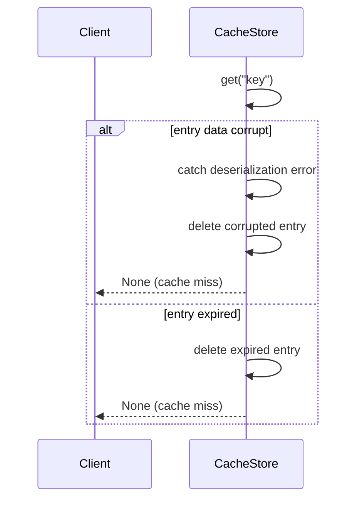

### Backup Verification Failure

```mermaid
sequenceDiagram
    participant Client
    participant BK as BackupManager
    participant FS as FileStore

    Client->>BK: verify("backup-uuid")
    BK->>FS: read(backup_record.path)
    FS-->>BK: serialized data
    BK->>BK: compute checksum of data
    BK->>BK: compare with stored checksum
    alt Match
        BK-->>Client: True
    else Mismatch
        BK->>BK: update status = CORRUPTED
        BK-->>Client: False
    end
```
