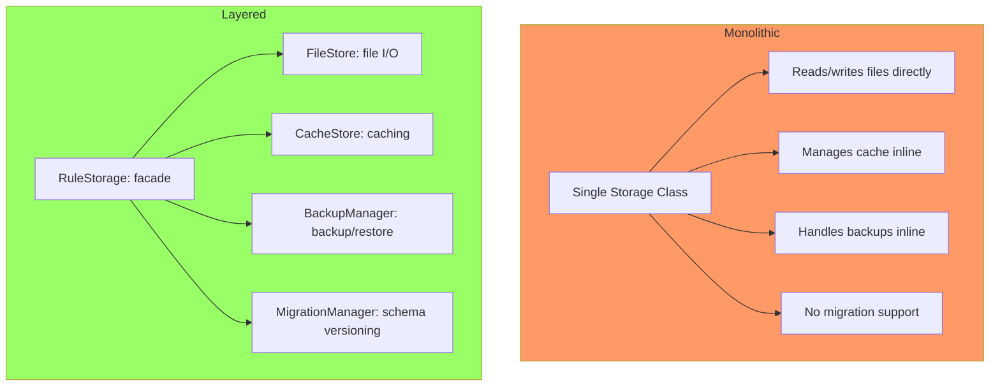
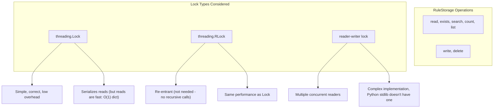
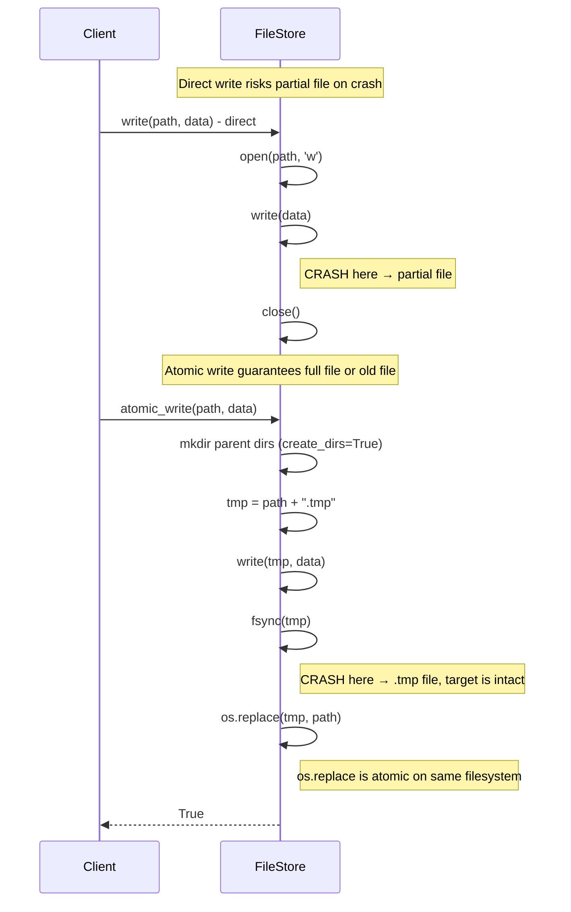
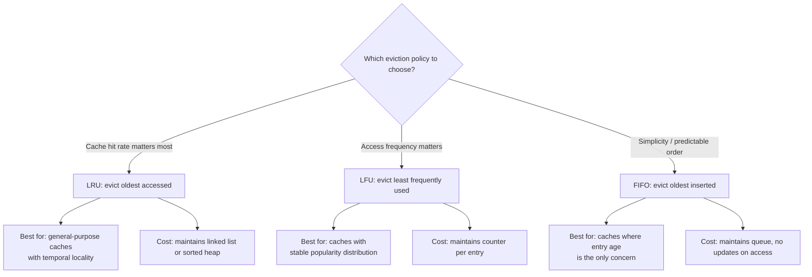
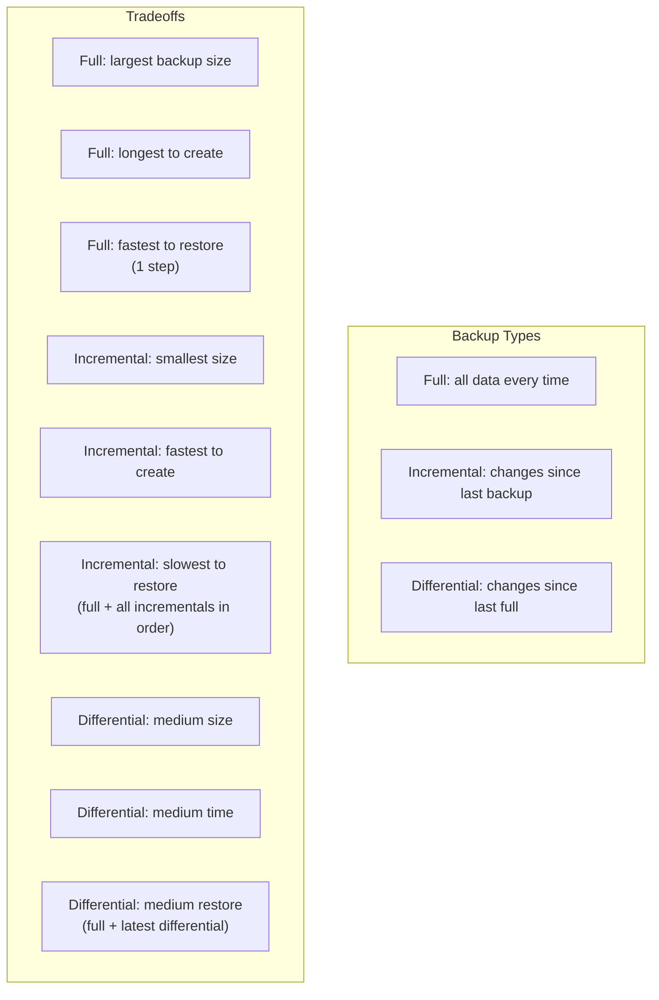
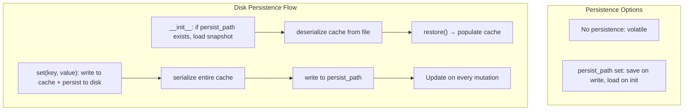
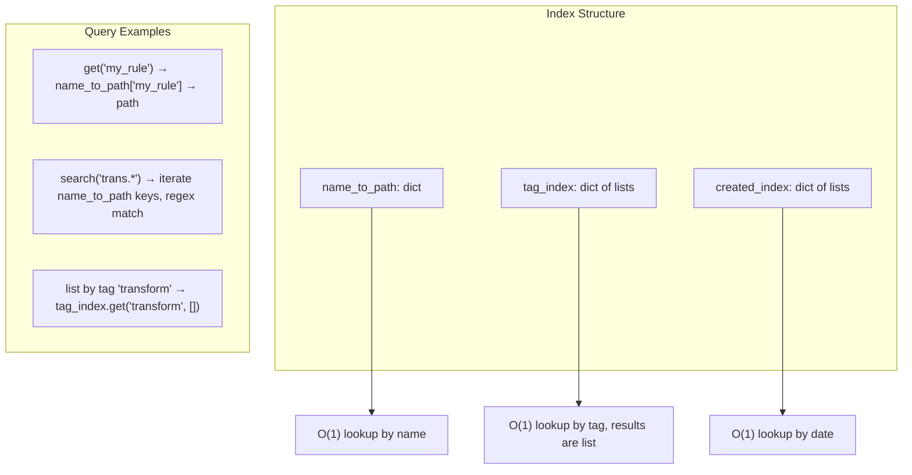
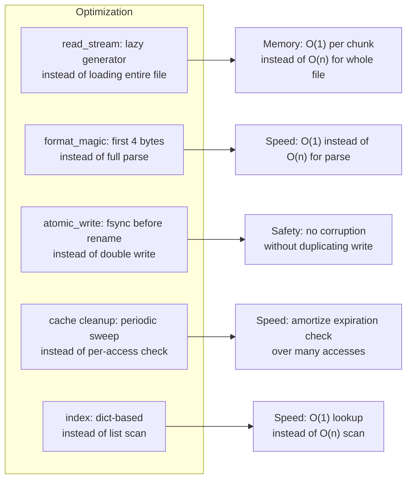
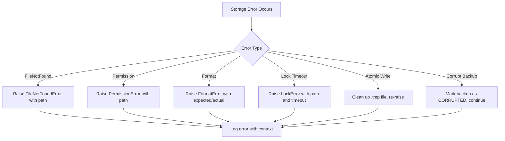

# Storage Module — Reasoning

## 1. Layered Architecture Decision



**Decision:** Layered architecture chosen because:

1. **Separation of concerns** — File I/O, caching, backup, and migration are distinct responsibilities. Mixing them into one class would violate the Single Responsibility Principle.
2. **Independent testability** — Each layer can be tested with mocked dependencies. `FileStore` tests don't need cache setup. `CacheStore` tests don't need filesystem access.
3. **Swappable backends** — `CacheStore` could be backed by Redis or Memcached without changing `RuleStorage`. `FileStore` could be backed by S3 without changing backup logic.
4. **Graceful degradation** — If `CacheStore` fails, `RuleStorage` can still read from `FileStore`. If `BackupManager` is busy, writes still proceed.

## 2. Why RuleStorage Uses a Lock (Not Read/Write Locks)



**Decision:** A single `threading.Lock` is sufficient because:

1. RuleStorage operations are fast (dict lookups, path resolution). The lock is held for microseconds, not milliseconds.
2. The index is small (thousands of entries at most — dict operations are O(1)).
3. A reader-writer lock would add complexity without measurable benefit given the operation speed.

## 3. Atomic Write Design



**Why os.replace() is atomic:**

On Windows, `os.replace()` maps to `MoveFileEx` with `MOVEFILE_REPLACE_EXISTING`, which is guaranteed atomic on the same volume. On POSIX, `rename()` is atomic. This means readers always see either the old file or the new file — never a partially written state.

**Why fsync() is called:**

Without `fsync()`, the write can be cached in the OS buffer and not yet flushed to disk. A power failure after `os.replace()` but before the buffer flush would lose the data. `fsync()` forces the buffer to disk before the rename.

**Why .tmp extension:**

The `.tmp` suffix allows recovery — on startup, stale `.tmp` files can be detected and cleaned up. They can be safely deleted because the target file (if it exists) is guaranteed complete.

## 4. Cache Eviction Policy Selection



**Decision rationale for LRU as default:**

- **LRU** works well for most workloads because of temporal locality (recently accessed items are likely to be accessed again).
- **LFU** can suffer from "cache pollution" — a one-time popular item stays in cache forever.
- **FIFO** is the simplest but has the worst hit rate because it doesn't consider access patterns at all.

The policy is configurable so the consumer can choose based on their specific access pattern.

## 5. Backup Strategy Selection



**Decision:** Support all three types because:

1. **Full backups** are the foundation. They are the restore baseline.
2. **Incremental backups** minimize storage and creation time. Best for frequent backups (e.g., hourly).
3. **Differential backups** trade off between storage and restore speed. Best for daily backups.

The `BackupPolicy` controls retention separately for each type.

## 6. Retention Policy Design

```mermaid
flowchart TB
    POLICY[BackupPolicy]
    POLICY --> KEEP_FULL[keep_full: 5]
    POLICY --> KEEP_INC[keep_incremental: 20]
    POLICY --> KEEP_DIFF[keep_differential: 10]
    POLICY --> MAX_AGE[max_age_days: 90]

    subgraph Pruning Logic
        prune[prune()] --> GROUP[Group by source]
        GROUP --> SORT[Sort by timestamp descending]
        SORT --> LIMIT_FULL["Keep first keep_full FULL"]
        SORT --> LIMIT_INC["Keep first keep_incremental INC"]
        SORT --> LIMIT_DIFF["Keep first keep_differential DIFF"]
        LIMIT_FULL --> AGE_CHECK["Remove if age > max_age_days (even within limit)"]
        LIMIT_INC --> AGE_CHECK
        LIMIT_DIFF --> AGE_CHECK
        AGE_CHECK --> DELETE[Delete remaining]
    end
```

**Why separate retention per backup type:**

- Full backups are expensive to create, so they're kept longer (5 most recent).
- Incremental backups are cheap but depend on the full backup, so they're kept in larger quantity (20 most recent).
- Differential backups are a middle ground (10 most recent).
- The max_age_days acts as a hard cutoff — even a full backup within the keep limit can be deleted if it's too old.

## 7. Migration Dependency Resolution

```mermaid
flowchart TB
    MIGRATIONS[Migration definitions]
    MIGRATIONS --> M1[migration_1: version 1.0]
    MIGRATIONS --> M2[migration_2: version 2.0, depends on 1.0]
    MIGRATIONS --> M3[migration_3: version 1.5, depends on 1.0]
    MIGRATIONS --> M4[migration_4: version 3.0, depends on 2.0 and 1.5]

    subgraph Dependency Graph
        M1 --> M3
        M1 --> M2
        M3 --> M4
        M2 --> M4
    end

    subgraph Topological Sort (ascending)
        TS1["1. M1 (no deps)"]
        TS2["2. M2 (dep M1 satisfied)"]
        TS3["3. M3 (dep M1 satisfied)"]
        TS4["4. M4 (deps M2, M3 satisfied)"]
    end

    subgraph Circular Detection
        C1[A --> B]
        C2[B --> C]
        C3[C --> A]
        C4[DFS detects cycle → raise CircularDependencyError]
    end
```

**Decision:** Migrations are topologically sorted by dependency before execution. This ensures:

1. Dependencies are always executed before their dependents.
2. Circular dependencies are detected early via DFS and raise an error.
3. Partial ordering is resolved automatically — the consumer doesn't need to specify the order.

## 8. Why FileLock Instead of Database Lock

```mermaid
flowchart TB
    subgraph FileLock
        FL1[Lock file on disk: path.lock]
        FL2[O_CREAT | O_EXCL for atomic creation]
        FL3[Timeout-based acquisition]
        FL4[Cross-process safe]
        FL5[No dependency on external services]
    end

    subgraph Database Lock (e.g., Redis, PostgreSQL)
        DL1["SELECT ... FOR UPDATE"]
        DL2["Redis SETNX"]
        DL3[Requires running database service]
        DL4[Network overhead per lock/unlock]
    end

    FL1 --> CONSIDER{Which to use?}
    DL1 --> CONSIDER
    CONSIDER -->|No external services needed| CHOOSE_FILE[Choose FileLock]
    CONSIDER -->|High-concurrency distributed| CHOOSE_DB[Choose Database Lock]
```

**Decision:** FileLock was chosen as the default because:

1. The Storage module targets local file-based storage. Adding a database dependency for locking would contradict the module's purpose.
2. The lock timeout mechanism prevents deadlocks even if a process crashes while holding the lock.
3. For distributed deployments, a separate distributed lock adapter can be injected.

## 9. Format Detection Design

```mermaid
flowchart TB
    MAGIC[format_magic(data bytes)]
    MAGIC --> FIRST[Check first 4 bytes]

    FIRST -->|b'---' or b'%YAML'| YAML[Return YAML]
    FIRST -->|b'{' or whitespace + b'{'| JSON[Return JSON]
    FIRST -->|b'[' or whitespace + b'['| JSON[Return JSON]
    FIRST -->|b'\\x80'| PICKLE[Return PICKLE - protocol 0]
    FIRST -->|b'\\x85'| PICKLE2[Return PICKLE - protocol 1+]
    FIRST -->|otherwise| UNKNOWN[Return UNKNOWN - try parse anyway]
```

**Why magic bytes instead of file extension:**

File extensions can be misleading (e.g., `data.yaml` might contain JSON). Magic bytes detect the actual format regardless of extension. This is particularly important when:

- Reading files from archives or streams where extension is missing
- Handling files created by external tools that may use non-standard extensions
- Detecting format in the `read_stream()` path where the file hasn't been named yet

## 10. CacheStore Persistence Design



**Decision:** Optional disk persistence trades write performance for durability.

- **Without persistence:** Cache is rebuilt on restart (warm-up cost).
- **With persistence:** Cache survives restarts but every write becomes 2x more expensive (memory + disk).

The default is no persistence because:
1. Cache data is a performance optimization, not the source of truth.
2. The source of truth is the FileStore.
3. Disk persistence is useful for large caches that are expensive to recompute.

## 11. Index Design



**Why three separate indexes instead of one universal index:**

- **name_to_path** — The primary key for direct access. Must be O(1).
- **tag_index** — Secondary index for filtering. A dict of lists handles the one-to-many relationship naturally.
- **created_index** — Secondary index for time-based queries. Grouping by date strings enables efficient date-range queries.

The indexes are updated atomically inside the `RuleStorage` lock, ensuring consistency.

## 12. Migration Reversibility

```mermaid
flowchart TB
    MIGRATION[Migration Definition] --> FN{Has reverse_fn?}
    FN -->|yes| REVERSIBLE[Mark as reversible]
    FN -->|no| IRREVERSIBLE[Mark as irreversible]

    ROLLBACK[rollback() called] --> CHECK_IRR{Any irreversible in range?}
    CHECK_IRR -->|yes| ERROR[Raise IrreversibleMigrationError]
    CHECK_IRR -->|no| PROCEED[Run reverse functions in reverse order]

    subgraph Example
        EX1["migration_1: fn=add_column, reverse_fn=drop_column ✓"]
        EX2["migration_2: fn=transform_data, reverse_fn=None ✗"]
        EX3["rollback to 1.0 fails because migration_2 has no reverse"]
    end
```

**Decision:** `reverse_fn` is optional because some migrations cannot be reversed (e.g., data destruction, external API calls). The `dry_run()` method checks for irreversibility before execution, allowing the consumer to decide whether to proceed.

## 13. Performance Optimizations



## 14. Error Handling Philosophy



**Decision:** All storage errors include contextual information (path, format, timeout) to aid debugging. The module never silently swallows errors — every failure is logged and propagated to the caller.

The one exception is backup verification: a corrupt backup is marked as `CORRUPTED` rather than raising an error, allowing other operations to continue while the corruption is investigated.
