# Storage Module — Integration

## 1. Integration Overview

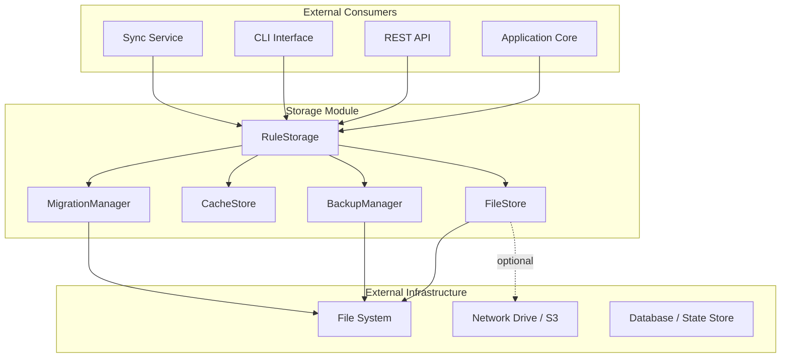

## 2. Integration with Skills Module

The Skills module consumes the Storage module for persisting and retrieving skill definitions.

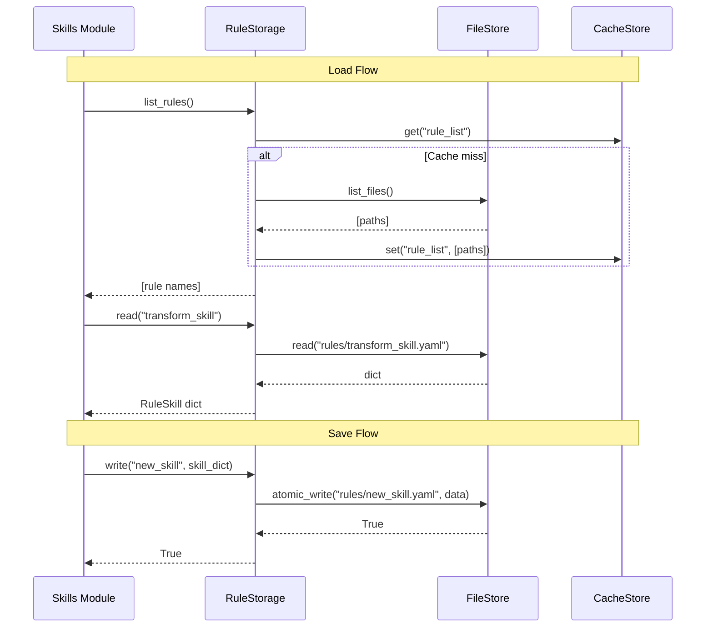

### Integration Points

| Skills Module | Storage Module | Operation |
|---|---|---|
| `SkillLoader.load(dir)` | `RuleStorage.list_rules()` | Discover skill files |
| `SkillLoader.read()` | `RuleStorage.read()` | Load individual skill |
| `SkillLoader.reload()` | `RuleStorage.read(force=True)` | Skip cache, re-read from disk |
| `SkillLoader.hot_reload()` | `FileStore.stat()` | Check mtime for changes |
| `SkillRegistry.snapshot()` | `RuleStorage.write(snapshot)` | Persist registry state |
| `SkillRegistry.restore()` | `RuleStorage.read(snapshot)` | Load registry state |
| `SkillExecutor.cache` | `CacheStore.get/set` | Cache execution results |

## 3. Integration with Backup Service

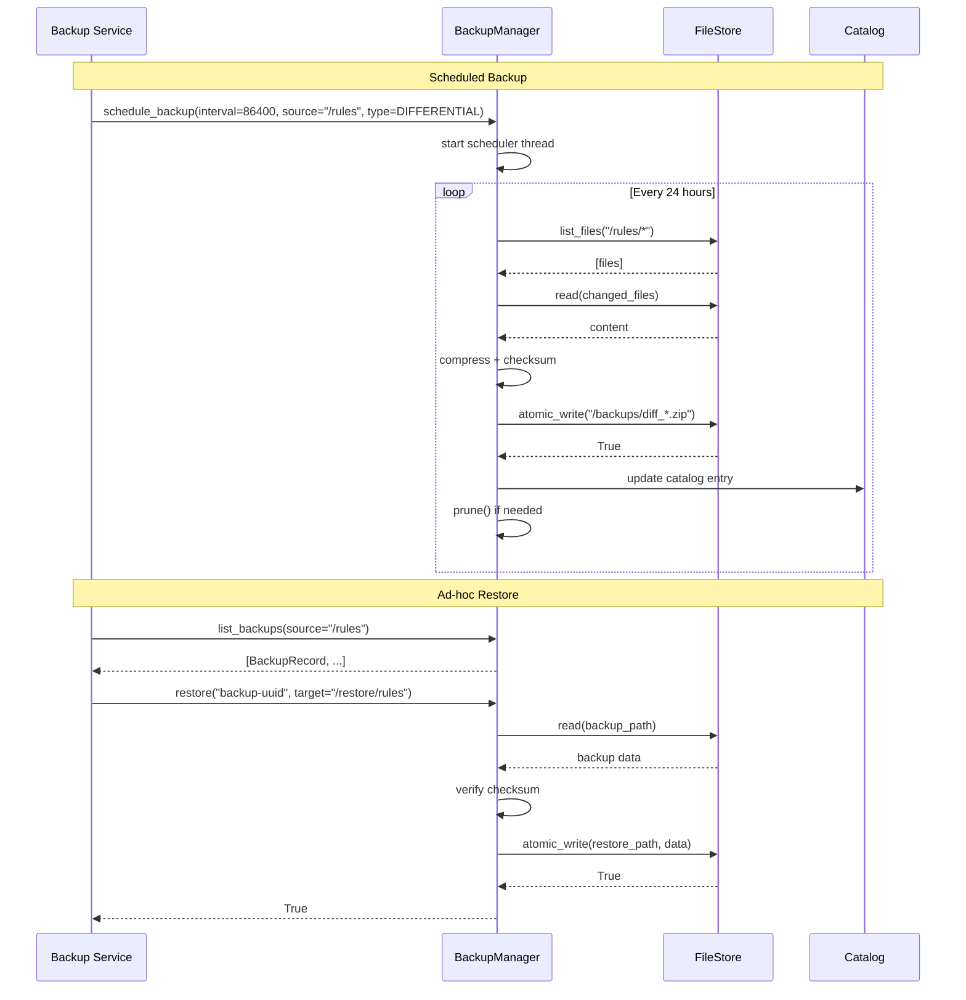

### Backup Integration Configuration

```yaml
backup:
  directory: "/data/backups"
  sources:
    - path: "/data/rules"
      type: DIFFERENTIAL
      schedule: "0 2 * * *"    # daily at 2am
      retention:
        keep_full: 5
        keep_incremental: 20
        keep_differential: 10
        max_age_days: 90
    - path: "/data/config"
      type: FULL
      schedule: "0 3 * * 0"    # weekly on Sunday
      retention:
        keep_full: 10
        max_age_days: 365
```

## 4. Integration with Migration Pipeline

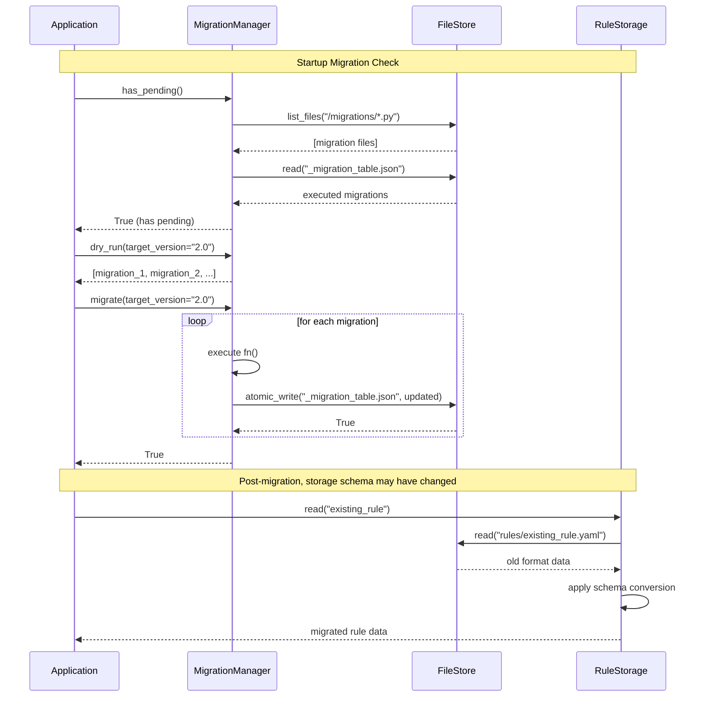

### Migration Script Template

```python
# migrations/001_add_version_field.py
def upgrade():
    # Load all rules, add "version": "1.0" if missing
    for rule_name in storage.list_rules():
        rule = storage.read(rule_name)
        if "version" not in rule:
            rule["version"] = "1.0"
        storage.write(rule_name, rule)

def downgrade():
    # Remove "version" field from all rules
    for rule_name in storage.list_rules():
        rule = storage.read(rule_name)
        rule.pop("version", None)
        storage.write(rule_name, rule)
```

## 5. Integration with REST API

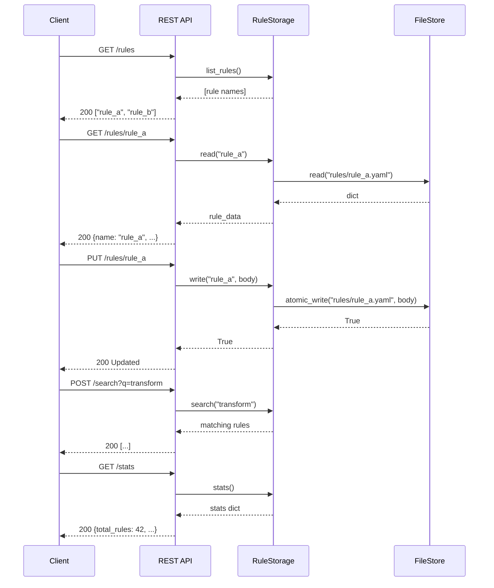

### API Endpoint Mapping

| HTTP Method | Endpoint | Module Call |
|---|---|---|
| `GET` | `/rules` | `RuleStorage.list_rules()` |
| `GET` | `/rules/{name}` | `RuleStorage.read(name)` |
| `PUT` | `/rules/{name}` | `RuleStorage.write(name, data)` |
| `DELETE` | `/rules/{name}` | `RuleStorage.delete(name)` |
| `GET` | `/rules/{name}/exists` | `RuleStorage.exists(name)` |
| `POST` | `/search` | `RuleStorage.search(pattern)` |
| `GET` | `/stats` | `RuleStorage.stats()` |
| `POST` | `/backup` | `BackupManager.create_backup()` |
| `GET` | `/backups` | `BackupManager.list_backups()` |
| `POST` | `/backups/{id}/restore` | `BackupManager.restore(id)` |
| `POST` | `/migrate` | `MigrationManager.migrate()` |
| `GET` | `/migrations` | `MigrationManager.status()` |
| `POST` | `/migrations/dry-run` | `MigrationManager.dry_run()` |

## 6. Integration with CLI

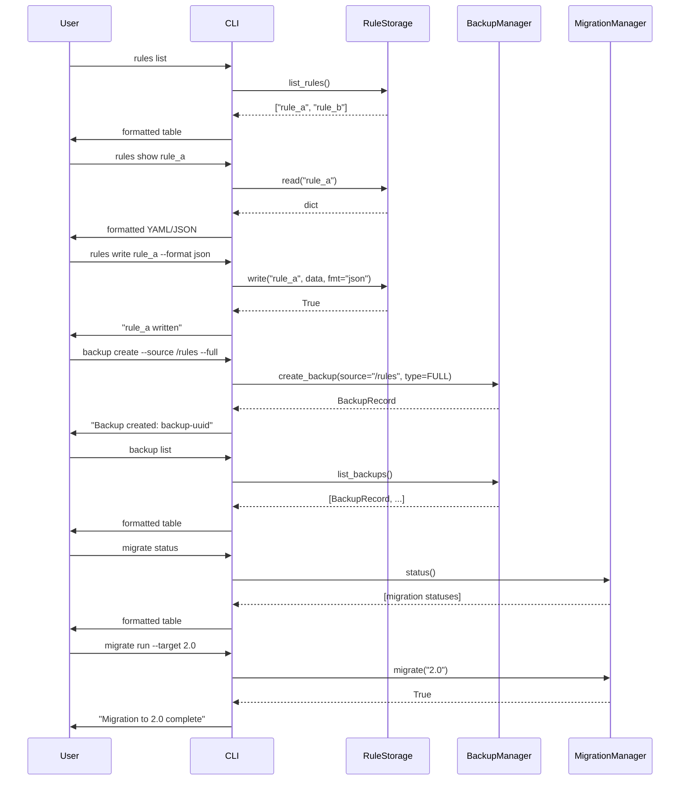

## 7. Integration with Cache Invalidation

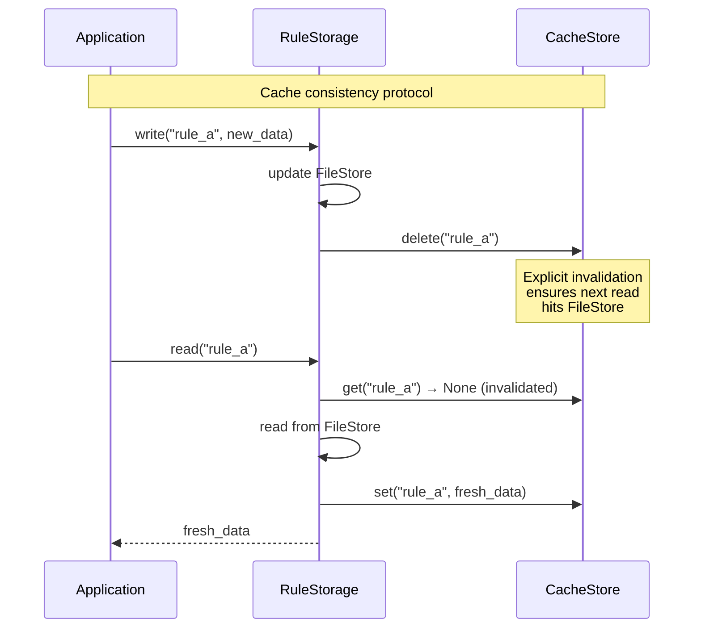

## 8. Integration with Monitoring

```mermaid
flowchart LR
    subgraph Storage Metrics
        RS[RuleStorage.stats()] --> M1[total_rules]
        RS --> M2[rules_per_format]
        RS --> M3[index_size]
        RS --> M4[cache_size]
        BK[BackupManager] --> M5[last_backup_time]
        BK --> M6[backup_count]
        BK --> M7[integrity_status]
        CS[CacheStore] --> M8[hit_rate]
        CS --> M9[eviction_count]
        CS --> M10[expired_count]
    end

    subgraph Monitoring Consumers
        PROM[Prometheus]
        GRAF[Grafana Dashboard]
        LOG[Structured Logs]
        ALERT[Alert Manager]
    end

    M1 --> PROM
    M2 --> PROM
    M5 --> ALERT
    M7 --> ALERT
    M8 --> GRAF
    M9 --> GRAF
    M10 --> GRAF
```

## 9. Integration Patterns

### Pattern 1: Read-Through Cache

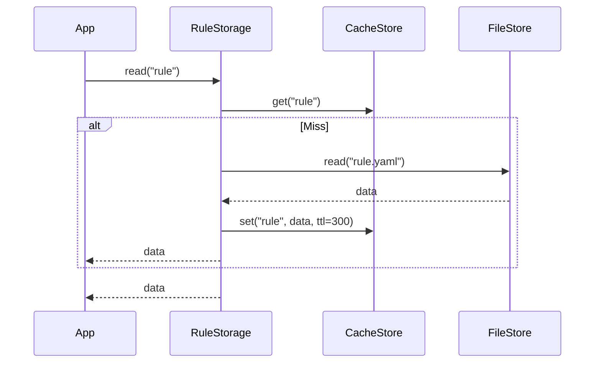

### Pattern 2: Write-Through Cache

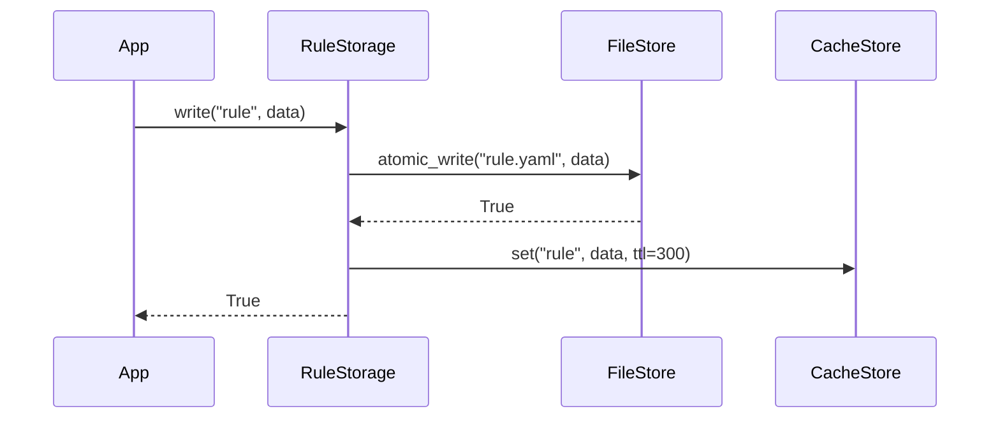

### Pattern 3: Write-Behind Cache (Async Persist)

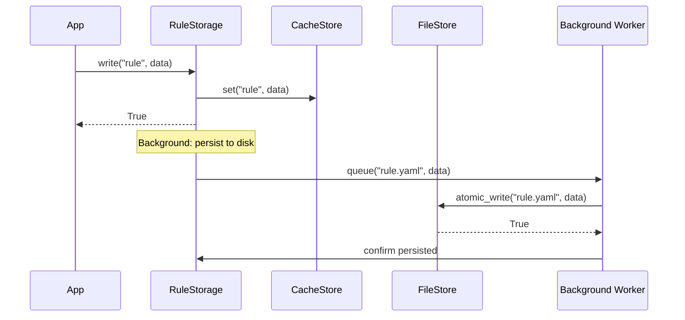

### Pattern 4: Versioned Migration

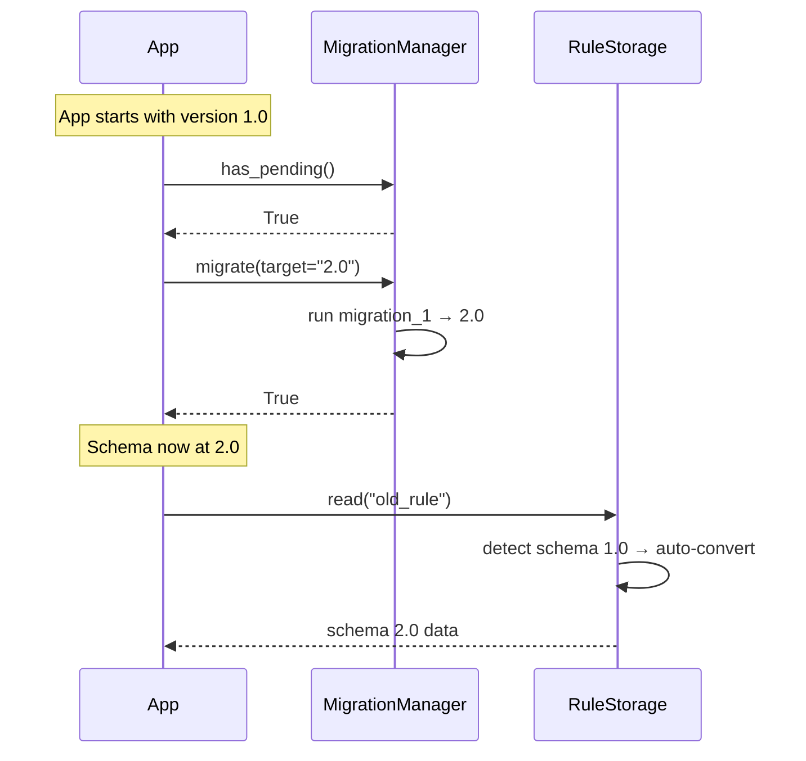

## 10. Configuration Integration

```yaml
# Main application config
storage:
  base_path: "/data/rules"
  default_format: "yaml"
  atomic_writes: true
  create_dirs: true
  cache:
    enabled: true
    max_size: 10000
    ttl: 300
    eviction_policy: "LRU"
  backup:
    enabled: true
    directory: "/data/backups"
    retention:
      keep_full: 5
      keep_incremental: 20
    schedule_interval: 3600
  migration:
    directory: "/data/migrations"
    auto_create: true
```

The Storage module reads this configuration on initialization. Each component (`FileStore`, `CacheStore`, `BackupManager`, `MigrationManager`) receives its relevant subset.
