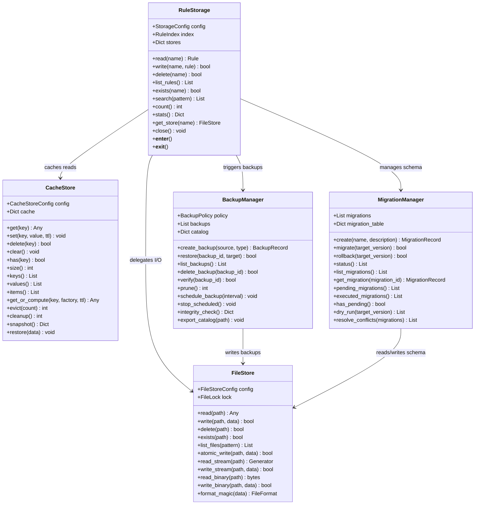
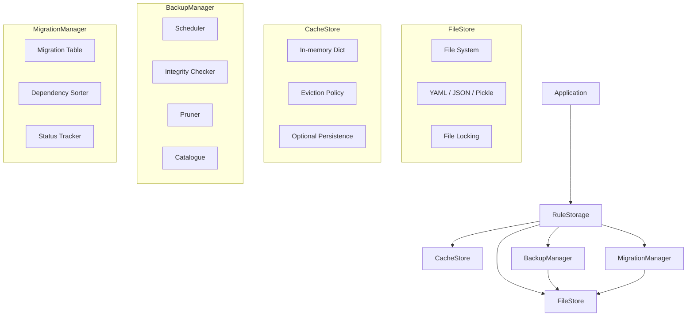
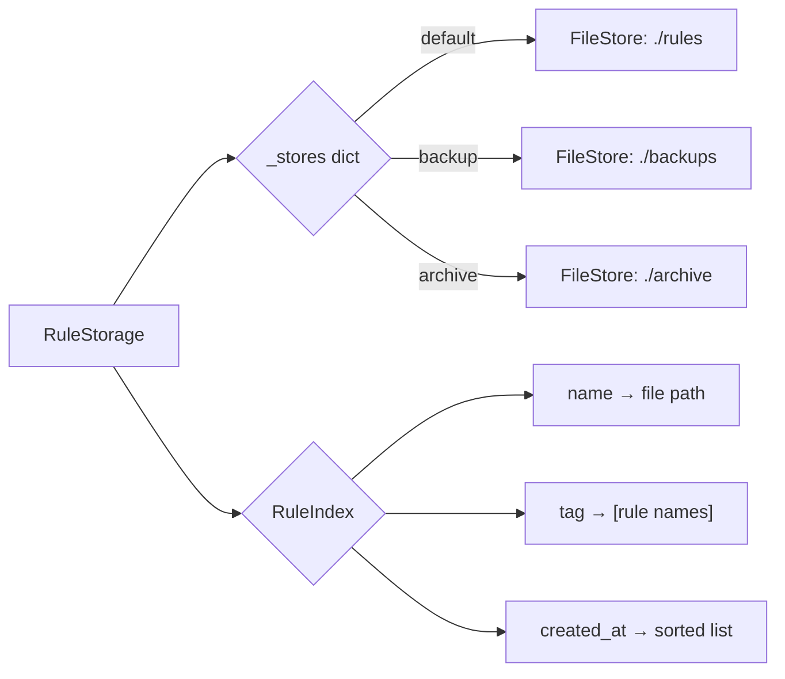
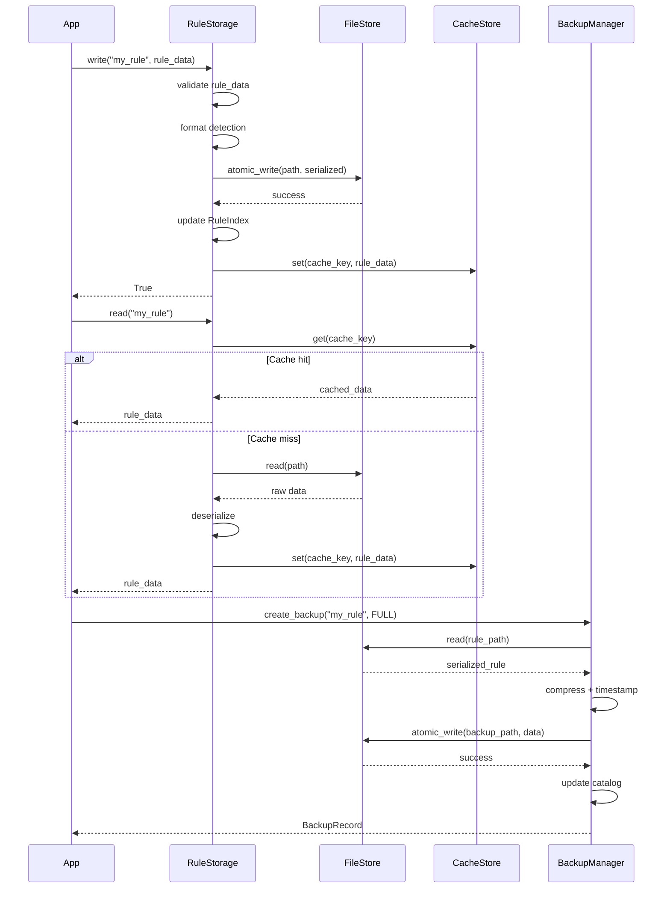
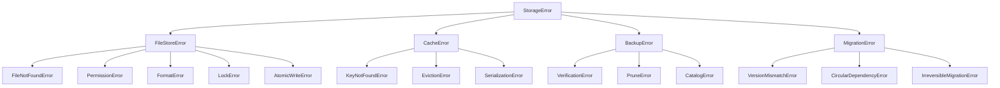

# Storage Module

## Overview

The Storage module provides a layered data persistence architecture for rules, cache entries, backups, and schema migrations. It consists of five components:

- **RuleStorage** — High-level facade that coordinates reading/writing rules. Handles format detection, index maintenance, and delegates to `FileStore` for raw I/O.
- **FileStore** — Low-level file I/O with atomic writes, file locking, format serialization (YAML, JSON, Pickle), and streaming for large files.
- **CacheStore** — In-memory cache with TTL-based expiration, LRU/LFU/FIFO eviction policies, and optional disk persistence.
- **BackupManager** — Scheduled and ad-hoc backup creation with versioning, pruning, integrity checks, and catalog management.
- **MigrationManager** — Schema migration engine with forward/reverse migrations, dependency ordering, status tracking, and dry-run mode.

## Class Diagram



## Component Hierarchy



## Store Delegation

`RuleStorage` can manage multiple `FileStore` instances, each associated with a named store. This enables multi-format, multi-path storage.



## API Reference

| Class | Method | Description |
|---|---|---|
| `RuleStorage` | `read(name)` | Read rule by name from default store |
| `RuleStorage` | `write(name, rule)` | Write rule, auto-serialize, update index |
| `RuleStorage` | `search(pattern)` | Pattern match rule names (RE search) |
| `RuleStorage` | `stats()` | Total rules, per-format counts, index size |
| `FileStore` | `atomic_write(path, data)` | Write with temp file + rename |
| `FileStore` | `read_stream(path)` | Lazy line-by-line generator |
| `FileStore` | `format_magic(data)` | Detect format from magic bytes |
| `CacheStore` | `get_or_compute(key, fn, ttl)` | Get or call factory to populate |
| `CacheStore` | `evict(count)` | Evict N entries per policy (LRU/LFU/FIFO) |
| `BackupManager` | `create_backup(source, type)` | Create full/incremental/differential backup |
| `BackupManager` | `prune()` | Remove old backups per retention policy |
| `MigrationManager` | `migrate(target_version)` | Run pending migrations in order |
| `MigrationManager` | `rollback(target_version)` | Reverse applied migrations |
| `MigrationManager` | `dry_run(target_version)` | Preview migrations without executing |

## Data Flow



## Storage Formats

| Format | Extension | Serialization | Magic Bytes |
|---|---|---|---|
| YAML | `.yaml`, `.yml` | `yaml.dump/load` | `%YAML` or `---` |
| JSON | `.json` | `json.dumps/loads` | `{` or `[` |
| Pickle | `.pkl`, `.pickle` | `pickle.dump/load` | Python pickle protocol |

## Error Handling

All storage classes define their own exception types that extend `StorageError`:



## Performance Characteristics

| Operation | Time Complexity | Notes |
|---|---|---|
| `FileStore.read()` | O(s) | s = file size |
| `FileStore.atomic_write()` | O(s) | Write to tmp + rename |
| `FileStore.read_stream()` | O(1) per yield | Memory-efficient for large files |
| `CacheStore.get()` | O(1) | Dict lookup |
| `CacheStore.set()` | O(1) average | May trigger O(n) eviction |
| `CacheStore.evict(LRU)` | O(n log n) | Sort by access time |
| `CacheStore.evict(LFU)` | O(n log n) | Sort by access count |
| `CacheStore.cleanup()` | O(n) | Remove expired entries |
| `BackupManager.create_backup()` | O(s) | s = source size |
| `BackupManager.prune()` | O(n log n) | Sort by version/age |
| `MigrationManager.migrate()` | O(m × n) | m = migrations, n = dependencies |
| `RuleStorage.search()` | O(k) | k = number of rules (regex scan) |

## Configuration

```yaml
storage:
  default_format: "yaml"
  encoding: "utf-8"
  atomic_writes: true
  create_dirs: true

cache:
  backend: "memory"
  max_size: 1000
  eviction_policy: "LRU"
  default_ttl: 300
  persist_path: null

backup:
  directory: "./backups"
  retention:
    keep_full: 5
    keep_incremental: 20
    max_age_days: 90
  schedule_interval: 3600
  compression: true
  verify_on_create: true

migration:
  table_name: "_migrations"
  directory: "./migrations"
  auto_create: true
  dry_run: false
```
