# Tools Module — Architecture

## Component Architecture

The Tools module consists of five independent tools, each with its own configuration and output types. They are connected through shared data formats and can be composed in pipelines.

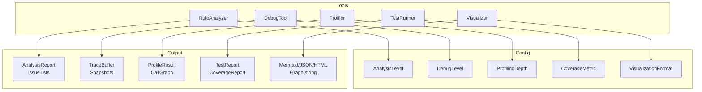

## RuleAnalyzer Architecture

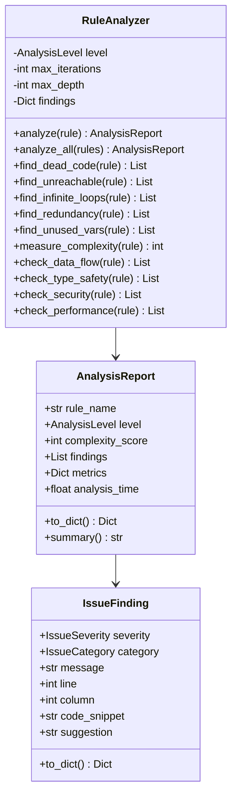

### Analysis Pipeline

```mermaid
flowchart TB
    RULE[Rule Definition] --> ANALYZE[analyze()]

    ANALYZE --> LEVEL{Analysis Level}

    LEVEL -->|BASIC| BASIC_CHECKS
    LEVEL -->|STANDARD| STD_CHECKS
    LEVEL -->|ADVANCED| ADV_CHECKS
    LEVEL -->|COMPREHENSIVE| ALL_CHECKS

    subgraph BASIC_CHECKS
        DC[find_dead_code]
        UR[find_unreachable]
        UV[find_unused_vars]
    end

    subgraph STD_CHECKS
        IL[find_infinite_loops]
        RD[find_redundancy]
        CX[measure_complexity]
    end

    subgraph ADV_CHECKS
        DF[check_data_flow]
        TS[check_type_safety]
    end

    subgraph ALL_CHECKS
        SC[check_security]
        PF[check_performance]
    end

    BASIC_CHECKS --> AGG
    STD_CHECKS --> AGG
    ADV_CHECKS --> AGG
    ALL_CHECKS --> AGG[aggregate findings]
    AGG --> REPORT[AnalysisReport]
```

## DebugTool Architecture

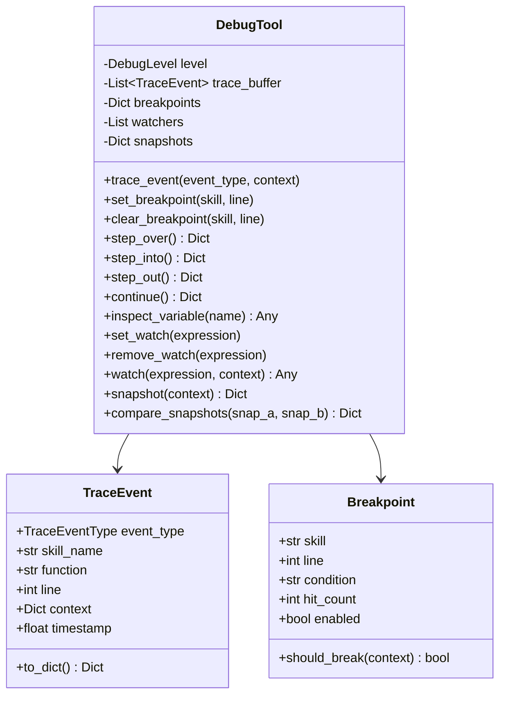

### Debug Architecture

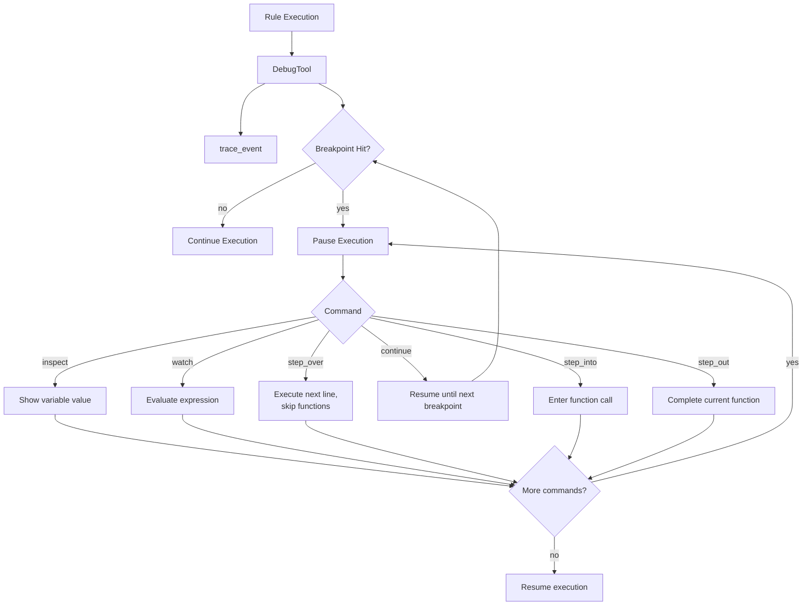

### Trace Buffer Architecture

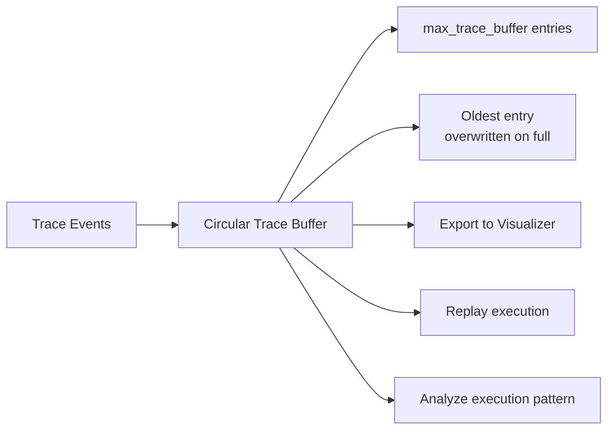

## Profiler Architecture

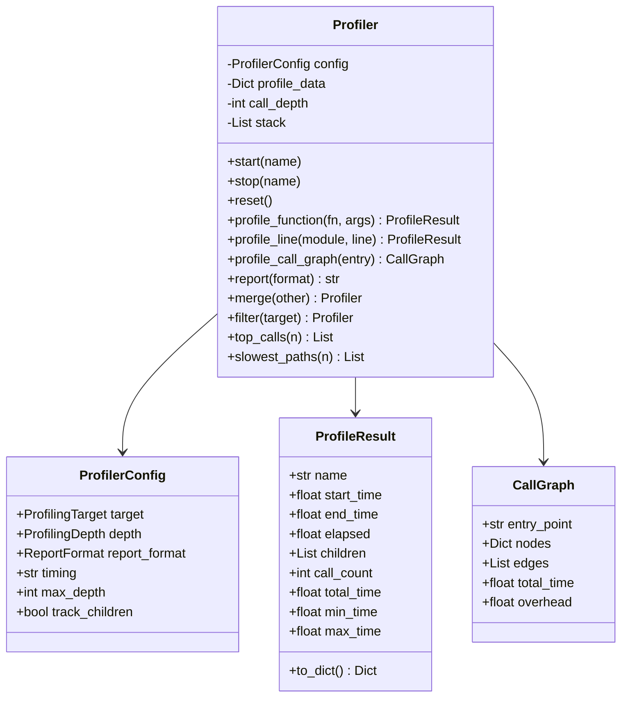

### Profiling Pipeline

```mermaid
flowchart TB
    START[start(name)] --> RECORD[Record start_time + stack push]
    RECORD --> EXEC[Execute code section]
    EXEC --> STOP[stop(name)]
    STOP --> COMPUTE[elapsed = end - start]
    COMPUTE --> AGG[Update: call_count, total_time, min/max]
    AGG --> PUSH[Append to profile_data[name]]
    PUSH --> PARENT{Has parent?}
    PARENT -->|yes| CHILD_ADD[Add to parent.children]
    PARENT -->|no| TOP[Top-level measurement]
    CHILD_ADD --> DONE
    TOP --> DONE

    subgraph Profile Data Structure
        D1["profile_data = { 'func_a': [ProfileResult, ...], 'func_b': [ProfileResult, ...] }"]
    end
```

### Call Graph Construction

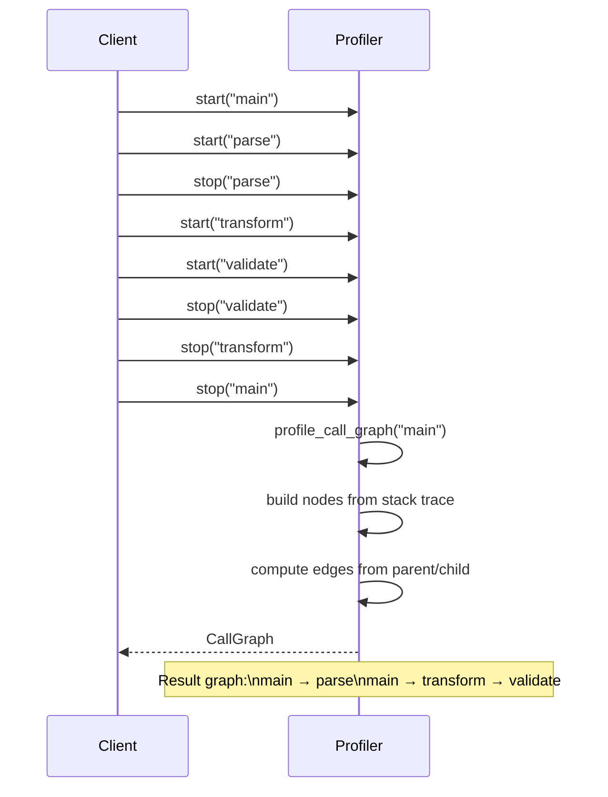

## TestRunner Architecture

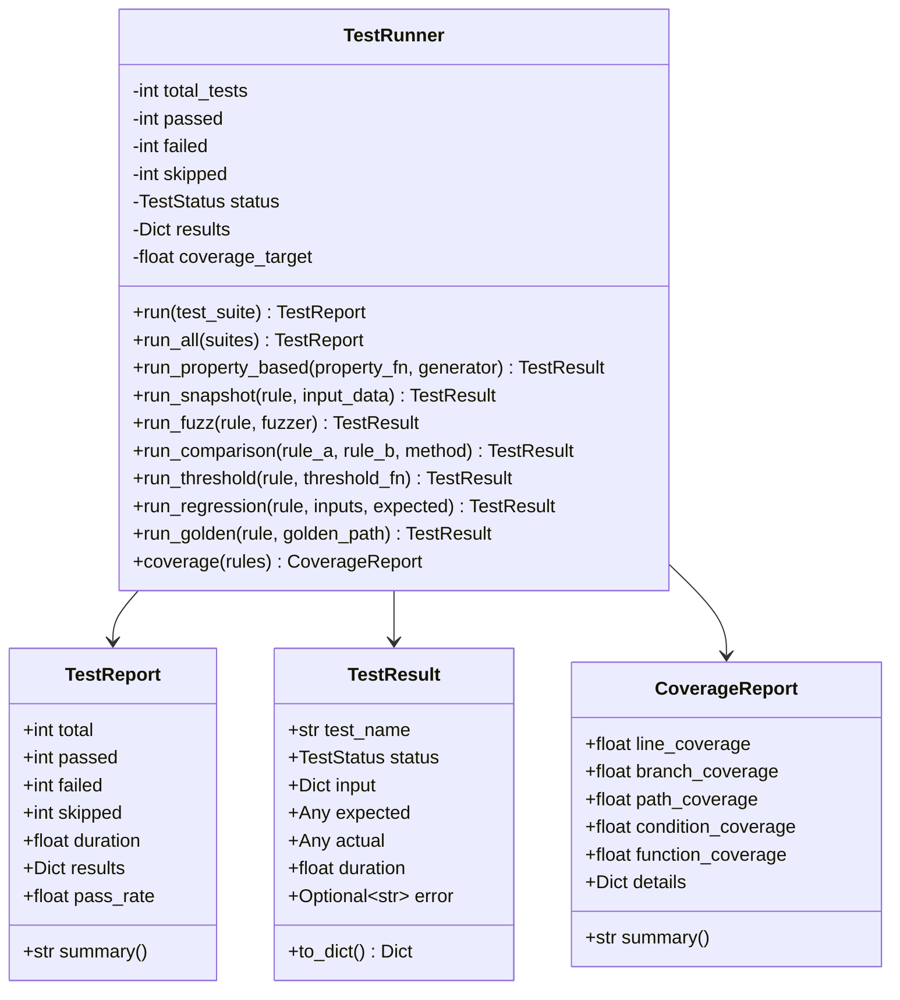

### Test Execution Pipeline

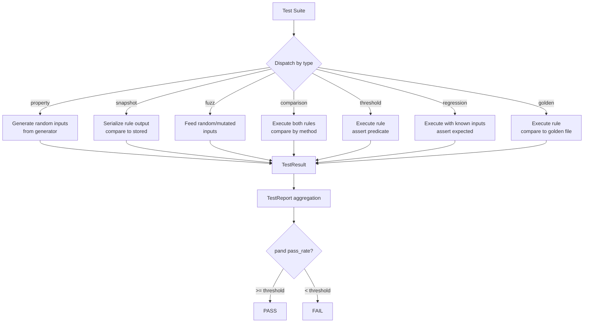

## Visualizer Architecture

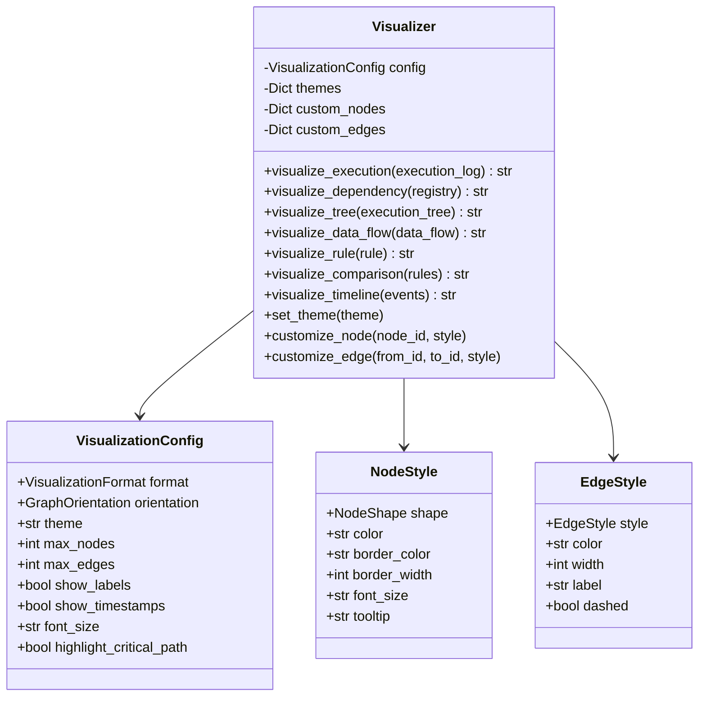

### Visualization Rendering Pipeline

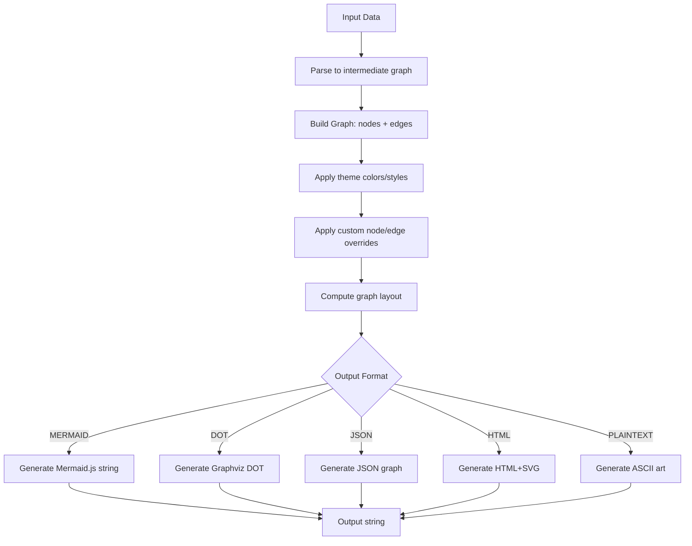

### Orientation Support

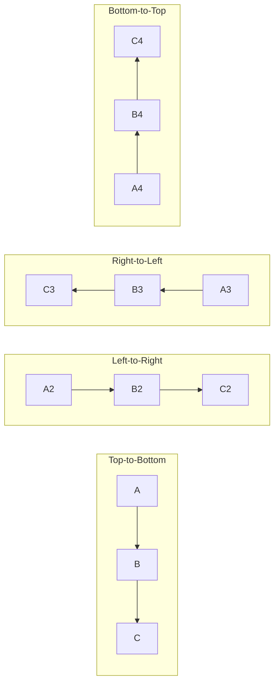

## Shared Data Types

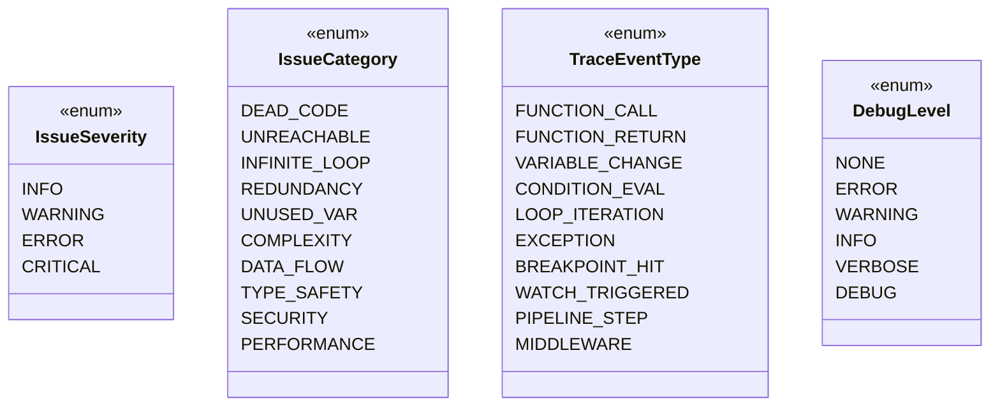

## Configuration Relationship

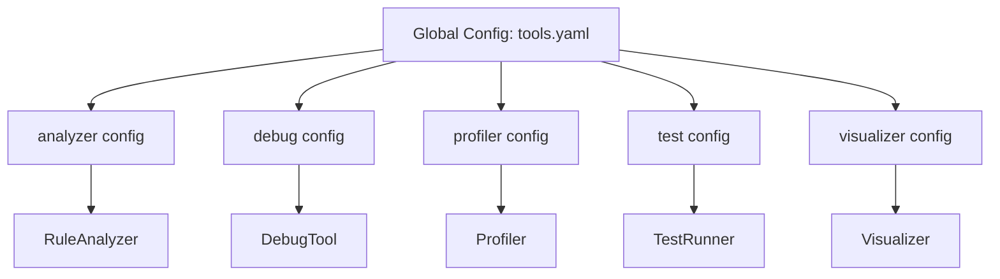

Each tool reads its own configuration subset on initialization. If a config key is missing, sensible defaults are used. Configuration can be updated at runtime by calling the tool's config update method.

## Thread Safety

The Tools module tools are designed to be single-threaded:

```mermaid
flowchart TB
    subgraph Thread-Safe
        PR[Profiler: stateless,\nmeasurements are independent]
        VZ[Visualizer: pure functions,\nno mutable state]
    end

    subgraph Not Thread-Safe
        DT[DebugTool: shared\nbreakpoints, watchers, buffer]
        RA[RuleAnalyzer: shared\nfindings accumulator]
        TR[TestRunner: shared\nresults accumulator]
    end

    T1[Thread 1] --> DT
    T2[Thread 2] --> DT
    note for DT: DebugTool is designed for single-threaded debugging
    note for RA: Analysis calls should be serialized
```

`Profiler` and `Visualizer` are effectively stateless and can be used concurrently. `DebugTool`, `RuleAnalyzer`, and `TestRunner` maintain internal mutable state and should be used from a single thread or protected by external synchronization.
