# Tools Module — Data Flow

## 1. RuleAnalyzer Data Flow

### Single Rule Analysis

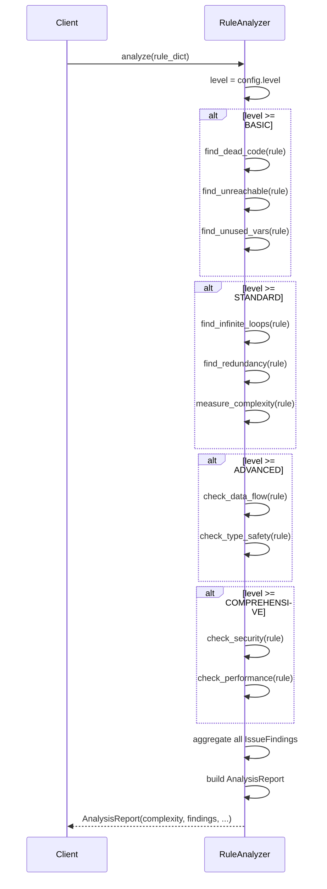
```mermaid
sequenceDiagram
    participant Client
    participant RA as RuleAnalyzer

    Client->>RA: analyze(rule_dict)
    RA->>RA: level = config.level

    alt level >= BASIC
        RA->>RA: find_dead_code(rule)
        RA->>RA: find_unreachable(rule)
        RA->>RA: find_unused_vars(rule)
    end

    alt level >= STANDARD
        RA->>RA: find_infinite_loops(rule)
        RA->>RA: find_redundancy(rule)
        RA->>RA: measure_complexity(rule)
    end

    alt level >= ADVANCED
        RA->>RA: check_data_flow(rule)
        RA->>RA: check_type_safety(rule)
    end

    alt level >= COMPREHENSIVE
        RA->>RA: check_security(rule)
        RA->>RA: check_performance(rule)
    end

    RA->>RA: aggregate all IssueFindings
    RA->>RA: build AnalysisReport
    RA-->>Client: AnalysisReport(complexity, findings, ...)
```

### Dead Code Detection Flow

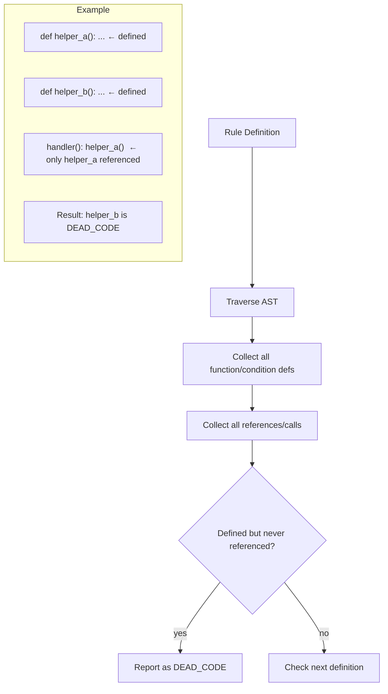
```mermaid
flowchart TB
    RULE[Rule Definition] --> TRAVERSE[Traverse AST]
    TRAVERSE --> DEFS[Collect all function/condition defs]
    DEFS --> REFS[Collect all references/calls]
    REFS --> COMPARE{Defined but never referenced?}
    COMPARE -->|yes| REPORT[Report as DEAD_CODE]
    COMPARE -->|no| NEXT[Check next definition]

    subgraph Example
        E1["def helper_a(): ...  ← defined"]
        E2["def helper_b(): ...  ← defined"]
        E3["handler(): helper_a()  ← only helper_a referenced"]
        E4["Result: helper_b is DEAD_CODE"]
    end
```

### Unreachable Branch Detection Flow

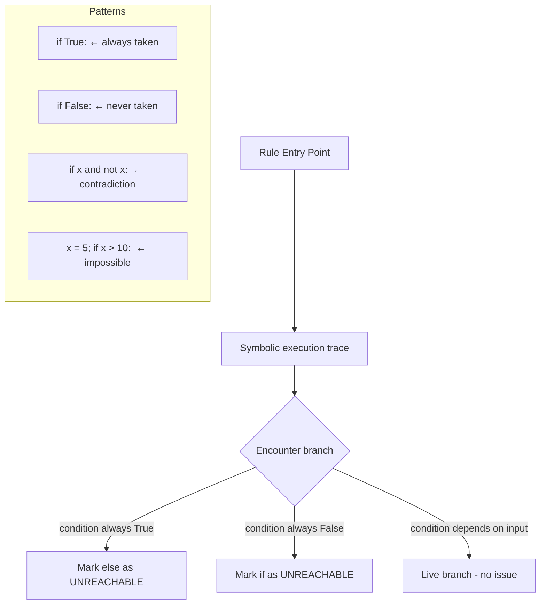
```mermaid
flowchart TB
    ENTRY[Rule Entry Point] --> TRACE[Symbolic execution trace]
    TRACE --> BRANCH{Encounter branch}
    BRANCH -->|condition always True| DEAD_BRANCH[Mark else as UNREACHABLE]
    BRANCH -->|condition always False| DEAD_BRANCH2[Mark if as UNREACHABLE]
    BRANCH -->|condition depends on input| LIVE[Live branch - no issue]

    subgraph Patterns
        P1["if True:  ← always taken"]
        P2["if False:  ← never taken"]
        P3["if x and not x:  ← contradiction"]
        P4["x = 5; if x > 10:  ← impossible"]
    end
```

### Infinite Loop Detection Flow

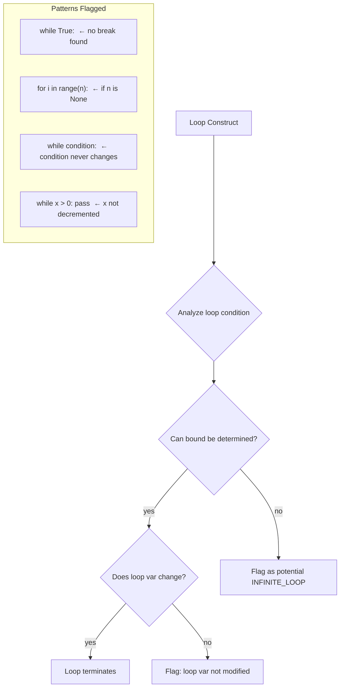
```mermaid
flowchart TB
    LOOP[Loop Construct] --> ANALYZE{Analyze loop condition}
    ANALYZE --> BOUNDED{Can bound be determined?}
    BOUNDED -->|yes| CHECK_MOD{Does loop var change?}
    BOUNDED -->|no| POTENTIAL[Flag as potential INFINITE_LOOP]

    CHECK_MOD -->|yes| SAFE[Loop terminates]
    CHECK_MOD -->|no| FLAG[Flag: loop var not modified]

    subgraph Patterns Flagged
        F1["while True:  ← no break found"]
        F2["for i in range(n):  ← if n is None"]
        F3["while condition:  ← condition never changes"]
        F4["while x > 0: pass  ← x not decremented"]
    end
```

### Complexity Measurement Flow

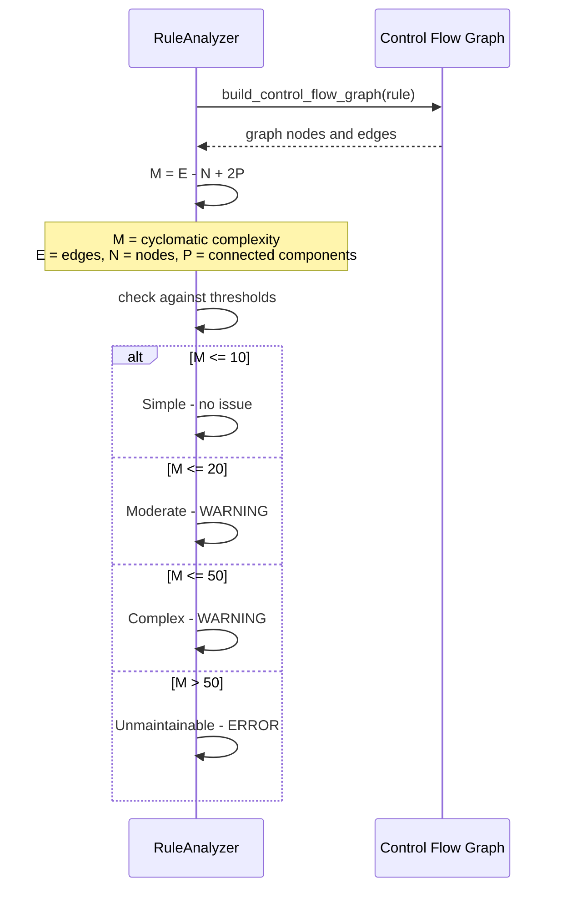
```mermaid
sequenceDiagram
    participant RA as RuleAnalyzer
    participant CFG as Control Flow Graph

    RA->>CFG: build_control_flow_graph(rule)
    CFG-->>RA: graph nodes and edges
    RA->>RA: M = E - N + 2P
    Note over RA: M = cyclomatic complexity<br/>E = edges, N = nodes, P = connected components
    RA->>RA: check against thresholds
    alt M <= 10
        RA->>RA: Simple - no issue
    else M <= 20
        RA->>RA: Moderate - WARNING
    else M <= 50
        RA->>RA: Complex - WARNING
    else M > 50
        RA->>RA: Unmaintainable - ERROR
    end
```

### Security Check Flow

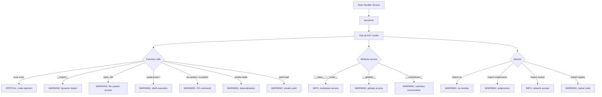
```mermaid
flowchart TB
    RULE[Rule Handler Source] --> AST[ast.parse]
    AST --> VISIT[Visit all AST nodes]

    VISIT --> CALLS{Function calls}
    CALLS -->|eval, exec| F1[CRITICAL: code injection]
    CALLS -->|__import__| F2[WARNING: dynamic import]
    CALLS -->|open, file| F3[WARNING: file system access]
    CALLS -->|subprocess.*| F4[WARNING: shell execution]
    CALLS -->|os.system, os.popen| F5[WARNING: OS command]
    CALLS -->|pickle.loads| F6[WARNING: deserialization]
    CALLS -->|yaml.load| F7[WARNING: unsafe yaml]

    VISIT --> ATTRIB{Attribute access}
    ATTRIB -->|.__class__, .__base__| F8[INFO: metaclass access]
    ATTRIB -->|.__globals__| F9[WARNING: globals access]
    ATTRIB -->|.__subclasses__| F10[WARNING: subclass enumeration]

    VISIT --> IMP{Imports}
    IMP -->|import os| S1[WARNING: os module]
    IMP -->|import subprocess| S2[WARNING: subprocess]
    IMP -->|import socket| S3[INFO: network access]
    IMP -->|import ctypes| S4[WARNING: native code]
```

### Performance Check Flow

```mermaid
flowchart TB
    RULE[Rule Handler Source] --> AST[ast.parse]
    AST --> VISIT[Visit nodes for perf patterns]

    VISIT --> LOOP{Inside a loop?}
    LOOP -->|yes| OP{Operation type}
    OP -->|list.append in hot loop| P1[INFO: consider list comprehension]
    OP -->|dict lookup→key in loop| P2[PASS: O(1) is fine]
    OP -->|nested loop| P3[WARNING: O(n²) or worse]
    OP -->|re.search in loop| P4[WARNING: compile regex first]
    OP -->|open/close in loop| P5[INFO: open outside loop]

    VISIT --> RECUR{Recursive function?}
    RECUR -->|depth > 1000| P6[WARNING: recursion depth risk]
    RECUR -->|no base case| P7[ERROR: infinite recursion]

    VISIT --> DATA{Data structure}
    DATA -->|large list → 'in' check| P8[INFO: use set for membership]
    DATA -->|string concatenation in loop| P9[INFO: use list join]
```

## 2. DebugTool Data Flow

### Trace Event Recording

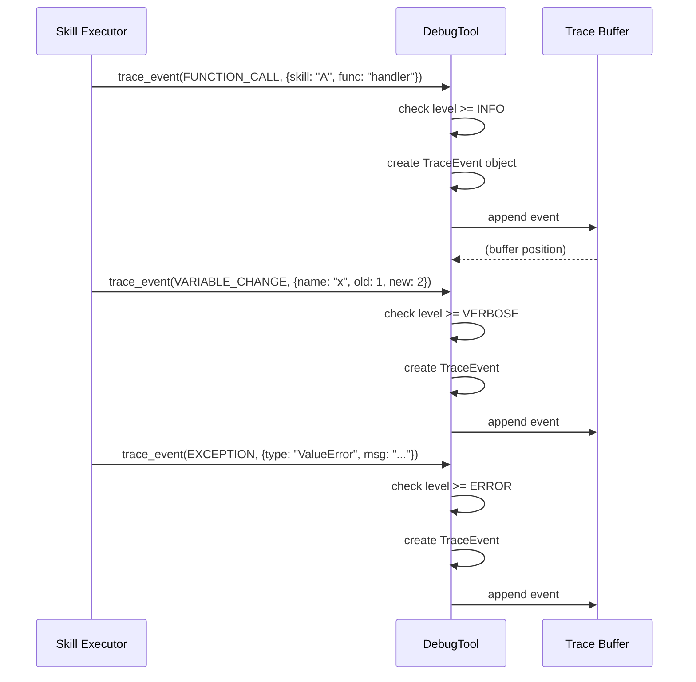
```mermaid
sequenceDiagram
    participant EXEC as Skill Executor
    participant DT as DebugTool
    participant BUF as Trace Buffer

    EXEC->>DT: trace_event(FUNCTION_CALL, {skill: "A", func: "handler"})
    DT->>DT: check level >= INFO
    DT->>DT: create TraceEvent object
    DT->>BUF: append event
    BUF-->>DT: (buffer position)

    EXEC->>DT: trace_event(VARIABLE_CHANGE, {name: "x", old: 1, new: 2})
    DT->>DT: check level >= VERBOSE
    DT->>DT: create TraceEvent
    DT->>BUF: append event

    EXEC->>DT: trace_event(EXCEPTION, {type: "ValueError", msg: "..."})
    DT->>DT: check level >= ERROR
    DT->>DT: create TraceEvent
    DT->>BUF: append event
```

### Breakpoint Hit Flow

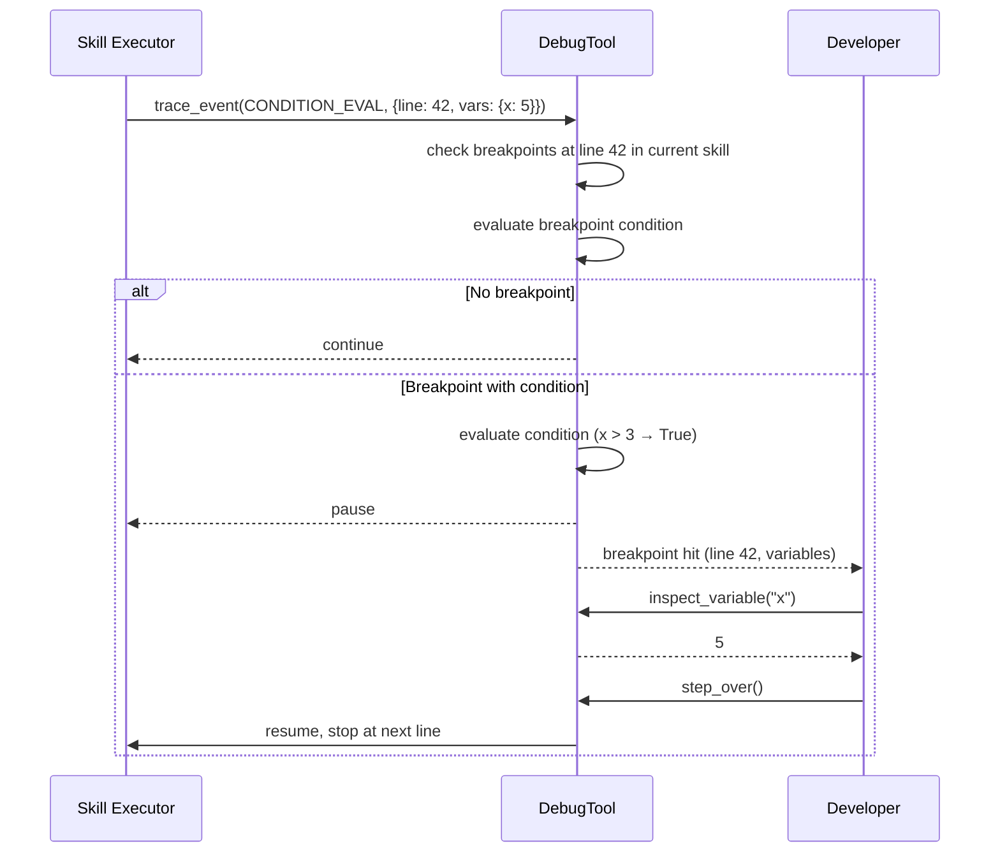
```mermaid
sequenceDiagram
    participant EXEC as Skill Executor
    participant DT as DebugTool
    participant USER as Developer

    EXEC->>DT: trace_event(CONDITION_EVAL, {line: 42, vars: {x: 5}})
    DT->>DT: check breakpoints at line 42 in current skill
    DT->>DT: evaluate breakpoint condition
    alt No breakpoint
        DT-->>EXEC: continue
    else Breakpoint with condition
        DT->>DT: evaluate condition (x > 3 → True)
        DT-->>EXEC: pause
        DT-->>USER: breakpoint hit (line 42, variables)
        USER->>DT: inspect_variable("x")
        DT-->>USER: 5
        USER->>DT: step_over()
        DT->>EXEC: resume, stop at next line
    end
```

### Snapshot Comparison Flow

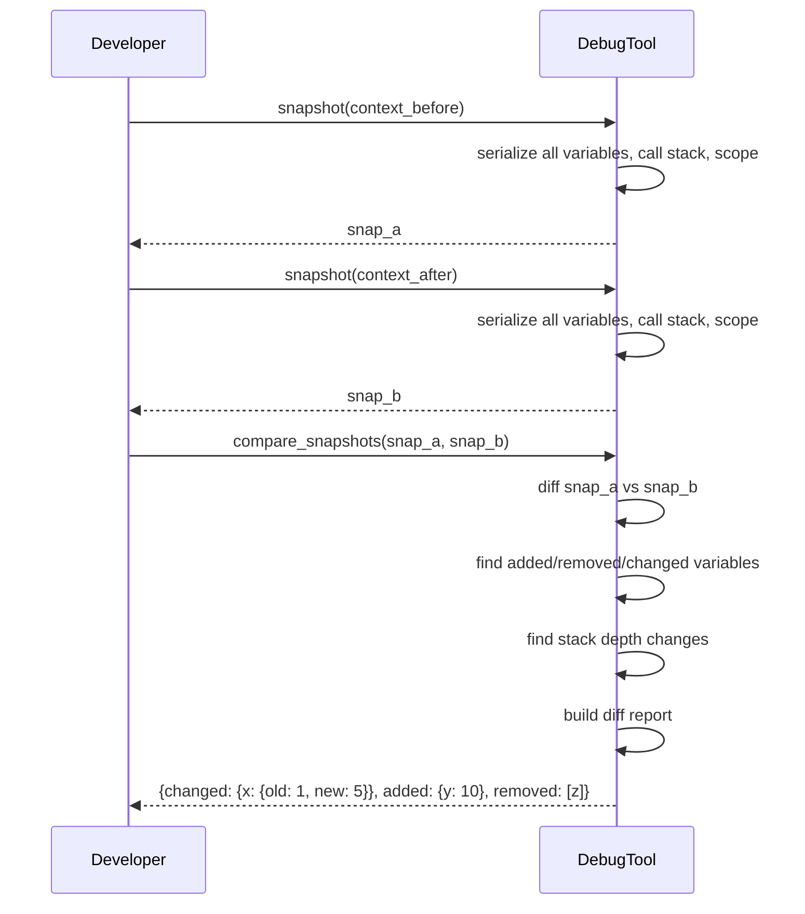
```mermaid
sequenceDiagram
    participant USER as Developer
    participant DT as DebugTool

    USER->>DT: snapshot(context_before)
    DT->>DT: serialize all variables, call stack, scope
    DT-->>USER: snap_a

    USER->>DT: snapshot(context_after)
    DT->>DT: serialize all variables, call stack, scope
    DT-->>USER: snap_b

    USER->>DT: compare_snapshots(snap_a, snap_b)
    DT->>DT: diff snap_a vs snap_b
    DT->>DT: find added/removed/changed variables
    DT->>DT: find stack depth changes
    DT->>DT: build diff report
    DT-->>USER: {changed: {x: {old: 1, new: 5}}, added: {y: 10}, removed: [z]}
```

## 3. Profiler Data Flow

### Function Profiling

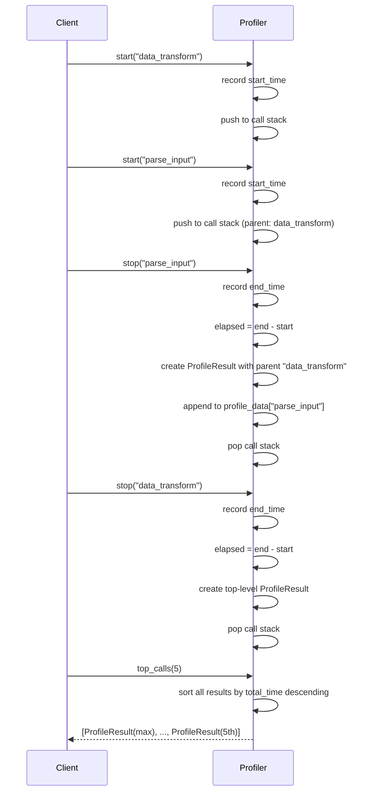
```mermaid
sequenceDiagram
    participant Client
    participant P as Profiler

    Client->>P: start("data_transform")
    P->>P: record start_time
    P->>P: push to call stack

    Client->>P: start("parse_input")
    P->>P: record start_time
    P->>P: push to call stack (parent: data_transform)

    Client->>P: stop("parse_input")
    P->>P: record end_time
    P->>P: elapsed = end - start
    P->>P: create ProfileResult with parent "data_transform"
    P->>P: append to profile_data["parse_input"]
    P->>P: pop call stack

    Client->>P: stop("data_transform")
    P->>P: record end_time
    P->>P: elapsed = end - start
    P->>P: create top-level ProfileResult
    P->>P: pop call stack

    Client->>P: top_calls(5)
    P->>P: sort all results by total_time descending
    P-->>Client: [ProfileResult(max), ..., ProfileResult(5th)]
```

### Call Graph Generation

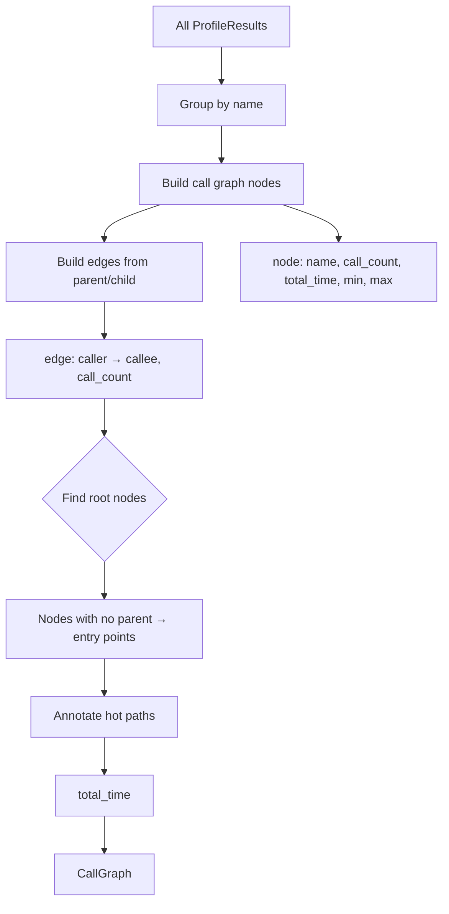
```mermaid
flowchart TB
    RESULTS[All ProfileResults] --> GROUP[Group by name]
    GROUP --> BUILD_NODES[Build call graph nodes]
    BUILD_NODES --> BUILD_EDGES[Build edges from parent/child]

    BUILD_NODES --> NODE_META[node: name, call_count, total_time, min, max]
    BUILD_EDGES --> EDGE_META[edge: caller → callee, call_count]

    EDGE_META --> COMPUTE_ROOT{Find root nodes}
    COMPUTE_ROOT --> ROOTS[Nodes with no parent → entry points]
    ROOTS --> COMPUTE_HOT[Annotate hot paths]
    COMPUTE_HOT --> TOTAL[total_time]
    TOTAL --> GRAPH[CallGraph]
```

### Report Generation

```mermaid
sequenceDiagram
    participant Client
    participant P as Profiler

    Client->>P: report(format="text")
    P->>P: iterate profile_data
    P->>P: for each function: compute aggregated stats
    P->>P: sort by total_time desc
    P->>P: format as table
    P-->>Client: """
    # Profile Report
    ## Summary
    Total functions: 12
    Total time: 3.452s

    ## Top Calls
    | Function | Calls | Total | Avg | Min | Max |
    | parse    | 42    | 1.2s  | 29ms| 1ms | 150ms|
    | ...

    Client->>P: report(format="flamegraph")
    P->>P: build call tree
    P->>P: format as folded stack format
    P-->>Client: "func_a;func_b;func_c 42\nfunc_a;func_d 15\n..."
```

## 4. TestRunner Data Flow

### Test Suite Execution

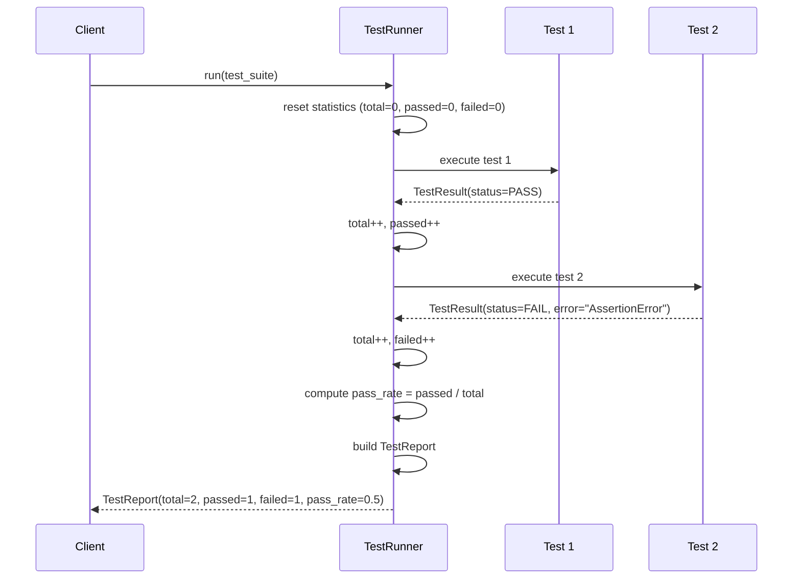
```mermaid
sequenceDiagram
    participant Client
    participant TR as TestRunner
    participant T1 as Test 1
    participant T2 as Test 2

    Client->>TR: run(test_suite)
    TR->>TR: reset statistics (total=0, passed=0, failed=0)

    TR->>T1: execute test 1
    T1-->>TR: TestResult(status=PASS)
    TR->>TR: total++, passed++

    TR->>T2: execute test 2
    T2-->>TR: TestResult(status=FAIL, error="AssertionError")
    TR->>TR: total++, failed++

    TR->>TR: compute pass_rate = passed / total
    TR->>TR: build TestReport
    TR-->>Client: TestReport(total=2, passed=1, failed=1, pass_rate=0.5)
```

### Property-Based Test Flow

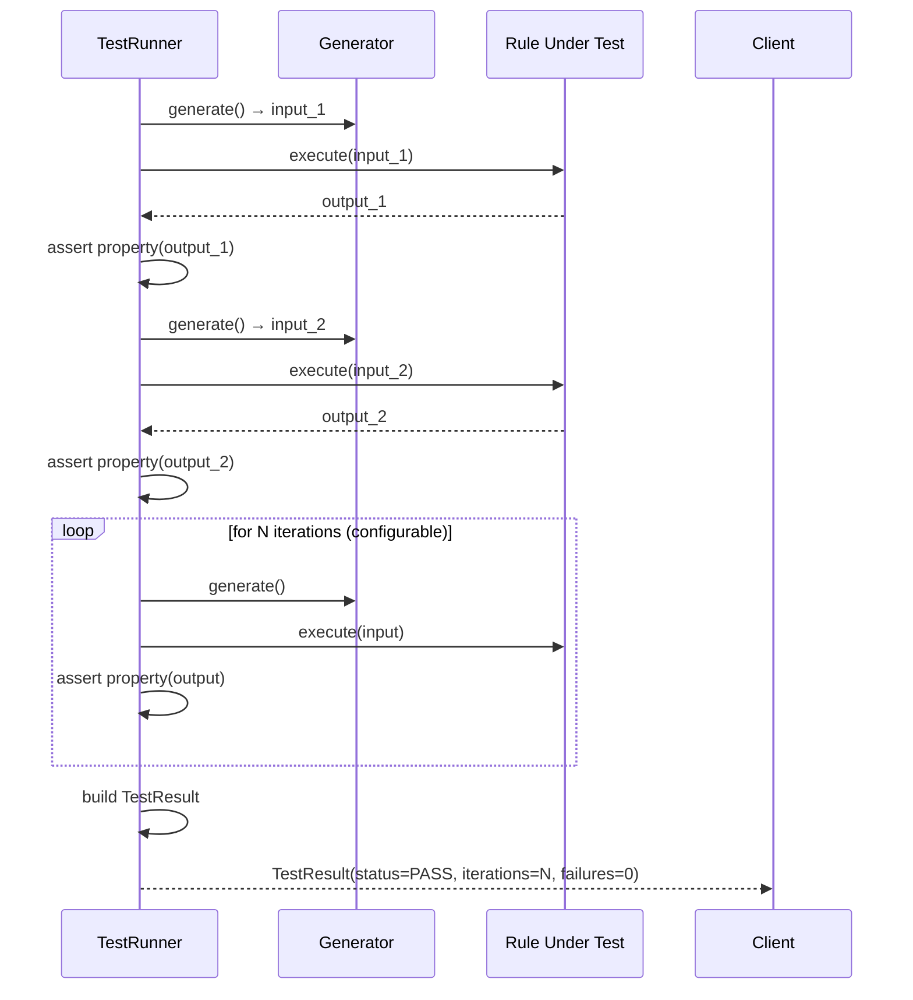
```mermaid
sequenceDiagram
    participant TR as TestRunner
    participant GEN as Generator
    participant RULE as Rule Under Test

    TR->>GEN: generate() → input_1
    TR->>RULE: execute(input_1)
    RULE-->>TR: output_1
    TR->>TR: assert property(output_1)

    TR->>GEN: generate() → input_2
    TR->>RULE: execute(input_2)
    RULE-->>TR: output_2
    TR->>TR: assert property(output_2)

    loop for N iterations (configurable)
        TR->>GEN: generate()
        TR->>RULE: execute(input)
        TR->>TR: assert property(output)
    end

    TR->>TR: build TestResult
    TR-->>Client: TestResult(status=PASS, iterations=N, failures=0)
```

### Snapshot Test Flow

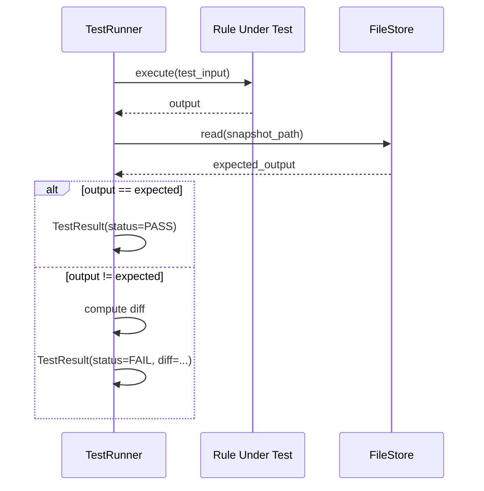
```mermaid
sequenceDiagram
    participant TR as TestRunner
    participant RULE as Rule Under Test
    participant FS as FileStore

    TR->>RULE: execute(test_input)
    RULE-->>TR: output
    TR->>FS: read(snapshot_path)
    FS-->>TR: expected_output

    alt output == expected
        TR->>TR: TestResult(status=PASS)
    else output != expected
        TR->>TR: compute diff
        TR->>TR: TestResult(status=FAIL, diff=...)
    end
```

### Coverage Measurement Flow

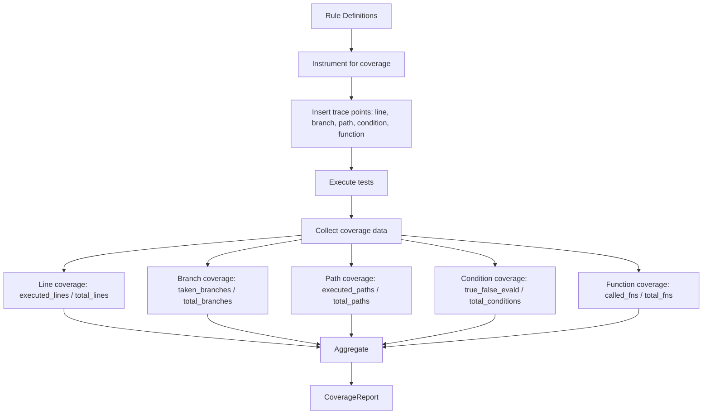
```mermaid
flowchart TB
    RULES[Rule Definitions] --> INSTRUMENT[Instrument for coverage]
    INSTRUMENT --> TRACE_POINTS[Insert trace points: line, branch, path, condition, function]

    TRACE_POINTS --> EXEC[Execute tests]
    EXEC --> COLLECT[Collect coverage data]
    COLLECT --> LINES[Line coverage: executed_lines / total_lines]
    COLLECT --> BRANCHES[Branch coverage: taken_branches / total_branches]
    COLLECT --> PATHS[Path coverage: executed_paths / total_paths]
    COLLECT --> CONDITIONS[Condition coverage: true_false_evald / total_conditions]
    COLLECT --> FUNCTIONS[Function coverage: called_fns / total_fns]

    LINES --> AGG[Aggregate]
    BRANCHES --> AGG
    PATHS --> AGG
    CONDITIONS --> AGG
    FUNCTIONS --> AGG

    AGG --> REPORT[CoverageReport]
```

## 5. Visualizer Data Flow

### Execution Visualization

```mermaid
sequenceDiagram
    participant Client
    participant VZ as Visualizer
    participant GRAPH as Graph Builder

    Client->>VZ: visualize_execution(execution_log)
    VZ->>GRAPH: parse log into events
    GRAPH->>GRAPH: create nodes for each event
    GRAPH->>GRAPH: create edges for event sequence
    GRAPH->>GRAPH: annotate with timing/duration data
    GRAPH-->>VZ: intermediate graph

    VZ->>VZ: apply theme colors
    VZ->>VZ: apply custom node/edge styles
    VZ->>VZ: select output format

    alt format = MERMAID
        VZ->>VZ: generate Mermaid.js string
        VZ-->>Client: """
        ```mermaid
        flowchart LR
            A[Start] --> B[Parse]
            B --> C[Transform]
            C --> D[End]
        ```
    else format = JSON
        VZ->>VZ: serialize as JSON graph
        VZ-->>Client: {"nodes": [...], "edges": [...]}
    else format = HTML
        VZ->>VZ: render SVG via graph layout
        VZ-->>Client: "<svg>...</svg>"
    end
```

### Dependency Graph Visualization

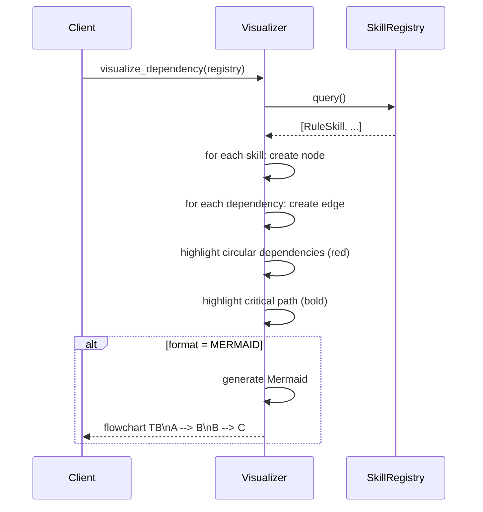
```mermaid
sequenceDiagram
    participant Client
    participant VZ as Visualizer
    participant REG as SkillRegistry

    Client->>VZ: visualize_dependency(registry)
    VZ->>REG: query()
    REG-->>VZ: [RuleSkill, ...]
    VZ->>VZ: for each skill: create node
    VZ->>VZ: for each dependency: create edge
    VZ->>VZ: highlight circular dependencies (red)
    VZ->>VZ: highlight critical path (bold)

    alt format = MERMAID
        VZ->>VZ: generate Mermaid

        VZ-->>Client: flowchart TB\nA --> B\nB --> C
    end
```

## 6. Pipeline: Analyze → Profile → Visualize

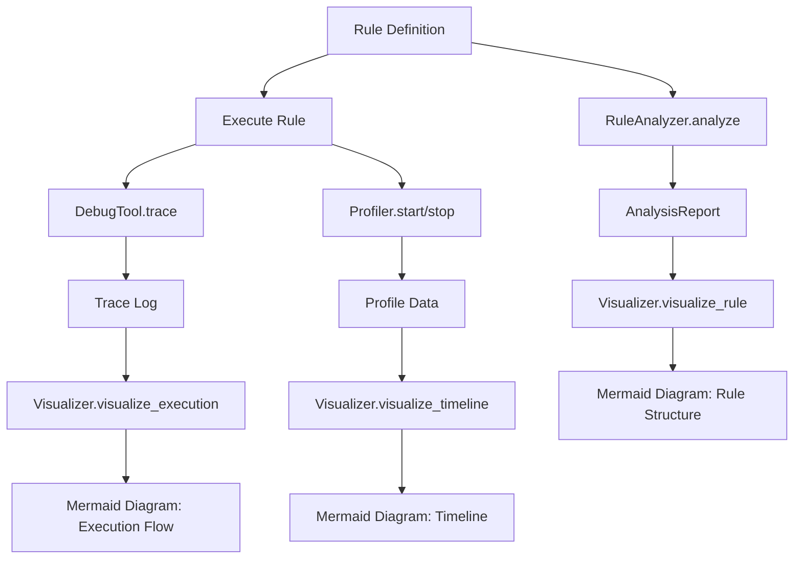
```mermaid
flowchart TB
    RULE[Rule Definition] --> RA[RuleAnalyzer.analyze]
    RA --> REPORT[AnalysisReport]

    RULE --> EXEC[Execute Rule]
    EXEC --> DT[DebugTool.trace]
    EXEC --> PR[Profiler.start/stop]
    DT --> TRACE_LOG[Trace Log]
    PR --> PROFILE[Profile Data]

    REPORT --> VZ1[Visualizer.visualize_rule]
    TRACE_LOG --> VZ2[Visualizer.visualize_execution]
    PROFILE --> VZ3[Visualizer.visualize_timeline]

    VZ1 --> MERMAID1[Mermaid Diagram: Rule Structure]
    VZ2 --> MERMAID2[Mermaid Diagram: Execution Flow]
    VZ3 --> MERMAID3[Mermaid Diagram: Timeline]
```

## 7. Pipeline: Test → Coverage → Visualize

```mermaid
flowchart TB
    TESTS[Test Suites] --> TR[TestRunner.run_all]
    TR --> REPORT[TestReport]
    TR --> COV[TestRunner.coverage]
    COV --> COV_REPORT[CoverageReport]

    REPORT --> VZ1[Visualizer: test results]
    COV_REPORT --> VZ2[Visualizer: coverage heatmap]

    VZ1 --> OUT1[Visualization: pass/fail matrix]
    VZ2 --> OUT2[Visualization: uncovered lines]
```

## 8. Error Handling in Tools

```mermaid
flowchart TB
    TOOL_CALL[Tool method call] --> TRY{Try execution}

    TRY -->|success| RETURN[Return result]

    TRY -->|timeout| TIMEOUT[Log timeout error]
    TRY -->|type error| TYPE_ERR[Log type validation error]
    TRY -->|value error| VAL_ERR[Validation error → WARNING issue]
    TRY -->|key error| KEY_ERR[Missing key → INFO issue]

    TIMEOUT --> WRAP[Wrap in ToolError]
    TYPE_ERR --> WRAP
    VAL_ERR --> WRAP
    KEY_ERR --> WRAP

    WRAP --> RAISE[Raise ToolError with context]
```

Each tool wraps internal errors in domain-specific exception types:
- `RuleAnalyzer` wraps errors in `AnalysisError`
- `DebugTool` wraps errors in `DebugError`
- `Profiler` wraps errors in `ProfilingError`
- `TestRunner` wraps errors in `TestError`
- `Visualizer` wraps errors in `VisualizationError`

All tool errors include the tool name, method name, original error message, and relevant context for debugging.
