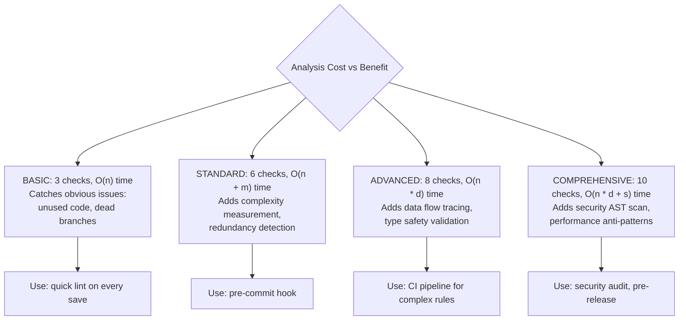
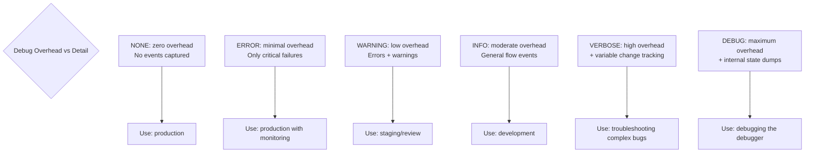
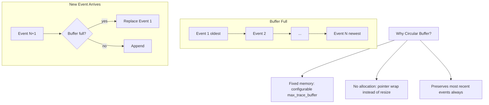
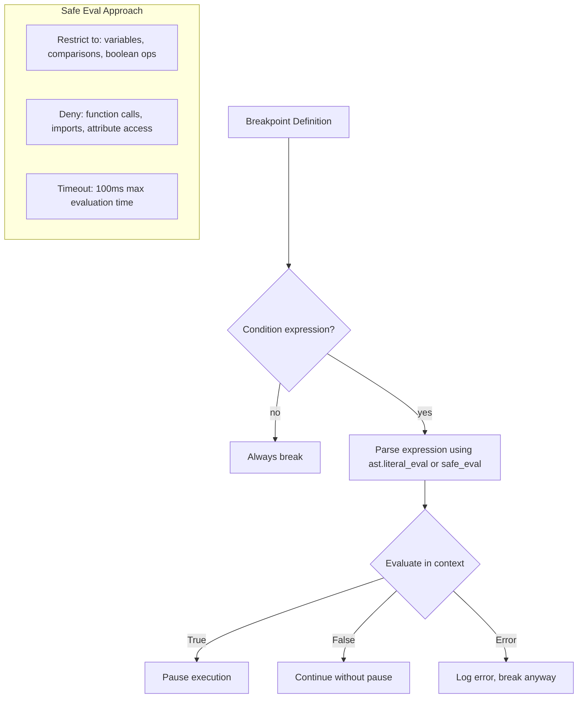
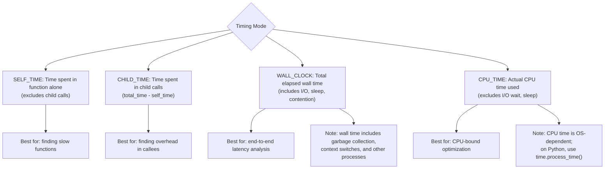
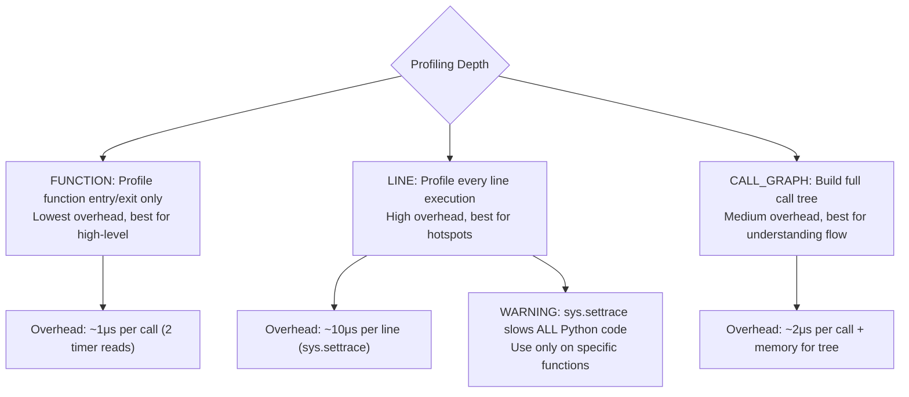
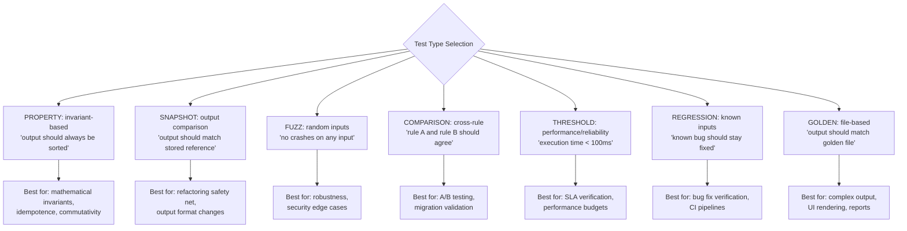
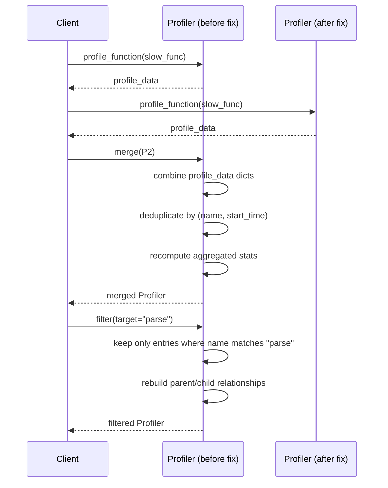
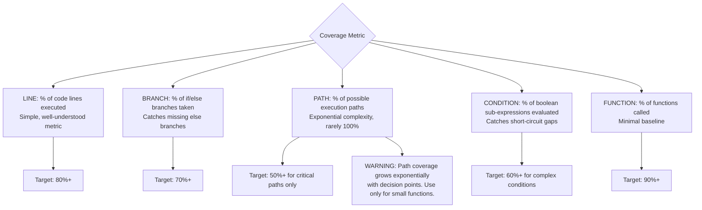
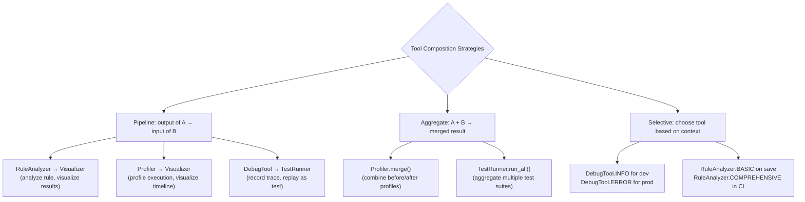

# Tools Module — Reasoning

## 1. Analysis Level Design



**Decision:** Four analysis levels let consumers trade off speed vs. thoroughness:

- **BASIC** runs in O(n) and is suitable for real-time feedback (editor integration, on-save).
- **STANDARD** adds complexity and redundancy detection. Suitable for pre-commit hooks.
- **ADVANCED** adds data flow analysis. Data flow analysis requires building a control flow graph and tracing variable usage, which is O(n × d) where d is the nesting depth.
- **COMPREHENSIVE** adds security and performance checks. Security checks involve scanning for dangerous function calls (AST traversal), which is fast O(n). Performance checks look for anti-patterns in loops.

## 2. Debug Level Design



**Decision:** Debug levels control the verbosity of the trace buffer. Each level adds more event types:

- **NONE/ERROR** — Suitable for production. Only critical failures are recorded.
- **WARNING/INFO** — Suitable for staging. Adds general flow tracking.
- **VERBOSE** — Records variable changes. Useful for understanding state mutations.
- **DEBUG** — Records internal debug tool state. Used for tool development.

The trace buffer is circular (fixed capacity). When full, the oldest events are overwritten. This prevents unbounded memory growth regardless of debug level.

## 3. Circular Trace Buffer Design



**Why circular instead of unbounded list:** An unbounded trace buffer would grow indefinitely during long debugging sessions, consuming all available memory. A circular buffer with a configurable capacity (default 10,000) provides:

1. Predictable memory usage
2. Always keeps the most recent events (most relevant for debugging)
3. O(1) append (no resize/copy cost)

## 4. Breakpoint Condition Evaluation



**Why safe_eval instead of exec/eval:** Breakpoint conditions are user-provided expressions. Using raw `eval()` would allow arbitrary code execution in the debugger context. Instead, conditions are evaluated using a safe expression parser that only allows:

- Variable references (from current scope)
- Comparison operators (==, !=, <, >, <=, >=)
- Boolean operators (and, or, not)
- Arithmetic operators (+, -, *, /)
- Literals (numbers, strings, None, True, False)

## 5. Profiler Timing Modes



**Decision:** The profiler supports multiple timing modes because:

- **Self time** answers "which function is slow by itself?"
- **Child time** answers "which function has expensive callees?"
- **Wall clock** answers "how long does the user wait?"
- **CPU time** answers "how much CPU does this consume?"

No single metric is sufficient for performance analysis.

## 6. Profiling Depth Options



**Why FUNCTION is the default:** `sys.settrace` (required for line-level profiling) can slow down execution by 10-100x because it fires on every Python line execution. Function-level profiling only adds overhead at function boundaries, making it suitable for production use.

**When to use CALL_GRAPH:** Call graph profiling is useful for understanding execution flow and finding unexpected call paths. It adds moderate overhead (parent/child tracking) but provides valuable insight into execution structure.

**When to use LINE profiling:** Line profiling is the nuclear option — use only when you've identified a specific function as a bottleneck and need to pinpoint which line within it is slow.

## 7. Test Types Design



**Why support 7 test types:** Different aspects of rule correctness require different testing strategies:

1. **Property-based** — Catches edge cases that explicit test cases miss. The generator produces random inputs, and properties are invariants that should hold for all inputs.
2. **Snapshot** — Captures the full output and compares it to a stored reference. When the output changes intentionally, the snapshot is updated.
3. **Fuzz** — Tests robustness by generating random, mutated, or boundary inputs. Find crashes and unexpected exceptions.
4. **Comparison** — When replacing or modifying a rule, compare its output to the original. Ensures behavioral equivalence.
5. **Threshold** — Not just correctness but performance and reliability. Assert that execution time, memory usage, or error rate stays within bounds.
6. **Regression** — The standard testing approach. Known inputs produce known outputs.
7. **Golden** — Like snapshot but uses external files (useful for complex or large outputs).

## 8. Visualizer Output Format Selection

```mermaid
flowchart TB
    FORMAT{Output Format}

    FORMAT --> MERMAID["MERMAID: Mermaid.js diagram\nBest for: embedding in Markdown,\ndocs, GitHub"]
    FORMAT --> DOT["DOT: Graphviz DOT language\nBest for: complex graphs,\ncustom rendering"]
    FORMAT --> JSON["JSON: structured graph data\nBest for: programmatic consumption,\ncustom renderers"]
    FORMAT --> HTML["HTML: self-contained SVG\nBest for: web dashboards,\ninteractive exploration"]
    FORMAT --> PLAINTEXT["PLAINTEXT: ASCII art\nBest for: terminal display,\nquick debugging"]

    MERMAID --> MERMAID_PRO["Rich ecosystem, GitHub native,\nsimple text format"]
    DOT --> DOT_PRO["Mature layout engine (neato, dot),\nhandles large graphs]
    JSON --> JSON_PRO["Language-agnostic,\neasy to transform"]
    HTML --> HTML_PRO["Interactive (zoom, pan, search),\nembedded styling"]
    PLAINTEXT --> PLAINTEXT_PRO["Zero dependencies,\nworks in any terminal"]
```

**Why MERMAID is the default:** Mermaid.js has become the de facto standard for diagrams in Markdown documentation. It is natively supported by GitHub, GitLab, and many documentation tools. The text-based format is easy to version control and diff.

**When to choose other formats:**
- **DOT** — For graphs with more than 50 nodes, Graphviz's layout engine produces better results.
- **JSON** — When the graph needs to be consumed by a custom frontend.
- **HTML/SVG** — For interactive dashboards where the user needs to explore the graph.
- **PLAINTEXT** — When working over SSH or in environments without a browser.

## 9. Node and Edge Customization

```mermaid
flowchart TB
    CUSTOMIZE[Customization API]
    CUSTOMIZE --> NODE[customize_node(id, style)]
    CUSTOMIZE --> EDGE[customize_edge(from, to, style)]

    NODE --> SHAPE[Shape: rect, circle, diamond, ellipse, hexagon, parallelogram]
    NODE --> COLOR[Fill color: hex/rgb]
    NODE --> BORDER[Border: color, width]
    NODE --> TEXT[Font size, tooltip]

    EDGE --> STYLE[EdgeStyle: solid, dashed, dotted, bold]
    EDGE --> COLOR2[Color: hex/rgb]
    EDGE --> WIDTH[Width: pixels]
    EDGE --> LABEL[Label text]
    EDGE --> DIR[Arrow direction: forward, both, none]

    SHAPE --> RATIONALE["Why multiple shapes?\nDifferentiate node types visually\ncircle = start/end, diamond = decision,\nrectangle = process"]
```

## 10. Profiler Merge and Filter



**Why merge and filter:** In performance analysis, you often need to:
- **Merge** results from multiple runs (before/after a fix) to compare performance.
- **Filter** to focus on specific functions or modules, excluding noise from unrelated code.

## 11. TestRunner Coverage Metrics



**Why multiple coverage metrics:** Line coverage alone is misleading — 100% line coverage can still miss untaken branches. Branch coverage catches missing else paths. Condition coverage catches short-circuit evaluation gaps (e.g., `x or y` where `y` is never evaluated because `x` is always True).

## 12. Tool Composition



**Why composition over monolithic tools:** Each tool has a single responsibility. Composition lets consumers build custom workflows by chaining tools:

- `analyze → visualize` produces a diagram of rule issues
- `profile → visualize` produces a performance flamegraph
- `debug → test` converts a debugging session into a regression test
