# Tools Module — Integration

## 1. Integration Overview

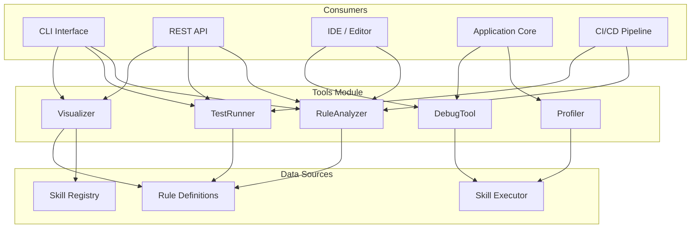

## 2. Integration with CLI

The CLI provides command-line access to all five tools.

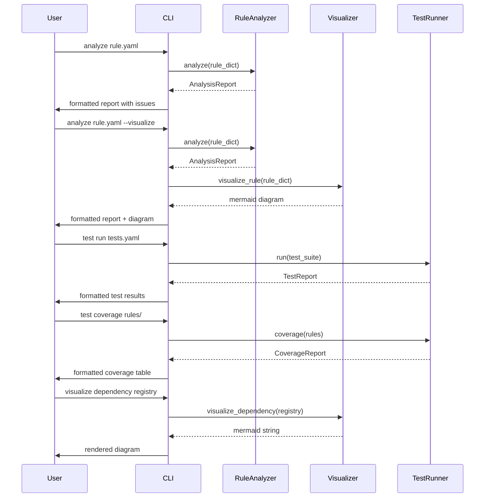

### CLI Command Mapping

| CLI Command | Tool Method |
|---|---|
| `analyze <rule>` | `RuleAnalyzer.analyze(rule)` |
| `analyze all <dir>` | `RuleAnalyzer.analyze_all(rules)` |
| `analyze <rule> --level BASIC` | `RuleAnalyzer.analyze(rule, level=BASIC)` |
| `debug trace <rule>` | `DebugTool.trace_event(...)` |
| `debug breakpoint <rule>:<line>` | `DebugTool.set_breakpoint(skill, line)` |
| `debug inspect <var>` | `DebugTool.inspect_variable(var)` |
| `debug snapshot` | `DebugTool.snapshot(context)` |
| `profile run <rule>` | `Profiler.profile_function(func, args)` |
| `profile report [--format json]` | `Profiler.report(format)` |
| `profile top [--n 10]` | `Profiler.top_calls(n)` |
| `test run <suite>` | `TestRunner.run(test_suite)` |
| `test all` | `TestRunner.run_all(suites)` |
| `test coverage <dir>` | `TestRunner.coverage(rules)` |
| `test fuzz <rule>` | `TestRunner.run_fuzz(rule, fuzzer)` |
| `visualize rule <rule>` | `Visualizer.visualize_rule(rule)` |
| `visualize deps` | `Visualizer.visualize_dependency(registry)` |
| `visualize exec <log>` | `Visualizer.visualize_execution(log)` |
| `visualize timeline <events>` | `Visualizer.visualize_timeline(events)` |

## 3. Integration with REST API

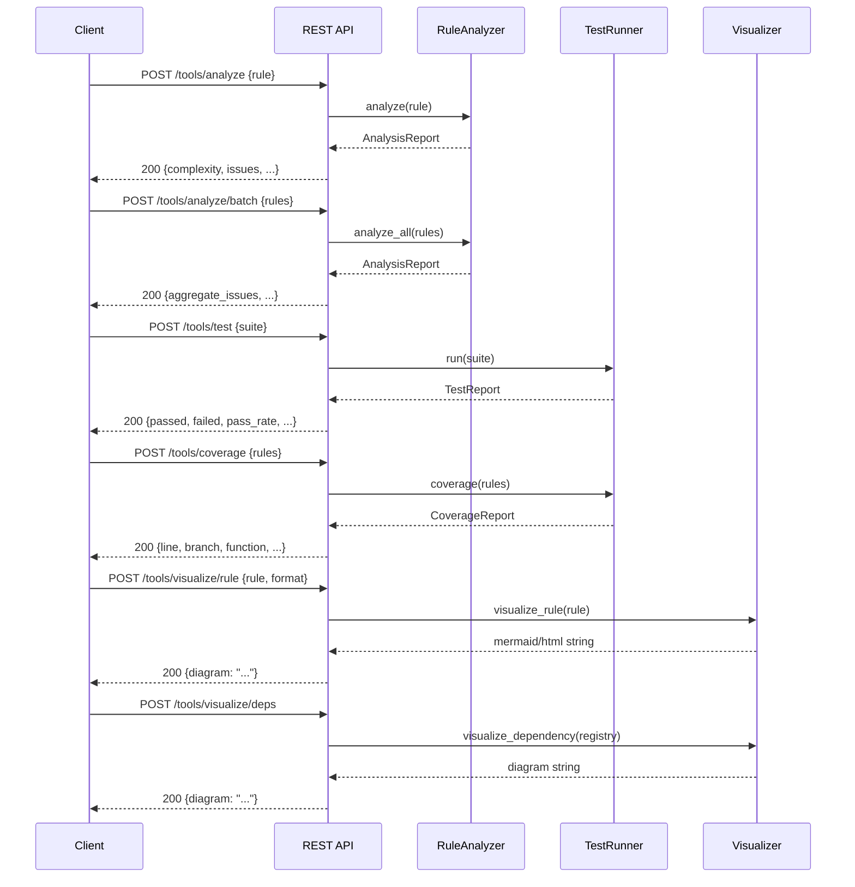

### API Endpoint Mapping

| HTTP Method | Endpoint | Tool Method |
|---|---|---|
| `POST` | `/tools/analyze` | `RuleAnalyzer.analyze()` |
| `POST` | `/tools/analyze/batch` | `RuleAnalyzer.analyze_all()` |
| `GET` | `/tools/analyze/levels` | (returns enum info) |
| `POST` | `/tools/test` | `TestRunner.run()` |
| `POST` | `/tools/test/all` | `TestRunner.run_all()` |
| `POST` | `/tools/coverage` | `TestRunner.coverage()` |
| `POST` | `/tools/visualize/rule` | `Visualizer.visualize_rule()` |
| `POST` | `/tools/visualize/deps` | `Visualizer.visualize_dependency()` |
| `POST` | `/tools/visualize/exec` | `Visualizer.visualize_execution()` |
| `POST` | `/tools/visualize/timeline` | `Visualizer.visualize_timeline()` |

## 4. Integration with Skills Module

The tools consume and operate on data from the Skills module.

```mermaid
flowchart TB
    subgraph Skills Module
        LOAD[SkillLoader]
        REG[SkillRegistry]
        EXEC[SkillExecutor]
    end

    subgraph Tools Module
        RA[RuleAnalyzer]
        DT[DebugTool]
        PR[Profiler]
        TR[TestRunner]
        VZ[Visualizer]
    end

    LOAD --> RA: skill definitions to analyze
    LOAD --> TR: skill definitions to test
    REG --> VZ: dependency graph to visualize
    EXEC --> DT: execution events to trace
    EXEC --> PR: execution to profile
    EXEC --> TR: execution results to verify
    RA --> VZ: analysis findings to visualize
    PR --> VZ: profile data to visualize
    TR --> VZ: test results to visualize
```

### Specific Integration Points

| Skills Component | Tool | Integration |
|---|---|---|
| `RuleSkill` | `RuleAnalyzer` | `analyze(rule.to_dict())` |
| `RuleSkill` | `TestRunner` | `run(rule_test_suite)` |
| `SkillRegistry` | `Visualizer` | `visualize_dependency(registry)` |
| `SkillExecutor` | `DebugTool` | `trace_event(call, context)` on each execution |
| `SkillExecutor` | `Profiler` | `start(name) / stop(name)` around execution |
| `SkillLoader` | `RuleAnalyzer` | `analyze(loaded_skill)` on load |
| `SkillValidator` | `RuleAnalyzer` | `analyze(rule)` for deeper validation |

## 5. Integration with CI/CD Pipeline

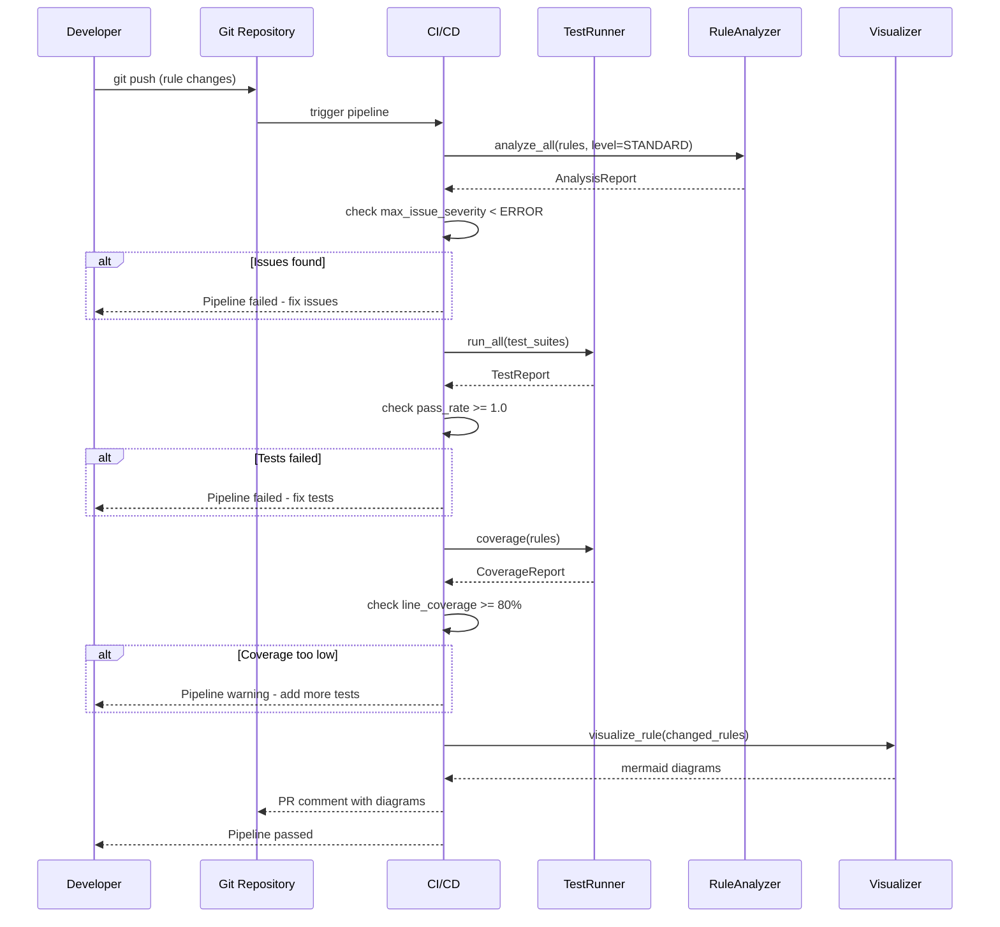

### CI Configuration Example

```yaml
# .github/workflows/rule-ci.yml
jobs:
  analyze:
    runs-on: ubuntu-latest
    steps:
      - uses: actions/checkout@v4
      - name: Analyze rules
        run: python -m tools analyze level STANDARD ./rules
      - name: Run tests
        run: python -m tools test all
      - name: Check coverage
        run: python -m tools test coverage --target 80
```

## 6. Integration with IDE / Editor

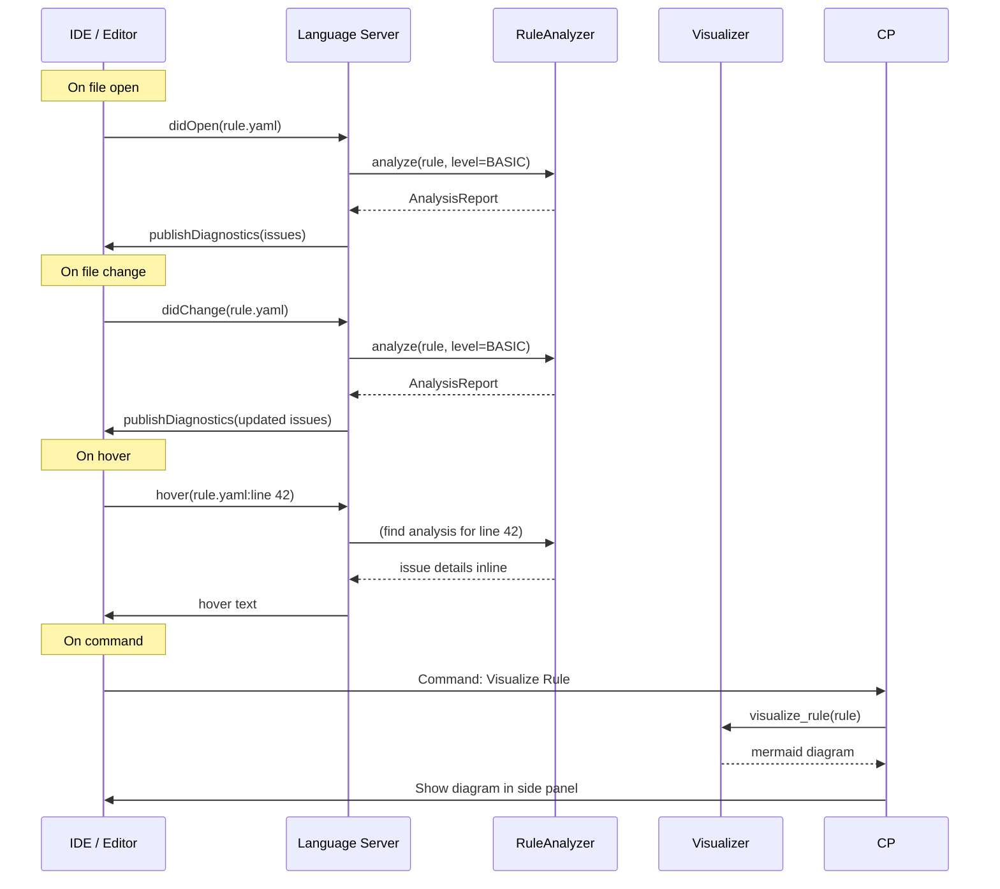

### LSP Integration

```python
# LSP handler pseudocode
def on_diagnostic(params):
    rule = load_rule(params.uri)
    report = analyzer.analyze(rule, level=AnalysisLevel.BASIC)
    diagnostics = []
    for finding in report.findings:
        diagnostics.append({
            "range": {"start": {"line": finding.line, "character": finding.column}},
            "severity": finding.severity.value,
            "message": finding.message,
            "source": "rule-analyzer"
        })
    return {"uri": params.uri, "diagnostics": diagnostics}
```

## 7. Integration with Monitoring System

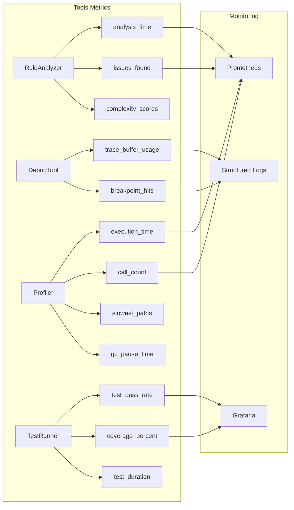

## 8. Integration with Storage Module

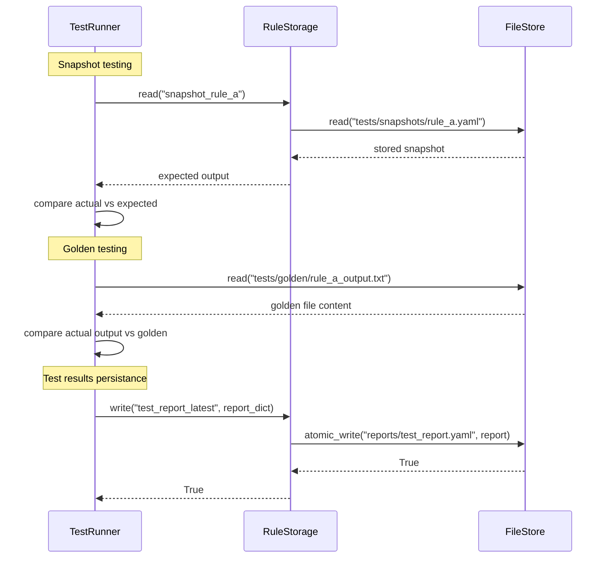

## 9. Integration Patterns

### Pattern 1: Analyze Before Execution

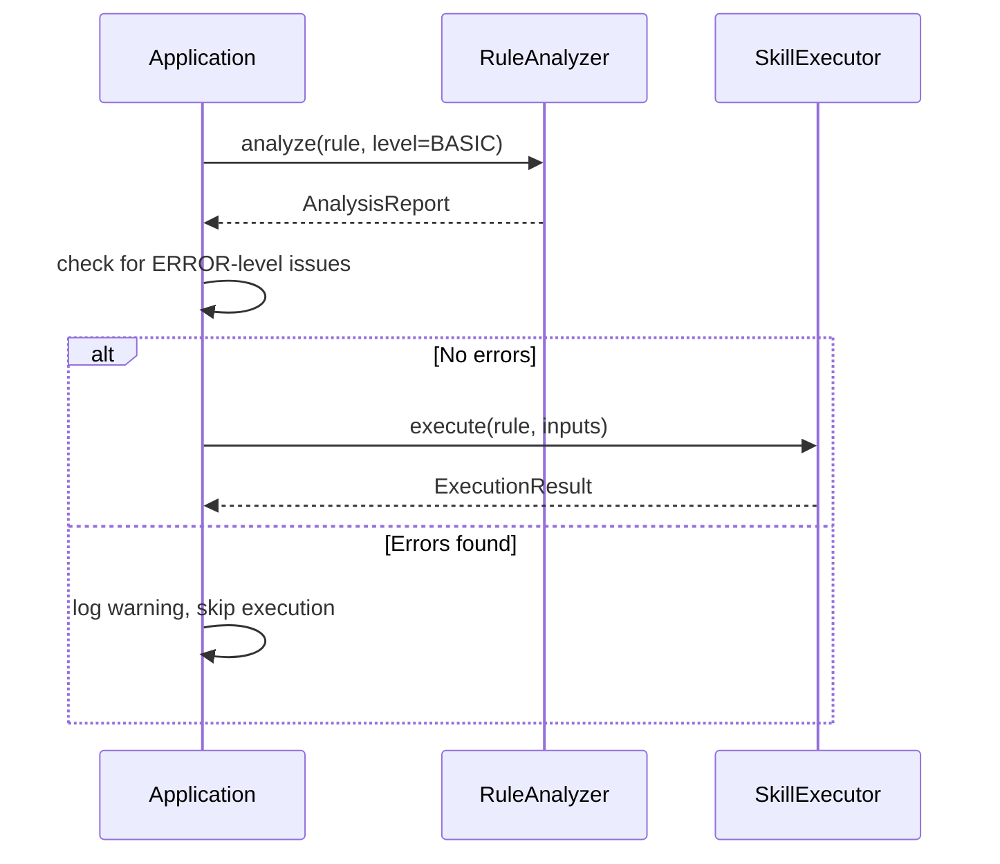

### Pattern 2: Debug on Failure

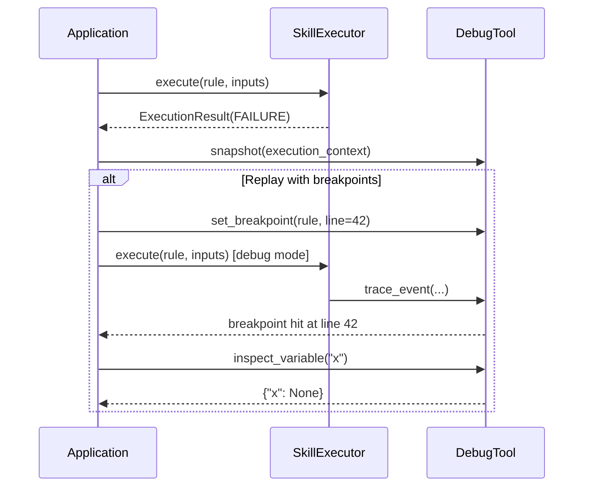

### Pattern 3: Profile and Visualize

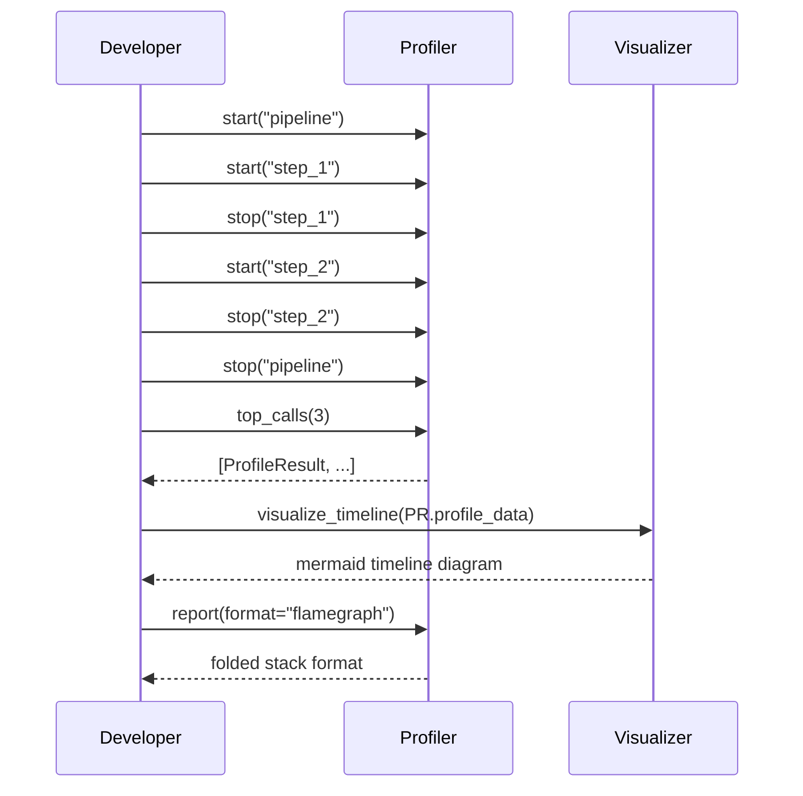

### Pattern 4: CI Gate

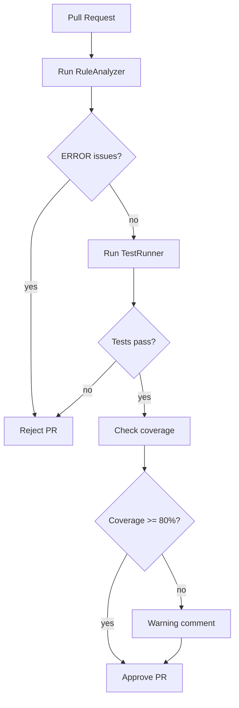

### Pattern 5: Continuous Profiling

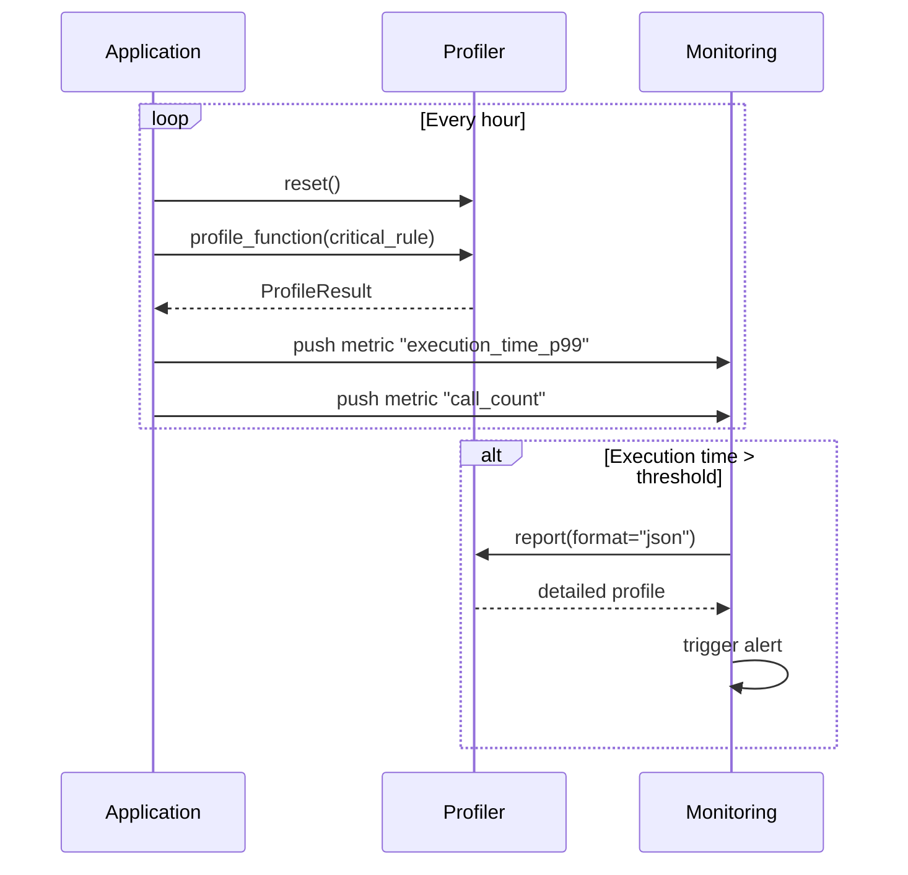

## 10. Tool Interoperability Matrix

| Tool | Consumes From | Produces For |
|---|---|---|
| `RuleAnalyzer` | `RuleSkill`, `SkillLoader` | `Visualizer`, reports |
| `DebugTool` | `SkillExecutor` | `TestRunner` (replay), `Visualizer` (trace) |
| `Profiler` | `SkillExecutor` | `Visualizer` (timeline), reports |
| `TestRunner` | `RuleSkill`, `RuleAnalyzer` | `Visualizer` (results), coverage reports |
| `Visualizer` | All tools | CLI output, REST response, file export |

## 11. Configuration Integration

```yaml
# Main application config for tools
tools:
  analyzer:
    default_level: "comprehensive"
    max_iterations: 100000
    max_depth: 50

  debug:
    default_level: "info"
    max_trace_buffer: 50000
    capture_snapshots: true

  profiler:
    default_target: "function"
    default_depth: "call_graph"
    default_timing: "wall_clock"

  test_runner:
    timeout: 60.0
    coverage_enabled: true
    coverage_target: 80
    default_format: "json"

  visualizer:
    default_format: "mermaid"
    default_orientation: "TB"
    max_nodes: 100
    max_edges: 500
```

The Tools module reads its configuration from a shared config object on initialization. Individual tools can be reconfigured at runtime by calling their configure methods after initialization.
