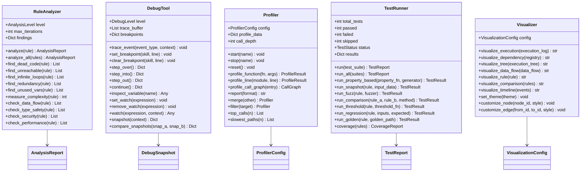
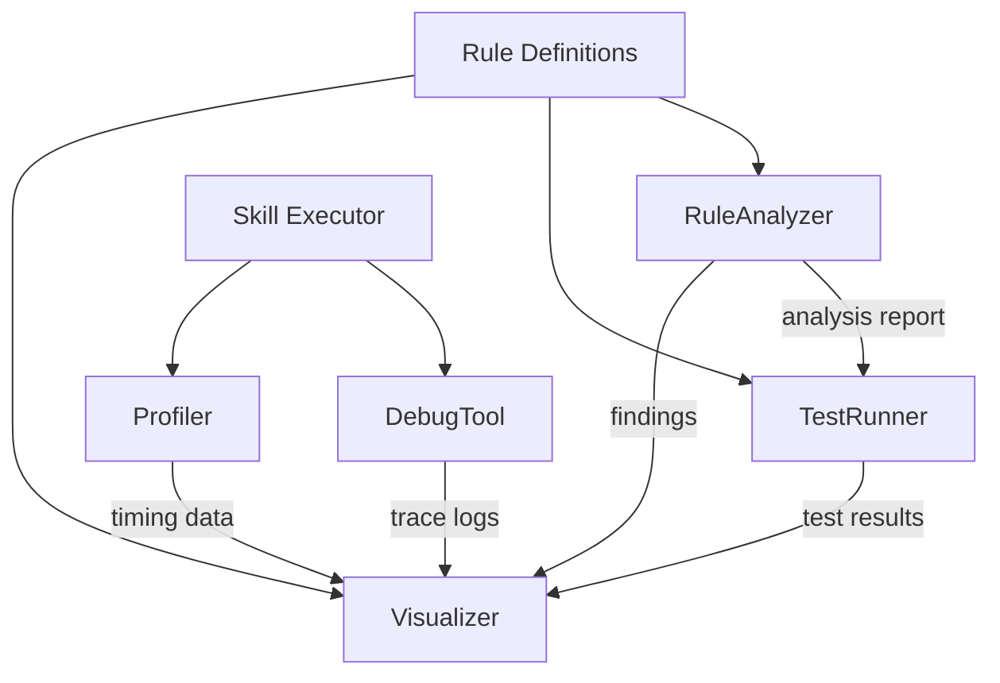

# Tools Module

## Overview

The Tools module provides analysis, debugging, profiling, testing, and visualization utilities for rule evaluation and system introspection. Five tools are available:

- **RuleAnalyzer** — Static analysis of rule definitions. Checks for dead code, unreachable branches, infinite loops, pattern redundancy, unused variables, complexity metrics, data flow consistency, type safety, security vulnerabilities, and performance bottlenecks.
- **DebugTool** — Runtime debugging with trace events, breakpoints, variable inspection, execution replay, watch expressions, conditional breakpoints, and snapshot comparison across execution states.
- **Profiler** — Performance profiling at function, line, and call-graph depth. Supports self, child, wall-clock, and CPU timing modes with customizable report formats (text, JSON, HTML, flamegraph-compatible).
- **TestRunner** — Test execution framework with support for property-based, snapshot, fuzz, comparison, threshold, regression, and golden tests. Tracks code coverage metrics (line, branch, path, condition, function).
- **Visualizer** — Graph visualization for rule execution flow, dependency graphs, execution trees, and data flow diagrams. Supports multiple output formats and customizable node/edge styles.

## Class Diagram



## Tool Relationships



## API Reference

| Class | Method | Description |
|---|---|---|
| `RuleAnalyzer` | `analyze(rule)` | Run all analysis checks on a rule |
| `RuleAnalyzer` | `analyze_all(rules)` | Analyze multiple rules, aggregate findings |
| `RuleAnalyzer` | `find_dead_code(rule)` | Scan for code that never executes |
| `RuleAnalyzer` | `find_unreachable(rule)` | Detect unreachable branches |
| `RuleAnalyzer` | `find_infinite_loops(rule)` | Detect potential infinite recursion/loops |
| `RuleAnalyzer` | `find_redundancy(rule)` | Find redundant pattern checks |
| `RuleAnalyzer` | `find_unused_vars(rule)` | Variable defined but never read |
| `RuleAnalyzer` | `measure_complexity(rule)` | Cyclomatic complexity calculation |
| `RuleAnalyzer` | `check_data_flow(rule)` | Trace data through rule execution |
| `RuleAnalyzer` | `check_type_safety(rule)` | Validate type constraints |
| `RuleAnalyzer` | `check_security(rule)` | Security vulnerability scan |
| `RuleAnalyzer` | `check_performance(rule)` | Performance anti-pattern detection |
| `DebugTool` | `trace_event(event_type, context)` | Record a trace event |
| `DebugTool` | `set_breakpoint(skill, line)` | Set breakpoint on skill source line |
| `DebugTool` | `step_over()` | Execute next line, step over calls |
| `DebugTool` | `step_into()` | Enter called function |
| `DebugTool` | `inspect_variable(name)` | Get variable value from current scope |
| `DebugTool` | `set_watch(expression)` | Register expression for continuous eval |
| `DebugTool` | `snapshot(context)` | Capture full execution state |
| `DebugTool` | `compare_snapshots(snap_a, snap_b)` | Diff two execution states |
| `Profiler` | `start(name)` | Begin profiling a named section |
| `Profiler` | `stop(name)` | End profiling, record timing |
| `Profiler` | `profile_function(fn, args)` | Profile a function call |
| `Profiler` | `profile_call_graph(entry)` | Build call graph with timing |
| `Profiler` | `report(format)` | Generate profiling report |
| `Profiler` | `merge(other)` | Merge two profiler data sets |
| `Profiler` | `top_calls(n)` | Get n slowest function calls |
| `Profiler` | `slowest_paths(n)` | Get n slowest execution paths |
| `TestRunner` | `run(test_suite)` | Execute a test suite |
| `TestRunner` | `run_all(suites)` | Execute multiple test suites |
| `TestRunner` | `run_property_based(prop, gen)` | Property-based testing |
| `TestRunner` | `run_snapshot(rule, input)` | Snapshot comparison testing |
| `TestRunner` | `run_fuzz(rule, fuzzer)` | Fuzz testing with random inputs |
| `TestRunner` | `run_comparison(a, b, method)` | Compare outputs of two rules |
| `TestRunner` | `run_threshold(rule, fn)` | Assert output meets threshold |
| `TestRunner` | `run_regression(rule, inputs, expected)` | Regression test |
| `TestRunner` | `run_golden(rule, golden_path)` | Golden file comparison |
| `TestRunner` | `coverage(rules)` | Measure test coverage metrics |
| `Visualizer` | `visualize_execution(log)` | Render execution flow diagram |
| `Visualizer` | `visualize_dependency(reg)` | Render dependency graph |
| `Visualizer` | `visualize_tree(tree)` | Render execution tree |
| `Visualizer` | `visualize_data_flow(flow)` | Render data flow diagram |
| `Visualizer` | `visualize_rule(rule)` | Render single rule structure |
| `Visualizer` | `visualize_comparison(rules)` | Side-by-side rule comparison |
| `Visualizer` | `visualize_timeline(events)` | Timeline visualization |
| `Visualizer` | `set_theme(theme)` | Change visual theme |
| `Visualizer` | `customize_node(id, style)` | Override node rendering style |
| `Visualizer` | `customize_edge(id, id, style)` | Override edge rendering style |

## Configuration

```yaml
tools:
  analyzer:
    level: "comprehensive"
    max_iterations: 10000
    max_depth: 20

  debug:
    level: "verbose"
    max_trace_buffer: 10000
    capture_snapshots: true

  profiler:
    target: "function"
    depth: "call_graph"
    timing: "wall_clock"
    report_format: "json"

  visualizer:
    format: "mermaid"
    orientation: "TB"
    theme: "default"

  test_runner:
    coverage_enabled: true
    coverage_target: 80
    timeout: 30.0
```

## Analysis Levels

| Level | Checks |
|---|---|
| BASIC | Dead code, unreachable branches, unused variables |
| STANDARD | BASIC + infinite loops, redundancy, complexity |
| ADVANCED | STANDARD + data flow, type safety |
| COMPREHENSIVE | ADVANCED + security, performance |

## Debug Levels

| Level | Data Captured |
|---|---|
| NONE | No tracing |
| ERROR | Only errors |
| WARNING | Errors + warnings |
| INFO | General trace events |
| VERBOSE | All events including variable changes |
| DEBUG | Full internal state |
