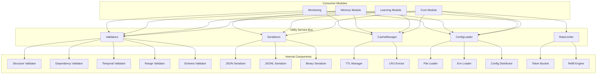
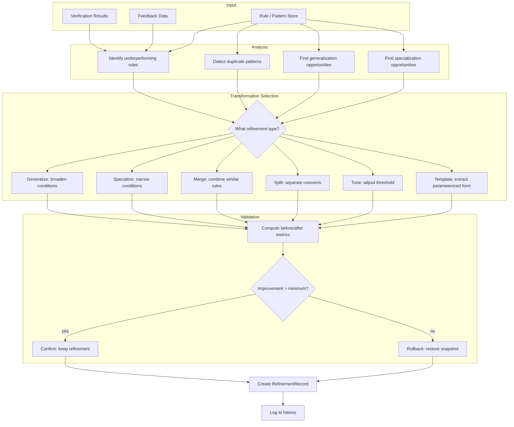
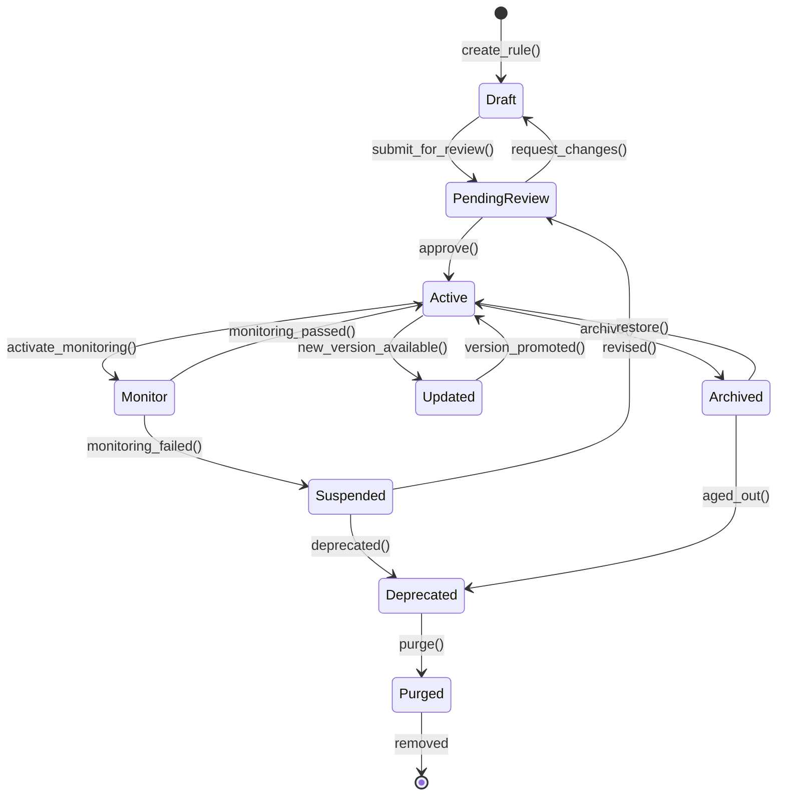
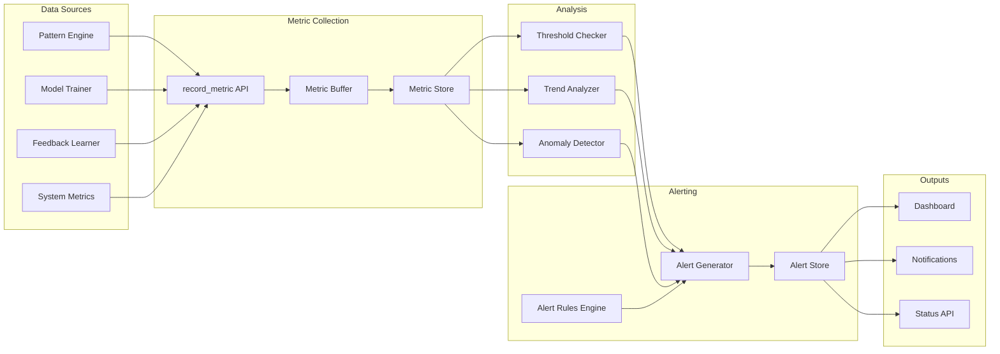
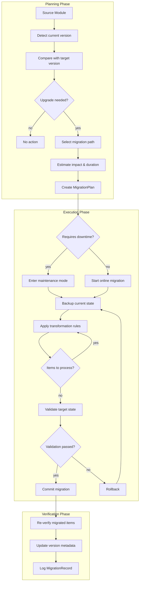
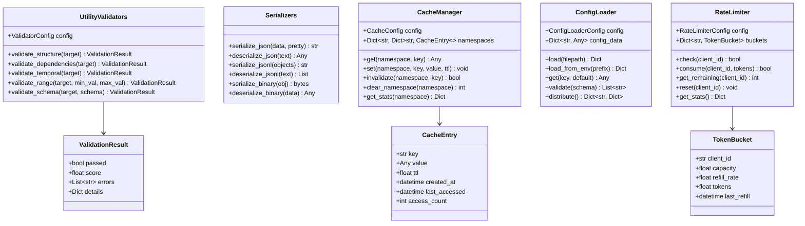

# Utility Module Architecture

## Overview

The Utility Module provides a service bus architecture where cross-cutting concerns are implemented as standalone services consumed by all other modules. The architecture separates infrastructure concerns (validation, caching, config, rate limiting, serialization) from business logic.

## Service Bus Architecture



## Component Architecture

### UtilityValidators

Provides validation services for data integrity, structure, and constraints.

```python
class UtilityValidators:
    def __init__(self, config: ValidatorConfig = None):
        self.config = config or ValidatorConfig()

    def validate_structure(self, target: Any) -> ValidationResult:
        if isinstance(target, dict):
            missing = [f for f in self.config.required_fields if f not in target]
            if missing:
                return ValidationResult(False, 0.0, [f"Missing: {missing}"])
        return ValidationResult(True, 1.0, [])

    def validate_dependencies(self, target: Any) -> ValidationResult:
        deps = getattr(target, 'metadata', {}).get('depends_on', [])
        if deps:
            return ValidationResult(False, 0.5, [f"Unresolved deps: {deps}"])
        return ValidationResult(True, 1.0, [])

    def validate_temporal(self, target: Any) -> ValidationResult:
        valid_until = getattr(target, 'valid_until', None)
        if valid_until and valid_until < datetime.now(timezone.utc):
            return ValidationResult(False, 0.0, ["Expired"])
        return ValidationResult(True, 1.0, [])
```

### Serializers

Handles data serialization across multiple formats.

```python
class Serializers:
    @staticmethod
    def serialize_json(data: Any, pretty: bool = False) -> str:
        class DateTimeEncoder(json.JSONEncoder):
            def default(self, obj):
                if isinstance(obj, datetime.datetime):
                    return obj.isoformat()
                if isinstance(obj, uuid.UUID):
                    return str(obj)
                if isinstance(obj, Decimal):
                    return float(obj)
                return super().default(obj)
        indent = 2 if pretty else None
        return json.dumps(data, cls=DateTimeEncoder, indent=indent)

    @staticmethod
    def serialize_binary(obj: Any) -> bytes:
        return pickle.dumps(obj)
```

### CacheManager

Provides centralized cache management across namespaces.

```python
class CacheManager:
    def __init__(self, config: CacheConfig = None):
        self.config = config or CacheConfig()
        self.namespaces: Dict[str, Dict[str, CacheEntry]] = {}

    def get(self, namespace: str, key: str) -> Any:
        ns = self.namespaces.get(namespace, {})
        entry = ns.get(key)
        if not entry:
            return None
        if self._is_expired(entry):
            del ns[key]
            return None
        entry.last_accessed = datetime.now(timezone.utc)
        entry.access_count += 1
        return entry.value
```

### ConfigLoader

Loads and distributes configuration from multiple sources.

```python
class ConfigLoader:
    def __init__(self, config: ConfigLoaderConfig = None):
        self.config = config or ConfigLoaderConfig()
        self.config_data: Dict[str, Any] = {}

    def load(self, filepath: str) -> Dict:
        if filepath.endswith('.yaml') or filepath.endswith('.yml'):
            with open(filepath, 'r') as f:
                self.config_data = yaml.safe_load(f)
        elif filepath.endswith('.json'):
            with open(filepath, 'r') as f:
                self.config_data = json.load(f)
        return self.config_data

    def load_from_env(self, prefix: str = "APP_") -> Dict:
        for key, value in os.environ.items():
            if key.startswith(prefix):
                config_key = key[len(prefix):].lower().replace('__', '.')
                self._set_nested(config_key, value)
        return self.config_data
```

### RateLimiter

Implements the token bucket algorithm for rate limiting.

```python
class RateLimiter:
    def __init__(self, config: RateLimiterConfig = None):
        self.config = config or RateLimiterConfig()
        self.buckets: Dict[str, TokenBucket] = {}

    def check(self, client_id: str) -> bool:
        bucket = self._get_bucket(client_id)
        self._refill(bucket)
        return bucket.tokens >= 1

    def consume(self, client_id: str, tokens: float = 1.0) -> bool:
        bucket = self._get_bucket(client_id)
        self._refill(bucket)
        if bucket.tokens >= tokens:
            bucket.tokens -= tokens
            return True
        return False
```

## Supporting System Architectures

### Verifier System Architecture

The Verifier implements a multi-stage verification pipeline.

```mermaid
flowchart LR
    subgraph Input["Input"]
        A[Target Rule / Pattern]
    end

    subgraph Stage1["Stage 1: Structure"]
        B[verify_structure]
        B1{Syntax valid?}
    end

    subgraph Stage2["Stage 2: Dependencies"]
        C[verify_dependencies]
        C1{All deps met?}
    end

    subgraph Stage3["Stage 3: Temporal"]
        D[verify_temporal]
        D1{Within valid window?}
    end

    subgraph Stage4["Stage 4: Confidence"]
        E[verify_confidence]
        E1{Confidence > threshold?}
    end

    subgraph Stage5["Stage 5: Knowledge"]
        F[verify_against_knowledge]
        G[verify_against_inferences]
    end

    subgraph Output["Output"]
        H{All checks passed?}
        I[VerificationResult]
    end

    A --> B
    B --> B1
    B1 --> C
    C --> C1
    C1 --> D
    D --> D1
    D1 --> E
    E --> E1
    E1 --> F
    F --> G
    G --> H
    H -->|yes| I
    H -->|no| I
```



### Refiner System Architecture



### Lifecycle Manager Architecture



### Monitor Architecture



### Migration Architecture



## Configuration Architecture

All utility components follow a consistent dataclass-based configuration pattern.

```python
@dataclass
class ValidatorConfig:
    required_fields: List[str] = field(default_factory=lambda: ["conditions", "actions"])
    enable_structure_check: bool = True
    enable_dependency_check: bool = True

@dataclass
class CacheConfig:
    max_capacity_per_namespace: int = 1000
    default_ttl_seconds: float = 300.0
    max_namespaces: int = 50
    enable_stats: bool = True

@dataclass
class ConfigLoaderConfig:
    config_dir: str = "./config"
    auto_reload: bool = False
    reload_interval_seconds: int = 60
    env_prefix: str = "APP_"

@dataclass
class RateLimiterConfig:
    default_capacity: float = 100.0
    default_refill_rate: float = 10.0
    refill_interval_seconds: float = 1.0
    max_buckets: int = 10000
```

## Class Relationships

