# Utility Module Data Flow

## Config Load → Validate → Distribute Flow

The configuration loading pipeline processes configuration from multiple sources, validates it, and distributes it to all modules.

```mermaid
flowchart LR
    subgraph Sources["Config Sources"]
        A[YAML File]
        B[JSON File]
        C[Environment Variables]
        D[Default Values]
    end

    subgraph Load["Config Loader"]
        E[ConfigLoader.load()]
        F[Merge Configs]
    end

    subgraph Validate["Validation"]
        G[Validate Structure]
        H[Validate Values]
        I{Valid?}
    end

    subgraph Distribute["Distribution"]
        J[Extract Module Configs]
        K[Core Config]
        L[Learning Config]
        M[Memory Config]
        N[Utils Config]
    end

    A --> E
    B --> E
    C --> E
    D --> F
    E --> F
    F --> G
    G --> H
    H --> I
    I -->|yes| J
    I -->|no| O[Log Errors]
    J --> K
    J --> L
    J --> M
    J --> N
```

### Config Load Sequence

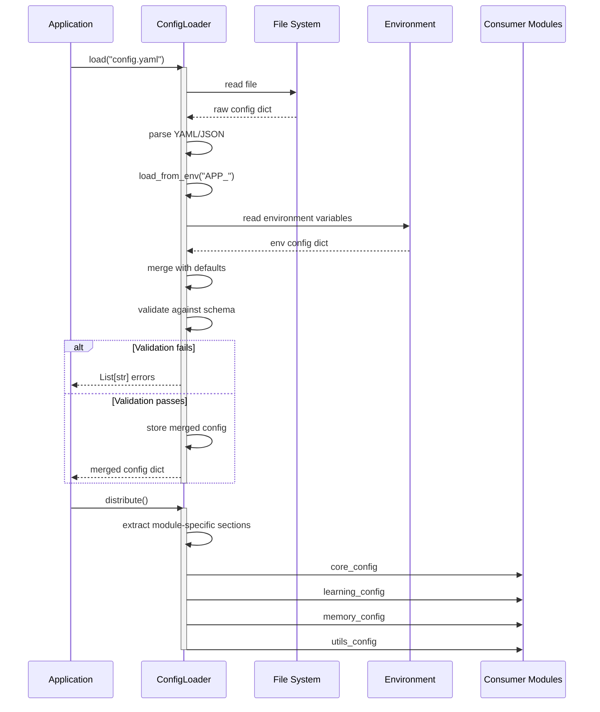

## Cache Data Flow

### Cache Get/Set/Invalidate

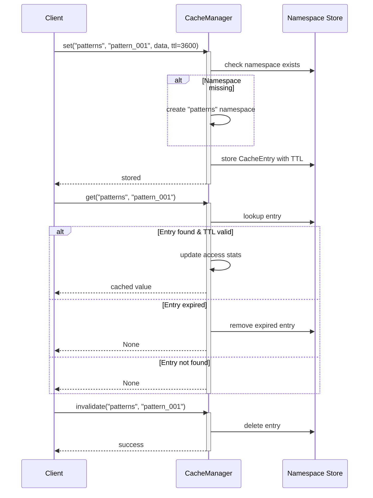

## Rate Limiter Data Flow

### Token Bucket Algorithm

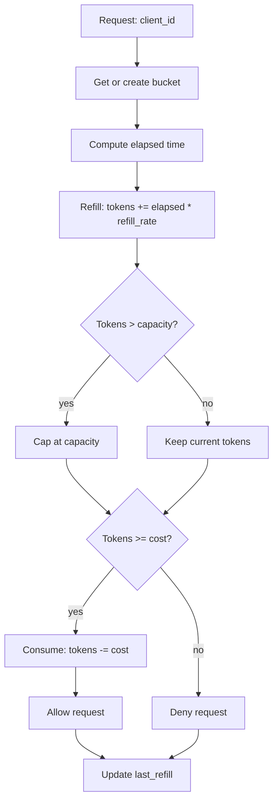

### Rate Limiter Sequence

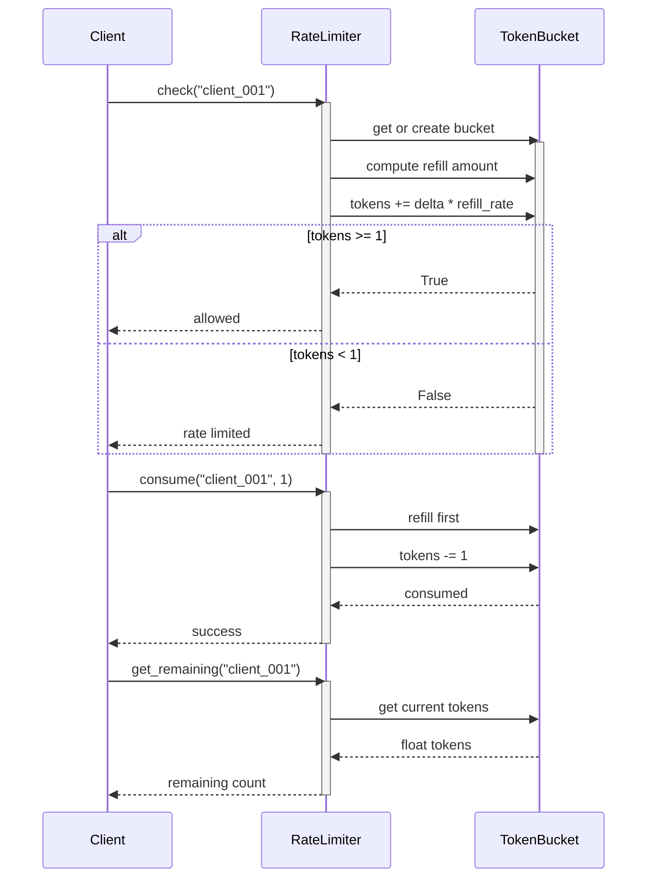

## Serializer Data Flow

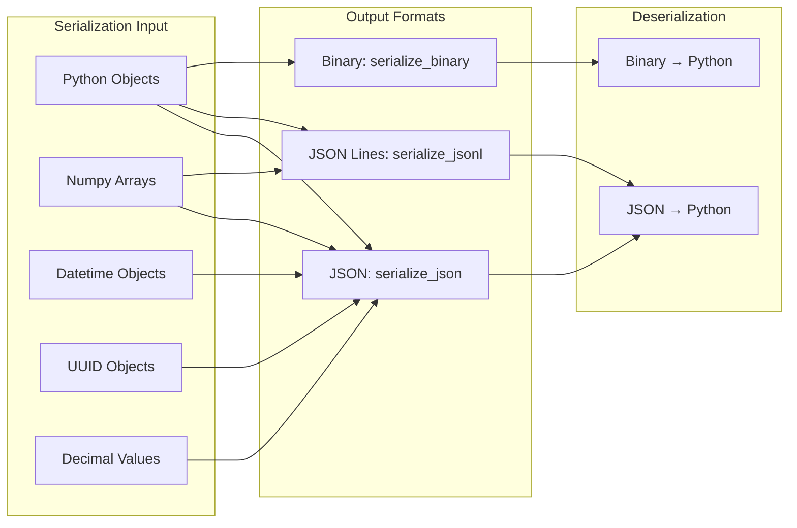

## Verifier Pipeline

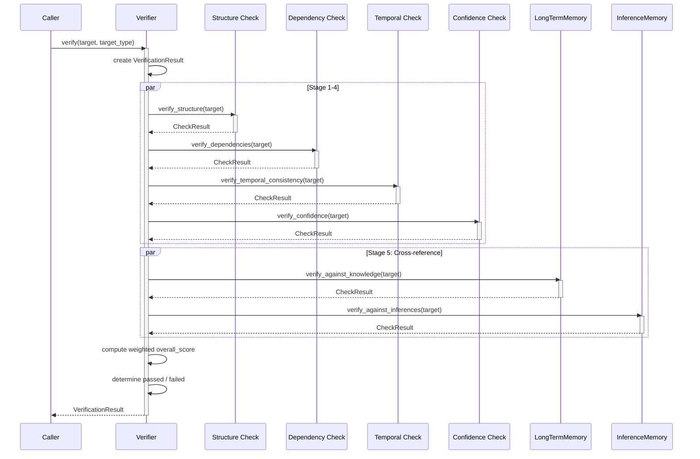

## Refinement Pipeline

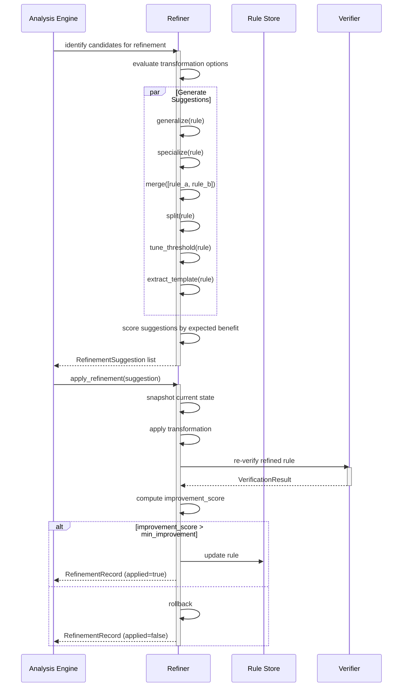

## Migration Flow

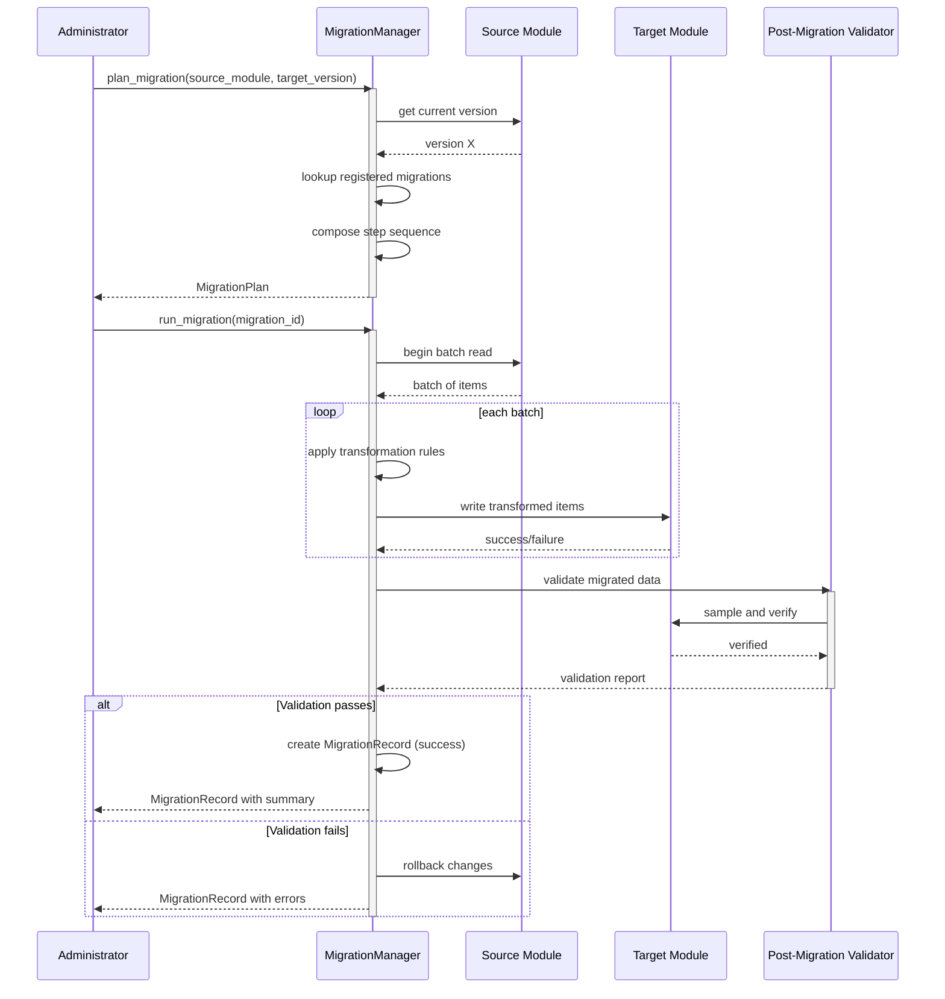

## Alert Flow

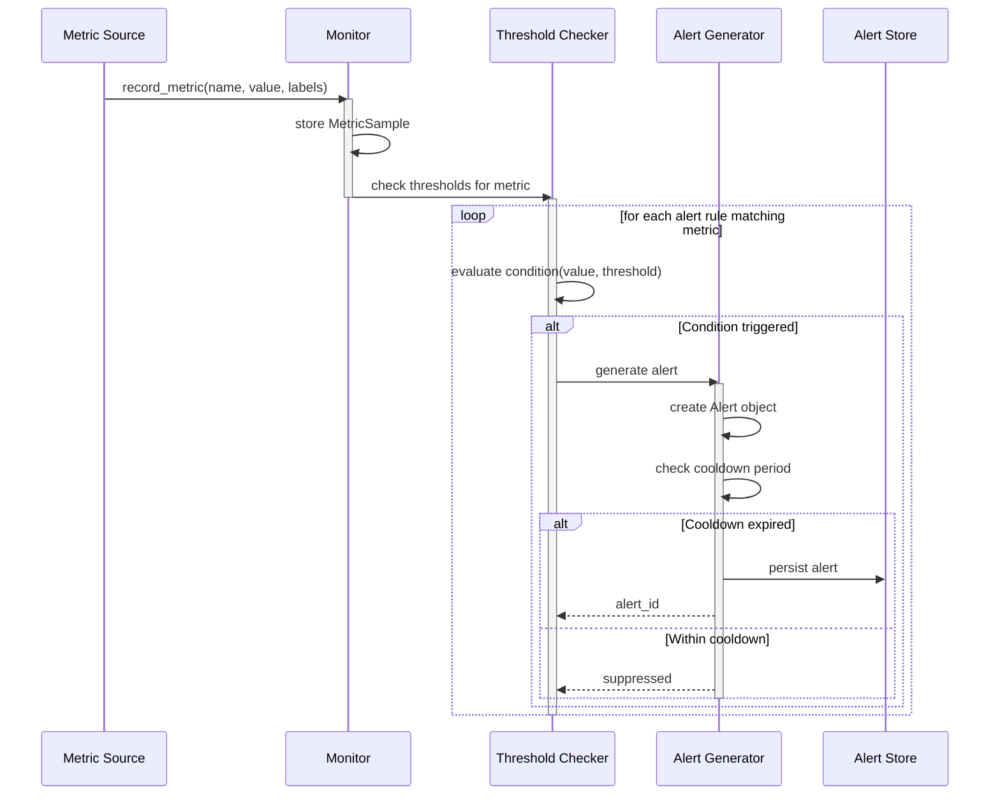

## Lifecycle State Transitions

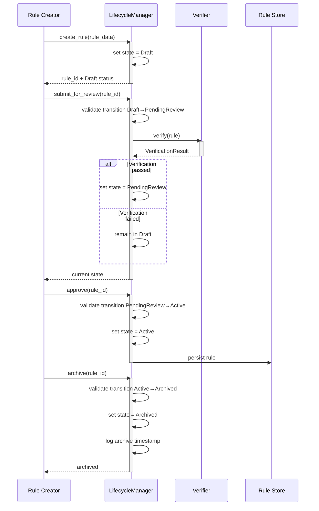

## Normalization Method Flow

```mermaid
flowchart TD
    subgraph Input["Input Values"]
        V[Raw Feature Values]
    end

    subgraph Methods["Normalization Methods"]
        M1[Min-Max: (x - min) / (max - min)]
        M2[Z-Score: (x - mean) / std]
        M3[Robust: (x - median) / IQR]
        M4[Log: log(1 + x)]
        M5[Unit Length: x / ||x||]
    end

    subgraph Output["Output"]
        N[Normalized Values]
    end

    V --> M1
    V --> M2
    V --> M3
    V --> M4
    V --> M5
    M1 --> N
    M2 --> N
    M3 --> N
    M4 --> N
    M5 --> N
```

## Metric Computation Flow

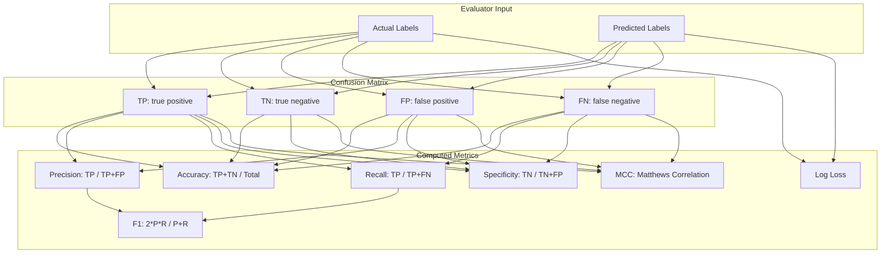