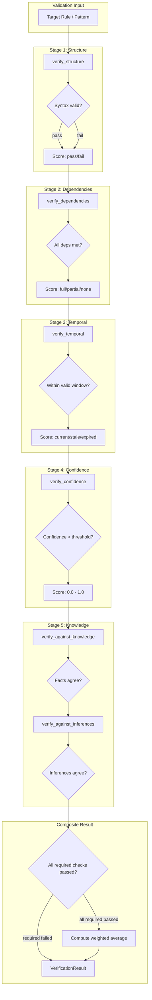
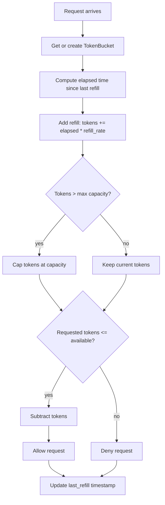

# Utility Module Reasoning & Logic

## Validator Chain Logic

The Verifier implements a multi-stage validation pipeline. Each stage produces a CheckResult with a score, and the final result is a weighted composite.



### Weighted Composite Score

```python
def verify(self, target: Any, target_type: str) -> VerificationResult:
    results = []
    checks = [
        ("structure", self.verify_structure),
        ("dependencies", self.verify_dependencies),
        ("temporal", self.verify_temporal_consistency),
        ("confidence", self.verify_confidence),
        ("knowledge", lambda t: self.verify_against_knowledge(t, target_type)),
        ("inference", lambda t: self.verify_against_inferences(t, target_type)),
    ]

    for check_name, check_fn in checks:
        if self.verification_rules.get(check_name, VerificationCheck(enabled=True)).enabled:
            result = check_fn(target)
            results.append(result)

    total_weight = 0
    weighted_sum = 0
    for result in results:
        rule = self.verification_rules.get(result.check_type, VerificationCheck(weight=1))
        if rule.is_required and not result.passed:
            weighted_sum = 0
            total_weight = 1
            break
        weighted_sum += result.score * rule.weight
        total_weight += rule.weight

    overall = weighted_sum / total_weight if total_weight > 0 else 0.0
    passed = overall >= self.config.pass_threshold

    return VerificationResult(
        verification_id=f"VER_{uuid4().hex[:8]}",
        target_id=getattr(target, 'rule_id', getattr(target, 'pattern_id', 'unknown')),
        target_type=target_type,
        overall_score=overall,
        passed=passed,
        check_results=results,
        verified_at=datetime.now(timezone.utc)
    )
```

## Rate Limit Algorithm (Token Bucket)

The RateLimiter implements the standard token bucket algorithm for rate limiting.

```python
class TokenBucket:
    def __init__(self, client_id: str, capacity: float, refill_rate: float):
        self.client_id = client_id
        self.capacity = capacity
        self.refill_rate = refill_rate  # tokens per second
        self.tokens = capacity
        self.last_refill = datetime.now(timezone.utc)

    def refill(self):
        now = datetime.now(timezone.utc)
        elapsed = (now - self.last_refill).total_seconds()
        self.tokens = min(self.capacity, self.tokens + elapsed * self.refill_rate)
        self.last_refill = now

    def consume(self, tokens: float = 1.0) -> bool:
        self.refill()
        if self.tokens >= tokens:
            self.tokens -= tokens
            return True
        return False
```



### Refill Rate Calculation

```python
def _refill(self, bucket: TokenBucket) -> None:
    now = datetime.now(timezone.utc)
    delta = (now - bucket.last_refill).total_seconds()
    if delta > 0:
        new_tokens = delta * bucket.refill_rate
        bucket.tokens = min(bucket.capacity, bucket.tokens + new_tokens)
        bucket.last_refill = now
```

### Burst Handling

The token bucket naturally supports bursts: if a client hasn't used tokens for a while, the bucket fills up to capacity, allowing a burst of requests up to the full capacity.

```python
class BurstAwareRateLimiter(RateLimiter):
    def can_accept_burst(self, client_id: str, burst_size: int) -> bool:
        bucket = self._get_bucket(client_id)
        self._refill(bucket)
        return bucket.tokens >= burst_size
```

## Cache Eviction Logic

The CacheManager uses TTL expiration followed by LRU eviction when capacity is exceeded.

```python
def _evict(self, namespace: str) -> int:
    ns = self.namespaces.get(namespace, {})
    if not ns:
        return 0

    # Phase 1: Evict expired entries
    expired = [k for k, v in ns.items() if self._is_expired(v)]
    for key in expired:
        del ns[key]

    # Phase 2: If still over capacity, evict LRU
    over = len(ns) - self.config.max_capacity_per_namespace
    if over > 0:
        sorted_by_access = sorted(ns.items(), key=lambda x: x[1].last_accessed)
        for key, _ in sorted_by_access[:over]:
            del ns[key]

    return len(expired) + max(over, 0)

def _is_expired(self, entry: CacheEntry) -> bool:
    if entry.ttl <= 0:
        return False
    elapsed = (datetime.now(timezone.utc) - entry.created_at).total_seconds()
    return elapsed > entry.ttl
```

```mermaid
flowchart TD
    A[set(namespace, key, value, ttl)] --> B{TTL valid?}
    B -->|yes| C[Store entry with TTL]
    B -->|no| D[Store with no TTL]
    C --> E{Over capacity?}
    D --> E
    E -->|no| F[Done]
    E -->|yes| G[Phase 1: Remove expired]
    G --> H{Still over?}
    H -->|no| F
    H -->|yes| I[Phase 2: Remove LRU entries]
    I --> F
```

## Refinement Decision Logic

The Refiner analyzes rules and applies transformations to improve quality.

### Generalization Logic

```python
def generalize(self, target: Any) -> RefinementSuggestion:
    conditions = getattr(target, 'conditions', {})
    original_specificity = self._count_conditions(conditions)
    generalized = self._broaden_conditions(conditions)
    new_specificity = self._count_conditions(generalized)
    benefit = (original_specificity - new_specificity) / max(original_specificity, 1)

    return RefinementSuggestion(
        suggestion_id=f"SUG_{uuid4().hex[:8]}",
        target_id=getattr(target, 'rule_id', 'unknown'),
        target_type=getattr(target, 'rule_type', 'rule'),
        suggested_action="generalize",
        expected_benefit=benefit,
        confidence=0.7,
        alternative_actions=["specialize", "tune_threshold"]
    )
```

### Specialization Logic

```python
def specialize(self, target: Any) -> RefinementSuggestion:
    failed_cases = getattr(target, 'metadata', {}).get('failed_contexts', [])
    conditions = getattr(target, 'conditions', {})
    specialized = self._narrow_conditions(conditions, failed_cases)
    added = self._count_conditions(specialized) - self._count_conditions(conditions)
    benefit = min(0.5, added * 0.1)

    return RefinementSuggestion(
        suggestion_id=f"SUG_{uuid4().hex[:8]}",
        target_id=getattr(target, 'rule_id', 'unknown'),
        suggested_action="specialize",
        expected_benefit=benefit,
        confidence=0.6 if failed_cases else 0.3,
        alternative_actions=["generalize"]
    )
```

### Merge Logic

```python
def merge(self, targets: List[Any]) -> RefinementSuggestion:
    if len(targets) < 2:
        raise ValueError("Need at least 2 targets to merge")
    similarity = self._compute_similarity(targets[0], targets[1])
    return RefinementSuggestion(
        suggestion_id=f"SUG_{uuid4().hex[:8]}",
        target_id=",".join(getattr(t, 'rule_id', 'unknown') for t in targets),
        target_type="rule_group",
        suggested_action="merge",
        expected_benefit=similarity,
        confidence=similarity,
        alternative_actions=["generalize", "specialize"]
    )
```

### Refinement Application with Rollback

```python
def apply_refinement(self, suggestion: RefinementSuggestion) -> RefinementRecord:
    record = RefinementRecord(
        refinement_id=f"REF_{uuid4().hex[:8]}",
        target_id=suggestion.target_id,
        target_type=suggestion.target_type,
        transformation_type=suggestion.suggested_action,
        before_snapshot={},
        after_snapshot={},
        improvement_score=0.0,
        applied=False,
        created_at=datetime.now(timezone.utc),
        applied_at=datetime.now(timezone.utc)
    )
    self.refinements[record.refinement_id] = record
    return record

def rollback(self, refinement_id: str) -> bool:
    record = next((r for r in self.refinements.values() if r.refinement_id == refinement_id), None)
    if not record or record.status != "completed":
        return False
    migration = self.migrations.get(record.migration_id)
    if not migration or not migration.reversible:
        return False
    record.status = "rolling_back"
    record.status = "rolled_back"
    return True
```

## Lifecycle State Transition Logic

```python
class LifecycleManager:
    VALID_TRANSITIONS = {
        LifecycleState.DRAFT: [LifecycleState.PENDING_REVIEW, LifecycleState.ARCHIVED],
        LifecycleState.PENDING_REVIEW: [LifecycleState.DRAFT, LifecycleState.ACTIVE],
        LifecycleState.ACTIVE: [LifecycleState.MONITOR, LifecycleState.UPDATED, LifecycleState.ARCHIVED],
        LifecycleState.MONITOR: [LifecycleState.ACTIVE, LifecycleState.SUSPENDED],
        LifecycleState.SUSPENDED: [LifecycleState.PENDING_REVIEW, LifecycleState.DEPRECATED],
        LifecycleState.UPDATED: [LifecycleState.ACTIVE, LifecycleState.ARCHIVED],
        LifecycleState.ARCHIVED: [LifecycleState.ACTIVE, LifecycleState.DEPRECATED],
        LifecycleState.DEPRECATED: [LifecycleState.PURGED],
        LifecycleState.PURGED: [],
    }

    def transition_to(self, rule_id: str, target: LifecycleState) -> LifecycleState:
        current = self.rules.get(rule_id)
        if not current:
            raise ValueError(f"Rule {rule_id} not found")
        if target not in self.VALID_TRANSITIONS.get(current, []):
            raise ValueError(f"Invalid transition: {current} -> {target}")
        self.rules[rule_id] = target
        self._log_event(rule_id, target, f"Transitioned from {current}")
        return target
```

### Aging & Archival Logic

```python
def check_aging(self) -> List[str]:
    now = datetime.now(timezone.utc)
    to_archive = []
    for rule_id, state in self.rules.items():
        if state != LifecycleState.ACTIVE:
            continue
        events = self.get_lifecycle_history(rule_id)
        if not events:
            continue
        last_activity = max(e.timestamp for e in events)
        age_days = (now - last_activity).days
        if age_days > self.config.auto_archive_days:
            to_archive.append(rule_id)
    return to_archive
```

## Monitor Threshold Evaluation Logic

```python
def check_thresholds(self) -> List[Alert]:
    triggered = []
    for entity_id, entity in self.monitors.items():
        for rule in entity.alert_rules:
            if not rule.enabled:
                continue
            samples = self.metrics.get(rule.metric_name, [])
            if not samples:
                continue
            latest = samples[-1].value
            if self._evaluate_condition(latest, rule.condition, rule.threshold):
                if self._is_on_cooldown(rule):
                    continue
                alert = Alert(
                    alert_id=f"ALERT_{uuid4().hex[:8]}",
                    alert_type=rule.metric_name,
                    severity=rule.severity,
                    message=f"{rule.metric_name} {rule.condition} {rule.threshold}: got {latest:.2f}",
                    source=entity_id,
                    entity_id=entity_id,
                    threshold=rule.threshold,
                    actual_value=latest,
                    triggered_at=datetime.now(timezone.utc),
                    resolved_at=None,
                    status="active"
                )
                self.alerts.append(alert)
                triggered.append(alert)
                rule.cooldown_until = time.time() + rule.cooldown_seconds
    return triggered

def _evaluate_condition(self, value: float, condition: str, threshold: float) -> bool:
    if condition == "gt":
        return value > threshold
    elif condition == "gte":
        return value >= threshold
    elif condition == "lt":
        return value < threshold
    elif condition == "lte":
        return value <= threshold
    elif condition == "eq":
        return value == threshold
    return False
```

## Migration Planning Logic

```python
def plan_migration(self, source_module: str, target_version: str) -> MigrationPlan:
    applicable = [
        m for m in self.migrations.values()
        if m.source_module == source_module and m.target_version == target_version
    ]
    applicable.sort(key=lambda m: m.estimated_impact, reverse=True)
    return MigrationPlan(
        plan_id=f"PLAN_{uuid4().hex[:8]}",
        steps=applicable,
        estimated_items=len(applicable),
        estimated_duration_seconds=sum(len(m.transformation_rules) * 0.1 for m in applicable),
        requires_downtime=any(m.estimated_impact > self.config.downtime_threshold for m in applicable)
    )
```

## STM to LTM Promotion Logic

```python
def promote_stm_to_ltm(self, stm, ltm) -> int:
    promoted = 0
    for entry in stm.get_all():
        if entry.priority >= self.config.promotion_priority_threshold:
            entity_name = entry.key
            try:
                existing = ltm.get_entity_by_name(entity_name)
            except ValueError:
                existing = None
            if not existing:
                ltm.add_entity(
                    name=entity_name,
                    entity_type=entry.entry_type,
                    attributes={
                        "promoted_from": "stm",
                        "original_value": entry.value,
                        "stm_access_count": entry.access_count,
                        "stm_priority": entry.priority
                    }
                )
                ltm.add_fact(
                    subject=entity_name,
                    predicate="promoted_at",
                    object=datetime.now(timezone.utc).isoformat(),
                    confidence=0.8,
                    source="migration_manager"
                )
                promoted += 1
    return promoted
```

## Normalization Method Selection Logic

```python
def normalize(self, vector: FeatureVector, method: str = "min_max") -> FeatureVector:
    if method == "min_max":
        return FeatureVector({k: (v - min_v) / (max_v - min_v) for k, v in vector.items()})
    elif method == "z_score":
        mean = statistics.mean(vector.values())
        std = statistics.pstdev(vector.values()) or 1.0
        return FeatureVector({k: (v - mean) / std for k, v in vector.items()})
    elif method == "robust":
        sorted_v = sorted(vector.values())
        n = len(sorted_v)
        median = statistics.median(sorted_v)
        q1 = sorted_v[n // 4]
        q3 = sorted_v[(3 * n) // 4]
        iqr = q3 - q1 or 1.0
        return FeatureVector({k: (v - median) / iqr for k, v in vector.items()})
    elif method == "log":
        return FeatureVector({k: math.log(1.0 + v) for k, v in vector.items()})
    elif method == "unit_length":
        norm = math.sqrt(sum(v * v for v in vector.values()))
        if norm == 0.0:
            return vector
        return FeatureVector({k: v / norm for k, v in vector.items()})
```