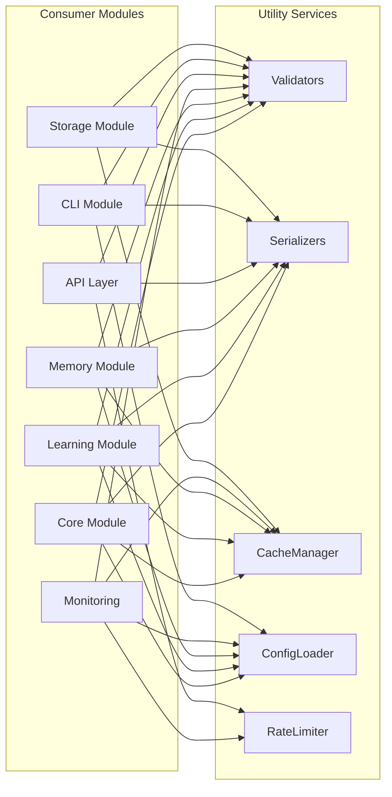
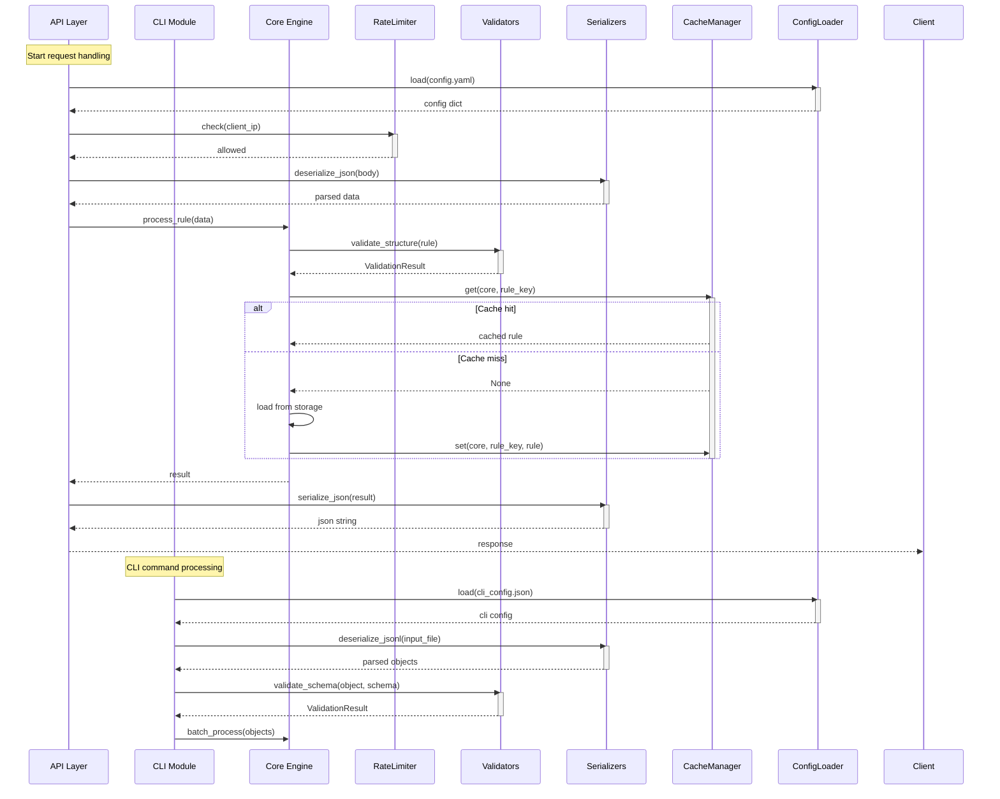
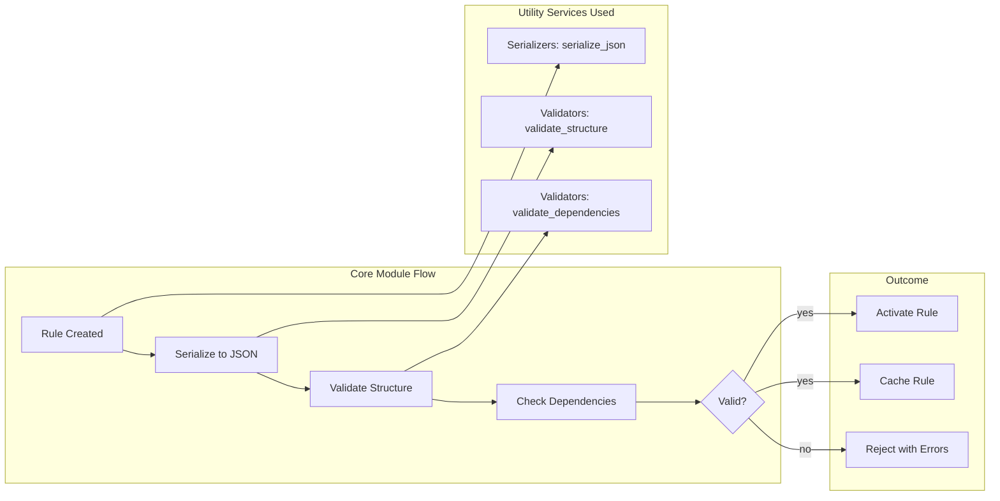
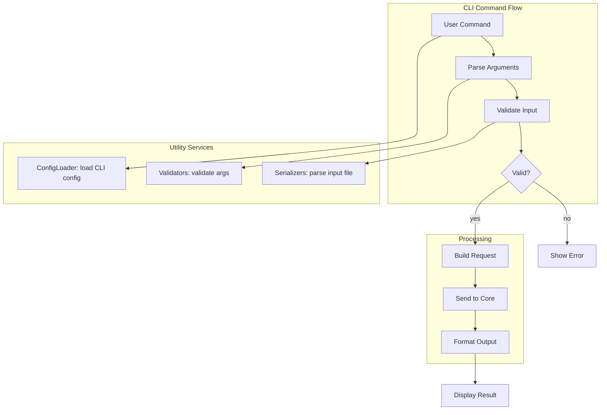
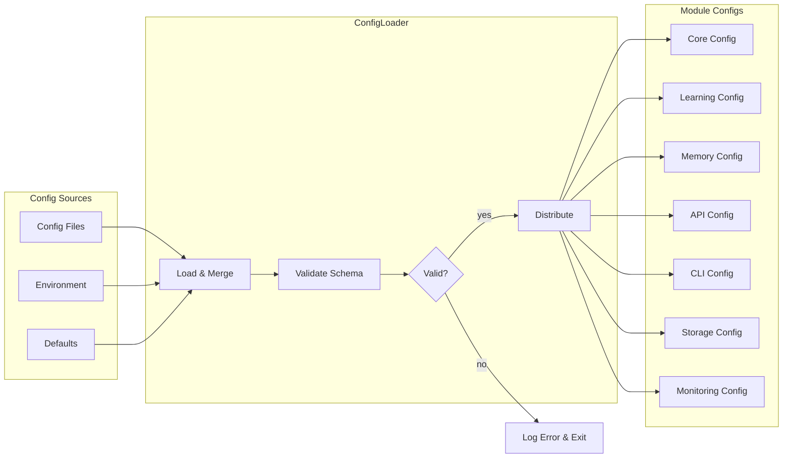
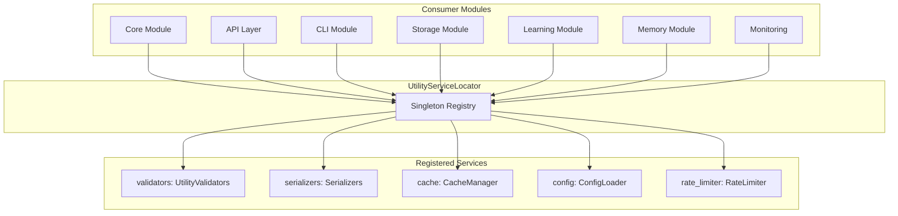

# Utilities Module Integration

## Integration Overview

The Utility Module provides cross-cutting infrastructure services consumed by all other modules. Each utility component integrates through a service bus pattern, where consumer modules reference shared interfaces without coupling to implementations.



## Cross-System Utility Sequence

The following sequence diagram shows how different modules interact with utility services during a typical system operation.



## Integration with Core

### ConfigLoader ↔ Core Module

The ConfigLoader provides configuration data to the Core Rule Engine during initialization and reload events.

```python
class CoreConfigIntegration:
    def __init__(self, config_loader: ConfigLoader):
        self.config_loader = config_loader

    def load_core_config(self) -> Dict[str, Any]:
        raw = self.config_loader.load("core_config.yaml")
        validated = self.config_loader.validate(raw)
        if validated:
            return self.config_loader.distribute().get("core", {})
        raise ValueError("Core config validation failed: " + ", ".join(validated))

    def reload_core_config(self, engine):
        config = self.load_core_config()
        engine.update_config(config)
        engine.reinitialize_rules()
```

### CacheManager ↔ Core Module

The Core Rule Engine uses the CacheManager to cache activated rules and evaluation results for fast repeated access.

```python
class CoreCacheIntegration:
    def cache_activated_rules(self, engine, cache):
        rules = engine.get_activated_rules()
        for rule in rules:
            cache.set(
                namespace="core_rules",
                key=f"rule:{rule.rule_id}",
                value=rule.to_dict(),
                ttl=600
            )

    def get_cached_rule(self, cache, rule_id):
        return cache.get("core_rules", f"rule:{rule_id}")
```

### Validators ↔ Core Module

The Core Module calls the Validator service to verify rule integrity before activation.

```python
class CoreValidationIntegration:
    def verify_rule_before_activation(self, rule, validator):
        checks = [
            validator.validate_structure(rule),
            validator.validate_dependencies(rule),
            validator.validate_temporal(rule),
            validator.validate_range(
                getattr(rule, 'confidence', 0.0),
                min_val=0.0, max_val=1.0
            )
        ]
        scores = [c.score for c in checks if c.passed]
        passed = len(scores) == len(checks)
        return ValidationResult(
            passed=passed,
            score=sum(scores) / len(scores) if scores else 0.0,
            errors=[e for c in checks for e in c.errors]
        )
```



## Integration with API

### RateLimiter ↔ API Layer

The API Layer uses the RateLimiter to enforce per-client request limits on HTTP endpoints.

```python
class APIRateLimitMiddleware:
    def __init__(self, rate_limiter: RateLimiter):
        self.rate_limiter = rate_limiter

    def before_request(self, request):
        client_id = self._extract_client_id(request)
        if not self.rate_limiter.check(client_id):
            return self._rate_limit_response(client_id)
        return None

    def _extract_client_id(self, request):
        api_key = request.headers.get("X-API-Key")
        if api_key:
            return f"api_key:{api_key}"
        ip = request.remote_addr or "unknown"
        return f"ip:{ip}"

    def _rate_limit_response(self, client_id):
        remaining = self.rate_limiter.get_remaining(client_id)
        return {
            "status_code": 429,
            "headers": {
                "Retry-After": "60",
                "X-RateLimit-Remaining": str(int(remaining))
            },
            "body": {"error": "rate_limit_exceeded", "message": "Too many requests"}
        }
```

```mermaid
sequenceDiagram
    participant Client
    participant API as API Gateway
    participant RL as RateLimiter
    participant App as Application

    Client->>API: POST /api/v1/rules
    activate API
    API->>RL: check(client_id)
    alt Rate limit exceeded
        RL-->>API: False
        API-->>Client: 429 Too Many Requests
        deactivate API
    else Request allowed
        RL-->>API: True
        API->>RL: consume(client_id, 1)
        API->>App: forward request
        App-->>API: response
        API-->>Client: 200 OK
        deactivate API
    end
```

### Serializers ↔ API Layer

The API Layer uses the Serializers for request body parsing and response formatting.

```python
class APISerializationIntegration:
    def __init__(self, serializer: Serializers):
        self.serializer = serializer

    def parse_request_body(self, body: str) -> Dict:
        return self.serializer.deserialize_json(body)

    def format_response(self, data: Any, pretty: bool = False) -> str:
        return self.serializer.serialize_json(data, pretty=pretty)

    def format_batch_response(self, items: List[Dict]) -> str:
        return self.serializer.serialize_jsonl(items)
```

### Validators ↔ API Layer

The API Layer validates incoming request payloads against expected schemas.

```python
class APIValidationIntegration:
    def __init__(self, validator: UtilityValidators):
        self.validator = validator

    def validate_create_rule_request(self, payload: Dict) -> ValidationResult:
        schema = {
            "type": "object",
            "required": ["name", "conditions", "actions"],
            "properties": {
                "name": {"type": "string"},
                "conditions": {"type": "object"},
                "actions": {"type": "object"},
                "priority": {"type": "number", "minimum": 1, "maximum": 10}
            }
        }
        return self.validator.validate_schema(payload, schema)
```

## Integration with CLI

### ConfigLoader ↔ CLI Module

The CLI Module loads its own configuration and command definitions through the ConfigLoader.

```python
class CLIConfigIntegration:
    def __init__(self, config_loader: ConfigLoader):
        self.config_loader = config_loader

    def load_cli_config(self) -> Dict:
        return self.config_loader.load("cli_config.json")

    def load_command_definitions(self) -> Dict:
        return self.config_loader.load("commands.yaml")

    def get_environment_settings(self) -> Dict:
        return self.config_loader.load_from_env("CLI_")
```

### Serializers ↔ CLI Module

The CLI Module uses serializers for input parsing and output formatting, supporting both JSON and JSON Lines for batch operations.

```python
class CLISerializationIntegration:
    def __init__(self, serializer: Serializers):
        self.serializer = serializer

    def parse_input_file(self, filepath: str) -> List[Dict]:
        with open(filepath, 'r') as f:
            content = f.read()
        if filepath.endswith('.jsonl'):
            return self.serializer.deserialize_jsonl(content)
        return [self.serializer.deserialize_json(content)]

    def format_output(self, data: Any, format_type: str = "json") -> str:
        if format_type == "json":
            return self.serializer.serialize_json(data, pretty=True)
        elif format_type == "jsonl":
            return self.serializer.serialize_jsonl(data if isinstance(data, list) else [data])
        raise ValueError(f"Unsupported format: {format_type}")
```

### Validators ↔ CLI Module

The CLI Module validates command arguments and input data before forwarding to the Core Engine.

```python
class CLIValidationIntegration:
    def __init__(self, validator: UtilityValidators):
        self.validator = validator

    def validate_cli_args(self, args: Namespace) -> ValidationResult:
        checks = []
        if hasattr(args, 'rule_file') and args.rule_file:
            result = self.validator.validate_structure(args.rule_file)
            checks.append(result)
        if hasattr(args, 'batch_size') and args.batch_size:
            result = self.validator.validate_range(args.batch_size, 1, 10000)
            checks.append(result)
        passed = all(c.passed for c in checks)
        score = sum(c.score for c in checks) / len(checks) if checks else 1.0
        return ValidationResult(passed=passed, score=score, errors=[])
```



## Integration with Storage

### Serializers ↔ Storage Module

The Storage Module uses serializers to convert between Python objects and persistence formats.

```python
class StorageSerializationIntegration:
    def __init__(self, serializer: Serializers):
        self.serializer = serializer

    def serialize_for_store(self, obj: Any, format: str = "binary") -> bytes:
        if format == "binary":
            return self.serializer.serialize_binary(obj)
        text = self.serializer.serialize_json(obj)
        return text.encode('utf-8')

    def deserialize_from_store(self, data: bytes, format: str = "binary") -> Any:
        if format == "binary":
            return self.serializer.deserialize_binary(data)
        return self.serializer.deserialize_json(data.decode('utf-8'))

    def serialize_batch(self, objects: List[Dict]) -> str:
        return self.serializer.serialize_jsonl(objects)
```

### CacheManager ↔ Storage Module

The Storage Module integrates with the CacheManager to provide a read-through cache layer.

```python
class StorageCacheIntegration:
    def __init__(self, cache: CacheManager, storage_backend):
        self.cache = cache
        self.storage = storage_backend

    def get_with_cache(self, namespace: str, key: str) -> Any:
        cached = self.cache.get(namespace, key)
        if cached is not None:
            return cached
        value = self.storage.read(key)
        if value is not None:
            self.cache.set(namespace, key, value, ttl=300)
        return value

    def save_with_cache_invalidation(self, namespace: str, key: str, value: Any):
        self.storage.write(key, value)
        self.cache.invalidate(namespace, key)
```

### Validators ↔ Storage Module

The Storage Module validates data integrity before persisting and after retrieval.

```python
class StorageValidationIntegration:
    def validate_before_persist(self, obj: Any, validator: UtilityValidators) -> bool:
        result = validator.validate_structure(obj)
        if not result.passed:
            return False
        result = validator.validate_schema(
            obj,
            {"type": "object", "required": ["id", "type", "data"]}
        )
        return result.passed

    def validate_after_read(self, obj: Any, validator: UtilityValidators) -> bool:
        result = validator.validate_temporal(obj)
        if not result.passed:
            return False
        result = validator.validate_dependencies(obj)
        return result.passed
```

```mermaid
sequenceDiagram
    participant App as Application
    participant Store as Storage Module
    participant CM as CacheManager
    participant SER as Serializers
    participant VAL as Validators
    participant DB as Disk/DB

    App->>Store: read_rule(rule_id)
    activate Store

    Store->>CM: get(storage, rule_id)
    activate CM
    alt Cache hit
        CM-->>Store: cached object
        Store-->>App: rule object
        deactivate Store
    else Cache miss
        CM-->>Store: None
        deactivate CM

        Store->>DB: read raw bytes
        DB-->>Store: bytes
        Store->>SER: deserialize_from_store(bytes)
        activate SER
        SER-->>Store: rule dict
        deactivate SER

        Store->>VAL: validate_after_read(rule)
        activate VAL
        VAL-->>Store: passed
        deactivate VAL

        Store->>CM: set(storage, rule_id, rule)
        Store-->>App: rule object
        deactivate Store
    end

    App->>Store: save_rule(rule)
    activate Store
    Store->>VAL: validate_before_persist(rule)
    activate VAL
    VAL-->>Store: passed
    deactivate VAL

    Store->>SER: serialize_for_store(rule)
    activate SER
    SER-->>Store: bytes
    deactivate SER

    Store->>DB: write bytes
    Store->>CM: invalidate(storage, rule_id)
    Store-->>App: saved
    deactivate Store
```

## Configuration Distribution Flow

All modules receive their configuration through the ConfigLoader's distribution mechanism.

```python
class ConfigDistributionIntegration:
    def __init__(self, config_loader: ConfigLoader):
        self.config_loader = config_loader

    def distribute_to_all_modules(self) -> Dict[str, Dict]:
        return self.config_loader.distribute()

    def get_core_config(self) -> Dict:
        return self.config_loader.distribute().get("core", {})

    def get_learning_config(self) -> Dict:
        return self.config_loader.distribute().get("learning", {})

    def get_memory_config(self) -> Dict:
        return self.config_loader.distribute().get("memory", {})

    def get_api_config(self) -> Dict:
        return self.config_loader.distribute().get("api", {})

    def get_cli_config(self) -> Dict:
        return self.config_loader.distribute().get("cli", {})

    def get_storage_config(self) -> Dict:
        return self.config_loader.distribute().get("storage", {})

    def get_monitoring_config(self) -> Dict:
        return self.config_loader.distribute().get("monitoring", {})
```



## Shared Pattern: Service Locator

The Utility Module exposes a service locator pattern that all modules use to access shared services.

```python
class UtilityServiceLocator:
    _instance = None
    _services = {}

    def __new__(cls):
        if cls._instance is None:
            cls._instance = super().__new__(cls)
        return cls._instance

    def register(self, name: str, service: Any):
        self._services[name] = service

    def get(self, name: str) -> Any:
        service = self._services.get(name)
        if service is None:
            raise KeyError(f"Service '{name}' not registered")
        return service

    @classmethod
    def initialize_defaults(cls):
        locator = cls()
        locator.register("validators", UtilityValidators())
        locator.register("serializers", Serializers())
        locator.register("cache", CacheManager())
        locator.register("config", ConfigLoader())
        locator.register("rate_limiter", RateLimiter())
        return locator
```



## External API Integration Points

The Utility Module does not expose external REST endpoints directly. Instead, it provides internal service interfaces that are consumed through the API Layer's rate-limited endpoints.

| Integration Pattern | Utility Service | Consumer | Purpose |
|--------------------|----------------|----------|---------|
| Request-level rate limiting | RateLimiter | API Layer | Throttle per-client requests |
| Payload validation | UtilityValidators | API Layer | Validate request schemas |
| Response formatting | Serializers | API Layer | JSON/JSONL serialization |
| Config loading | ConfigLoader | CLI Module | Parse CLI config files |
| Data serialization | Serializers | Storage Module | Object persistence format |
| Read-through cache | CacheManager | Storage Module | Reduce storage I/O |
| Rule verification | UtilityValidators | Core Module | Pre-activation validation |
| Cache rule lookups | CacheManager | Core Module | Fast rule retrieval |
| Feature validation | UtilityValidators | Learning Module | Validate extracted features |
| Pattern serialization | Serializers | Learning Module | Export/import patterns |
| Metric caching | CacheManager | Monitoring | Cache metric snapshots |

The service locator pattern ensures all modules can access utility services without direct coupling, enabling the infrastructure layer to be swapped or upgraded independently of the business logic modules.
