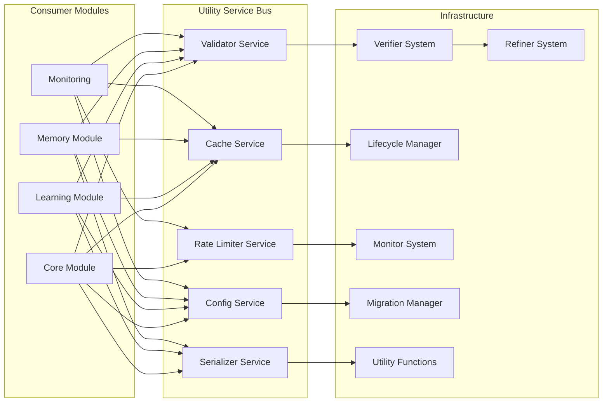
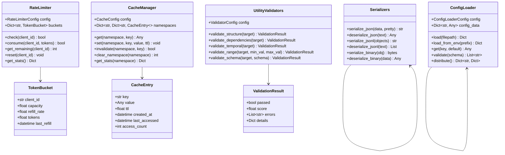

# Utility Module

## Overview

The Utility Module provides shared helper functions, cross-cutting services, and infrastructure components used by all other modules. It includes validators, serializers, caching infrastructure, configuration loading, rate limiting, monitoring, lifecycle management, migration, and refinement systems.

### Components

- **UtilityValidators** (`validators.py`): Multi-stage verification pipeline for rules, patterns, and system objects. Performs structural validation, dependency checking, temporal consistency, confidence assessment, and cross-referencing against stored knowledge.

- **Serializers** (`serializers.py`): Data serialization and deserialization for Python objects. Supports JSON (with datetime/uuid/Decimal encoding), JSON Lines, and binary pickle formats with schema validation.

- **CacheManager** (`cache_manager.py`): Centralized caching layer with support for TTL-based expiration, LRU eviction, and namespace isolation. Provides common cache interface across all modules.

- **ConfigLoader** (`config_loader.py`): Configuration loading and distribution system. Loads config from files, environment variables, and defaults. Validates config structure and distributes to all modules.

- **RateLimiter** (`rate_limiter.py`): Token bucket rate limiting algorithm. Controls request rates per client, endpoint, or global limits with burst support and configurable refill rates.

### Supporting Systems

- **Verifier System** (`VERIFIER.md`): Quality gate that validates rules and patterns against multiple criteria before they are applied or surfaced.

- **Refiner System** (`REFINER.md`): Rule optimization engine that applies transformations — generalization, specialization, merging, splitting, threshold tuning — to improve stored knowledge quality.

- **Lifecycle Manager** (`LIFECYCLE.md`): State machine governing rule lifecycle from creation through activation, monitoring, updating, archive, and purging.

- **Monitor System** (`MONITOR.md`): Real-time observation of rules, patterns, and system performance with threshold-based alerting.

- **Migration Manager** (`MIGRATION.md`): Data and schema migration across module boundaries, handling version upgrades and cross-module synchronization.

- **Utility Module** (`UTILITY.md`): Shared helper functions for data normalization, serialization, metric computation, time utilities, and common data structures.

## Service Bus Architecture



## Class Diagram



## Quick Start

```python
from rules_emerging_pattern.utils.validators import UtilityValidators
from rules_emerging_pattern.utils.serializers import Serializers
from rules_emerging_pattern.utils.cache_manager import CacheManager
from rules_emerging_pattern.utils.config_loader import ConfigLoader
from rules_emerging_pattern.utils.rate_limiter import RateLimiter

# Validators
validator = UtilityValidators()
result = validator.validate_structure({"conditions": {}, "actions": {}})
print(f"Valid: {result.passed}, Score: {result.score}")

# Serializers
serializer = Serializers()
data = {"name": "test", "value": 42}
json_str = serializer.serialize_json(data, pretty=True)
restored = serializer.deserialize_json(json_str)

# CacheManager
cache = CacheManager()
cache.set("default", "my_key", {"data": "cached_value"}, ttl=300)
value = cache.get("default", "my_key")

# ConfigLoader
config = ConfigLoader()
cfg = config.load("config.yaml")
db_host = config.get("database.host", "localhost")

# RateLimiter
limiter = RateLimiter()
if limiter.check("client_001"):
    limiter.consume("client_001", 1)
    print("Request allowed")
else:
    print("Rate limited")
```

## API Reference

| Class | Method | Description |
|-------|--------|-------------|
| `UtilityValidators` | `validate_structure(target)` | Validate syntactic structure |
| `UtilityValidators` | `validate_dependencies(target)` | Check dependency satisfaction |
| `UtilityValidators` | `validate_temporal(target)` | Verify temporal validity windows |
| `UtilityValidators` | `validate_range(target, min_val, max_val)` | Validate numeric range |
| `UtilityValidators` | `validate_schema(target, schema)` | Validate against schema definition |
| `Serializers` | `serialize_json(data, pretty)` | Serialize to JSON string |
| `Serializers` | `deserialize_json(text)` | Parse JSON string to Python |
| `Serializers` | `serialize_jsonl(objects)` | Serialize list to JSON Lines |
| `Serializers` | `deserialize_jsonl(text)` | Parse JSON Lines to list |
| `Serializers` | `serialize_binary(obj)` | Serialize to binary (pickle) |
| `Serializers` | `deserialize_binary(data)` | Deserialize from binary |
| `CacheManager` | `get(namespace, key)` | Get cached value |
| `CacheManager` | `set(namespace, key, value, ttl)` | Set cached value with TTL |
| `CacheManager` | `invalidate(namespace, key)` | Invalidate cache entry |
| `CacheManager` | `clear_namespace(namespace)` | Clear all entries in namespace |
| `CacheManager` | `get_stats(namespace)` | Get cache statistics |
| `ConfigLoader` | `load(filepath)` | Load config from file |
| `ConfigLoader` | `load_from_env(prefix)` | Load config from environment |
| `ConfigLoader` | `get(key, default)` | Get config value by key |
| `ConfigLoader` | `validate(schema)` | Validate config against schema |
| `ConfigLoader` | `distribute()` | Distribute config to modules |
| `RateLimiter` | `check(client_id)` | Check if request is allowed |
| `RateLimiter` | `consume(client_id, tokens)` | Consume tokens from bucket |
| `RateLimiter` | `get_remaining(client_id)` | Get remaining tokens |
| `RateLimiter` | `reset(client_id)` | Reset client rate limit |
| `RateLimiter` | `get_stats()` | Get rate limiter statistics |